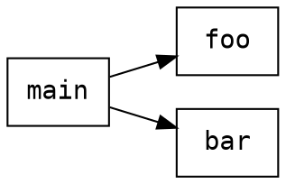

# GCC Plugin for Static Analyzer Support

A middleware GCC plugin (`libcl_gcc.so`) that sits between the GCC compiler and external static analyzers. It collects the compiler's intermediate representation, builds a compiler-independent **CodeModel**, and hands it to any loaded analyzer through a C/C++ ABI.

```txt
GCC compilation
     |
     V
libcl_gcc.so (GCC plugin)
     |
     | builds CodeModel
     |
     V
analyzer ABI
  ├── cl_get_analyzer_api() - legacy/C ABI   (e.g. Predator)
  └── cl_get_native_api()   - native/C++ ABI (e.g. callgraph_dot, json_dump)
```

## Requirements

| Dependency | Version | Notes |
| --- | --- | --- |
| GCC | 12 | Must match `TARGET_GCC` cmake option |
| `gcc-12-plugin-dev` | - | Provides plugin headers |
| `g++-12` | - | |
| CMake | >= 3.28 | |
| patch | any | Used to apply the Predator shim patch |

### Debian/Ubuntu

```bash
sudo apt install gcc-12 g++-12 gcc-12-plugin-dev cmake patch
```

## Getting Started

### 1. Clone with submodules

```bash
git clone --recurse-submodules -b implementation git@github.com:pseja/gcc-plugin-for-static-analyzer-support.git
cd gcc-plugin-for-static-analyzer-support
```

If you already cloned without `--recurse-submodules`:

```bash
git submodule update --init --recursive
```

### 2. Configure

```bash
make configure
# or
cmake -B build -DTARGET_GCC=gcc-12
```

Optional cmake variables:

| Variable | Default | Description |
| --- | --- | --- |
| `TARGET_GCC` | `gcc-12` | GCC executable to build for |
| `WITH_PREDATOR` | `ON` | Build Predator and its regression tests |

### 3. Build

```bash
make build
# or:
cmake --build build -j$(nproc)
```

Artifacts produced in `build/`:

| File | Description |
| --- | --- |
| `libcl_gcc.so` | The GCC plugin (pass this to `-fplugin=`) |
| `libcl_core.so` | Compiler-independent CodeModel library |
| `libcl_callgraph_dot.so` | Demo analyzer - call-graph in Graphviz DOT |
| `libcl_json_dump.so` | Demo analyzer - full CodeModel as JSON |
| `analyzers/predator/sl_build/libsl_analyzer.so` | Predator heap-shape analyzer |

## Running an Analyzer

All analyzers are loaded at compile time via GCC plugin arguments:

```bash
gcc-12 -S your_file.c -o /dev/null \
  -fplugin=./build/libcl_gcc.so \
  -fplugin-arg-libcl_gcc-load-analyzer=<path-to-analyzer.so> \
  -fplugin-arg-libcl_gcc-args=<analyzer-specific-args>
```

### Call-graph in DOT format (callgraph_dot)

Writes a Graphviz DOT file showing which functions call which.

```bash
make callgraph FILE=your_file.c
```

Output example for a file with `main()` calling `foo()` and `bar()`:



### CodeModel as JSON (json_dump)

Dumps the entire CodeModel (functions, basic blocks, types, variables, instructions) as a JSON file.

```bash
make json FILE=your_file.c
```

### Predator - Heap-shape / memory-safety analyzer

Predator reports memory leaks, use-after-free, and other heap shape violations.

```bash
make predator FILE=your_file.c
```

> The `-DPREDATOR` flag and the predator-builtins include are required so that `__VERIFIER_error()` and similar builtins are visible to the analyzed code.

## Running multiple Translation Unit (TU) program analyses

```bash
# 1. Compile each TU to JSON (one GCC invocation per file)
gcc -fplugin=libcl_gcc.so -fplugin-arg-libcl_gcc-load-analyzer=libcl_json_dump.so \
    -fplugin-arg-libcl_gcc-args=a.json -S a.c -o /dev/null
gcc ... -fplugin-arg-libcl_gcc-args=b.json -S b.c -o /dev/null

# 2. Merge all TUs into one whole-program model
cl_merge a.json b.json -o merged.json

# 3. Run any native analyzer on the merged model
cl_analyze merged.json --analyzer=libcl_callgraph_dot.so --args=whole_program.dot
cl_analyze merged.json --analyzer=libsl_analyzer.so --args=error_label:ERROR
```

or you can use the Makefile abstractions:

```bash
# compile every .c file in DIR to JSON, then merge into DIR/merged.json
make json-multi DIR=<dir>

# generate a DOT CFG from DIR/merged.json and render it to DIR/merged.svg
make dot-multi DIR=<dir> [VERBOSITY=CLEAN|COMPACT|FULL]

# shorthand for json-multi + dot-multi in one step
make merge DIR=<dir>
```

## Running Tests

### Predator regression test suite

```bash
make test-predator
```

### GCC-adapter C tests (46 tests)

These tests verify the plugin's GCC adapter handles a broad range of C language constructs (types, operators, control flow, standard headers, ...) by running each file in `analyzers/predator/cl/tests/gcc-adapter/C/` through `libcl_gcc.so`.

```bash
make test-cl-adapter
```

### All suites at once

```bash
make test
```

## Project Structure

```bash
.
├── analyzers/
│   ├── callgraph_dot/           # demo: call-graph DOT exporter (native ABI)
│   ├── json_dump/               # demo: JSON code-model dumper (native ABI)
│   └── predator/                # Git submodule - Predator analyzer
│       ├── include/predator-builtins/ # verifier built-ins header
│       └── sl/                        # Predator's core
├── build-aux/
│   └── cl_gcc_support.patch     # patch applied to predator/sl/ during build
│                                # (adds sl_analyzer_shim.cc and new-plugin tests)
├── include/
│   ├── cl_analyzer_api.h        # C ABI for legacy cl_code_listener analyzers
│   └── cl_native_analyzer_api.h # C++ ABI for native CodeModel analyzers
└── src/
    ├── adapters/gcc/            # GCC plugin implementation
    ├── annotation_services/     # CallGraph (and other) model annotations
    ├── core/                    # CodeModel, types, instructions, ...
    └── exporters/               # JSONExporter (and other) exporters
```

## Analyzer ABI Reference

Two ABIs are supported. A single `.so` may implement either or both.

### Native ABI - `cl_get_native_api()` (preferred for new analyzers)

Defined in `include/cl_native_analyzer_api.h`.

```c
// implement in your analyzer:
extern "C" CL_ANALYZER_EXPORT
const cl_native_analyzer_api_t *cl_get_native_api(void);

// struct the function must return:
typedef struct cl_native_analyzer_api_t {
    int  api_version; // must be CL_NATIVE_API_VERSION
    void (*analyze)(const CodeListener::Core::CodeModel &model, const char *args);
} cl_native_analyzer_api_t;
```

`args` is the value of `-fplugin-arg-libcl_gcc-args=...` (may be `nullptr`).

### Legacy ABI - `cl_get_analyzer_api()` (used by Predator)

Defined in `include/cl_analyzer_api.h`. Wraps the original `struct cl_code_listener *` interface.

```c
extern "C" CL_ANALYZER_EXPORT
const cl_analyzer_api_t *cl_get_analyzer_api(void);
```

The plugin tries the native ABI first. If `cl_get_native_api` is absent it falls back to `cl_get_analyzer_api`. If neither symbol is found the load fails.

## Writing a New Analyzer

1. Create `analyzers/my_analyzer/my_analyzer.cpp`.
2. Implement `cl_get_native_api()`.
3. Add it to `CMakeLists.txt`:

```cmake
add_cl_analyzer(cl_my_analyzer analyzers/my_analyzer/my_analyzer.cpp)
```

Minimal skeleton:

```cpp
#include <cl_native_analyzer_api.h>
#include <CodeModel.hpp> // from src/core/

static void my_analysis(const CodeListener::Core::CodeModel &model, const char *args)
{
    // my analysis here
}

static constexpr cl_native_analyzer_api_t my_api = {
    CL_NATIVE_API_VERSION,
    my_analysis
};

extern "C" CL_ANALYZER_EXPORT
const cl_native_analyzer_api_t *cl_get_native_api(void) { return &my_api; }
```

Then build and run:

```bash
cmake --build build --target cl_my_analyzer
gcc-12 -S your_file.c -o /dev/null \
  -fplugin=./build/libcl_gcc.so \
  -fplugin-arg-libcl_gcc-load-analyzer=./build/libcl_my_analyzer.so \
  -fplugin-arg-libcl_gcc-args=optional_args
```
