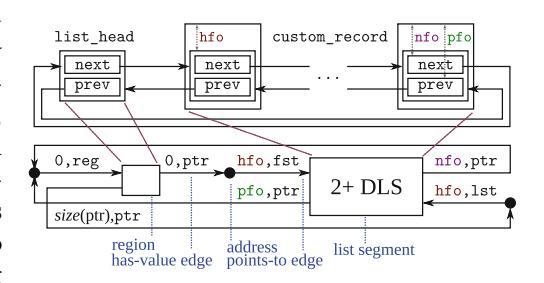
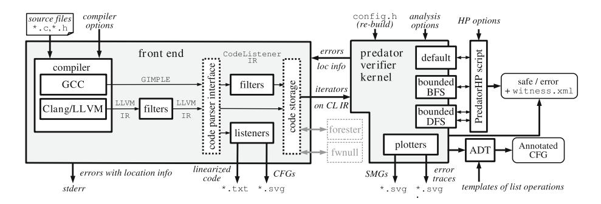

# Predator Shape Analysis Tool Suite

Lukáš Holík, Michal Kotoun, Petr Peringer, Veronika Šoková, Marek Trtík, and Tomáš Vojnar(⊠)

FIT, IT4Innovations Centre of Excellence, Brno University of Technology, Brno, Czech Republic vojnar@fit.vutbr.cz

**Abstract.** The paper presents a tool suite centered around the Predator shape analyzer for low-level C code based on the notion of symbolic memory graphs. Its architecture, optimizations, extensions, inputs, options, and outputs are covered.

#### 1 Introduction

Analysing programs with dynamic pointer-linked data structures is one of the most difficult tasks in program analysis. The reason is that one has to deal with infinite sets of program configurations having the form of complex graphs representing the contents of the program heap. The task becomes even more complicated when considering low-level pointer manipulating programs where one has to deal with operations such as pointer arithmetic, address alignment, or block operations.

Many different formalisms have been proposed for finitely representing infinite sets of heap configurations. One of them is the formalism of symbolic memory graphs (SMGs) [6]. In particular, SMGs specialise—at least for the time being—in representing sets of configurations of programs manipulating various kinds of lists, which can be singly- or doubly-linked, hierarchically nested, cyclic, shared, and have various additional links (head pointers, tail pointers, data pointers, etc.). SMGs were originally inspired by the notion of separation logic with higher-order list predicates, but they were given a graph form to allow for an as efficient fully-automated shape analysis based on abstract interpretation as possible. Moreover, SMGs turned out to be a suitable basis for extensions allowing one to capture various low-level memory features.

SMGs are used as the underlying formalism of the Predator shape analyser for low-level pointer programs written in C. The first version of Predator, based on a notion of SMGs significantly simpler than that of [6], appeared in [5]. Predator is capable of checking *memory safety* (no dereferencing of invalid pointers, no memory leaks, no double free operations, etc.), it can check *assertions* present in the code, and it can also print out the computed shape invariants. Since its first version, Predator was extended to support low-level memory operations in

R. Bloem and E. Arbel (Eds.): HVC 2016, LNCS 10028, pp. 202-209, 2016.

DOI: 10.1007/978-3-319-49052-6\_13

Supported by the Czech Science Foundation project 14-11384S, the IT4IXS: IT4Innovations Excellence in Science project (LQ1602), and the internal BUT project FIT-S-14-2486.

© Springer International Publishing AG 2016

the way proposed in [\[6](#page-7-0)] and optimized in various ways (e.g., by using function summaries, elimination of dead variables, etc.).

Later on, a parallelized layer, called *Predator Hunting Party* (Predator HP), was built on top of the basic Predator analyzer [\[8](#page-7-2)]. Predator HP runs the original analyzer in parallel with several bounded versions of the analysis in order to speed up error discovery and reduce the number of false alarms. The efficiency of SMGs together with all the optimizations allowed Predator to win 6 gold medals, 3 silver medals, and 1 bronze medal at the International Software Verification Competition SV-COMP'12–16 organised within TACAS'12–16 as well as the G¨odel medal at FLoC'14 Olympic Games.

Apart from optimizations, Predator has also been extended with various further outputs, such as error traces required at SV-COMP. Moreover, recently, another (experimental) extension of Predator has been implemented [\[3](#page-7-3)] which uses (slightly extended) shape invariants computed by Predator to automatically convert pointer programs manipulating lists to higher-level *container programs*.

In this paper, we describe the architecture of Predator and the entire tool suite formed around it, its various optimizations, as well as its different inputs, options, and possible outputs. This should make it significantly easier for anybody interested in Predator to start using it, join its further development, and/or get inspiration applicable in development of other program analyzers. Moreover, we believe that one can also directly re-use some of the modules of the architecture, such as the Predator's connection to both gcc and (recently added) LLVM. Indeed, all components of the tool suite are open source and freely available[1](#page-1-0) together with an extensive set of use cases.

*Related work.* There are, of course, many other shape analysers, such as TVLA [\[10](#page-7-4)], Invader [\[11\]](#page-7-5), SLAyer [\[1\]](#page-6-0), Xisa [\[2\]](#page-7-6), or Forester [\[7](#page-7-7)]. These tools differ in the underlying formalisms, generality, scalability, and/or degree of automation. Predator is distinguished by its high efficiency, degree of automation, and coverage of low-level features for analysing list-manipulating programs.

## **2 Abstract Domain of Symbolic Memory Graphs**

Predator is based on the SMG abstract domain [\[6\]](#page-7-0). We now shortly highlight its main features. For an illustration of SMGs, see Fig. [1](#page-1-1) which provides an SMG describing a cyclic Linuxstyle doubly-linked list with nodes linked by pointers pointing into the middle of the nodes (requiring pointer arithmetic to get access to the data stored in the list). SMGs

**Fig. 1.** An example of a Linux-style cyclic DLL (top) and its SMG representation (bottom)

1 [http://www.fit.vutbr.cz/research/groups/verifit/tools/predator.](http://www.fit.vutbr.cz/research/groups/verifit/tools/predator)

are directed graphs consisting of two kinds of nodes and two kinds of edges. The nodes include objects representing allocated space and values representing addresses and non-pointer data (mainly, integers). The edges have the form of has-value and points-to edges.

Objects are further divided into regions representing individual blocks of memory, doubly- and singly-linked list segments (DLSs/SLSs) representing doubly- and singly-linked sequences of nodes uninterrupted by any external incoming pointer, respectively, and optional objects that can but need not be present. Each object has some constant size in bytes (with a so far preliminary extension to interval-sized objects), a validity flag (deleted objects are kept till they are pointed to), and a placement tag distinguishing objects stored in the heap, stack, and statically allocated memory.

Each DLS is given by the hfo offset of the head structure of its nodes, storing the next and previous ("prev") pointers, which is the offset to which linking fields usually point in low-level list implementations, and the nfo/pfo offsets of the next and prev fields themselves. DLSs are tagged by a length constraint of the form N+ for  $N\geq 0$ , meaning that the DLS abstractly represents all concrete list segments of length N or bigger, or by a constraint of the form 0-1 representing segments of length zero or one. Nodes of DLSs can point to objects that are shared (each node points to the same object) or nested (each node points to a separate copy of the object). The nesting is implemented by tagging objects by their nesting level. For SLSs, the situation is similar.

Has-value edges lead from objects to values and are labelled by the field offset at which the given value is stored and the type of the value (like the simplified pointer type ptr in Fig. 1). Points-to edges lead from values encoding addresses to the objects they point to. They are labelled by a target offset and a target specifier. For a DLS, the latter specifies whether a points-to edge encodes a pointer to its first or last node (fst/lst in Fig. 1), or even a set of pointers (one for each node abstracted by the DLS) incoming into the DLS from "below". This way, back-links from nested objects to their parent DLS are encoded. Predator supports even offsets with constant interval bounds, which is crucial to support pointers obtained by address alignment wrt an unknown base pointer. In addition, SMGs can also contain inequality constraints between values.

Program statements are *symbolically executed* on regions, possibly concretised from list segments. *Block operations*, like memcopy, memset, or memmove, are supported. When reading/writing from/to regions, Predator uses *re-interpretation* to try to synthesise fields, which were not yet explicitly defined, from the currently known ones. This is so far supported (and highly needed) for low-level handling of nullified and undefined blocks—which can, e.g., nullify a field of 32 bytes and then read its sub-field of length 4 only. This way, overlapping fields can arise and be cached for efficiency purposes.

The *join operator* is based on traversing two SMGs from the same pointer variables and joining simultaneously encountered objects, sometimes replacing some more concrete objects with more abstract ones and/or inserting 0+ or 0-1 list segments when some list segment is found missing in one of the SMGs.

Entailment checking is based on the join operator: Predator checks whether the two given SMGs can be joined while always encountering more general objects in the same SMG out of the two given. Abstraction collapses uninterrupted sequences of compatible regions and list segments into a single list segment, using the join operator to join sub-heaps nested below the nodes being collapsed. Predator tries to collapse first the longest sequence of objects with the lowest loss of precision (with configurable thresholds on the minimum such length). The abstraction loop is repeated till some collapsing can be done.

#### 3 Predator Front End

The architecture of the Predator tool suite is shown in Fig. 2. Its *front end* is based on the *Code Listener* (CL) infrastructure [4] that can accept input from both the gcc and Clang/LLVM compilers. CL is connected to both gcc and Clang as their plug-in.

When used with gcc, CL reads in the GIMPLE intermediate representation (IR) from gcc and transforms it into its own Code Listener IR (CL IR), based on simplified GIMPLE. The resulting CL IR can be filtered—currently there is a filter that replaces switch instructions by simple conditions—and stored into the code storage. When used with Clang/LLVM, CL reads in the LLVM IR and (optionally) simplifies it through a number of filters in the form of LLVM optimization passes, both LLVM native and newly added. These filters can inline functions, split composed initialization of global variables, remove usage of memcpy and memset added by LLVM, change memory references to register references (removing unnecessary alloca instructions), and/or remove LLVM switch instructions. These transformations can be used independently of Predator to simplify the LLVM IR to have a simpler starting point for developing new analyzers. Moreover, CL offers a listeners architecture that can be used to further process CL IR. Currently, there are listeners that can print out the CL IR or produce a graphical form of the control flow graphs (CFGs) present in it.

The code storage stores the obtained CL IR and makes it available to the Predator verifier kernel through a special API. This API allows one to easily iterate over the types, global variables, and functions defined in the code. For each function, one can then iterate over its parameters, local variables, and its CFG. Of course, other verifier kernels than the one of Predator can be linked to the code storage. Currently, it is also used by the Forester shape analyzer [7], and, as a demo example, a simple static analyzer for finding null pointer dereferences (fwnull) is implemented over it too.

#### 4 The Predator Kernel

The kernel of Predator (written in C++ like its front end) implements an abstract interpretation loop over the SMG domain. An inter-procedural approach based on *function summaries*, in the form of pairs of input/output sub-SMGs encoding parts of the heap visible to a given function call, is used. As a further

**Fig. 2.** Architecture of the Predator tool suite

optimization, *copy-on write* is used when creating new SMGs by modifying the already existing ones.

Predator's support of *non-pointer data* is currently limited. Predator can track integer data precisely up to a given bound and can—optionally—use intervals with constant bounds (which may be widened to infinity). Arrays are handled as allocated memory blocks with their entries accessible via field offsets. Reinterpretation is used to handle unions. Predator also supports function pointers. String and float constants can be assigned, but any operations on these data types conservatively yield an undefined value.

The kernel supports many *options*. Some of them can be set in the config.h file and some when starting the analysis. Apart from various debugging options and some options mentioned already above, one can, e.g., decide whether the abstraction and join should be performed after every basic block or at loop points only (abstraction can also be performed when returning from function calls). One can specify the maximum call depth, choose between various search orders, switch on/off the use of function summaries and destruction of dead local variables, control error recovery, or control re-ordering and pruning of the lists of SMGs kept for program locations.

# **5 Outputs and Extensions**

Predator automatically looks for *memory safety errors*: illegal pointer dereferences (i.e., dereferences of uninitialised, deleted, null, or out-of-bound pointers), memory leaks, and/or double-free errors. It also looks for violations of *assertions* written in the code. Predator reports discovered errors together with their location in the code in the standard gcc format, and so they can be displayed in standard editors or IDEs. Predator can also produce error traces in a textual or graphical format or in the XML format of SV-COMP.

### **5.1 Predator Hunting Party**

*Predator Hunting Party* is an extension of the Predator analyzer implemented in Python. It runs in parallel several instances of Predator with different options. One Predator instance, called *verifier*, runs the standard sound SMG-based analysis. Then there are several (by default two) Predator instances—called *DFS hunters*—running bounded depth first searches over the CL IR of the program (with different bounds on the number of CL IR instructions to perform in one branch of the search). Finally, there is also a single Predator instance, a *BFS hunter*, running a timeout-bounded breadth-first search. The hunters use SMGs but without any heap abstraction, just non-pointer data get abstracted as usual. The verifier is allowed to claim a program safe, but it cannot report errors (to avoid false alarms stemming from heap abstraction). The hunters can report errors but cannot report a program safe (unless they exhaust the state space without reaching any bound). This strategy significantly increases the speed of the tool as well as its precision.

## **5.2 Transformation from Low-Level Lists to Containers**

The latest (experimental) extension of Predator—denoted as ADT in Fig. [2](#page-4-0) leverages the sound shape analysis of Predator to provide a sound recognition of implementation of *list-based containers* in low-level pointer code [\[3](#page-7-3)]. Moreover, it also implements a fully automated (and sound) replacement of the low-level implementation of the containers by calls of standard container operations (such as push back, pop front, etc.). Currently, (non-hierarchical) NULL-terminated doubly-linked lists (DLLs), cyclic DLLs, as well as DLLs with head/tail pointers are supported.

At the input, Predator ADT expects a specification of destructive container operations (such as push back or pop front) to look for. The operations are specified by pairs of input/output SMGs whose objects are linked to show which object is transformed into which. A fixed set of non-destructive operations (i.e., iterators, tests, etc.) is also supported. Predator ADT takes from Predator the program CFG labelled by the computed shape invariants (i.e., sets of SMGs per location), slightly extended by links showing which objects are transformed into which between the locations. It then looks in the SMGs for *container shapes* (i.e., sub-SMGs representing the supported container types) and sub-sequently tries to match the way the containers change along the CFG with the provided templates of container operations. While doing so, safe reordering of program statements is done. If all operations with some part of memory are covered this way, Predator replaces the original operations by calls of standard library functions (so far in the CFG labels only).

The recognition of container operations and their transformation to library calls can be used in a number of ways, ranging from program understanding and optimization to simplification of verification. The last possibility is due to a split of concerns: first, low-level pointer manipulation is resolved, then data-related properties can be checked [\[3\]](#page-7-3).

## **6 Experiments**

Predator was successfully tested on a quite high number of test cases that are all freely available. Among them, there are over 250 test cases specially created to test capabilities of Predator. They, however, reflect typical patterns of dealing with various kinds of lists (creating, traversing, searching, destructing, or sorting) with a stress on the way lists are used in system code (such as the Linux kernel). Predator was also successfully tested on the driver code snippets available with SLAyer [\[1\]](#page-6-0). Next, Predator found a bug in the cdrom.c test case of Invader [\[11](#page-7-5)] caused by the test harness used (unfound by Invader itself as it was not designed to track the size of allocated memory blocks)[2](#page-6-1).

Further, Predator successfully verified several aspects of the *Netscape Portable Runtime* (NSPR). Memory safety and built-in asserts during repeated allocation and deallocation of differently sized blocks in arena pools (lists of arenas) and lists of arena pools (lists of lists of arenas) were checked (for one arena size and without allocations exceeding it). Further, some aspects of the *Logical Volume Manager (lvm2)* were checked, so far with a restricted test harness using doubly-linked lists instead of hash tables.

Predator was quite successful on memory-related tasks of the *SV-COMP competition* as noted already in the introduction. Up to SV-COMP'16, if Predator was beaten on such tasks, it was by unsound bounded checkers only. In the competition, in line with its stress on soundness, Predator has never produced a false negative.

Finally, the extension of Predator for *transforming pointers to containers* was successfully tested on more than 20 programs using typical list operations (insertion, removal, iteration, tests) on null-terminated DLLs, cyclic DLLs, and DLLs with head/tail pointers. Moreover, various SLAyer's test cases on nullterminated DLLs were handled too. Verification of data-related properties (not handled by Predator) on the resulting container programs (transformed to Java) was tested by verifying several programs (such as insertion into sorted lists) by a combination of Predator and J2BP [\[9\]](#page-7-9).

## **7 Future Directions**

In the future, the kernel of Predator should be partially re-engineered to allow for easier extensions. Next, a better support for non-pointer data, a support for non-list dynamic data structures, and for open programs are planned to be added.

#### **References**

1. Berdine, J., Cook, B., Ishtiaq, S.: SLAyer: memory safety for systems-level code. In: Gopalakrishnan, G., Qadeer, S. (eds.) CAV 2011. LNCS, vol. 6806, pp. 178–183. Springer, Heidelberg (2011). doi[:10.1007/978-3-642-22110-1](http://dx.doi.org/10.1007/978-3-642-22110-1_15) 15

2 Other test cases of Invader were not handled due to problems with compiling them.

- 2. Laviron, V., Chang, B.-Y.E., Rival, X.: Separating shape graphs. In: Gordon, A.D. (ed.) ESOP 2010. LNCS, vol. 6012, pp. 387–406. Springer, Heidelberg (2010). doi[:10.1007/978-3-642-11957-6](http://dx.doi.org/10.1007/978-3-642-11957-6_21) 21
- 3. Dudka, K., Hol´ık, L., Peringer, P., Trt´ık, M., Vojnar, T.: From low-level pointers to high-level containers. In: Jobstmann, B., Leino, K.R.M. (eds.) VMCAI 2016. LNCS, vol. 9583, pp. 431–452. Springer, Heidelberg (2016). doi[:10.1007/](http://dx.doi.org/10.1007/978-3-662-49122-5_21) [978-3-662-49122-5](http://dx.doi.org/10.1007/978-3-662-49122-5_21) 21
- 4. Dudka, K., Peringer, P., Vojnar, T.: An easy to use infrastructure for building static analysis tools. In: Moreno-D´ıaz, R., Pichler, F., Quesada-Arencibia, A. (eds.) EUROCAST 2011. LNCS, vol. 6927, pp. 527–534. Springer, Heidelberg (2012). doi[:10.1007/978-3-642-27549-4](http://dx.doi.org/10.1007/978-3-642-27549-4_68) 68
- 5. Dudka, K., Peringer, P., Vojnar, T.: Predator: a practical tool for checking manipulation of dynamic data structures using separation logic. In: Gopalakrishnan, G., Qadeer, S. (eds.) CAV 2011. LNCS, vol. 6806, pp. 372–378. Springer, Heidelberg (2011). doi[:10.1007/978-3-642-22110-1](http://dx.doi.org/10.1007/978-3-642-22110-1_29) 29
- 6. Dudka, K., Peringer, P., Vojnar, T.: Byte-precise verification of low-level list manipulation. In: Logozzo, F., F¨ahndrich, M. (eds.) SAS 2013. LNCS, vol. 7935, pp. 215–237. Springer, Heidelberg (2013). doi[:10.1007/978-3-642-38856-9](http://dx.doi.org/10.1007/978-3-642-38856-9_13) 13
- 7. Hol´ık, L., Leng´al, O., Rogalewicz, A., Sim´ ˇ aˇcek, J., Vojnar, T.: Fully automated shape analysis based on forest automata. In: Sharygina, N., Veith, H. (eds.) CAV 2013. LNCS, vol. 8044, pp. 740–755. Springer, Heidelberg (2013). doi[:10.1007/](http://dx.doi.org/10.1007/978-3-642-39799-8_52) [978-3-642-39799-8](http://dx.doi.org/10.1007/978-3-642-39799-8_52) 52
- 8. Muller, P., Peringer, P., Vojnar, T.: Predator hunting party (competition contribution). In: Baier, C., Tinelli, C. (eds.) TACAS 2015. LNCS, vol. 9035, pp. 443–446. Springer, Heidelberg (2015). doi[:10.1007/978-3-662-46681-0](http://dx.doi.org/10.1007/978-3-662-46681-0_40) 40
- 9. Par´ızek, P., Lhot´ak, O.: Predicate abstraction of Java programs with collections. In: Proceedings of OOPSLA 2012. ACM Press (2012)
- 10. Sagiv, M., Reps, T.W., Wilhelm, R.: Parametric shape analysis via 3-valued logic. ACM Trans. Program. Lang. Syst. (TOPLAS) **24**(3), 217–298 (2002). ACM
- 11. Yang, H., Lee, O., Berdine, J., Calcagno, C., Cook, B., Distefano, D., O'Hearn, P.: Scalable Shape Analysis for Systems Code. In: Gupta, A., Malik, S. (eds.) CAV 2008. LNCS, vol. 5123, pp. 385–398. Springer, Heidelberg (2008). doi[:10.1007/](http://dx.doi.org/10.1007/978-3-540-70545-1_36) [978-3-540-70545-1](http://dx.doi.org/10.1007/978-3-540-70545-1_36) 36