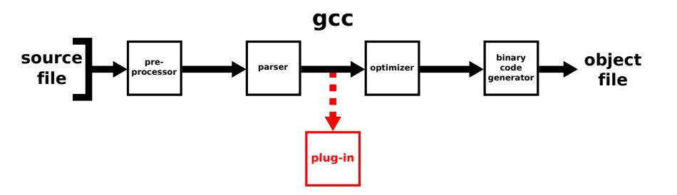
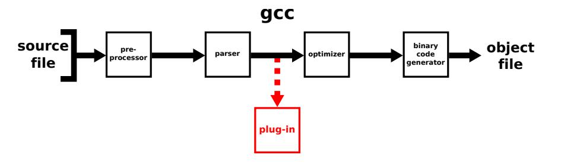
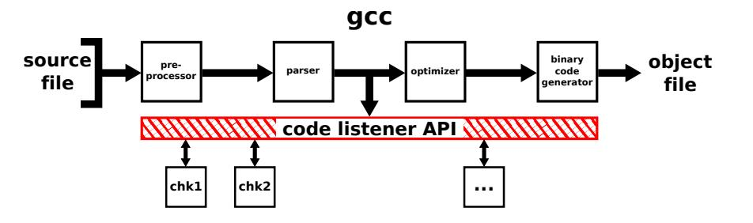
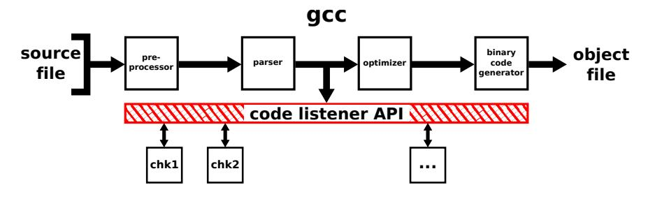
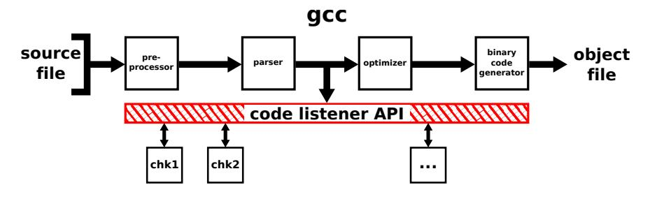
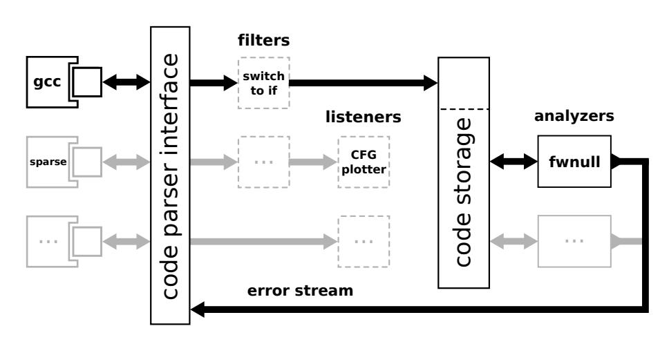
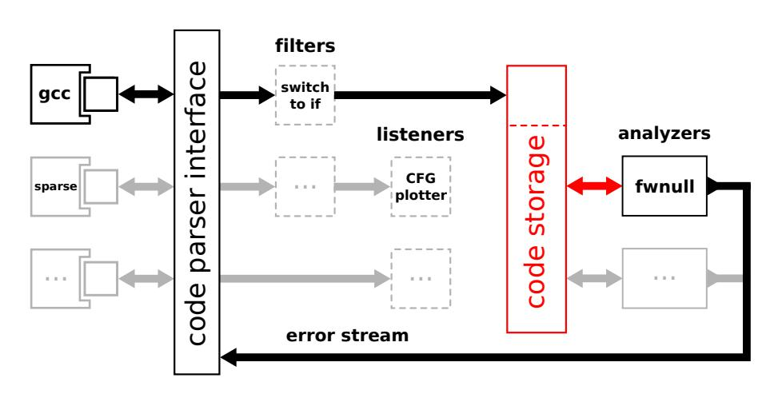
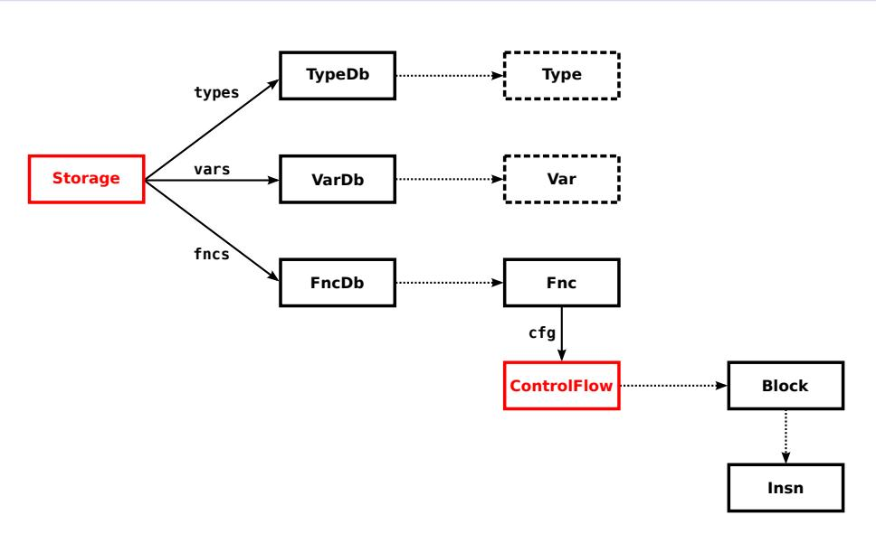

# An Easy to Use Infrastructure for Building Static Analysis Tools

**Kamil Dudka** Petr Peringer Toma´s Vojnar ˇ

FIT, Brno University of Technology, Czech Republic

February 10, 2011

# Agenda

- [Goal, Motivation](#page-2-0)
- [Design, Usage](#page-26-0)
- [Current State](#page-35-0)
- [Future](#page-39-0)

- no manual preprocessing
- fully compatible with the compiler
- fully compatible with the build system

- no manual preprocessing
- fully compatible with the compiler
- fully compatible with the build system
- as much concise API as possible

- no manual preprocessing
- fully compatible with the compiler
- fully compatible with the build system
- as much concise API as possible
- available for free

- our research group needed to build various analyzers
- we were looking for a suitable code parser

- our research group needed to build various analyzers
- we were looking for a suitable code parser
  - gcc (industrial compiler, plug-in support)

- our research group needed to build various analyzers
- we were looking for a suitable code parser
  - gcc (industrial compiler, plug-in support)
  - sparse (concise, powerful, actively used in the industry)

- our research group needed to build various analyzers
- we were looking for a suitable code parser
  - gcc (industrial compiler, plug-in support)
  - sparse (concise, powerful, actively used in the industry)
  - LLVM/clang (C++ API, not fully compatible with gcc)

- our research group needed to build various analyzers
- we were looking for a suitable code parser
  - gcc (industrial compiler, plug-in support)
  - sparse (concise, powerful, actively used in the industry)
  - LLVM/clang (C++ API, not fully compatible with gcc)
  - CIL (OCaml API, used primarily in research)

- our research group needed to build various analyzers
- we were looking for a suitable code parser
  - gcc (industrial compiler, plug-in support)
  - sparse (concise, powerful, actively used in the industry)
  - LLVM/clang (C++ API, not fully compatible with gcc)
  - CIL (OCaml API, used primarily in research)

# gcc plug-in



### gcc plug-in


Why should one build an analysis as a gcc plug-in?

### gcc plug-in



Why should one build an analysis as a gcc plug-in?

- the same code parser is used for both analysis and building
- easy to use for the end users
- ready for C++ as well as C

#### code listener



#### code listener



Why should we bother with an extra layer?

## code listener



Why should we bother with an extra layer?

- gcc is complex (about 800 000 lines of code)
- lack of documentation
- we want to be independent of gcc

What does it mean for a user?

What does it mean for a user?

- gcc **-fplugin=plug.so** ...
- make CFLAGS=**-fplugin=plug.so**
- some additional errors and warnings are reported

What does it mean for a developer?

#### What does it mean for a developer?

- easy to use C++ API
- availability of various diagnostic tools
  - CFG plotter
    - intermediate code printer
  - debugging helpers

What is code listener suitable for?

What is code listener suitable for?

- tools based on data flow analysis
- tools based on abstract interpretation
- any tool that expects CFG on its input

What is code listener suitable for?

- tools based on data flow analysis
- tools based on abstract interpretation
- any tool that expects CFG on its input

What is code listener not suitable for?

What is code listener suitable for?

- tools based on data flow analysis
- tools based on abstract interpretation
- any tool that expects CFG on its input

What is code listener not suitable for?

- tools that expect AST on their input
- GPL-incompatible projects

# Agenda

- [Goal, Motivation](#page-2-0)
- [Design, Usage](#page-26-0)
- [Current State](#page-35-0)
- <span id="page-26-0"></span>[Future](#page-39-0)

# Key Design Constraints

- concise and intuitive API for writing analyzers
- the API should be independent of gcc
- easy migration to other code parsers (e.g. from gcc to sparse)

# Block Diagram



# Block Diagram



# Code Storage API



### Instruction Set

non-terminal instructions

terminal instructions

### Instruction Set

- non-terminal instructions
  - unary operation
  - binary operation
  - function call
- 2 terminal instructions

CL\_INSN\_UNOP CL\_INSN\_BINOP CL\_INSN\_CALL

### Instruction Set

- <sup>1</sup> non-terminal instructions

  - binary operation CL INSN BINOP
- <sup>2</sup> terminal instructions
  - unconditional jump CL INSN JMP

unary operation CL INSN UNOP

function call CL INSN CALL

conditional jump CL INSN COND

return CL INSN RET

# Error Reporting Facility

- location info for each instruction, declaration
- error stream for reporting of code defects
- fully compatible with the code parser's error output

# Agenda

- [Goal, Motivation](#page-2-0)
- [Design, Usage](#page-26-0)
- [Current State](#page-35-0)
- <span id="page-35-0"></span>[Future](#page-39-0)

### Current State

- architecture already implemented and being used
- tools for verification of sequential C programs with dynamic linked data structures
- predator based on separation logic <http://www.fit.vutbr.cz/research/groups/verifit/tools/predator>
- forester based on tree automata <http://www.fit.vutbr.cz/research/groups/verifit/tools/forester>

## Demo (1/2)

- fwnull easy data-flow analyzer (demo)
- simplified [FORWARD](http://www-2.cs.cmu.edu/~aldrich/courses/654-sp09/tools/cure-coverity-06.pdf) NULL check used by Coverity
- if a pointer is checked against NULL, it should be checked before the pointer is first dereferenced

### Demo (2/2)

- fwnull found a hidden bug in the [cUrl](http://curl.haxx.se) project
- <http://github.com/bagder/curl/compare/62ef465...7aea2d5>

```
diff --git a/lib/rtsp.c b/lib/rtsp.c
--- a/lib/rtsp.c
+++ b/lib/rtsp.c
     while(*start && ISSPACE(*start))
       start++;
- if(!start) {
+ if(!*start) {
       failf(data, "Got a blank Session ID");
     }
     else if(data->set.str[STRING RTSP SESSION ID]) {
```

# Agenda

- [Goal, Motivation](#page-2-0)
- [Design, Usage](#page-26-0)
- [Current State](#page-35-0)
- <span id="page-39-0"></span>[Future](#page-39-0)

### Future Work

- support for C++ (gcc is ready)
- more front-ends (sparse, LLVM, . . . )
- we are going to build Bi-Abductive analyzer using the infrastructure
- we want to offer the infrastructure to other researchers (implies stabilisation of the API)

### Summary

- an easy way to analyze real-world code
- solution based on gcc plug-ins
- compact **C++** API
- suitable for tools that expect CFG on their input
- <http://www.fit.vutbr.cz/research/groups/verifit/tools/code-listener>
