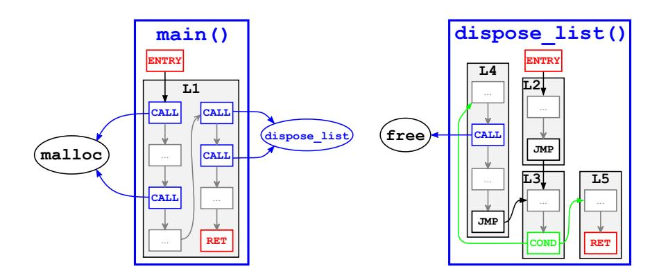
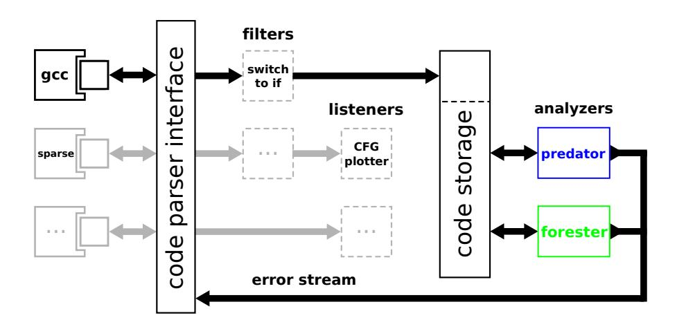
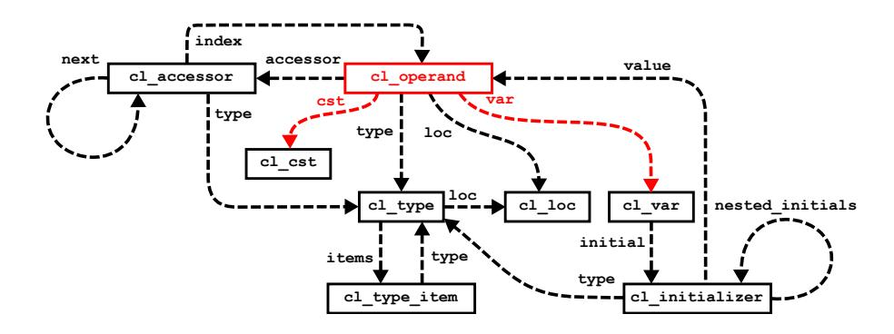
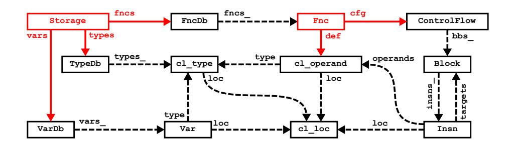

# An Easy to Use Infrastructure for Building Static Analysis Tools?

Kamil Dudka, Petr Peringer, and Toma´s Vojnar ˇ

FIT, Brno University of Technology, Czech Republic

Abstract. This paper deals with design and implementation of an easy to use infrastructure for building static analyzers. The infrastructure provides an abstraction layer called a *Code Listener* over existing source code parsers like, for example, GCC or Sparse. It is distributed as a C++ library that can be used to build static analyzers in the form of GCC *plug-ins*. The interface exposed to analyzers is, however, completely independent of GCC, which allows one to run the same analyzer on top of different code parsers without a need to change anything in the analyzer. We describe the key design principles of the infrastructure and briefly introduce its application programming interface that is available to analyzers. The infrastructure is already used in research prototypes Predator and Forester, implementing advanced shape analyses, intended to operate on real industrial code.

## 1 Introduction

In this paper, we present an infrastructure intended to simplify construction of tools for static analysis of C programs. We call the infrastructure *Code Listener*. There already are several infrastructures for writing static analysis tools. Some of them are used in software industry, like, e.g., Sparse<sup>1</sup> , which is utilized by developers of the Linux kernel. More and more static analysis passes are being added directly into compilers. Mature enough compilers, such as GCC<sup>2</sup> or LLVM<sup>3</sup> , allow one to insert additional static analysis passes at run-time. These are implemented in the form of the so-called *compiler plug-ins* and often developed independently of the compilers themselves. An advantage of writing analyzers in the form of such plug-ins is that they cannot fail due to problems with parsing the source programs. That is, whatever source program the compiler is able to compile, the analyzer is able to use as its input.

On the other hand, there exist infrastructures that are used mainly in research, like, e.g., the CIL infrastructure [4]. Another alternative is to use a generic parser generator (such as ANTLR<sup>4</sup> ) that, given a C/C++ grammar definition, can be used for building static analysis tools. These are often easier to understand by researchers as their API

<sup>?</sup> This work was supported by the Czech Science Foundation (project P103/10/0306), the Czech Ministry of Education (projects COST OC10009 and MSM 0021630528), and the BUT FIT project FIT-S-11-1.

<sup>1</sup> http://sparse.wiki.kernel.org/

<sup>2</sup> http://gcc.gnu.org/

<sup>3</sup> http://llvm.org/

<sup>4</sup> http://www.antlr.org/

(Application Programming Interface) is more concise than the internal API of industrial compilers. The downside is that the code parsers these infrastructures are based on are mainly used for static analyses only, but not for building binaries. In general, there is no guarantee that a source program we are able to compile by an industrial compiler will be accepted by a static analysis tool based on such an infrastructure. Moreover, in some cases, the source code that is analysed can differ from the code that is actually compiled and run afterwards (different included files are used, different built-in macros are defined, etc.), which significantly decreases reliability of such tools from the perspective of software vendors.

The facts stated above drove us to an idea to put the advantages of both of the mentioned approaches together. The goal of our Code Listener infrastructure is to provide an easy interface to an industrial strength compiler. We decided to use GCC as the compiler, allowing new static analysis tools to be built in the form of *GCC plug-ins*<sup>5</sup> . The infrastructure is implemented as a C++ library that takes the GCC internal representation of C and C++ source programs and makes it available to static analyzers via a concise object-oriented API. The main advantage of this approach is that developers of static analyzers do not need to learn how to access the GCC internal representation whose documentation is said to be incomplete and incorrect<sup>6</sup> . Moreover, the API that our infrastructure provides is, in fact, completely independent of GCC. That is, replacing GCC by another code parser should be possible without touching the code of static analyzers based on our infrastructure.

The Code Listener infrastructure is currently used in two prototype analyzers: Predator [1] and Forester [2]. Both of the tools aim at analysing programs with complex dynamic linked data structures. Predator is based on *separation logic* whereas Forester on *tree automata*. The distribution of our infrastructure also comes with a simple analyzer looking for null pointer dereferences, which is intended to serve as an easy to understand illustration of how to use our infrastructure.

*Plan of the paper.* Section 2 describes the considered intermediate representation of source programs that our infrastructure works with. Section 3 provides a high-level overview of the Code Listener infrastructure. Section 4 highlights important details of the interface available to analyzers. Finally, Section 5 concludes the paper and briefly mentions possible further development of the infrastructure.

### 2 Intermediate Representation of Source Programs

In C programs, the code is organized into functions, which can be to some degree compiled independently of each other. The particular representation used in GCC to describe their bodies varies as one goes along the chain of compiler passes. The representation that our infrastructure works with when obtaining the intermediate code from GCC is called GIMPLE<sup>7</sup> [3]. It is based on the structure of parse trees where expressions are

<sup>5</sup> http://gcc.gnu.org/onlinedocs/gccint/Plugins.html

<sup>6</sup> http://www.delorie.com/gnu/docs/gcc/gccint 32.html

<sup>7</sup> More precisely, our infrastructure uses *low-level GIMPLE*.



Fig. 1. Two functions described by their control flow graphs

broken down into a 3-address form, using temporary variables to hold intermediate values. For further use in the Code Listener infrastructure, GIMPLE is translated into our own representation, which is inspired by GIMPLE, but more concise and thus easier to understand.

In our intermediate representation, depicted in Fig.1, each function is described by a *control flow graph (CFG)* where the nodes are *basic blocks*, and edges describe possible transitions among them during execution of the code<sup>8</sup> . Basic blocks are defined by a sequence of instructions that need to be executed as a whole before jumping to another basic block of the same function. We consider two groups of instructions: terminal and non-terminal. A *terminal instruction* can appear as the last instruction of a basic block only whereas a *non-terminal instruction* cannot be used as the last instruction of a basic block. The edges of CFG are specified by targets of the terminal instructions.

The instructions (whose brief overview is provided below) use their *operands* to access literals, program variables, or the contents of memory at an address given by a program variable. The so-called *accessors* can be used to change the semantics of an operand, e.g., from using the value of a variable to using the address of the variable, or even to taking the value of the object that the variable points to. The accessor-based approach helps to keep the instruction set reasonably small, encoding the semantics of certain C language operators at the level of operands.

Since the C language is a statically typed language, the Code Listener infrastructure provides all type information that is known at compile-time. It assigns a C language type to each operand, accessor, variable, literal, and function. These types are defined recursively (e.g., a pointer to a structure consisting of a Boolean item and a generic data pointer) and can be easily traversed this way. Our infrastructure offers a type-graph generator (cl typedot) that can be used to visualize relations among types.

<sup>8</sup> The graph representation used in Fig.1 can be generated on demand by a diagnostic tool called cl dotgen that is distributed with the Code Listener infrastructure.

#### 2.1 Intermediate Instruction Set

The intermediate instruction set that our infrastructure works with consists of 3 nonterminal instructions (UNOP, BINOP, and CALL) and 5 terminal instructions (JMP, COND, SWITCH, RET, and ABORT). A brief introduction of each of them follows.

A *unary operation (UNOP)* is an instruction of the form dst := ◦ src where dst is a destination operand, src is a source operand, and ◦ is a unary operator. If ◦ is the identity, the instruction becomes an assignment. Our infrastructure further supports the following unary operators: logical not (! in the C language), bitwise not (∼ in the C language), and unary minus. Other arithmetic unary operators, like, e.g., postincrementation, are encoded as binary operators in our representation.

A *binary operation (BINOP)* is an instruction of the form dst := src1 ◦ src2 where dst is a destination operand, src1 and src2 are source operands, and ◦ is a binary operator. Binary operators that our infrastructure supports include comparison operators, arithmetic operators (including the pointer plus), logical operators, and bitwise operators (including shifts and rotations).

A *function call (CALL)* is an instruction of the form dst := fnc arg1 arg2 . . . where dst is a destination operand (can be void in case the function's return value is not used), fnc is an operand that specifies a function to be called, and arg1 arg2 . . . are optional arguments passed to the called function. The fnc operand can specify a function that is defined in the program being analyzed, an external function that we have only a declaration of, or even an indirect function call. Function calls are treated as non-terminal instructions, hence they are always followed by another instruction within a basic block.

An *unconditional jump (JMP)* is a terminal instruction that has exactly one target and no operands. It simply connects the end of a basic block with the entry of another basic block. A *conditional jump (COND)* is a terminal instruction that has exactly two targets, denoted as the *then* target and the *else* target, and one operand that is treated as Boolean. Its semantics says that the *then* target should be taken whenever the operand evaluates as true. Otherwise, the *else* target should be taken.

A *switch instruction (SWITCH)* is a generalisation of the conditional jump for operands of integral and enumerated types. Its semantics is similar to the corresponding switch statement in the C language. Instead of two targets, an arbitrarily long list of value–target pairs can be supplied. The so-called *default target* says where to jump in case no value from the list has been matched. Since not all analyzers can gain something from operating with SWITCH instructions directly, our infrastructure allows one to optionally translate each SWITCH instruction into a sequence of COND instructions.

A *return from a function (RET)* is a terminal instruction that has no target. It constitutes an endpoint of the CFG of a function. The RET instruction has exactly one operand that specifies the return value of a function. The operand can be void in case the function does not return any value.

An *abort instruction (ABORT)* is a terminal instruction that has no target and no operands. It says that, by reaching the instruction, the execution terminates for the whole program. This instruction usually follows a call of a function annotated by the noreturn attribute as, e.g., abort() from <stdlib.h>.

#### 3 The Code Listener Infrastructure

Fig. 2 provides a high-level overview of the Code Listener infrastructure. The block denoted as the *code parser interface* represents the API used for communication with code parsers. The small boxes embedded into each code parser are called *adapters*. They are responsible for translating the intermediate code representation that is specific to each particular parser into a unified, parser-independent code representation. The corresponsing API is based on callbacks which the adapters use to emit constructs of the intermediate code during traversal of the parsers' internal data structures. Behind the API, the so-called filters and listeners take place.



Fig. 2. A block diagram of the Code Listener infrastructure

The *filters*, such as the "switch to if" block in Fig. 2, can perform various transformations of the intermediate code. They take a sequence of callbacks on their input, modify the code, and submit the result as their output. For example, in case of the "switch to if" block, all SWITCH instructions of the intermediate code are translated into a sequence of COND instructions as mentioned in Section 2.

In contrast to filters, the *listeners* use the API only at their input. They install custom handlers on the callbacks and process the incoming stream of the intermediate code inside those handlers. The distribution of Code Listener provides some diagnostic tools (a CFG plotter, an intermediate code printer, etc.), which are implemented as listeners.

Since the callback-based interface is not suitable for common data-flow analyzers, we introduced another interface named *code storage*. One can view the code storage as a Code Listener which accepts a sequence of callbacks on its input and uses them to build a persistent object model of the intermediate code. Once the whole object model is built, an analysis can be started. Code storage has its own, well-documented API, which is based on the API for code parsers. Both interfaces are briefly described in the following section.

### 4 The Code Listener API

Since the Code Listener infrastructure acts as a bridge between a code parser and analyzers, it defines APIs for both. The API for code parsers is written in pure C, so that it can be easily accessed from code parsers written in pure C (such as Sparse), which may use C++ keywords as identifiers in their header files<sup>9</sup> . The API for analyzers is written in C++ and partially reuses the API for code parsers, so that we avoid defining the same data structures (an operand, a C type, and the like) at two places. In the following text, we mainly focus on the API for writing analyzers.

The types and symbols exposed to pure C code are spelled using lower case and underscores, and all of them are provided by <cl/code listener.h>, which is the only header file that a code parser adapter needs to include to interact with the Code Listener infrastructure. On the contrary, the identifiers available from C++ code only are encoded in camel-case and placed in the CodeStorage namespace. The globally scoped identifiers are decorated by the cl prefix to prevent possible collisions.

*Operands.* The key design element of the API is an operand as introduced in Section 2, which is represented by a structure named cl operand. Its collaboration diagram is shown in Fig. 3. A non-void operand must refer to either a constant (cl cst) or a variable (cl var). Constants can represent numeric or string literals, or functions. A scope (global, static, or local) is assigned to each variable and function. Further, each operand



Fig. 3. A collaboration diagram of the cl operand data type

contains a link to a (possibly empty) list of accessors (instances of cl accessor) that specifies the way how a variable is used—we can take a reference to a variable, dereference a variable, access an element of an array, or access an item of a composite type. If there is a dereference in the chain of accessors, it is guaranteed to appear at the beginning of the chain. Chaining of dereferences is not allowed, so whenever a multiple dereference appears in a source program, it is automatically broken into a sequence of instructions, each of them containing at most one dereference in each operand. If there

<sup>9</sup> http://www.spinics.net/lists/linux-sparse/msg02222.html

is a reference in the chain of accessors, it is guaranteed to be placed at the tail of the chain. The accessors for accessing array elements take indexes to arrays as operands, which causes a cycle to appear in the collaboration diagram.

Both operands and accessors are statically typed. The Code Listener API uses a structure named cl type to encode type information. Each C type is defined by its kind (integer, array, function, etc.) and, in case of non-atomic types, also by a list of references to other types that the type depends on. These connections are held in an array of structures of type cl type item. For each type, we provide the size that the corresponding object occupies in the memory. For items nested into a composite type, a relative placement (*offset*) in the surrounding type is supplied. Some variables and types can be named, but even then the names are not guaranteed to be unique. Instead of ambiguous names, their identity is given by unique integral numbers, denoted uid. A unique uid is also assigned to each function, either defined or external. In case of the GCC front-end, all those uids are globally unique.

Variables may optionally be connected with an initializer whose value is represented by an operand. The operand may refer to another variable or even the variable itself. In case of composite variables, the initializers refer to nested initializers, reflecting the composition of variables. We can take the following piece of code from <linux/list.h> as an example:

```
struct list_head {
    struct list_head *next, *prev;
};
#define LIST_HEAD_INIT(name) { &(name), &(name) }
#define LIST_HEAD(name) \
    struct list_head name = LIST_HEAD_INIT(name)
```

The code defines a macro LIST HEAD for constructing list heads either on stack or in static data. When the macro is used, a new variable with the given name is defined, featuring a composite initializer whose nested initializers refer back to the variable itself.

*Code Storage.* The API described in the previous paragraph is common for both code parsers and analyzers. On top of that API, a higher-level C++ API (*code storage*) is built that is available to analyzers only. The top-level data type assembling all available information about a source program is named Storage. It consists of lookup containers for types (TypeDb), variables (VarDB), and functions (FncDb). The collaboration diagram of the Storage structure is depicted in Fig. 4.

Using FncDb, one can access functions, which are represented by a value type named Fnc. For each defined function, it provides a list of arguments, a list of variables used by code of the function, and, finally, its CFG. The CFG is represented by the ControlFlow class, which allows to iterate over basic blocks (Block). Blocks are maintained as lists of instructions where the last (terminal) instruction in each block is treated specially as it defines successors of the block. Instructions are represented by a value type named Insn, where operands and targets are stored in STL vectors. A recently added feature extends the Insn data type by a bit vector that says which variables can be killed after execution of the instruction. The considered instruction set is described in Section 2. The numerous edges ending in cl loc suggest that the model



Fig. 4. A collaboration diagram of the Storage data type

provides the original placement in the source program for all type definitions, variables, functions, and instructions. The so-called *location info* can be used by the analyzer for reporting defects found in the analyzed program.

#### 5 Conclusion

We have presented the Code Listener infrastructure that we have designed as an easy to use infrastructure for building static analysis tools. Like GCC, the Code Listener is distributed 10 under the GPL 11 license. In order to demonstrate how easily the code storage API can be used, the distribution of our infrastructure comes with a simple analyzer looking for null pointer dereferences. This simple analyzer has already succeeded in analysing an industrial software project and found a hidden flaw in its code 13. Despite this success and despite the infrastructure is also successfully used by the research prototypes Predator and Forester, there still remains a lot of room for improvement. The first planned step is to extend the infrastructure to handle C++ code, which GCC and GIMPLE are already able to deal with. We are also working on a code parser adapter for Sparse, which is more compact in comparison to GCC.

#### References

- 1. K. Dudka, P. Peringer, and T. Vojnar. Predator: A Practical Tool for Checking Manipulation of Dynamic Data Structures Using Separation Logic. In Proceedings of CAV'11, 2011.
- 2. P. Habermehl, L. Holik, J. Simacek, A. Rogalewicz, and T. Vojnar. Forest Automata for Verification of Heap Manipulation. In Proceedings of CAV'11, 2011.
- 3. J. Merill. GENERIC and GIMPLE: A New Tree Representation for Entire Functions. In Proceedings of the 2003 GCC Summit, Ottawa, Canada, May 2003.
- 4. G. Necula, S. McPeak, S. Rahul, and W. Weimer. Cil: Intermediate Language and Tools for Analysis and Transformation of C Programs. In Proc. of CC'02, LNCS 2304, Springer, 2002.

 $<sup>^{10}\; \</sup>texttt{http://www.fit.vutbr.cz/research/groups/verifit/tools/code-listener}$ 

<sup>11</sup> http://www.gnu.org/licenses/gpl-3.0.txt

<sup>&</sup>lt;sup>12</sup> The analyzer can be found in the fwnull directory in the distribution of Code Listener.

http://github.com/bagder/curl/compare/62ef465...7aea2d5