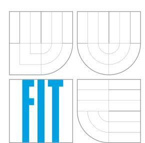
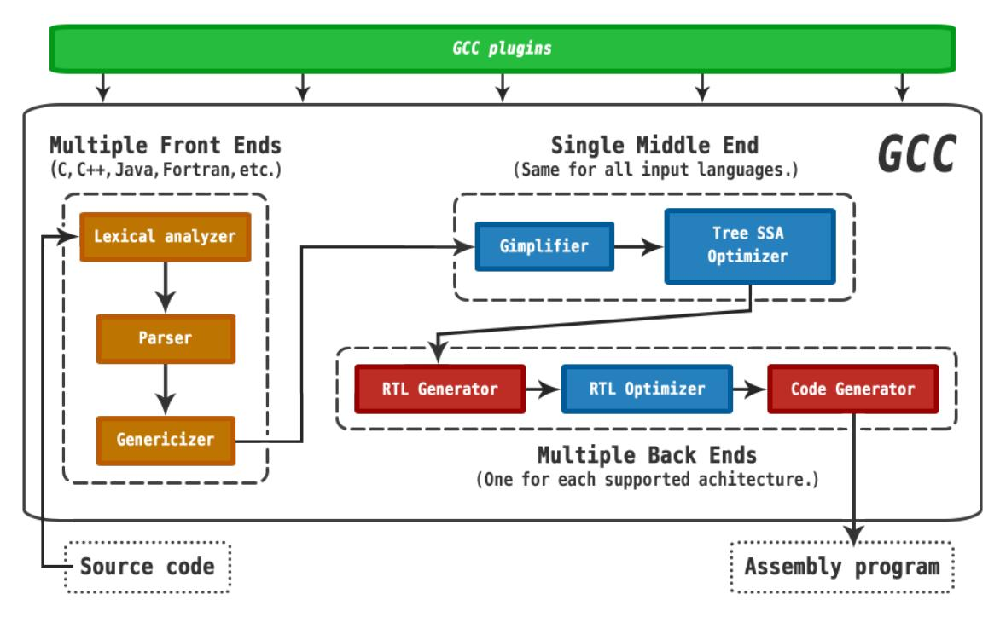
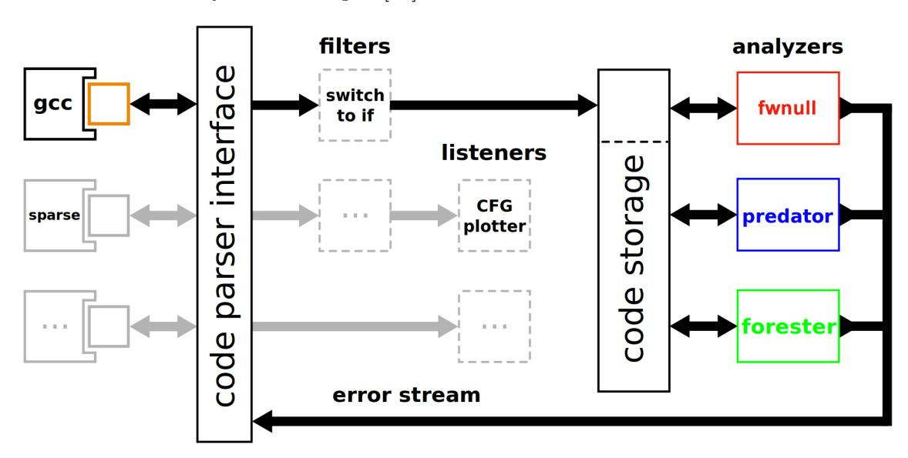
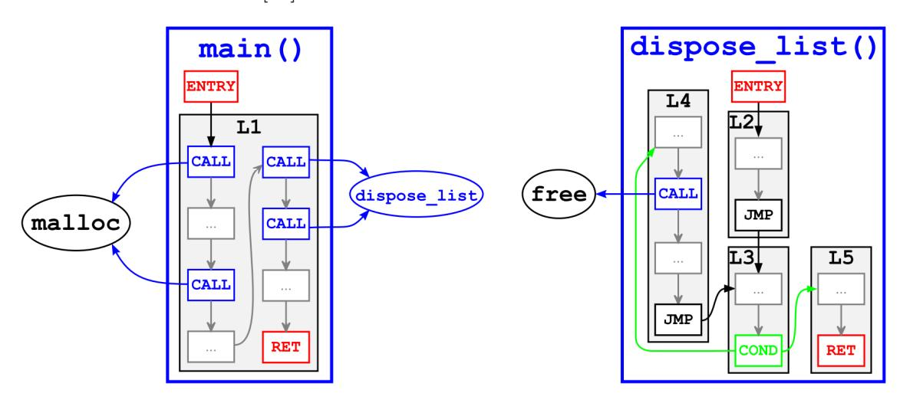
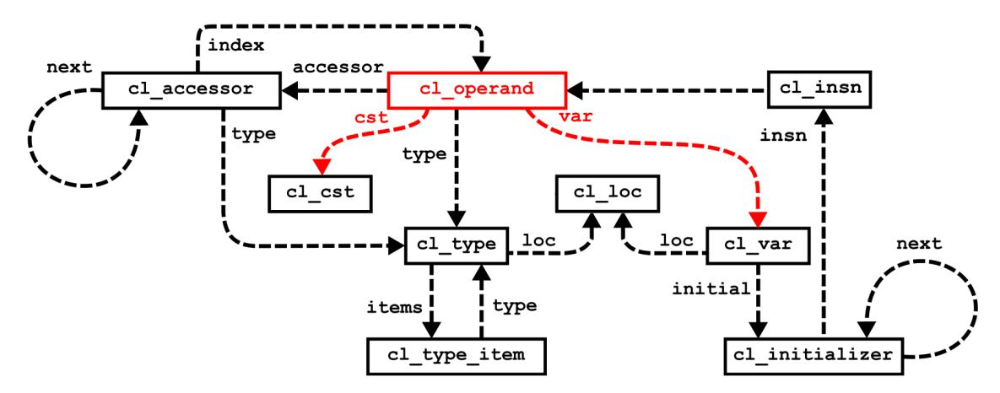

## VYSOKÉ UČENÍ TECHNICKÉ V BRNĚ BRNO UNIVERSITY OF TECHNOLOGY



## FAKULTA INFORMAČNÍCH TECHNOLOGIÍ ÚSTAV INTELIGENTNÍCH SYSTÉMŮ

FACULTY OF INFORMATION TECHNOLOGY DEPARTMENT OF INTELLIGENT SYSTEMS

# ROZŠÍŘENÍ INFRASTRUKTURY CODE LISTENER O PODPORU C++

EXTENSION OF THE CODE LISTENER INFRASTRUCTURE ADDING C++ SUPPORT

BAKALÁŘSKÁ PRÁCE BACHELOR'S THESIS

AUTOR PRÁCE DAVID KAŠPAR

VEDOUCÍ PRÁCE Ing. KAMIL DUDKA SUPERVISOR

BRNO 2014

AUTHOR

#### **Brno University of Technology - Faculty of Information Technology**

Department of Intelligent Systems Academic year 2014/2015

## **Bachelor Project Specification**

For: **Kašpar David**

Branch of study: Information Technology

Title: **Extension of the Code Listener Infrastructure Adding C**++ **Support**

Category: Formal Verification

#### Instructions for project work:

- 1. Get familiar with the GCC compiler, the Code Listener infrastructure for building static analysis tools, and the Predator and Forester tools for verification of operations with dynamic linked data structures.
- 2. Study GCC's internal representation of the C++ code.
- 3. Design and implement an extension of the current GCC adapter for the Code Listener infrastructure to add support of the C++ language so that Predator and Forester can be used to analyze C++ programs.
- 4. Test the resulting adapter using the test-suites distributed with Predator and Forester. Additionally, extend Predator's test-suite with your own test-cases covering the constructs of the C++ language that are not available in the C language (destructors, virtual methods, etc.).
- 5. Compare the extended GCC adapter you have created with its original version and evaluate your contribution for the Predator and Forester tools.

#### Basic references:

- K. Dudka, P. Peringer, and T. Vojnar. An Easy to Use Infrastructure for Building Static Analysis Tools. In Proc. of 13th International Conference on Computer Aided Systems Theory - EUROCAST'11, Las Palmas, Spain, volume 6927 of LNCS, pages 527-534, 2012. Springer-Verlag.
- K. Dudka, P. Müller, P. Peringer, and T. Vojnar. A Tool for Verification of Low-level List Manipulation. In Proc. of 19th International Conference on Tools and Algorithms for the Construction and Analysis of Systems - TACAS'13, Rome, Italy, volume 7795 of LNCS, pages 627-629, 2013. Springer-Verlag.
- Documentation of GCC's intermediate code: <http://gcc.gnu.org/onlinedocs/gccint/GIMPLE.html>

Supervisor: **Dudka Kamil, Ing.**, DITS FIT BUT

Beginning of work: November 1, 2013 Date of delivery: May 21, 2014

Detailed formal specifications can be found at <http://www.fit.vutbr.cz/info/szz/>

The Bachelor Thesis must define its purpose, describe a current state of the art, introduce the theoretical and technical background relevant to the problems solved, and specify what parts have been used from earlier projects or have been taken over from other sources.

Each student will hand-in printed as well as electronic versions of the technical report, an electronic version of the complete program documentation, program source files, and a functional hardware prototype sample if desired. The information in electronic form will be stored on a standard non-rewritable medium (CD-R, DVD-R, etc.) in formats common at the FIT. In order to allow regular handling, the medium will be securely attached to the printed report.

> L.S. Petr Hanáček *Associate Professor and Head of Department*

## Abstrakt

V této práci je popisováno rozšíření infrastruktury Code Listener, kterou lze použít pro tvorbu nástrojů pro statickou analýzu programů, o podporu zpracování programovacího jazyka C++. Řešení představuje rozšíření pluginu Code Listener bez nutnosti jakékoliv modifikace v již existujících statických analyzátorech, které jsou na této infrastruktuře postaveny. Výsledkem této práce je přidání podpory pro zpracování základních konstrukcí jazyka C++, jako například jmenných prostorů, L-hodnotových referencí nebo tříd. Přínosem této práce je možnost ji dále použít jako odrazový bod pro implementaci zbývající podpory jazyka C++ pro infrastrukturu Code Listener.

## Abstract

The thesis describes an extension of the Code Listener infrastructure adding support for C++ programming language, where the Code Listener infrastructure itself can be used for building of static analysis tools. The solution represents the extension of the Code Listener plugin without any need to modify the already existing static analysis tools that are based on it. Outcome of this work is added support for processing of basic C++ language construct, like e.g. namespaces, L-value references or classes. Contribution of the work is then represented by the possibility to use this thesis as a stepping-stone for implementing the remaining support of C++ language into the Code Listener infrastructure.

## Klíčová slova

Code Listener, Predator, Forester, nástroj pro statickou analýzu, C, C++, GCC, GIMPLE, mezijazyk, VeriFIT

## Keywords

Code Listener, Predator, Forester, static analysis tool, C, C++, GCC, GIMPLE, intermediate language, VeriFIT

## Citace

David Kašpar: Extension of the Code Listener Infrastructure Adding C++ Support, bakalářská práce, Brno, FIT VUT v Brně, 2014

## Extension of the Code Listener Infrastructure Adding C++ Support

## Prohlášení

Prohlašuji, že svou bakalářskou práci na téma Extension of the Code Listener Infrastructure Adding C++ Support jsem vypracoval samostatně, pouze pod vedením Ing. Kamila Dudky, a s použitím odborné literatury a dalších informačních zdrojů, které jsou v práci všechny citovány a které jsou uvedeny v seznamu použité literatury na konci práce.

> . . . . . . . . . . . . . . . . . . . . . . . David Kašpar July 31, 2014

## Poděkování

Tímto bych rád poděkoval všem, kteří se svou pomocí – ať už přímo nebo nepřímo – podíleli na úspěšném dokončení této bakalářské práce...

V prvé řadě mé díky patří vedoucímu této bakalářské práce, Kamilu Dudkovi, za jeho vedení správným směrem, cenné rady i tipy, a jeho bezmeznou tpělivost s mojí osobou. Následně bych rád poděkoval Stanislavu Smatanovi, za jeho pomoc se sazbou oficiálního zadání, stejně jako Janu Mišákovi, bez kterého by tato prace byla mnohem více plná drobných chyb a překlepů. A v neposlední řadě bych hlavně rád poděkoval svojí rodině za jejich psychickou i finanční podporu – bez nich bych se takto daleko nikdy dostat nedokázal.

Vám všem patří mé díky. Děkuji!

#### c David Kašpar, 2014.

Tato práce vznikla jako školní dílo na Vysokém učení technickém v Brně, Fakultě informačních technologií. Práce je chráněna autorským zákonem a její užití bez udělení oprávnění autorem je nezákonné, s výjimkou zákonem definovaných případů.

# Contents

| 1 |                        | Introduction                                     | 2      |
|---|------------------------|--------------------------------------------------|--------|
| 2 | Basic preliminaries    |                                                  |        |
|   | 2.1                    | Static program analysis<br>                      | 3<br>3 |
|   | 2.2                    | Intermediate language and its representation<br> | 4      |
|   |                        | 2.2.1<br>Three-address code<br>                  | 4      |
|   |                        | 2.2.2<br>Static single assignment form<br>       | 5      |
|   | 2.3                    | GCC – the GNU Compiler Collection<br>            | 5      |
|   |                        | 2.3.1<br>Internal structure of GCC<br>           | 6      |
|   | 2.4                    | Code Listener<br>                                | 8      |
|   |                        | 2.4.1<br>Control flow graph<br>                  | 8      |
|   |                        | 2.4.2<br>Predator and Forester<br>               | 9      |
|   |                        | 2.4.3<br>Acquiring Code Listener's code<br>      | 9      |
| 3 | State of the Art<br>11 |                                                  |        |
|   | 3.1                    | Information from online sources<br>              | 11     |
|   | 3.2                    | Information from other sources<br>               | 12     |
|   | 3.3                    | Internal structures of Code Listener<br>         | 13     |
|   | 3.4                    | Merit of the Code Listener's extension<br>       | 14     |
| 4 |                        | Proposal of the Solution                         | 16     |
|   | 4.1                    | Extension layout<br>                             | 16     |
|   | 4.2                    | Anticipated problematic sections<br>             | 17     |
|   |                        | 4.2.1<br>Templates<br>                           | 17     |
|   |                        | 4.2.2<br>Class inheritance<br>                   | 17     |
|   |                        | 4.2.3<br>Virtual member functions<br>            | 18     |
|   |                        | 4.2.4<br>Run-Time Type Information<br>           | 18     |
|   |                        | 4.2.5<br>Exceptions<br>                          | 19     |
|   | 4.3                    | Plan of work<br>                                 | 19     |
| 5 |                        | Achieved Results                                 | 21     |
| 6 |                        | Conclusion                                       | 24     |

# <span id="page-5-0"></span>Chapter 1

# Introduction

With the increasing speed of software and hardware development, there is also a bigger need for much more quicker and reliable testing of the resulted applications or hardware designs. However, success of the conventional testing largely depends on the skills of a tester, therefore it might not be always suitable for verification of the life-critical systems, for example medical, nuclear or aviation software or hardware.

The process of formal verification and its approaches might be a solution to this issue, since it uses formal methods of mathematics to prove or disprove the correctness of a tested behaviour. Still, the act of such proving is not an easy task and for example the Theorem proving, one of the approaches, usually requires an expert to lead the process of the verification [\[46\]](#page-31-0).

On the other hand, it is possible to create a computer program which will automatically check and verify the certain aspects of other computer programs/hardware designs. One of the such approaches is called static program analysis. It uses the source code of the program, or some form of the object code representing it, to perform a certain type of formal verification. This is being done without executing the tested program itself.

To ease up the process of creating a static analysis tool, the members of the VeriFIT group [\[3\]](#page-28-0) have been working on the so-called Code Listener in recent years. This infrastructure is able to wrap an existing code parser and transform its intermediate code representation into the intermediate code representation used by Code Listener. It provides researchers with the concise, free, unified, object-oriented, and mainly – well-documented API (Application Programming Interface) – for creating static analysis tools [\[39,](#page-31-1) [7\]](#page-28-1).

Even though the current version of the Code Listener infrastructure supports only processing of the C programming language, it is being used in two static analysis tools of the VeriFIT group – predator [\[37\]](#page-30-0) and forester [\[36\]](#page-30-1) – and one demo tool – fwnull [\[7,](#page-28-1) [12\]](#page-29-0).

The goal of this thesis is to extend the Code Listener infrastructure by adding support for processing of the C++ programming language. This extension will allow the use of predator, forester, and any other static analysis tools based on Code Listener, to analyze the C++ language source codes – without need to make any changes to the tools themselves.

The following Chapter [2](#page-6-0) will provide more information about the Code Listener itself, industrial compiler named GCC [\[18\]](#page-29-1) and its connection to Code Listener, GCC's intermediate code representation, and key aspects of the C and C++ programming languages.

Chapter [3](#page-14-0) describes the initial state of the thesis, while in the Chapter [4](#page-19-0) the proposed solution is discussed more thoroughly.

Finally, the Chapter [5](#page-24-0) summarizes the work's results and usability.

# <span id="page-6-0"></span>Chapter 2

# Basic preliminaries

The upcoming sections contain all of the fundamental knowledge, which some of the readers might find useful in order to fully understand the terms, figures or schemes used later. These previously studied information were cherry-picked to provide only the relevant ones.

To comply with the common typesetting rules, every new occurrence of an important term will be emphasized, while every source code example will be written in monospaced font.

## <span id="page-6-1"></span>2.1 Static program analysis

Static program analysis (static analysis in short) is one of the approaches of the formal verification. It is used for proving or disproving correctness of certain aspects of the source code which is being checked. Just like a conventional testing, it can not certify that the inspected program is completely flawless. It can only confirm if a certain type of error is present in the source code or not. However, this can be done very effectively with the combination with automated testing and thus, by using many types of static analysis tools, it is possible to cover large error domains of a program where the bugs might occur.

In order to create a new static analysis tool, there is usually a requirement to obtain some form of the intermediate representation of the code, upon which the analysis can be performed. There are several ways to achieve this [\[41\]](#page-31-2):

- Use one of the existing infrastructures, like e.g. ckit [\[5\]](#page-28-2), Microsoft's AST Toolkit (which is now part of the Microsoft PREfast[\[10,](#page-28-3) [26\]](#page-30-2)) or CIL [\[45\]](#page-31-3).
- Utilize a generic parser generator that can be used for building the static analysis tool by specifying the grammar of a programming language. Some common examples include Yacc [\[35\]](#page-30-3), Bison[\[4\]](#page-28-4) or ANTLR [\[2\]](#page-28-5). Synoptic comparison of notable code parser generators can be found at Wikipedia [\[8\]](#page-28-6).
- Create a static analysis tool as a plugin for any industrial compiler, which is mature enough to support such a feature, using its generated intermediate representation.

The last mentioned approach has some quite significant benefits over the previous two approaches. Firstly, the static analysis tool, as a such plugin, "cannot fail due to problems with parsing the source programs" [\[41\]](#page-31-2). Either the compiler's input is syntactically wrong, or it can be compiled and therefore the produced intermediate representation can be used for the analysis. Secondly, the static analysis tool as a plugin can be developed completely independent of the compiler itself, assuming the API (Application Programming Interface) of the compiler stays unchanged. Lastly, source code that is used for compilation of a program is also used for the analysis. In other words, the final output of a compiler should have the same behaviour as the analysed program. This can, however, be altered in case the compiler's optimizations are faulty, which is not uncommon [\[15\]](#page-29-2).

### <span id="page-7-0"></span>2.2 Intermediate language and its representation

Compilation of source code represents transformation of a high-level language into a form of a low-level language. Even though the terms high-level language and low-level language are quite relative, for the sake of simplicity, these terms will be thence used in the following sense:

- High-level language any programming language with a strong abstraction from the computer details, like e.g. Java, C++, Perl, Python or Ruby – including the C programming language.
- Low-level language any programming language that provides little or no abstraction from the computer details at all. This would generally include a machine code or an assembly language, which can be transformed into a machine code very easily.

One of the means how to ease up the process of transformation is by using a medium-level language as a stepping-stone between the high-level and low-level languages [\[43\]](#page-31-4). This medium-level language is commonly called an intermediate language[1](#page-7-2) (IL), while the data structures representing an intermediate language are usually being called the intermediate representation (IR). Typical formats of intermediate language representations include abstract syntax tree (AST), directed acyclic graph (DAG), postfix notation (RPN) or threeaddress code (abbreviated as TAC or 3AC).

### <span id="page-7-1"></span>2.2.1 Three-address code

This intermediate language was named after its most significant feature – each instruction consists of three operands at most, generally in a form of an assignment:

$$target = operand_1 \circ operand_2$$

where ◦ represents an arbitrary binary operator and target is a place for storing the result. In case a statement of the original source code is more complicated than a binary operation, it has to be broken down into several smaller instructions of the three-address code. Keeping the instruction form very simple allows the use of some of the optimization techniques and the resulted three-address code is more easily translated into an assembly language.

If we take as source code example the statement below:

$$r = (-42 * x * x) + ((89 * z / (3.14 * y));$$

then the Listing [2.1](#page-8-2) on page [5](#page-8-2) shows the corresponding three-address code for this statement, after it was broken down into a set of the smaller instructions.

<span id="page-7-2"></span><sup>1</sup> With reference to [\[43\]](#page-31-4), the medium-level language can be also called an intermediate code.

#### <span id="page-8-2"></span>Listing 2.1: Breaking down a complex statement into a three-address code

```
TAC instruction: | Produces: 1
t1 = 0 - 42 ->> -42 2
t2 = x * x ->> x * x 3
t3 = t1 * t2 ->> (-42 * x * x) 4
t4 = 89 * z ->> (89 * z) 5
t5 = 3.14 * y ->> (3.14 * y) 6
t6 = t4 / t5 ->> (89 * z) / (3.14 * y) 7
t7 = t3 + t6 ->> (-42 * x * x) + ((89 * z) / (3.14 * y)) 8
r = t7 ->> assigment into the initial variable 9
```

The t1 to t7 and r are only a symbolic addresses. The actual addresses or registers of a computer will be assigned to them in one of the later phases of a compilation, if needed.

#### <span id="page-8-0"></span>2.2.2 Static single assignment form

Very similar intermediate representation to a three-address code is a static single assignment form (often abbreviated as SSA or SSA form). One of its two main distinctions is that each variable has to be assigned exactly once. If this condition cannot be fulfilled, then the variables with multiple assignments have to be versioned, thus de facto creating new variables by labeling them distinctively. This process is called live range splitting and is done by utilizing the so-called use-define chain [\[34\]](#page-30-4).

The second main distinction is the property of the use-define chain – each variable has to be defined before it may be used. The number of definitions is not limited and can have many forms.

Listing [2.2](#page-8-3) displays a small source code snippet in the C language and an appropriate representation in a static single assignment form.

<span id="page-8-3"></span>Listing 2.2: Example of variables versioning while generating SSA Source code: | Static single assignment: **1** ... ... **2** f = 0; ->> f0 = 0; **3** f++; ->> f1 = f0 + 1; **4** r = foo(f); ->> r0 = foo(f1); **5** f++; ->> f2 = f1 + 1; **6**

r += f; ->> r1 = r0 + f2; **7** ... ... **8**

Using a static single assignment form allows use of some SSA-based compiler optimizations, like Global value numbering or Sparse conditional constant propagation [\[9\]](#page-28-7).

## <span id="page-8-1"></span>2.3 GCC – the GNU Compiler Collection

The abbreviation GCC stands for the GNU Compiler collection and as the name suggests, it is the compiler system of the GNU project. It is distributed under the GNU General Public License (GPL) by the Free Software Foundation (FSF), and as a free software, it has been adopted as the standard compiler by most of the modern Unix-like operating systems, including Linux and BSD family [\[23\]](#page-29-3).

Initially the GCC supported only the C programming language, but this support has been extended. Official supported programming languages now include C, C++, Objective-C, Objective-C++, Java, Fortran, Ada and Go [\[27\]](#page-30-5). GCC also supports wide variety of computer architectures [\[33\]](#page-30-6).

The GCC compiler is rapidly developed and maintained by the open-source community, and because of this it strives to keep the internal documentation up-to-date. Many places of the documentation tends to be "incomplet and incorrekt" [\[19\]](#page-29-4). This can make joining the process of GCC development frustrating and not easy, just as development of any software that is directly connected to GCC's internal structures, like e.g. GCC plugins.

### <span id="page-9-0"></span>2.3.1 Internal structure of GCC

The GNU Compiler Collection is primarily consisting of several smaller units that operates sequentially, where each unit transforms the output of the previous unit. Generally, this output is in some form of an intermediate representation, except the final output of the GCC as a whole, which is a program in an assembly language.

It should be noted that GCC does not produce the machine code directly, even that it may seem so. If required, GCC calls the GNU assembler and the GNU linker to finalize a compilation, but both of these utilities are not part of a GCC itself. They are included in the GNU Binutils software collection [\[22\]](#page-29-5).

Currently, "GCC uses three main intermediate languages to represent the program during compilation" [\[1\]](#page-28-8):

- GENERIC a standardized form of an abstract syntax tree [\[44\]](#page-31-5), which is able to represent programs written in all the programming languages supported by the GCC [\[1\]](#page-28-8). In other words, GENERIC is a language-independent representation of a program's source code which serves as an interface between parser and optimizer. Its purpose is to provide a way of representing each program function entirely in trees [\[20\]](#page-29-6).
- GIMPLE simplified subset of GENERIC intermediate language, used mainly for optimizations. It was heavily influenced by the SIMPLE intermediate language, utilized by the McCAT compiler project[2](#page-9-1) of McGill University [\[21\]](#page-29-7).
- Register transfer language (RTL) an architecture-neutral assembly language [\[28\]](#page-30-7), which is primarily set for use with an abstract machine with infinite number of registers [\[42\]](#page-31-6). The register transfer language used in GCC has both internal and textual forms [\[30\]](#page-30-8) that were inspired by the S-expression notation of the Lisp programming language [\[28\]](#page-30-7). However, this intermediate language has been slow to adapt new technologies in the last few years. It is therefore expected it will be replaced by much more modern CGEN framework in the future [\[13\]](#page-29-8).

As we can see in the simplified scheme in Fig. [2.1,](#page-10-0) on the page [7,](#page-10-0) the GCC is composed of three main blocks – front-end, middle-end and back-end – and optional compiler plugins[3](#page-9-2) .

Programming languages specific parts are displayed in orange, target architecture dependent parts are in red and parts completely independent of an input programming language or computer architecture are displayed with a blue colour.

<span id="page-9-1"></span><sup>2</sup> It seems the McCAT project has died. There are no recent references about the project and the website mentioned in the GCC mailing list, where the SIMPLE IL was initially introduced [\[32\]](#page-30-9), does not exist anymore. The link redirects to homepage of Sable Research Group at McGill University instead [\[31\]](#page-30-10).

<span id="page-9-2"></span><sup>3</sup> The support for compiler plugins was introduced into the GCC with the release of GCC-4.5.0 [\[14\]](#page-29-9).

Every front-end of GCC is responsible for parsing the source files of a programming language it was created for, including any additional processing that is necessary. It is also responsible for providing results of its work in GENERIC form, so it can be used in the next compilation phase that is language independent. In case the front-end does not uses GENERIC as its internal representation for the parsed source code, then it has to be transformed correspondingly. However, since the GIMPLE is a subset of GENERIC, the front-ends are also allowed to produce the GIMPLE representation directly, in case it is desirable or more convenient[4](#page-10-1) .

<span id="page-10-0"></span>

Figure 2.1: Simplified scheme of the GNU Compiler Collection

Middle-end block provides most of the target and programming language independent optimizations[5](#page-10-2) , but it also serves as a mediator component of the compiler and thus reduces the coupling between the sets of GCC front-ends and back-ends. In other words, there is no need for creating a new specialized version of the compiler when the support for new programming language or computer architecture is added. Either a new front-end or back-end is plugged into compiler, without any further changes to the rest of it.

Back-end block is primarily responsible for generating correct assembly program for the selected target architecture[6](#page-10-3) and it also provides target architecture dependent optimizations, like e.g. register allocation or instruction scheduling [\[29\]](#page-30-11).

Plugins provide optional extension of GCC's functionality, which may vary depending on the each plugin itself. The plugins API is based on the event callback system [\[17\]](#page-29-10) and plugin callback handlers can be registered for many pre-determined events of compilation [\[16\]](#page-29-11).

<span id="page-10-1"></span><sup>4</sup> Currently, this possibility is utilized by the C and the C++ front-ends [\[21\]](#page-29-7).

<span id="page-10-2"></span><sup>5</sup> Other independent optimization passes are done by the RTL optimizer of the back-end [\[29\]](#page-30-11).

<span id="page-10-3"></span><sup>6</sup> For example, proper calling conventions, endianness and word-size have to be used.

### <span id="page-11-0"></span>2.4 Code Listener

Code Listener is an infrastructure that was introduced to allow more easier development of static analysis tools [\[39\]](#page-31-1) and is used as a GCC's plugin [\[7\]](#page-28-1).

The block denoted as the code parser interface represents the Application Programming Interface used for communication with code parsers, while the block denoted as code storage represents interface for communication with the static analysis tools based on Code Listener [\[41\]](#page-31-2).

The small boxes of each code parser represent a so-called adapters, which are responsible for emitting proper Code Listener's intermediate code representation by using its callbacks. In between the code parser interface and code storage are located the so-called filters and listeners. The filters can perform various intermediate code transformations, while the listeners can only use their input [\[41\]](#page-31-2).



Figure 2.2: A block diagram of the Code Listener infrastructure[7](#page-11-2)

The orange box in the figure above represents the adapter of GCC, whose extending is the aim of this thesis.

#### <span id="page-11-1"></span>2.4.1 Control flow graph

The Code Listener infrastructure uses its own intermediate code representation, which is based on the GIMPLE intermediate language, but is more concise and thus more easier to understand. This intermediate representation uses the so-called control flow graph for representing of each program function [\[41\]](#page-31-2). Its diagram is shown in the Figure ??, on page ??.

Nodes of this graph represent the basic blocks, while the edges describes possible transitions among them during the execution of the program. Basic blocks are consisting of sequence of instructions that need to be executed before the jump to another basic block can be performed. Because of it, two groups of instructions are considered – terminal and non-terminal [\[41\]](#page-31-2).

<span id="page-11-2"></span><sup>7</sup> Diagram taken from Code Listener's official website [\[7\]](#page-28-1) and modified after.

The terminal instruction can only appear as a last instruction of the basic block. The non-terminal instruction, on the other hand, can not be used as a last instruction of the basic block. The edges of the CFG are corresponding to the targets specified by the terminal instructions [\[41\]](#page-31-2).



Figure 2.3: Two functions described by their control flow graphs[8](#page-12-2)

Currently, the Code Listener infrastructure uses 5 non-terminal instructions – NOP, UNOP, BINOP, CALL, LABEL – and 5 terminal instructions – JMP, COND, SWITCH, RET, ABORT.

#### <span id="page-12-0"></span>2.4.2 Predator and Forester

Both of these are the static analysis tools based on the Code Listener infrastructure and are developed by members of the VeriFIT group [\[3\]](#page-28-0).

- Predator is a static analysis tool for automated formal verification of programs operating with pointers and linked lists [\[37\]](#page-30-0). Previously, the tool was based on a separation logic, but currently it is based on the Symbolic Memory Graphs (SMG). This graph representation, however, was inspired by the previously used separation logic [\[40\]](#page-31-7).
- Forester is a static analysis tool for programs which manipulate complex dynamic data structures and is based on the CEGAR framework [\[36\]](#page-30-1).

#### <span id="page-12-1"></span>2.4.3 Acquiring Code Listener's code

Source code of Code Listener – which is part of the Predator project – was acquired by cloning its online official Git repository[9](#page-12-3) from Github hosting service. Github mainly uses the Fork & Pull Model, instead of previously common Shared Project Repository Model.

If any user wants to contribute to the chosen repository, it has to be forked first. It means the copy of the original repository is created in user's repository collection, which can then be cloned as a local repository to user selected machine.

Because the fork acts like a bitwise copy, any commits produced by user does not affect the original repository, they stay in user's repository only. There are two ways how user can try to make these commits be included into the original repository:

<span id="page-12-2"></span><sup>8</sup> Diagram taken from an article in Computer Aided Systems Theory [\[41\]](#page-31-2).

<span id="page-12-3"></span><sup>9</sup> <https://github.com/kdudka/predator>

- 1) Create a so-called pull request to inform owner of the original repository that changes have been made and can be merged to the original repository. Usually, an owner of the original repository then inspects the changes and either approves them, rejects them or sends them back to the user for rework, if they miss any requirements by the owner.
- 2) Inform the owner of the original repository in some other way, e.g. by e-mail, and let him/her to cherry-pick the changes that are suitable or appropriate.

Forking of repository can be done multiple times and even forking of forked repository is possible, creating a chain of forked repositories. Getting the changes back to the original repository means going up the chain with the pull request. Because of it, the term upstream is commonly used to refer to the repository, which is one level up to the current repository. In other words, it is the parent repository to the actual one.

On the other hand, the term origin is generally used for referencing of the non-local fork of the upstream repository, which is usually stored on a server.

For the sake of this thesis, the word upstream will be used while for referencing the official Code Listener's repository, where the term origin will be used for the forked copy of the upstream[10](#page-13-0) .

<span id="page-13-0"></span><sup>10</sup> <https://github.com/deekej/predator>

# <span id="page-14-0"></span>Chapter 3

# State of the Art

The Code Listener infrastructure should have been able to process most of the C programming language constructs when the source code of it was taken over. Even though, it was necessary to find out which programming constructs were actually supported and which were not. The initial desire was to avoid needless bug hunting – or searching for possible bugs – in the later phases of the work.

Not all necessary information could be found online, however. The introduction to Code Listener's infrastructure was done via article in Computer Aided Systems Theory [\[41\]](#page-31-2); more detailed information were then found in the <cl/code listener.h> header file, which contains specifications of data structures used by Code Listener's API, and other information were obtained via discussion with the supervisor, who is both the maintainer and lead developer of Predator and Code Listener projects.

Nevertheless, these information were still not enough to fully grasp the program flow inside the GCC adapter. That eventually led to need to go through the execution of the GCC adapter plugin manually[1](#page-14-2) , statement by statement, to see what is actually being done inside of it and how.

The following sections contain more information on the necessary preliminary work, and overall state of the art of Code Listener when the work on the extension began.

### <span id="page-14-1"></span>3.1 Information from online sources

This section lists some of the information found in the upstream project description[2](#page-14-3) or official websites of either Code Listener[3](#page-14-4) , Predator[4](#page-14-5) or Forester[5](#page-14-6) :

- There is no need to manually pre-process the source code to run the analysis. An existing build-system should ease up the whole task of running the analysis tools [\[24\]](#page-29-12). Predator itself, however, is not yet ready to be used for complex projects. [\[37\]](#page-30-0).
- Forester is an early prototype and because of that, it "handles only a very restricted subset of program constructions" [\[36\]](#page-30-1).
- Code Listener, Forester and Predator are all licensed under GPLv3+ license.

<span id="page-14-2"></span><sup>1</sup> This was done by using the already prepared debugging environment for Code Listener. Use of this environment will be described more in the appendix.

<span id="page-14-3"></span><sup>2</sup> Please note that Github displays the README.md file from the repository as a project description.

<span id="page-14-4"></span><sup>3</sup> <http://www.fit.vutbr.cz/research/groups/verifit/tools/code-listener/>

<span id="page-14-5"></span><sup>4</sup> <http://www.fit.vutbr.cz/research/groups/verifit/tools/predator/>

<span id="page-14-6"></span><sup>5</sup> <http://www.fit.vutbr.cz/research/groups/verifit/tools/forester/>

- Although these tools are intended to be portable as GCC is, the only currently supported platform is Linux [\[24\]](#page-29-12). As it seems, this is mainly caused by the portability issues with the Code Listener itself, which is plugged directly into GCC.
- To build these tools from source code requires a GCC of 4.5.0 version or newer. Despite the fact the test-suite is guaranteed to fully succeed only against the 4.9.0 version of GCC[6](#page-15-1) , "the Predator plug-in itself is known to work with GCC 4.[5-8].x equally well" [\[24\]](#page-29-12).
- There are some other dependences that are needed for Predator and Forester to be able to run. One of these dependences, though, is quite interesting – 32-bit system header files. According to the supervisor, this is on account of the analysis to produce same results when the regression tests are being run.

Judging from the scope of the internal documentation of Code Listener's API for GCC adapter, there apparently were not much of contributors involvement in this part of Code Listener. Compared to API documentation of Code Listener for static analysis tools, the GCC adapter is much less documented/commented. On the other hand, it seems that the documented parts are at least correct and up-to-date.

## <span id="page-15-0"></span>3.2 Information from other sources

The information above proved to be insufficient to start the work on the extension, which led to number of small discussions with the supervisor to provide another stepping stone. Information from the supervisor about Code Listener and Predator included:

- Currently there is no support for assembly code written as a part of C programming language source code, upon which the analysis should be performed.
- Even though there should be support for bitwise operations, pointer arithmetics and safe usage of invalid pointers, Predator will probably not be able to handle bitwise operations upon pointers, which some programmers might use.
- Predator uses a so-called points-to analysis as a part of its own static analysis, to make it more easier or accurate. However, the points-to analysis is know to fail in some cases. That actually does not mean any problem in analysis done by Predator as a whole. What it does mean is when the points-to analysis fail, Predator itself will have to perform more discerning analysis on its own. And if the debugging output is turned on, some errors connected to the points-to analysis will be printed.
- For debugging purposes of Code Listener, there are two useful functions which can be used. First one is debug tree(tree t), which takes a pointer to tree's NODE structure of GIMPLE intermediate language, and displays its content in a textual form. This includes content of the structure, but also addresses inside the pointers to other nodes. The second function is overloaded cl dump(\*ptr), which can take a pointer to cl type, cl accessor, cl operand or CodeStorage::Insn structures[7](#page-15-2) to display its content. As with the previous function, the output is also textual, and both of these functions can be called inside any debugging program during execution of Code Listener.

<span id="page-15-2"></span><span id="page-15-1"></span><sup>6</sup> Update to this supported version of GCC was done on May 15, 2014.

<sup>7</sup> All of these structures will be described in detail in the following section, except the CodeStorage::Insn, which is mainly based on the cl insn structure.

• To take a first glimpse or inspiration how the GIMPLE trees are usually processed, one can take a look into the gcc/tree-pretty-print.c file inside the GCC source code.

Utilizing the knowledge collected so far was essential to find out more about the state of the art of Code Listener and Predator. By analyzing the Code Listener infrastructure, the author of this thesis was able to find out another substantial facts:

- Right now, there is no support of modular programs by Code Listener, because the GCC is usually run for each module separately, and so are the Code Listener and static analysis tool based on it. Currently, it is only able to detect if the variable or function were declared as extern.
- The Code Listener's plugin will not start processing the input source code if there was any error in previous phases of the compilation. Performing analysis on syntactically wrong code would be pointless.
- Processing of the input source code is done via mutually recursive calling of specialized handler functions. The stop for recursion is a hashing table of types – if the type was already processed before, it is skipped and the recursion can start to emerge back.

Systematic testing of Code Listener for support of C programming language constructs unveiled that there should be complete support for ISO standard C90 [8](#page-16-1) and C99 – except for handling of ISO C99 complex numbers[9](#page-16-2) . It also revealed some misleading debugging messages of points-to analysis in Predator [\[6\]](#page-28-9).

The ISO standard C11 and GNU dialects/extensions for ISO C standard were not tested, as they were not essential for initial work on Code Listener's support for C++ programming language.

### <span id="page-16-0"></span>3.3 Internal structures of Code Listener

Main design feature of Code Listener's API for static analysis tools is the use of simplified instruction set, as previously shown on page [8](#page-11-1) in Section [2.4.1.](#page-11-1)

Each instruction itself is represented by the cl insn structure and consists of these items:

- Specification of kind of an instruction UNOP, BINOP, CALL, JMP, COND, etc.
- Information about the location of instruction's occurrence in the source code.
- Additional extra information if the instruction requires them. This includes pointers to operands for instructions operating with them, name of label for JMP and LABEL instructions or specification of binary operation for BINOP instructions.

The operand is another key element of Code Listener's API. It is represented by a cl operand structure and the API defines that each non-void operand has to refer to either a constant[10](#page-16-3) (cl cst) or a variable (cl var) [\[41\]](#page-31-2). Its relations to other internal data structures of Code Listener are shown in the Figure [3.1](#page-17-1) on the subsequent page.

<span id="page-16-1"></span><sup>8</sup> Similarly known as ANSI C or ISO standard C89.

<span id="page-16-3"></span><span id="page-16-2"></span><sup>9</sup> Defined in <complex.h> header file.

<sup>10</sup> The term constant has nothing to do with const keyword of C/C++ programming languages. Here it is used for representing program data which stay unchanged during the whole execution of the program. Equivalent term in the C/C++ programming language would be word literal.

Constants can represent string literals, function definitions or numeric literals of integral and floating point type. The variables, on the other hand, are used for functions arguments, local or global variables, registers, etc.

<span id="page-17-1"></span>

Figure 3.1: A collaboration diagram of the cl operand data structure[11](#page-17-2)

Each variable and function is assigned a scope of operand's validity, which can be either global (scope is unlimited), static (scope is limited to currently processed source file) or local (scope is limited to currently processed function).

Optionally, the variable may be connected with an initializer whose value is represented by an operand of the instruction containing it. Thus the operand can refer to another variable, or even refer to the initial variable itself [\[41\]](#page-31-2). And because these initializations can be chained for nested types, the cl initializer is actually a singly linked list.

The accessor is used to change operand's semantics, if necessary, and it is represented by the cl accessor structure. Accessors can be used to reference or dereference an object, to dereference an item of array[12](#page-17-3), to access an item of structural/composite type or to obtain an offset from specified address. For more complex expressions, these accessors can be chained also, thus creating another singly linked list.

Code Listener's API guarantees that accessor dereferences will appear only at the beginning of the chain, while the references are guaranteed to be placed at the tail of it. Connecting of dereferences is not allowed [\[41\]](#page-31-2). "So whenever a multiple dereference appears in a source program, it is automatically broken into a sequence of instructions, each of them containing at most one dereference in each operand." [\[41\]](#page-31-2)

Every operand and accessor has its own statically assigned type, which is represented by instance of cl type structure. In case these types are non-atomic, another structure is used – cl type item. It allows nesting of types one into another to create a composite type.

### <span id="page-17-0"></span>3.4 Merit of the Code Listener's extension

The fwnull demo utility has already helped to find out a hidden flaw in the source code of curl [13](#page-17-4) tool [\[7\]](#page-28-1). Nevertheless, there is still a great need to work on extending the Code Listener infrastructure, so the static analysis tools based upon it are brought much more closer to the point where they could be used for checking for bugs and flaws on day-to-day

<span id="page-17-2"></span><sup>11</sup> Diagram taken from an article in Computer Aided Systems Theory [\[41\]](#page-31-2) and updated afterwards.

<span id="page-17-3"></span><sup>12</sup> The index for accessing an item of array is provided by another operand.

<span id="page-17-4"></span><sup>13</sup> <https://github.com/bagder/curl>

basis – making them useful for complex projects just as, e.g. Valgrind [14](#page-18-0) , Cppcheck [15](#page-18-1) or Clang Static Analyzer [16](#page-18-2) .

This need eventually led to the idea of expanding the area of supported languages by Code Listener's GCC adapter, adding support for C++ programming language. Both GCC and C++ language are still widely used, and it does not seem that developers or companies will stop using them any soon in the upcoming future. Thus, creating and extension for C++ programming language should lead to spread of the tools based on Code Listener infrastructure. And since all of these tools are open-source based projects, it might eventually advance to more developers joining in and collaborating. It would certainly help tools based on Code Listener in the long term basis.

<span id="page-18-0"></span><sup>14</sup> <http://valgrind.org/>

<span id="page-18-1"></span><sup>15</sup> <http://cppcheck.sourceforge.net/>

<span id="page-18-2"></span><sup>16</sup> <http://clang-analyzer.llvm.org/>

# <span id="page-19-0"></span>Chapter 4

# Proposal of the Solution

The coming sections of this chapter will try to provide background context for decisions that were made in order to provide solution for Code Listener extension. This includes details on anticipated problematic parts of the extension, other possible solutions as well as proposed plan of work.

## <span id="page-19-1"></span>4.1 Extension layout

Two main approaches were explored in order to develop Code Listener's extension for C++ programming language. The first method comprised of creating a new GCC adapter for Code Listener from scratch, while the second one was focused on extending the current GCC adapter that is already working for almost all C programming language constructs.

Creating a new GCC adapter – this approach might seem much more straightforward, but it would create a lot of similar or duplicate code to the current GCC adapter. Maintaining of such source codes, which are very much alike, would not only be much more error-prone, but it would also be much more time-consuming, which is undesirable. On the other hand, creating an extension separately would not interfere with the already working source code, thus the possibility of breaking existing code or introducing new bug(s) into the current GCC adapter would be almost completely eliminated.

Extending the current GCC adapter – this approach seems a lot easier than previous one, but as it was already stated in the paragraph above, it has its flaws. Still, the benefits of this method might be quite essential when deciding which approach should be chosen. Firstly, many of GIMPLE statements and trees are already processed and because of it, smaller area of GIMPLE intermediate language would have to be covered. Secondly, suitable software development process with very short development cycles could be used for developing the extension, e.g. test-driven development, that would utilize the already used test-suite of Code Listener and Predator. Lastly, by extending the current GCC adapter in this way, adding support for other programming languages (e.g. Java or Objective C) will be even easier in the future.

After a discussion with the supervisor and his consent, it was decided to use the latter approach. The advantages of such method outweigh its disadvantages and possible risks.

### <span id="page-20-0"></span>4.2 Anticipated problematic sections

The following subsections will focus on a description of each section of the work that were anticipated to be somehow tricky or problematic in one way or the another. In case more than one suitable solution existed, a discussion of possible courses is brought out, followed by a solution that was expected to be used.

It should be noted that a GCC 4.5.0 was chosen as a starting point of the work on the extension, because it is the first GCC which introduced the support for plugins [\[14\]](#page-29-9). And since this version of GCC has already a full support for ISO C++03 [\[25\]](#page-30-12), it was a next logical step to choose this standard as the one initially supported by the extension itself.

#### <span id="page-20-1"></span>4.2.1 Templates

First bigger issues were anticipated with the generic programming style, which in the C++ programming language is represented by the use of C++ templates. This style of programming allows programmer to postpone the (usually required) type specification in the phase of compilation, where the compiler itself is able to deduce the necessary type to be used. This process is called a template instantiation. And because the type deduction can be sometimes ambiguous, partial and full template specializations are provided as a solution.

Generally, the templates instantiation is entirely in the hands of GCC front-ends, and therefore the types should be known at the time of GIMPLE processing by Code Listener. However, this was not yet fully verified and because of it, most of the C++ Standard Library could not be used for creating tests.

If it would have proven that templates are not fully instantiated when the GIMPLE is being processed, a workaround solution would have to be found, so the Code Listener infrastructure would be able to deduce the types by itself. This need is caused by the requirement of Code Listener's API that every type (represented by cl type) is to be statically typed [\[41\]](#page-31-2).

Nevertheless, in order to verify or disprove such a behaviour, the basic C++ types ought to be tested first, and if necessary, their support would have to be implemented. This led to a creation of a work plan, which is described more in detail in the Section [4.3,](#page-22-1) on page [19.](#page-22-1)

### <span id="page-20-2"></span>4.2.2 Class inheritance

To support the object-oriented programming, the C++ language provides not only a concept of class inheritance, but it provides a concept of multiple class inheritance too. The standard of C++ programming language does not provide any rules for compilers on how to store objects of derived classes in memory or how to deal with them at all. Solution for class inheritance support is purely in hands of C++ compilers.

Every data member of any structural type (class, struct or union) has its own offset computed by Code Listener, from the beginning of that type. And it can already processed structural types composed of other structural types, in case there is no inheritance used.

However, computing the offset of data members from a class using multiple inheritance could be tricky, because there is no guarantee in which order the base classes will be stored inside the new derived class. Inheriting the same class multiple times could also pose a problem in a form of an ambiguity that would need to be handled. To avoid unnecessary and premature problems, it was decided to create a support for basic class inheritance first. And only after then to examine the representation of classes with multiple inheritance inside the GIMPLE. In case these classes would not be stored continuously in memory, a new workaround for computing offsets of data members would have to be created.

#### <span id="page-21-0"></span>4.2.3 Virtual member functions

Virtual member functions in C++ programming language are a concept of a polymorphism. They allow a late binding[1](#page-21-2) when the member function of an object is called. In other words, the exact member function to be called is looked up during the program execution, because it might not be accurately known at the time of compilation.

Some form of a virtual method table[2](#page-21-3) is usually being used in order to provide such a functionality. There are many possible solutions for compilers how to implement working virtual method table for any OOP programming language. For the sake of example, two simplified possibilities are mentioned[3](#page-21-4) :

- 1) Each object can have its own copy of virtual method table and as a part of it, a pointer to virtual method table of its base class. The base class' virtual method table can also contain a pointer to virtual method table of another class in the inheritance hierarchy.
- 2) The virtual method tables are stored in a code segment of a program, because the relative addresses of virtual member functions can be precomputed during the compilation. Each object then only contains a pointer to its own virtual method table. From there, it can also virtual method tables of its base classes in case it is a derived class.

Both of these examples have their drawbacks. The first one could be much more memory demanding. The second one, on the other hand, uses more pointer dereferences which could lead into more CPU cache misses.

In order to allow processing of virtual member functions by Code Listener, the exact solution for virtual method tables used by GCC would have to be sought out[4](#page-21-5) . The GCC parameter -fdump-class-hierarchy could be used to display the virtual method tables alignment. In case this solution would not be sufficient, then the exact Application Binary Interface (ABI) would have to be looked up in the GCC internal documentation.

Further more, solution for pure virtual member functions would have to be also created. One possible option, which makes use of that Code Listener can process functions declared as extern, would be processing pure virtual member functions as a function declarations.

#### <span id="page-21-1"></span>4.2.4 Run-Time Type Information

The C++ programming language permit to obtain information about type of the object during run-time of the program, which is also known as type introspection. It allows manipulating of type information at run-time, as well as safe typecasts of polymorphic classes with use of the dynamic cast operator. As a result, the compiler has to generate additional type information for objects of the program.

Operator typeid is used for obtaining type information, the result of such operation is of type info type.

Because the compiler has to generate additional code to support RTTI feature, the debugging inside Code Listener would produce a lot of error messages of unhandled GIMPLE statements or NODEs, which are irrelevant for initial development of the extension and would slow it down.

Turning off the Run-Time Type Information – with the -fno-rtti parameter of GCC – was proposed as a solution until the support for RTTI feature is eventually implemented.

<span id="page-21-2"></span><sup>1</sup> Also known as dynamic binding.

<span id="page-21-3"></span><sup>2</sup> Abbreviated as VMT or v-table also.

<span id="page-21-4"></span><sup>3</sup> Both of these examples, among others, do not take in account the multiple inheritance.

<span id="page-21-5"></span><sup>4</sup> It is known the exact implementation of VMTs in GCC has changed more than one time.

#### <span id="page-22-0"></span>4.2.5 Exceptions

Another feature of the C++ programming language is possibility of use of the exception handling design, which allows the change of standard program flow.

In almost every point of the C++ program it is possible to throw an exception to indicate an error has occurred and it needs to be handled. The so-called stack-unwinding is used for cleanup of local variables, by calling their destructors, when an exception is thrown. Basically, it then needs to be handled in special part of the program called catch block. If this does not happen, the exception starts to emerge from function calls, unwinding the stack on the way. In case the exception reaches a main function and is not caught in there, the program is aborted. On the other hand, the execution of the program can continue if the exception has been processed.

Because of it, the GCC generates again a lot of auxiliary information and code, as with the Run-Time Type Information, to support such a feature. However, the stack-unwinding would probably introduce another possible issue – generating of many transition edges in the Code Listener's Control flow graph.

It was expected this issue would be the hardest for dealing with, therefore it was suggested to use -fno-exceptions parameter of the GCC in order to avoid all the auxiliary information and code generated by the GCC. Because of it, the suggestion was made to postpone the implementation of support of this feature as a last step of the work.

## <span id="page-22-1"></span>4.3 Plan of work

In order to ease up the development process of the extension, a plan of work listed below was approved. The goal of this plan was to start with basic constructs of C++ programming language and advance to more complex ones, step by step. Each phase included creating of new test-cases, adding them into the test-suite and running them.

If the tests did not exploit any unhandled GIMPLE statements or trees, the phase could be finished and the next one could have been started. Otherwise, all missing implementations would have to be added and the test-suite run again. In case the regression tests discovered any new flaws, the next phase could not have been started until they were fixed.

Below you can see the proposed plan of work[5](#page-22-2) :

- 0) Testing, and implementing if necessary, the support for all constructs of C programming language compiled by the C++ compiler[6](#page-22-3) .
- 1) Adding support for basic and commonly used constructs, like e.g. L-value reference, functions overloading, functions default arguments, or other commonly used features, including bool type (and its literals) or POD[7](#page-22-4) structural types.
- 2) Implementing and testing the usage of operators new and delete for fundamental types, structural types and arrays; including the usage of placement new.
- 3) Creating basic support for concept of classes of C++ programming language. This includes among others handling of constructors and destructors; accessing static and non-static data members; or using of this pointer, access specifiers or class member functions.

<span id="page-22-2"></span><sup>5</sup> For the sake of clarity the testing done in each phase is not mentioned in every phase.

<span id="page-22-3"></span><sup>6</sup> In case of GCC, the C++ compiler can be invoked in a shell environment by calling the g++ utility.

<span id="page-22-4"></span><sup>7</sup> Plain-old-data, according to ISO standard C++98 [\[38\]](#page-31-8).

- 4) Deploying remaining support for C++ classes, which involves handling of user-defined conversions; pointers to data members and pointers to data member functions; class operators overloading; friend classes and friend functions; basic and multiple class inheritance – both without using of virtual member functions.
- 5) Testing and implementing the usage of C++ conversions const cast, static cast and reinterpret cast.
- 6) Developing support for C++ templates. This includes handling of templates of classes, functions and class member functions. It also includes making sure the partial and full templates specializations are working too.
- 7) Creating support for concept of polymorphism virtual member functions, virtual destructors and theirs invoking. Another part of this phase deploying support for abstract classes[8](#page-23-0) and C++ inheritance with use virtual member functions.
- 8) Adding support for Run-Time Type Information (RTTI) and handling of operator typeid, type info result and conversions by dynamic cast operator.
- 9) Developing support for C++ exceptions concept, which includes processing of basic exceptions, exceptions with parameters, exceptions hierarchy and standard C++ exceptions.
- 10) Making sure that C++ Standard Library can be fully utilized and if needed, implementing parts that have been missed in previous phases.
- 11) Testing of the finished extension with the newer versions of GCC to find any possible changes of the GIMPLE API, so the extension is compatible with latest versions.

Despite the effort to follow the plan of work, some situations required ad hoc changes of the plan to reflect them, but none of them were anyhow significant.

<span id="page-23-0"></span><sup>8</sup> Every class, that has at least one pure virtual member function.

# <span id="page-24-0"></span>Chapter 5

# Achieved Results

This chapter will provide summary of achieved results, as well as overview of Code Listener's state at the end of the work. Unfortunately, due to time constraints, not all expected phases of the work plan has been finished.

At the time when the tests for C programming language constructs were finished, the work on the extension began. The first step included making sure the extension will be able to process content of these tests when the g++ compiler will be used. Manual testing discovered that 10 of 41 initially created tests were displaying messages about unhandled tree NODEs, when the displaying of debugging information was turned on, and because of it was concluded these tests were de facto failing. The reason for this were nodes of TYPE DECL type that were not processed inside a structural types.

This behaviour was discussed with the supervisor. He stated that this issues should be skipped for that time, as he wanted to look into this matter by himself. Eventually, the supervisor deployed a patch for this issue as well as an explanation. The reason why g++ creates these TYPE DECL NODEs inside the structural type is that C++ allows the use of name of class as if it was previously declared with typedef. Such a behaviour is also noted in GIMPLE internal documentation [\[11\]](#page-28-10). After the fix these test were no longer failing.

The test-suite for C programming language constructs were subsequently extended by five more tests, where one of them helped to discover unhandled COMPLEX TYPE tree NODE inside Code Listener. By supervisor's decision it was accepted to ignore this behaviour in sake of the thesis. The supervisor himself then created a patch to display warning messages when the debugging mode of Code Listener is turned on, and updated it so the test-suite would not fail[1](#page-24-1) .

The next step was creating of test-cases for C++ programming language constructs, theirs testing and implementing the missing support. However, right after start it was discovered that NAMESPACE DECL tree NODE would have to be processed first. C++ language uses many of namespaces, in contrast of C language, that uses only the global namespace (in terms of GIMPLE intermediate language). If we test the version of Code Listener, where the NAMESPACE DECL is unhandled, then 9 of 54 tests created so far will fail. This number might not seem like a much, but not all the test-cases uses namespaces. In real production, code the number of occurrences of NAMESPACE DECL tree NODEs would be much higher.

After handling issues with namespaces of C++ language, it was possible to return to initial plan of work that was stated in Section [4.3,](#page-22-1) on page [19.](#page-22-1)

<span id="page-24-1"></span><sup>1</sup> Nevertheless, at the time of writing the test-suite is still failing when run with GCC 4.5.0. Please, visit the <https://github.com/deekej/predator/issues/7> webpage to see the latest status of this issue.

The next bigger issue encountered, when the plan was followed, was the matter how to deal with L-value references of C++ language. Initial exploration inside the GIMPLE code generated by g++ discovered that L-value references behaves exactly the same as pointers. However, the C++ language syntax does not allow obtaining an address of a reference, because it is not an object in the memory. Therefore this situation needed to be adequately reflected for the static analysis tools using the Code Listener.

Initially, two solutions were proposed to Kamil Dudka, who is the lead developer of Predator and the supervisor of this thesis, and to Ing. Ondřej Lengál, who is the current lead developer of Forester. However, both of the proposed solutions would need to alter the Code Listener's API, which is not something desirable.

After a significant e-mail discussion and additional examination of GIMPLE intermediate code, an acceptable solution has been found. This solution sets both the L-value and R-value references as CL TYPE PTR inside the Code Listener's representation, but it extends the Code Listener's API to provide additional information if the CL TYPE PTR is really pointer or reference. As a result, Predator and Forester did not have to be updated in any way, but the Code Listener infrastructure is able provide these necessary informations, if required.

Another significant issue detected was how to process the OFFSET TYPE tree NODEs, which represent a pointer to data member used in C++ language source code. There was a need to make sure handling of these NODEs as a CL TYPE PTR type would not result in addition of two pointers together in some cases, which is by definition of C/C++ language a syntax error. Even though the Predator or Forester should be able to detect such a flaw, the Code Listener infrastructure should not generate its internal representation that does not correspond the source code in the first place.

A further examination and testing discovered that this situation should never occur and therefore it was safe to use CL TYPE PTR type for representation of OFFSET TYPE NODE.

Eventually, there were created 54 tests for C++ programming language constructs, which makes the total number 100 of created tests so far[2](#page-25-0) , where the tests for C programming language constructs are run for both gcc and g++.

Running all the tests for C++ language constructs with a version of Code Listener before the implementation of the extension revealed that 13 of 54 tests failed, which makes its success rate more than 75%. This is caused by the unified representation of similar constructs of C and C++ programming language inside the GIMPLE intermediate code that the initial version of Code Listener is already able to process. If we run these tests for extended version of Code Listener, the success rate is increased to 100%.

With the initial version of Code Listener, there was 24% success rate for tests from Predator test-suite (638 of 837 tests failed), if they were run by g++-4.5.0. Running these tests with newer version of Code Listener produces completely same results.

If we try this again, but only with newer g++-4.9.0, the results are again completely the same for both old and new version of Code Listener. However, the success rate for g++-4.9.0 has dropped by 5% (674 of 837 tests failed). This drop is probably caused by the changes in the GIMPLE API that has been continuously introduced between releases of 4.5.0 and 4.9.0.

Nevertheless, the overall low-rate of success is caused by using C language syntax in these tests, which is not compatible with syntax of C++ language and because of it, compiler cannot compile them at all.

<span id="page-25-0"></span><sup>2</sup> Please, be advised that at the time of writing this note, there are 6 so-called dummy tests, which are waiting to be finished or enabled when the support for specific constructs is added.

So far, by testing and implementing the missing support, the Code Listener is to be able to handle these C++ programming language constructs and features:

- namespaces this includes global, nested and unnamed namespaces, as well as extension namespace definition, using directive and using declaration
- bool type which is native for C++ language and its literals
- functions overloading and default argument values
- use of const-volatile qualifiers with fundamental and structural types
- L-value references used as an alias for variable, a function return value, a formal parameter of the function and as a data member of a class
- operators new and delete for fundamental types, arrays and structural types, including the use of placement new.
- direct, zero and value initializations of objects
- plain-old-data (POD) types, nested classes and typedef nesting
- implicit and basic class constructors and destructors, default and copy constructors, user-defined conversion constructors
- access to classes data members and use of access specifiers
- declarations, definitions and using of class member functions, static data members, static const data members and static member functions
- usage of this pointer and pointers to data members.

Unfortunately, the rest of C++ programming language constructs and features remain untested and unimplemented.

As a result of this work, the GCC adapter of Code Listener infrastructure was extended to support a subset of C++ programming language constructs that are common and can be used for creation of simple test-cases for Predator, Forester or fwnull utility. Also, the prepared regression tests will be useful when the support for C++ language will be further extended.

It should be also stated that all these changes were successfully pulled by the upstream repository and merged into official Code Listener source code[3](#page-26-0) , with only small changes[4](#page-26-1) or zero changes at all.

The statistics for origin repository[5](#page-26-2) provided by the Github source-code hosting service shows there were 79 commits in total, which added 7429 and removed 941 lines of code.

If you wish to see the source code of these updates and changes, please refer to the origin repository[6](#page-26-3) or to the attached DVD. Among others, this DVD contains the instructions on how to reproduce the work results.

<span id="page-26-0"></span><sup>3</sup> The only pull-request that was rejected did not include changes in the behaviour of Code Listener itself, it was only a proposal of installation suite enhancement. Consequently, it was agreed upon the installation suite should use some improvements and because of it, they will be eventually added in the future.

<span id="page-26-1"></span><sup>4</sup> Changes that did not differed the functionality of updates, like e.g. fixing the commit message or changing the indentation of the source code, so it stays unified.

<span id="page-26-2"></span><sup>5</sup> Please note that the statistics from the upstream repository will differ.

<span id="page-26-3"></span><sup>6</sup> <https://github.com/deekej/predator>

# <span id="page-27-0"></span>Chapter 6

# Conclusion

Even though not all parts of the plan of the work have been finished, the work on this thesis succeeded in some of the significant areas of extending the Code Listener infrastructure.

Firstly, as far as it is known, all the changes and updates to the Code Listener infrastructure did not introduced any kind of flaws nor broke it. As for the author of the thesis, this is the condition that he thinks should be followed in the first place when working with any kind of production code and is a small personal achievement for him.

Secondly, the current state of Code Listener is able to handle not only C programming language source code, either compiled with gcc or g++, but it can also process a subset of C++ programming language constructs.

Creating of the regression tests did not only help to discover missing processing of GIMPLE statements and trees, it will be also useful for the future work on Code Listener, allowing e.g. to detect new bugs or regressions in case the API will change someday.

Accepting the created source code updates by the upstream repository shows these changes were approved and are actually useful, which can be taken as a small kind of success.

Furthermore, this bachelor thesis can serve as a stepping-stone for everyone who would like to join in and help with the work on the Code Listener infrastructure. The work done on the extension can also serve as a starting point for adding support for other programming languages supported by GCC, like e.g. Objective C or Java.

From the assignment point of view, all the items of it have been successfully accomplished, except the item number 4. It has been completed only partially, because not all support for every C++ programming language constructs has been added.

Lastly, by finishing this bachelor thesis the work for its author on the Code Listener infrastructure does not end here. He acknowledges the usefulness of such an infrastructure and sees its potential not only for research area, but also for practical day-to-day use by programmers all around the World.

# Bibliography

<span id="page-28-9"></span><span id="page-28-8"></span><span id="page-28-5"></span><span id="page-28-4"></span><span id="page-28-2"></span><span id="page-28-0"></span>[1] Analysis and Optimization of GIMPLE tuples. <https://gcc.gnu.org/onlinedocs/gccint/Tree-SSA.html>. Official webpage, last access: July 14, 2014. [2] ANTLR Parser Generator. <http://www.antlr.org/about.html>. Official website, last access: July 8, 2014. [3] Automated Analysis and Verification Research Group - VeriFIT. <http://www.fit.vutbr.cz/research/groups/verifit/index.php.en>. Official website, last access: July 6, 2014. [4] Bison - GNU parser generator. <https://www.gnu.org/software/bison/>. Official website, last access: July 8, 2014. [5] ckit. <http://www.smlnj.org/doc/ckit/>. Project website, last access: July 6, 2014. [6] cl/pointsto fics: eliminate a misleading debug msg – commit, Predator repository. <https://github.com/kdudka/predator/commit/a96e571>. Github source-code hosting service, last accessed: July 26, 2014. [7] Code Listener. <http://www.fit.vutbr.cz/research/groups/verifit/tools/code-listener/>. Official website, last access: July 30, 2014. [8] Comparison of parser generators. [http://en.wikipedia.org/wiki/Comparison\\_of\\_parser\\_generators](http://en.wikipedia.org/wiki/Comparison_of_parser_generators). Wikipedia webpage, last access: July 8, 2014. [9] Compiler optimizations – SSA-based optimizations. [https://en.wikipedia.org/wiki/Compiler\\_optimization#SSA-based\\_optimizations](https://en.wikipedia.org/wiki/Compiler_optimization#SSA-based_optimizations). Wikipedia webpage, last access: July 12, 2014. [10] Daniel Weise's WWW Home Page. [http://homes.cs.washington.edu/˜weise/](http://homes.cs.washington.edu/~weise/). Personal website, last access: July 8, 2014. [11] Declarations – GNU Compiler Collection (GCC) Internals. [http://www.delorie.com/gnu/docs/gcc/gccint\\_41.html](http://www.delorie.com/gnu/docs/gcc/gccint_41.html).

<span id="page-28-10"></span><span id="page-28-7"></span><span id="page-28-6"></span><span id="page-28-3"></span><span id="page-28-1"></span>DJ Delorie personnal webpage, last accessed: July 30, 2014.

<span id="page-29-0"></span>[12] fwnull – demo tool, source code. [https://github.com/kdudka/predator/blob/master/fwnull/cl\\_fwnull.cc](https://github.com/kdudka/predator/blob/master/fwnull/cl_fwnull.cc). Github source-code hosting service, last accessed: July 6, 2014.

<span id="page-29-8"></span>[13] GBE: A Gimple Back End for GCC. <https://gcc.gnu.org/wiki/gimplebackend>. Official wiki page, last access: July 14, 2014.

<span id="page-29-9"></span>[14] GCC 4.5 Release Series Changes, New Features, and Fixes. <https://gcc.gnu.org/gcc-4.5/changes.html>. Official webpage, last access: July 14, 2014.

<span id="page-29-2"></span>[15] GCC Bugzilla - Bug List. [https://gcc.gnu.org/bugzilla/buglist.cgi?bug\\_status=\\_\\_all\\_\\_&content=](https://gcc.gnu.org/bugzilla/buglist.cgi?bug_status=__all__&content=optimization&product=gcc&query_format=specific&order=changeddate%20DESC%2C) [optimization&product=gcc&query\\_format=specific&order=changeddate%20DESC%2C](https://gcc.gnu.org/bugzilla/buglist.cgi?bug_status=__all__&content=optimization&product=gcc&query_format=specific&order=changeddate%20DESC%2C). List of latest bugs for keyword optimization, last access: July 9, 2014.

<span id="page-29-11"></span>[16] GCC Plugin API – Documentation. <https://gcc.gnu.org/onlinedocs/gccint/Plugin-API.html>. Official webpage, last access: July 15, 2014.

<span id="page-29-10"></span>[17] GCC Plugin API – Wiki. [https://gcc.gnu.org/wiki/GCC\\_PluginAPI](https://gcc.gnu.org/wiki/GCC_PluginAPI). Official wiki page, last access: July 15, 2014.

<span id="page-29-1"></span>[18] GCC, the GNU Compiler Collection – GNU Project – Free Software Foundation. <https://gcc.gnu.org/>. Official website, last access: July 6, 2014.

<span id="page-29-4"></span>[19] GENERIC – Deficiencies. <https://gcc.gnu.org/onlinedocs/gccint/Deficiencies.html>. Official webpage, last access: July 13, 2014.

<span id="page-29-6"></span>[20] GENERIC – Intermediate language. <https://gcc.gnu.org/onlinedocs/gccint/GENERIC.html>. Official webpage, last access: July 14, 2014.

<span id="page-29-7"></span>[21] GIMPLE – Intermediate language. <https://gcc.gnu.org/onlinedocs/gccint/GIMPLE.html>. Official webpage, last access: July 14, 2014.

<span id="page-29-5"></span>[22] GNU Binutils. <https://www.gnu.org/software/binutils/>. Official webpage, last access: July 13, 2014.

<span id="page-29-3"></span>[23] GNU Compiler Collection. [https://en.wikipedia.org/wiki/GNU\\_Compiler\\_Collection](https://en.wikipedia.org/wiki/GNU_Compiler_Collection). Wikipedia webpage, last access: July 13, 2014.

<span id="page-29-12"></span>[24] kdudka / predator – official repository. <https://github.com/kdudka/predator>. Github source-code hosting service, last accessed: July 26, 2014.

- <span id="page-30-12"></span>[25] Language Standards Supported by GCC 4.3.0. <https://gcc.gnu.org/onlinedocs/gcc-4.3.0/gcc/Standards.html>. Official webpage, last accessed: July 28, 2014.
- <span id="page-30-2"></span>[26] PREfast Analysis Tool (Windows CE 5.0). <http://msdn.microsoft.com/en-us/library/ms933794.aspx>. Official website, last access: July 8, 2014.
- <span id="page-30-5"></span>[27] Programming Languages Supported by GCC. [https://gcc.gnu.org/onlinedocs/gcc/G\\_002b\\_002b-and-GCC.html](https://gcc.gnu.org/onlinedocs/gcc/G_002b_002b-and-GCC.html). Official webpage, last access: July 13, 2014.
- <span id="page-30-7"></span>[28] Register transfer language. [https://en.wikipedia.org/wiki/Register\\_transfer\\_language](https://en.wikipedia.org/wiki/Register_transfer_language). Wikipedia webpage, last access: July 14, 2014.
- <span id="page-30-11"></span>[29] RTL Passes of GCC. <https://gcc.gnu.org/onlinedocs/gccint/RTL-passes.html>. Official webpage, last access: July 15, 2014.
- <span id="page-30-8"></span>[30] RTL Representation. <https://gcc.gnu.org/onlinedocs/gccint/RTL.html>. Official webpage, last access: July 14, 2014.
- <span id="page-30-10"></span>[31] Sable Research Group – McGill University. <http://www.sable.mcgill.ca/>. Official webpage, last access: July 14, 2014.
- <span id="page-30-9"></span>[32] SIMPLE: A language-independent tree IR. <https://gcc.gnu.org/ml/gcc/2002-01/msg00082.html>. GCC mailing list, last access: July 14, 2014.
- <span id="page-30-6"></span>[33] Status of Supported Architectures from Maintainers' Point of View. <https://gcc.gnu.org/backends.html>. Official webpage, last access: July 13, 2014.
- <span id="page-30-4"></span>[34] Use-define chain. [https://en.wikipedia.org/wiki/Use-define\\_chain](https://en.wikipedia.org/wiki/Use-define_chain). Wikipedia webpage, last access: July 12, 2014.
- <span id="page-30-3"></span>[35] Yacc - Yet Another Compiler Compiler. <http://dinosaur.compilertools.net/#yacc>. Project online manual, last access: July 8, 2014.
- <span id="page-30-1"></span>[36] Forester – Tool for Verification of Programs with Pointers. <http://www.fit.vutbr.cz/research/groups/verifit/tools/forester/>, July 2014. Official website, last access: July 26, 2014.
- <span id="page-30-0"></span>[37] Predator. <http://www.fit.vutbr.cz/research/groups/verifit/tools/predator/>, July 2014. Official website, last access: July 30, 2014.

- <span id="page-31-8"></span>[38] Walter E. Brown. C++ Language Note: POD Types. <http://www.fnal.gov/docs/working-groups/fpcltf/Pkg/ISOcxx/doc/POD.html>, November 1999. Working group notes, last accessed: July 29, 2014.
- <span id="page-31-1"></span>[39] Kamil Dudka, Petr Peringer, and Tomáš Vojnar. An Easy to Use Infrastructure for Building Static Analysis Tools. <www.fit.vutbr.cz/research/groups/verifit/tools/code-listener/cl-ppt.pdf>, February 2011. Presentation from Eurocast'11, last access: July 29, 2014.
- <span id="page-31-7"></span>[40] Kamil Dudka, Petr Peringer, and Tomáš Vojnar. Byte-precise Verification of Low-level List Manipulation. [http://www.fit.vutbr.cz/research/groups/verifit/tools/predator/](http://www.fit.vutbr.cz/research/groups/verifit/tools/predator/predator-sas2013-slides.pdf) [predator-sas2013-slides.pdf](http://www.fit.vutbr.cz/research/groups/verifit/tools/predator/predator-sas2013-slides.pdf), June 2013. Conference presentation slides, last accessed: July 30, 2014.
- <span id="page-31-2"></span>[41] Dudka, Kamil and Peringer, Petr and Vojnar, Tomáš. An Easy to Use Infrastructure for Building Static Analysis Tools. In Moreno-Díaz, Roberto and Pichler, Franz and Quesada-Arencibia, Alexis, editor, Computer Aided Systems Theory – EUROCAST 2011, volume 6927 of Lecture Notes in Computer Science, pages 527–534. Springer Berlin Heidelberg, 2012.
- <span id="page-31-6"></span>[42] Uday Khedker. Introduction to RTL. [http://www.cse.iitb.ac.in/˜uday/courses/cs715-09/gcc-rtl.pdf](http://www.cse.iitb.ac.in/~uday/courses/cs715-09/gcc-rtl.pdf), March 2010. Lecture slides, last access: July 14, 2014.
- <span id="page-31-4"></span>[43] Mogensen, Torben Ægidius. Intermediate-Code Generation. In Introduction to Compiler Design, Undergraduate Topics in Computer Science, pages 119–146. Springer London, 2011.
- <span id="page-31-5"></span>[44] Patrick Morin. The Gnu Compiler Collection (GCC) – COMP 3002. [http://cg.scs.carleton.ca/˜morin/teaching/3002/notes/gcc.pdf](http://cg.scs.carleton.ca/~morin/teaching/3002/notes/gcc.pdf). Course slides, last access: July 14, 2014.
- <span id="page-31-3"></span>[45] Necula, GeorgeC. and McPeak, Scott and Rahul, ShreeP. and Weimer, Westley. CIL: Intermediate Language and Tools for Analysis and Transformation of C Programs. In Horspool, R.Nigel, editor, Compiler Construction, volume 2304 of Lecture Notes in Computer Science, pages 213–228. Springer Berlin Heidelberg, 2002. Chapter accessed at:

[http://www.cs.berkeley.edu/˜necula/Papers/cil\\_cc02.pdf](http://www.cs.berkeley.edu/~necula/Papers/cil_cc02.pdf). Last access: July 8, 2014.

<span id="page-31-0"></span>[46] Tomáš Vojnar. Synchronizace procesů. <www.fit.vutbr.cz/study/courses/IOS/public/prednasky/ios-prednaska-06.pdf>, April 2014. Lecture slides, IOS course, last access: July 6, 2014.