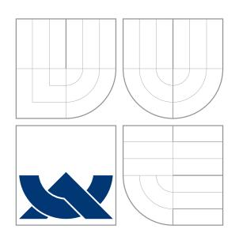
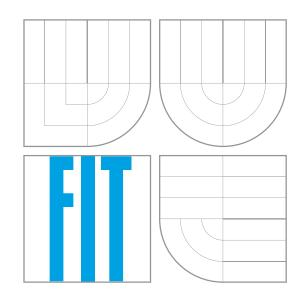
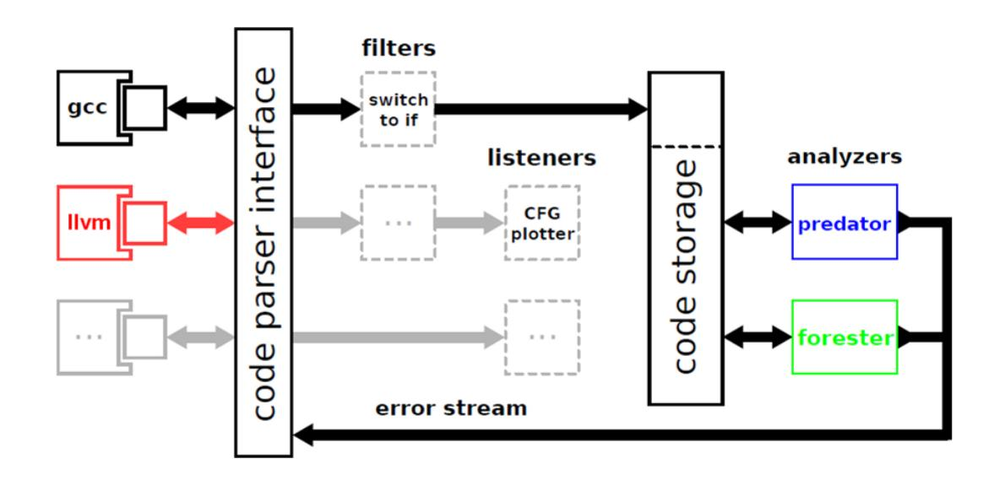
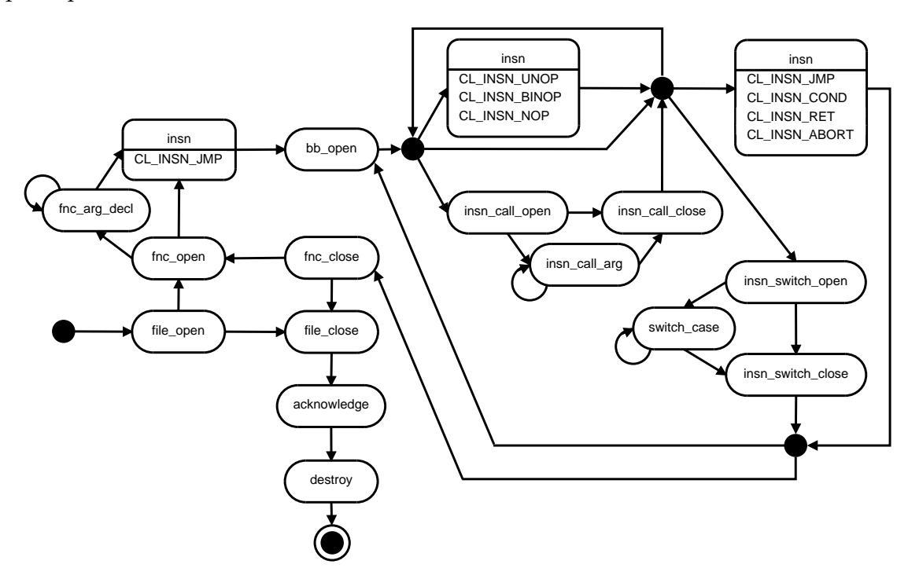
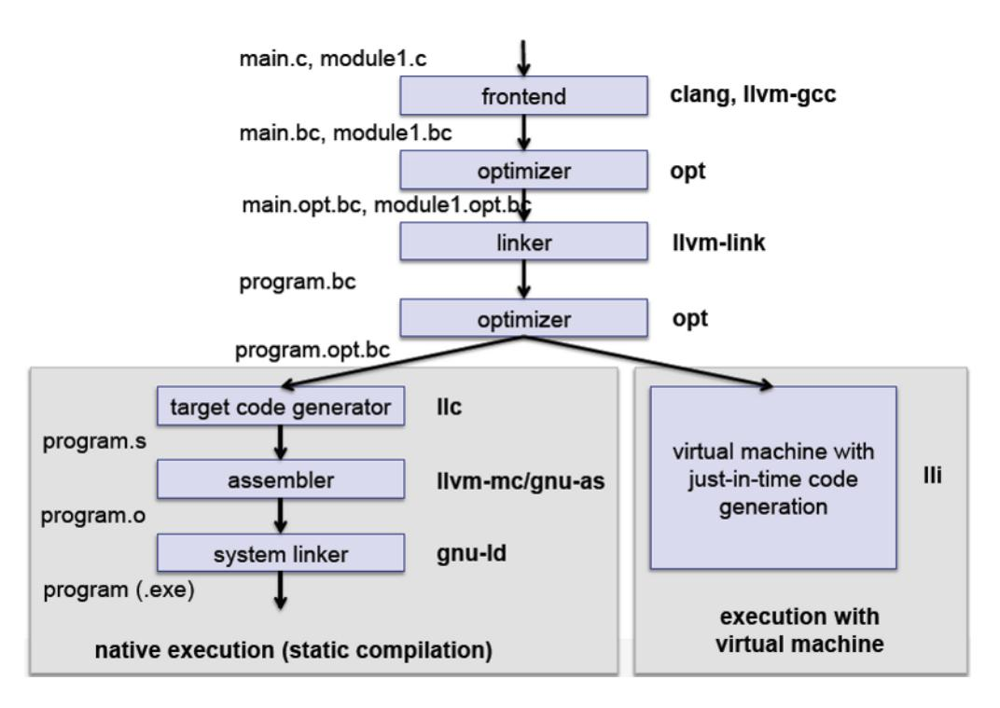

<span id="page-0-0"></span>

## VYSOKÉ UCENÍ TECHNICKÉ V BRN ˇ Eˇ BRNO UNIVERSITY OF TECHNOLOGY



### FAKULTA INFORMACNÍCH TECHNOLOGIÍ ˇ ÚSTAV INTELIGENTNÍCH SYSTÉMU˚

FACULTY OF INFORMATION TECHNOLOGY DEPARTMENT OF INTELLIGENT SYSTEMS

## VÝVOJ LLVM ADAPTÉRU PRO INFRASTRUKTURU CODE LISTENER

DEVELOPMENT OF AN LLVM ADAPTER FOR THE CODE LISTENER INFRASTRUCTURE

BAKALÁRSKÁ PRÁCE ˇ

BACHELOR'S THESIS

AUTHOR

AUTOR PRÁCE VERONIKA ŠOKOVÁ

SUPERVISOR

VEDOUCÍ PRÁCE Ing. KAMIL DUDKA

BRNO 2014

#### **Vysoké učení technické v Brne - Fakulta informačních technologií**

Ústav inteligentních systému Akademický rok 2013/2014

### **Zadání** bakaláŕské **práce**

Rešitel:

**Šoková Veronika**

Obor:

Informační technologie

Téma:

**vývoj LLVM adaptéru pro infrastrukturu Code Listener**

**Development of an LLVM Adapter for the Code Listener Infrastructure**

Kategorie: Formáiní verifikace

#### Pokyny:

1. Seznamte se snástrojem Clang/LLVM pro preklad a analýzu C/C++ programu, infrastrukturou Code Listener pro tvorbu nástroju na statickou analýzu a nástroji Predator a Forester pro verifikaci operací s dynamickými datovými strukturami.

2. Prostudujte interní reprezentaci kódu v infrastruktuŕe LLVM. Zaméŕte se zejména na

reprezentaci instrukcí pro práci s parnétí.

3. Implementujte Clang/LLVM adaptér pro infrastrukturu Code Listener tak, aby bylo možné nástroje Predator a Forester používat nezávisle na GCC.

4. Vytvorený adaptér otestujte na sadách testu dodávaných spolu s nástroji Predator a

Forester.

5. Srovnejte vámi vytvorený adaptér s adaptérem pro GCC a zhodnoťte prínos vámi vytvoreného adaptéru pro nástroje Predator a Forester.

#### Literatura:

• K. Dudka, P. Peringer, and T. Vojnar. An Easy to Use Infrastructure for Building Static Analysis Tools. In Proc. of 13th International Conference on Computer Aided Systems Theory - EUROCAST'll, Las Palmas, Spain, volume <sup>6927</sup> of LNCS, pages 527-534, 2012. Springer-Verlag.

• K. Dudka, P. MUller, P. Peringer, and T. Vojnar. A Tool for Verification of Low-Ievel List Manipulation. In Proc. of 19th International Conference on Tools and Algorithms for the Construction and Analysis of Systems - TACAS'13, Rome, Italy, volume 7795 of

LNCS, pages 627-629, 2013. Springer-Verlag.

• Domovská stránka nástroje Clang/LLVM: http://clang.llvm.org/

Pri obhajobe semestrální části projektu je požadováno:

• První dva body zadání.

Podrobné závazné pokyny pro vypracování bakaláŕské práce naleznete na adrese http://www.fit.vutbr.cz/i nfo/ szz/

Technická zpráva bakaláŕské práce musí obsahovat formulaci die, charakteristiku současného stavu, teoretická a odborná východiska ešených problému a specifikaci etap (20 až 30% celkového rozsahu technické zprávy).

Student odevzdá v jednom výtisku technickou zprávu a v elektronické podobe zdrojový text technické zprávy, úplnou programovou dokumentaci a zdrojové texty programu. Informace v elektronické podobe budou uloženy na standardním nepŕeptsovatelném paméŕovém médiu (CD-R, DVD-R, apod.), které bude vloženo do písemné zprávy tak, aby nemohlo dojít k jeho ztráté pri bežné manipulaci.

Vedoucí: **Dudka Kamil, Ing.,** UITS FIT VUT

Datum zadá ní: 1. listopadu 2013

Datum odevzdání: 21. kvétna <sup>2014</sup>Vf

f, utta <sup>í</sup> " "lallnfch.technologH Lstav Inlli **61266** .

0'1' **rr <sup>C</sup> "IC** <sup>É</sup> <sup>V</sup> <sup>~</sup> <sup>E</sup>

doc. Dr. Ing. Petr Hanáček *vedoucí ústa vu*

## **Abstrakt**

Tato bakaláˇrská práce se zabývá vývojem LLVM adaptéru pro infrastrukturu Code Listener, která usnad ˇnuje tvorbu statických analyzátor ˚u jako jsou Predator a Forester. Ty jsou vyvíjeny a využívany v rámci skupiny VeriFIT. Popisuje pˇrekladový systém LLVM, jeho interní reprezentaci kódu a frontend Clang. Souˇcástí práce je implementace daného adaptéru. K dnešnímu dni je schopen analyzovat omezenou množinu program ˚u jazyka C. Je schopen generovat CFG k funkcím. Nˇekteré testy pro Predator a Forester projdou. Dále je naznaˇcen budoucí vývoj adaptéru.

## **Abstract**

This Bachelor's thesis deals with the development of an LLVM adapter for the Code Listener Infrastructure, which simplifies the creation of static analyzers such as the Predator and the Forester. They are developed and used within the group VeriFIT. It describes LLVM compiler system, the internal representation of the code and frontend Clang. Part of this work is the implementation of the adapter. Up to this date, it is able to analyze a limited set of programs in C. It is able to generate CFGs. Some tests for Predator and Forester pass. It is also hinted at future developments.

## **Klíˇcová slova**

LLVM, infrastruktura Code Listener, plugin, statická analýza

## **Keywords**

LLVM, Code Listener Infrastructure, plug-in, static analysis

### **Citace**

Veronika Šoková: Vývoj LLVM adaptéru pro infrastrukturu Code Listener, bakaláˇrská práce, Brno, FIT VUT v Brnˇe, 2014

## **Vývoj LLVM adaptéru pro infrastrukturu Code Listener**

## **Prohlášení**

Prohlašuji, že jsem tuto bakaláˇrskou práci vypracovala samostatnˇe pod vedením pana Ing. Kamila Dudku. Uvedla jsem všechny literární prameny a publikace, ze kterých jsem ˇcerpala.

> . . . . . . . . . . . . . . . . . . . . . . . Veronika Šoková 21. mája 2014

c Veronika Šoková, 2014.

*Tato práce vznikla jako školní dílo na Vysokém uˇcení technickém v Brnˇe, Fakultˇe informaˇcních technologií. Práce je chránˇena autorským zákonem a její užití bez udˇelení oprávnˇení autorem je nezákonné, s výjimkou zákonem definovaných pˇrípad ˚u.*

# <span id="page-4-0"></span>**Obsah**

|   | Obsah                                                                                                                                                                                            | 1                                |  |  |
|---|--------------------------------------------------------------------------------------------------------------------------------------------------------------------------------------------------|----------------------------------|--|--|
| 1 | Úvod<br>1.1<br>Motivácia                                                                                                                                                                         | 2<br>2                           |  |  |
| 2 | Statická analýza<br>2.1<br>Analýza tvaru<br><br>2.2<br>Vybrané nástroje tvarovej analýzy<br>                                                                                                     | 3<br>3<br>3                      |  |  |
| 3 | Infraštruktúra Code Listener<br>3.1<br>Medzikód<br><br>3.2<br>Rozhranie infraštruktúry Code Listener<br>                                                                                         | 5<br>6<br>6                      |  |  |
| 4 | LLVM<br>4.1<br>Front-end Clang<br>4.2<br>LLVM IR<br><br>4.3<br>Možnosti napojenia                                                                                                                | 8<br>8<br>9<br>11                |  |  |
| 5 | Implementácia adaptéru<br>5.1<br>Popis tried<br><br>5.2<br>Mapovanie typov<br><br>5.3<br>Mapovanie inštrukˇcnej sady<br>5.4<br>Registrácia zásuvného modulu<br><br>5.5<br>Ovládanie programu<br> | 12<br>12<br>13<br>14<br>22<br>23 |  |  |
| 6 | Výsledky testovania                                                                                                                                                                              | 24                               |  |  |
| 7 | Budúci vývoj                                                                                                                                                                                     |                                  |  |  |
| 8 | Záver                                                                                                                                                                                            |                                  |  |  |
|   | Slovník pojmov                                                                                                                                                                                   | 29                               |  |  |
|   | Literatúra                                                                                                                                                                                       | 31                               |  |  |
| A | Hierarchia tried v LLVM                                                                                                                                                                          | 33                               |  |  |
| B | Obsah CD                                                                                                                                                                                         | 35                               |  |  |

# <span id="page-5-0"></span>**Úvod**

Táto práca sa zaoberá vývojom LLVM adaptéru k rozhraniu Code Listener, ktoré ul'ahˇcuje tvorbu statických analyzátorov. K dnešnému d ˇnu je podporovaný prekladaˇc GCC a sémantický analyzátor Sparse. Všeobecne adaptér umož ˇnuje spoluprácu ˇcastiam programu s rôznymi vnútornými štruktúrami ich vzájomným namapovaním.

Ciel'om tejto práce je vytvorit' alternatívny prístup k používaniu analyzátorov ako je Predator ˇci Forester a tak odhal'ovat' prípadné chyby v programoch jazyka C v spojení s iným prekladovým systémom ako bol používaný doposial'.

Na miestach, kde neexistuje slovenský ekvivalent anglického výrazu, sú použité anglické termíny (vid' Slovník pojmov na str. [29\)](#page-32-0).

Práca je ˇclenená nasledujúcim spôsobom. Úvod do problematiky statických analyzátorov sa nachádza v kapitole [2.](#page-6-0) Rozhranie Code Listener je popísane v [3.](#page-8-0) kapitole. Štruktúra prekladového systému LLVM a front-endu Clang, tak ako aj návrh napojenia rozširujúcich modulov, približuje kapitola [4.](#page-11-0) V [5.](#page-15-0) je popis vlastnej implementácie adaptéru. Výsledky testovania sú prezentované v kapitole [6.](#page-27-0) Dalšia kapitola ˇ [7](#page-29-0) naˇcrtne možné budúce rozšírenie. Výsledky testovania a samotnej práce s prípadnými nedostatkami sú zhrnuté v kapitole [8.](#page-31-0)

### <span id="page-5-1"></span>**1.1 Motivácia**

Statické analyzátory sú prostriedkom na kontrolu správnosti zdrojového kódu a dopomáhajú odhal'ovat' chyby programátora. Takými nástrojmi sú aj práve vyvíjané analyzátory Predator a Forester. Aktuálne pracujú nad prekladaˇcom GCC. Aby testovanie programov nemuselo byt' obmedzené len na jeden prekladový systém, táto práca ponúka rozšírenie už stávajúcej infraštruktúry Code Listener o LLVM adaptér.

Samozrejme existuje vel'ké spektrum iných prekladaˇcov, avšak LLVM je podobne ako GCC šírený pod slobodnou licenciou. Jedná sa o moderný softwarový systém, pôvodne vytváraný ako univerzitný projekt. Dnes už so širokou a aktívnou komunitou vývojárov. LLVM je ˇcasto používaná infraštruktúra pre nástroje na verifikáciu kódu (napr. Clang Static Analyzer).

## <span id="page-6-0"></span>Statická analýza

Statická analýza informuje o správaní systému na základe zdrojového popisu bez jeho vykonávania (alebo vykonávanie s odľahčenou sémantikou). Tento druh analýzy nevyžaduje model systému, používa sa i pre optimalizáciu a generovanie kódu. Jednou z techník statickej analýzy je symbolická exekúcia, ktorá vykonáva program, nie s dátami, ale množinami hodnôt, ktoré sú popísané formou logiky alebo automatmi.

V rámci formálnej verifikácie rozlišujeme aj iné postupy ako sú napr. Model Checking, Theorem Proving a SAT Solving.<sup>1</sup>

### <span id="page-6-1"></span>2.1 Analýza tvaru

Analýza tvaru (angl. *shape analysis*, podrobnejšie [1]) je druh statickej analýzy, ktorý si dáva za cieľ verifikovať kompozitné štruktúry ako sú rôzne cyklické a acyklické zoznamy. Existujú prístupy k analýze tvaru, ktoré potrebujú vopred vedieť tvar dátových štruktúr. Alebo sú poloautomatizované tak, že sa dodefinuje invariant cyklu či indukčný predikát.

Bohužiaľ dnešné analyzátory neponúkajú prostriedky na analýzu dynamických kompozitných dátových štruktúr používaných v oblasti priemyselného softwaru.

## <span id="page-6-2"></span>2.2 Vybrané nástroje tvarovej analýzy

Ďalej priblížim dva vybrané analyzátory vyvíjané pod záštitou skupiny VeriFIT. Tvorbu nástroja Predator vedie Kamil Dudka a nástroja Forester Ondřej Lengál (predtým Jiří Šimáček). Analyzátory sú postavené na rozhraní Code Listener (vid' kapitola 3), preto sa aktuálne spúšťajú ako plug-in prekladača GCC. Zaoberajú sa verifikáciou programov s dynamickým prideľovaním pamäte. Oba sú publikované pod GNU GPLv3 licenciou.

#### **Predator**

Predator [2] je úplne automatizovaný nástroj ukazujúci nový prístup k tvarovej analýze programov s prepojenými zoznamami používajúci nízkoúrovňové operácie s pamäťou. Je založený na separačnej logike a symbolických grafoch pamäti (SMG).

Je schopný detekovať cyklické, vnorené (do ľubovoľnej hĺbky) a zdieľané jedno- či obojsmerne viazané zoznamy v programoch napísaných v jazyku C. Špeciálne sa zame-

<span id="page-6-3"></span><sup>&</sup>lt;sup>1</sup>vid' kurz FAV http://www.fit.vutbr.cz/study/courses/FAV/

riava na zoznamy používané v Linuxovom jadre. Kontroluje prácu so smerníkovou aritmetikou (angl. *pointer arithmetic*), neplatné ciele, blokové operácie s pamät'ou, reinterpretáciu obsahu pamäti, zarovnanie adries a iné.

Nástroj je stále vo vývoji, no už teraz dosahuje výborné výsledky[2](#page-7-0) (najmä ˇco do rýchlosti a zárove ˇn presnosti).

### **Forester**

Forester [\[4\]](#page-34-3) je experimentálny nástroj založený na stromových automatoch [\(TA\)](#page-33-6) a abstraktnom stromovom regulárnom model-checkingu [\(ARTMC\)](#page-32-4). Názov analyzátora vychádza z pojmu lesný automat [\(FA\)](#page-32-5), ktorý slúži na reprezentáciu množiny dosiahnutel'ných konfigurácií programu. Vzhl'adom na možnost' reprezentácie zložitých dátových štruktúr na halde, môžu byt' FA hierarchicky zanorené tým spôsobom, že FA sú použité ako symboly abecedy iných FA (FA vyššej úrovne).

Zaoberá sa verifikáciou programov so všeobecnými dátovými štruktúrami. Automaticky detekuje základné chyby pri práci s dynamicky pridelenou pamät'ou (napr. neplatná dereferencia, nedefinovaný smerník, viacnásobné uvol'nenie pamäte ˇci preteˇcenie). Podporuje analýzu sekvenˇcných nerekurzívnych C programov pracujúcich s haldou. V sú-ˇcasnosti pracuje dobre nad jedno- ˇci obojsmerne viazanými zoznamami (i cyklickými), *skip*-zoznamami a stromami (s pridanými smerníkmi).

<span id="page-7-0"></span><sup>2</sup>[SV-COMP'](#page-33-7)14 [\[3\]](#page-34-4), kategória *Heap Manipulation*

# <span id="page-8-0"></span>**Infraštruktúra Code Listener**

Infraštruktúra Code Listener (CL, [\[5\]](#page-34-5)) je [framework](#page-32-6) ul'ahˇcujúci tvorbu statických analyzátorov vyvíjaný skupinou [VeriFIT.](#page-33-3) Tvorí abstraktnú vrstvu medzi výstupom syntaktickej analýzy prekladaˇca a vyvíjaným nástrojom. Je distribuovaná pod [GPLv3](#page-32-3) licenciou ako C++ knižnica[1](#page-8-1) pre tvorbu [GCC](#page-32-2) [plug-inu](#page-33-4). Vnútorná reprezentácia prekladaného programu je úplne nezávislá od GCC. Vd'aka ˇcomu sa môže napojit' na výstup iného syntaktického analyzátora (napr. Clang, vid' sekcia [4.1\)](#page-11-1) bez nutnosti menit' svoju vnútornú štruktúru.

Infraštruktúra CodeListener je schematicky znázornená na obr. [3.1.](#page-8-2) Blok *code parser interface* definuje Code Listener [API](#page-32-7) pre syntaktické analyzátory využívajúci vlastný medzikód a *code storage*je C++ API pre statické analyzátory. Dalej sú tu filtre ako napr. "switch ˇ to if" blok, ktorý transformuje SWITCH inštrukciu na COND inštrukcie. A bloky pracujúce iba so vstupom generujúce graf riadenia toku [\(CFG\)](#page-32-8) gen-dot, graf typov type-dot alebo linearizovaný medzikód dump-pp.



<span id="page-8-2"></span>Obr. 3.1: Architektúra Code Listener (inšpirované podl'a [\[5,](#page-34-5) str. 531])

<span id="page-8-1"></span><sup>1</sup> spoloˇcne s nástrojmi Predator a Forester v repozitári <https://github.com/kdudka/predator>

### <span id="page-9-0"></span>**3.1 Medzikód**

Medzikód používaný v Code Listener API je inšpirovaný [GIMPLE](#page-32-9) používaným v prekladaˇci [GCC.](#page-32-2) Je podstatne jednoduchší. Funkcie programu sú popísané pomocou [CFG.](#page-32-8) Inštrukcie sú rozdelené do dvoch skupín: ukonˇcujúce (COND, SWITCH, RET a ABORT) a neukonˇcujúce (UNOP, BINOP a CALL). Ukonˇcujúca inštrukcia sa môže nachádzat' iba na konci základného bloku [\(BB\)](#page-32-10). Hrany v grafe urˇcujú ciel' tejto inštrukcie. Priˇcom neukonˇcujúca inštrukcia nesmie ukonˇcit' BB. Popis inštrukcií v sekcií [5.3.](#page-17-0)

Inštrukcie pristupujú pomocou operandov (cl\_operand) ku konštante (cl\_cst) alebo premennej programu (cl\_var). Konštanta reprezentuje ˇcíselný alebo ret'azcový literál, ˇci funkciu. Ku každej premennej a funkcií je priradená úrove ˇn (GLOBAL, STATIC ˇci LOCAL) a unikátne uid, ktoré ju identifikuje. Sémantiku operandu môžeme menit' pomocou tzv. *accessorov* (cl\_accessor). Z premennej vytvoríme smerník na premennú a pod. Viacnásobná [dereferencia](#page-32-11) v zdrojovom kóde sa v medzikóde reprezentuje pomocou postupnosti inštrukcií, kde v každej z nich je najviac jedna dereferencia. Každá z vyššie menovaných štruktúr si uchováva informáciu o type (popis v sekcií [5.2\)](#page-16-0). Priˇcom typy sú definované rekurzívne. Kompozitné typy sú dané typom ich zložiek.

### <span id="page-9-1"></span>**3.2 Rozhranie infraštruktúry Code Listener**

Infraštruktúra sa skladá z dvoch rozhraní. Najskôr priblížim prvé, ktoré bude uplatnené pri implementácií.



<span id="page-9-2"></span>Obr. 3.2: Diagram volania funkcií pri vytváraní objektu CL

Všetko potrebné na použitie Code Listener API pre tvorbu adaptéru sa nachádza v hlaviˇckovom súbore <cl/code\_listener.h>. Definuje potrebné štruktúry, vymenované zoznamy symbolov a funkcie: inicializáciu (cl\_global\_init, cl\_global\_init\_defaults), vytvorenie objektu zapuzdrujúceho CL (cl\_code\_listener\_create), zret'azenie viacerých objektov (cl\_chain\_create, cl\_chain\_append) a uvol'nenie zdrojov (cl\_global\_cleanup).

V objekte CL sú definované funkcie spätného volania (vid' obr. [3.2\)](#page-9-2) pre vytvorenie funkcií, [BB](#page-32-10) a inštrukcií. Po vložení všetkých súˇcastí programu sa zavolá acknowledge, ktorý znaˇcí, že všetky funkcie spätného volania boli odoslané a objekt CL je validný. Na záver sa zavolá deštruktor (destroy).

Na rozdiel od predchádzajúceho je Code Storage API napísané v C++. Jeho použitie je ukázané na jednoduchom programe (fwnull) hl'adajúcom NULL-smerník dereferencie.

# <span id="page-11-0"></span>**LLVM**

*Low-Level Virtual Machine* [\[6\]](#page-34-6) je komplexný prekladový systém distribuovaný pod [NCSA](#page-33-8) licenciou. Jedná sa o silne typovaný nízkoúrov ˇnový modulárne riešený systém napísaný v jazyku C++, ktorý je vel'mi dobre dokumentovaný. Pozostáva z troch ˇcastí: front-endu, optimalizéru a back-endu. Tým sa stáva samotný preklad jazykovo nezávislý. Systém ponúka prostriedky pre napísanie vlastných kompilátorov. Na nasledujúcich riadkom priblížim niektoré aktuálne vyvíjané projekty.

Front-end zabezpeˇcuje lexikálnu, syntaktickú a sémantickú analýzu programu. Výstupom je vygenerovaný LLVM IR kód, ktorý sa d'alej spracuje. Najznámejší je **Clang** (vid' [4.1\)](#page-11-1), ktorý podporuje okrem C a C++ aj Objectiv-C a Objectiv-C++. Iné projekty podporujú napr. Javu a Scheme.

Gro systému predstavuje súbor knižníc nazvaných **LLVM Core**, ktoré tvoria optimalizér a back-end (generátor kódu) prekladaˇca. Podporuje architektúry typu X86, X86-64, PowerPC, ARM, SPARC a iné. Okrem klasickej kompilácie je pre niektoré platformy podpora [JIT-](#page-32-12)kompilácie.

Dalším projektom je ˇ **DragonEgg**, ktorý použije LLVM namiesto [GCC](#page-32-2) back-endu. Napojí sa na GCC a výstup syntaktickej analýzy prevedie do podoby LLVM IR kódu. Aktuálne plne podporuje jazyky Ada, C, C++ a Fortran a ˇciastoˇcne jazyky ako Go ˇci Java.

Proces prekladu zdrojového kódu je znázornený na obrázku [4.1.](#page-12-1) Pri analýze kódu nás bude zaujímat' ˇcast' medzi front-endom a optimalizérom.

## <span id="page-11-1"></span>**4.1 Front-end Clang**

Projekt Clang [\[8\]](#page-34-7) tvorí front-end pre jazyky C, C++, Objective-C a Objective-C++. Je založený na prekladaˇci GCC, má však l'ahko pochopitel'nú štruktúru a je publikovaný pod [NCSA](#page-33-8) licenciou. Ponúka [API](#page-32-7) pre vývoj nástrojov používajúcich statickú a sémantickú analýzu.

Výstupom statickej analýzy je abstraktný syntaktický strom [\(AST\)](#page-32-13) pre každú funkciu zvlášt', ktorý si uchováva podrobné informácie o typoch a umiestnení v zdrojovom súbore. Vd'aka tomu je schopný generovat' užitoˇcné chybové hlásenia. Následne sa transformuje na [CFG.](#page-32-8) Pri prevode do LLVM IR je schopný kód optimalizovat'. Ponúka štyri úrovne optimalizácie, priˇcom väˇcšina prebieha na úrovni 2.



<span id="page-12-1"></span>Obr. 4.1: Proces prekladu zdrojových súborov – l'avá vetva predstavuje statickú kompiláciu a pravá [JIT](#page-32-12) (prebrané z [\[7,](#page-34-8) snímka ˇc. 5])

### <span id="page-12-0"></span>**4.2 LLVM IR**

Medzikód (angl. *assembly language* ev. *intermediate representation*, [\[9\]](#page-34-9)) tvorí gro kompilátoru. Jedná sa o jazykovo-nezávislý a silne typovaný systém založený na load-store architektúre a [RISC](#page-33-9) inštrukciách. Má jednoznaˇcne definovanú sémantiku. Kde každý operand má typ a aj návratová hodnota je typovaná.

Pracuje s potenciálne nekoneˇcným poˇctom virtuálnych registrov v **SSA forme** (angl. *Static Single Assignment*, [\[10\]](#page-35-0)). To znamená, že do každého registra sa môže priradit' hodnota iba raz. Z dominantnej premennej sa vytvoria nezávislé premenné pri každom priradení, avšak, ak je to možné, pristúpi k vykonaniu cesty v [CFG](#page-32-8) ako prvá. Pre platnost' invariantov pri vetveniach a cykloch sa využíva Φ-inštrukcia volaná iba na zaˇciatku [BB.](#page-32-10) Tá zabezpeˇcuje použitie správnej verzie premennej.

SSA ul'ahˇcuje analýzu závislostí medzi premennými, detekciu m´rtveho kódu a d'alšie optimalizácie. Napr. optimalizácia -mem2reg konvertuje ne-SSA formu LLVM IR do SSA podoby. Vkladá alokované premenné, ktoré sú použité iba v inštrukciách load a store do registrov (redukcia poˇctu inštrukcií).

Medzikód je dostupný v troch reprezentáciách: uložený v pamäti prekladaˇca, na disku v binárnej podobe (pri [JIT-](#page-32-12)preklade) a v textovej podobe.

#### **Textová podoba**

Je ˇcitatel'ne formátovaná. Rozpoznáva lokálne a globálne symboly. Lokálne zaˇcínajú znakom '%' a sú to registre, lokálne premenné a definície typov. Globálne symboly sú oznaˇcované znakom '@' a identifikujú funkcie a globálne premenné. Anonymným symbolom sa priradí meno pomocou prepínaˇca -instnamer, inak sú postupne ˇcíslované (unikátne len v rámci svojej úrovne). Komentár zaˇcína znakom ';'. Výpis pozostáva z popisu ciel'ovej architektúry, definícií typov, globálnych premenných, funkcií, aliasov a pomenovaných metadát.

Obsah zdrojového súboru source.c:

```
struct point {int x; int y;};
int A = 0;
int suma(int a, int b) {
       return a+b;
}
int main(void){
       return A;
}
   Reprezentácia v medzikóde:
; ModuleID = 'source.c'
target datalayout = "e-p:64:64:64 - i1:8:8 -i8:8:8 - i16 :16:16
-i32 :32:32 - i64 :64:64 - f32 :32:32 - f64 :64:64 - v64 :64:64 - v128 :1
28:128 - a0 :0:64 - s0 :64:64 - f80 :128:128 - n8 :16:32:64 - S128" ; # cielova architektura
target triple = "x86_64 -redhat -linux -gnu"
%struct.point = type { i32 , i32 } ; # definicie typov
@A = global i32 0, align 4 ; # globalne premenne
; Function Attrs: nounwind ; # funkcie
define i32 @suma(i32 %a, i32 %b) { ; # s parametrami
bb:
 %tmp4 = add nsw i32 %a, %b
 ret i32 %tmp4
}
; Function Attrs: nounwind
define i32 @main () {
bb:
 %tmp1 = load i32* @A , align 4
 ret i32 %tmp1
}
```

### **Podoba IR uložená v pamäti**

Hlavným kontajnerom pre IR je Module [\[11\]](#page-35-1). Všetky objekty sú reprezentované pomocou obojsmerne viazaných zoznamov. Module obsahuje zoznam objektov Function (definície a deklarácie funkcií) a GlobalVariable (globálne premenné). Function obsahuje zoznam objektov BasicBlock (základné bloky) a Argument (argumenty funkcie). Približne odpovedá funkciám v C. BasicBlock obsahuje zoznam objektov Instruction (inštrukcie). Instruction sa pretypováva na správnu podtriedu podl'a svojho opcode. Samotná predstavuje návratovú hodnotu. Môže obsahovat' vektor operandov, priˇcom všetky a aj výsledok samotnej inštrukcie sú typované. Typ popisuje trieda Type, na ktorú vždy ukazuje trieda Value a od nej sú odvodené všetky triedy reprezentujúce premenné, konštanty a inštrukcie. Znázornené v prílohe [A.](#page-36-0)

### <span id="page-14-0"></span>**4.3 Možnosti napojenia**

Pre vytvorenie adaptéru potrebujeme dostat' program do tej správnej podoby, aby sa dal l'ahko namapovat' na vnútornú reprezentáciu Code Listenera (vid' [3.1\)](#page-9-0). Potrebujeme získat' prístup k výsledku syntaktickej analýzy. Ci už v podobe ˇ [CFG](#page-32-8) alebo LLVM IR (vid' [4.2\)](#page-12-0). Do úvahy prichádzajú nasledujúce prostriedky.

### **LLVM priechod**

LLVM priechod (angl. *LLVM Pass*, [\[12\]](#page-35-2)) je LLVM [framework](#page-32-6) pre nástroj, ktorý môže vykonávat' transformácie a optimalizácie nad kódom. Vstupom je program v bitecode podobe. Programom je dynamická knižnica, ktorá sa nahrá do optimalizéra prepínaˇcom: opt -load. V závislosti na zvolenej triede máme plnú alebo ˇciastoˇcnú kontrolu nad LLVM IR.

Každá trieda popisuje tri virtuálne metódy: doInitialization (spúšt'aná pred samotným spracovaním), runOn<meno\_triedy> (hlavný program - spúšt'aná nad každým objektom) a doFinalization (spúšt'aná po spracovaní všetkých objektov). Nasleduje popis tried:

- trieda ImmutablePass: najmenej zaujímavá, podáva informácie o konfigurácií kompilátora, priˇcom nie je volaná, niˇc nerobí a nemôže niˇc menit'
- trieda ModulePass: najvšeobecnejšia, spracováva program ako celok v podobe modulu
- trieda CallGraphSCCPass: spracováva graf volaní, má dostupnost' len k funkciám, ktoré sú priamo volané
- trieda FunctionPass: spracováva každú funkciu zvlášt'
- trieda LoopPass: spracováva každý cyklus funkcie zvlášt'
- trieda RegionPass: podobná LoopPass, ale vykonáva pre každý jeden vstupný jeden výstupný región funkcie
- trieda BasicBlockPass: spracováva každý [BB](#page-32-10) funkcie zvlášt'
- trieda MachineFunctionPass: podobná FunctionPass, ale spracováva funkciu v podobe závislej na ciel'ovej architektúre

## <span id="page-15-0"></span>Implementácia adaptéru

V tejto kapitole je ukázaný postup tvorby samotného adaptéru. Ukážky LLVM inštrukcií a postupy vychádzajú z programového manuálu [11] a príručky [9]. Identifikátory použité v tejto kapitole sa nachádzajú v mennom priestore 11vm, ak nezačínajú prefixom CL\_. Tie označujú symboly infraštruktúry Code Listener.

Zvoleným jazykom je C++ podľa normy C++11. Z viacerých dostupných možností (viď 4.3) bolo najvhodnejšie zvoliť si ModulePass, pretože naraz spracúva jeden súbor, čo korešponduje s CL objektom.

### <span id="page-15-1"></span>5.1 Popis tried

**Trieda CLPass** je vlastný adaptér implementovaný ako zásuvný modul. Obsahuje dve tabuľky (použité asociačné pole) uchovávajúce si typy a premenné. Jedná sa o dvojice smerníkov na objekty LLVM a CL vyskytujúce sa v analyzovanom súbore. Nebolo možné použiť číselný identifikátor, nakoľko v LLVM je unikátny len v rámci vlastného kontextu a iba ak je objekt pomenovaný.

```
typedef std::unordered_map<Type *, struct cl_type *> TypeMap;
typedef std::unordered_map<Value *, struct cl_var *> VarMap;
```

Je použitý smerník na hlavnú triedu a ďalej sa používa pretypovanie. LLVM rozširuje RTTI mechanizmu. Je to podobné norme C++98. Operátor dynamic\_cast<> pracuje iba nad triedami s tabuľku virtuálnych metód, čo u dyn\_cast<> neplatí. Operátor isa<> určuje, či sa jedná o inštanciu danej triedy a na základe jeho výsledku robí cast<> statické pretypovanie. Hierarchiu tried viď príloha A.

Prepisuje už spomínané tri virtuálne metódy triedy ModulePass: doInitialization, runOnModule a doFinalization. V prvej menovanej sa spracujú parametre príkazového riadku (viď tab. 5.5) a podľa nich sa vytvorí príslušný CL objekt. V druhej metóde sa tento objekt napĺňa, tak ako je to naznačené na obr. 3.2. V cykle sa prechádzajú funkcie. Pre každú funkciu sa spracujú základné bloky a pre každý blok všetky jeho inštrukcie. V poslednej menovanej metóde sa označí CL objekt za validný (prebehne analýza), uvoľnia sa zdroje a upraví sa návratový kód. Ďalej sú v triede definované pomocné metódy začínajúce handle, ktorých funkcionalitu popíšem ďalej.

**Trieda** CLPrint slúži len na presmerovanie výpisov na errs().

### <span id="page-16-0"></span>**5.2 Mapovanie typov**

V LLVM je použité podobné rozdelenie typov ako v CL (vid' tab. [5.1\)](#page-16-1). Sú tu však menšie odchýlky. Napr. nie sú definované uniony, ale iba štruktúry. Takže union je vlastne štruktúra o jednom prvku (najväˇcšom) a pri naˇcítaní sa používa inštrukcia pretypovania bitcast.

Nerozlišuje sa medzi znamienkovým a neznamienkovým celoˇcíselným typom. U znamienkového predpokladá dvojkový doplnok, takže vo výsledku sú všetky ˇcísla v CL znamienkové. Typ ENUM je tu chápaný ako celoˇcíselný typ. LLVM pozná viacero typov reálnych ˇcísel, ktoré sú reprezentované jedinou triedou a to APFloat, nezávislou na ciel'ovej architektúre.

Nedovol'uje použit' void\*. V kóde je reprezentovaný ako i8\*, ˇco plug-in prekladá na typ char\*. Táto nekonzistencia robila problém napr. pri volaní funkcie free. Ked'že smerníky špceifikujú konkrétne miesto v pamäti, všetky globálne premenné sú vždy typu pointer.

Typ sa urˇcuje v metóde handleType, kde je každý nový vložený do tabul'ky typov a je mu pridelený jedineˇcný identifikátor. Pre konkrétnejšie urˇcenie sa volajú metódy handleStructType, handleIntegerType a handleFunctionType.

|                  | LLVM                                      | Code Listener            |  |  |
|------------------|-------------------------------------------|--------------------------|--|--|
| Type::TypeID     | IR                                        | cl_type_e                |  |  |
| VoidTyID<br>void |                                           | CL_TYPE_VOID             |  |  |
| HalfTyID         | half                                      |                          |  |  |
| FloatTyID        | float                                     |                          |  |  |
| DoubleTyID       | double                                    | CL_TYPE_REAL             |  |  |
| X86_FP80TyID     | x86_fp80                                  |                          |  |  |
| FP128TyID        | fp128                                     |                          |  |  |
| PPC_FP128TyID    | ppc_fp128                                 |                          |  |  |
| LabelTyID        | label                                     | (inštrukcia)             |  |  |
| MetadataTyID     | –                                         | CL_TYPE_UNKNOWN          |  |  |
| X86_MMXTyID      | –                                         | CL_TYPE_UNKNOWN          |  |  |
|                  | iN                                        | CL_TYPE_INT              |  |  |
| IntegerTyID      | i8                                        | CL_TYPE_CHAR             |  |  |
|                  | i1                                        | CL_TYPE_BOOL             |  |  |
| FunctionTyID     | <ret_type> (<params>)</params></ret_type> | CL_TYPE_FNC              |  |  |
|                  | %struct. <name> {<list>}</list></name>    | CL_TYPE_STRUCT           |  |  |
| StructTyID       | %union. <name> {<type>}</type></name>     | CL_TYPE_UNION            |  |  |
| ArrayTyID        | [ <num> x <type>]</type></num>            | CL_TYPE_ARRAY            |  |  |
| PointerTyID      | <type> *</type>                           | CL_TYPE_PTR              |  |  |
| VectorTyID       | –                                         | CL_TYPE_UNKNOWN<br>(C++) |  |  |

<span id="page-16-1"></span>Tabul'ka 5.1: Reprezentácia typov

### <span id="page-17-0"></span>**5.3 Mapovanie inštrukˇcnej sady**

Popis inštrukcií vychádza zo súboru llvm/IR/Instruction.def. Niektoré inštrukcie sa mapujú priamo (vid' tab. [5.4\)](#page-24-0), iné potrebujú vytvárat' d'alšie typy alebo základné bloky. V niektorých prípadoch je podpora pomocných funkcií zo strany CL (napr. call). Iné inštrukcie majú funkciu *accessorov*. Pri vysvetl'ovaní je ukázaný program v troch podobách: v jazyku C, v LLVM IR a ako výstup CL v podobe linearizovaného kódu.

Cast' inštrukcií nie je podporovaná. Bud' preto, lebo sa nachádzajú v testovaných ˇ programoch zriedka, ak vôbec, alebo sa týkajú jazyka C++.

Samotné spracovanie prebieha v metóde handleInstruction.

### **Ukonˇcujúce inštrukcie**

Definované triedou TerminatorInst (vid' tab. [5.2\)](#page-17-1). Uzatvárajú každý základný blok. Inštrukcie Ret a Unreachablepresne zodpovedajú inštrukciám CL\_INSN\_RET a CL\_INSN\_ABORT. Skokovú inštrukciu Br je potrebné spracovat' zvlášt' v metóde handleBranchInstruction. Zistí sa, ˇci sa jedná o podmienený skok alebo nie a podl'a toho sa použije príslušná inštrukcia v CL.

S prepínaˇcom -lowerswitch sa automaticky rozkladá inštrukcia Switch na postupnost' BB a inštrukcií Br, preto nie je nutná podpora tejto inštrukcie v rámci plug-inu.

|             | LLVM            | Code Listener            |  |  |
|-------------|-----------------|--------------------------|--|--|
| opcode      | trieda          | cl_inst_e                |  |  |
| Ret         | ReturnInst      | CL_INSN_RET              |  |  |
|             | BranchInst      | CL_INSN_COND             |  |  |
| Br          |                 | CL_INSN_JMP              |  |  |
| Switch      | SwitchInst      | CL_INSN_SWITCH           |  |  |
| IndirectBr  | IndirectBrInst  | (nepodporuje)            |  |  |
| Invoke      | InvokeInst      | (ret pre výnimky C++)    |  |  |
| Resume      | ResumeInst      | (propagácia výnimky C++) |  |  |
| Unreachable | UnreachableInst | CL_INSN_ABORT            |  |  |

<span id="page-17-1"></span>Tabul'ka 5.2: Reprezentácia ukonˇcujúcich inštrukcií

#### Φ**-inštrukcia**

Inštrukcia PHI sa môže nachádzat' len na zaˇciatku BB a to len v prípade, že sa nejedná o vstupný blok funkcie. Podl'a toho, z akého bloku sa skoˇcilo, urˇcuje hodnotu, ktorá sa priradí do registra alebo premennej. Tým v LLVM zabezpeˇcuje [SSA](#page-33-11) formu. Je reprezentovaná triedou PHINode. Pozostáva z postupnosti dvojíc < *val<sup>i</sup>* , *bb<sup>i</sup>* >, kde *val<sup>i</sup>* predstavuje hodnotu, ktorá sa má použit', ak bolo skoˇcené z bloku *bb<sup>i</sup>* .

V CL je nutné ju eliminovat'. O to sa stará metóda testPhi, ktorá je volaná len pred nepodmieneným skokom (u ostatným podporovaných ukonˇcujúcich inštrukcií to nemá význam, lebo sa PHI negeneruje). Zistí, ˇci prvá inštrukcia v BB, na ktorý sa skáˇce, je PHI. Ak áno, vloží inštrukciu priradenia s hodnotou viazanou na aktuálny blok.

V príklade nekoneˇcného cyklu sa to týka premennej %a.0. Ak sa nachádzame v bloku %1 a skáˇceme na blok %2, ktorý zaˇcína inštrukciou PHI, ešte pred vykonaním daného skoku sa vloží do premennej %a.0 hodnota O. Obdobne pre blok %2.

```
int a=0;
while(1) a++;
; <label >:1
 br label %2
; <label >:2 ; preds = %2, %1
 %a.0 = phi i32 [ 0, %1 ], [ %r3 , %2 ]
 %r3 = add nsw i32 %a.0, 1
 br label %2
       L1: [int :4]% mF2:a.0 := 0
               goto L2
       L2: [int :4]% r3 := ([ int :4]% mF2:a.0 + 1)
               [int :4]% mF2:a.0 := [int :4]% r3
               goto L2
```

#### **Inštrukcia** Select

Táto inštrukcia predstavuje ternárny výraz v jazyku C. V CL pre ˇn nie je priama podpora a i ked' je Select chápaný ako neukonˇcujúca inštrukcia, je transformovaný metódou handleSelectInstruction na podmienený skok (CL\_INSN\_COND). Vytvárajú sa tri pomocné bloky (v príklade sú to L2, L3 a L4) a samotný Select sa delí na dve inštrukcie priradenia (CL\_UNOP\_ASIGN) pre register %r3.

```
int a = (x >3)? 4 : 6;
%r2 = icmp sgt i32 %r1 , 3
%r3 = select i1 %r2 , i32 4, i32 6
        L1: [bool :1]% r2 := ([ int :4]% r1 > 3)
                 if ([ bool :1]% r2)
                         goto L2
                 else
                         goto L3
        L2: [int :4]% r3 := 4
                 goto L4
        L3: [int :4]% r3 := 6
                 goto L4
```

#### **Neukonˇcujúce inštrukcie**

Inštrukcie s binárnym operátorom (triedy BinaryOperator) sú namapované priamo. Stará sa o to metóda handleBinInstruction, ktorá si len potrebuje zistit' o aký typ sa jedná (getCLCode). Ostatné rozoberiem na nasledujúcich riadkoch.

#### **Inštrukcie pre prácu s pamät'ou**

Inštrukcia Alloca pridel'uje pamät' na zásobník. Po ukonˇcení funkcie sa automaticky uvol'ní. Pri lokálnych premenných sa tomu dá z ˇcasti zabránit' pomocou prepínaˇca -mem2reg. Všade, kde to bude možné, bude premenná reprezentovaná ako register. Jej spracovanie prebieha v metóde handleAllocaInstruction. V rámci CL je namiesto inštrukcie generovaná funkcia \_\_alloca. Pre Predator ju bolo potrebné doplnit' do tabul'ky modelových externých funkcií v súbore sl/symbin.cc.

Inštrukcia Load ˇcíta z pamäte na príslušnej adrese a Store ukladá hodnotu na miesto v pamäti. Obe sú reprezentované inštrukciou CL\_UNOP\_ASIGN s príslušnými *accessormy* dereferencie.

V príklade je naˇcítanie do pamät' ako %r4 := [%b] a uloženie hodnoty [%b] := 3.

```
int back(void) {
  int b=3;
  return b;
}
define i32 @back () {
  %b = alloca i32 , align 4
  store i32 3, i32* %b, align 4
  %r4 = load i32* %b, align 4
  ret i32 %r4
}
[int ()():0] back ():
                 goto L1
        L1: [int *:8]% mF3:b := [int * ()(int , int ):0] __alloca (4, 4)
                 [int :4]*% mF3:b := 3
                 [int :4]% r4 := [int :4]*% mF3:b
                 ret [int :4]% r4
```

#### **Inštrukcie pretypovania**

V LLVM sú združené pod triedu CastInst a v tabul'ke [5.4](#page-24-0) sú to inštrukcie od Trunc po IntToPtr. Spracovávajú sa v metóde handleCastInstruction. V CL sú reprezentované inštrukciou CL\_UNOP\_ASSIGN, až na prevod z celoˇcíselného typu na reálny (špeciálna inštrukcia CL\_UNOP\_FLOAT).

Ak je operand %a smerník na union, použije sa inštrukcia pretypovania BitCast. Tento prípad bližšie rozoberiem v ˇcasti o *accessoroch*.

```
%b = <opcode > <type1 > %a to <type2 > ; [type2 ]%b := [type1 ]%a
```

### **Porovnávacie inštrukcie**

Jedná sa o binárne inštrukcie triedy CmpInst s tým, že okrem dvoch operandov majú aj predikát <cond>. Ten urˇcuje o aké pretypovanie sa jedná (vid' tab. [5.3\)](#page-20-0). Oba operandy musia byt' rovnakého typu a to bud' celoˇcíselného alebo reálneho. Spracovanie prebieha obdobne ako pri binárnych inštrukciách, len kód sa zistí pomocou getCLCodePredic volanej z metódy handleCmpInstruction.

| %result<br>=<br>icmp | <cond><br/><ty></ty></cond> | <op1>,</op1> | <op2></op2> | ; | %result | je | typu | bool | (i1) |
|----------------------|-----------------------------|--------------|-------------|---|---------|----|------|------|------|
|                      |                             |              |             |   |         |    |      |      |      |

|          | CmpInst::Predicate      | CL_INSN_BINOP |  |
|----------|-------------------------|---------------|--|
| ICmp     | FCmp                    | cl_binop_e    |  |
| eq       | oeq, ueq                | CL_BINOP_EQ   |  |
| ne       | one, une                | CL_BINOP_NE   |  |
| ugt, sgt | ogt, ugt                | CL_BINOP_GT   |  |
| uge, sge | oge, uge                | CL_BINOP_GE   |  |
| ult, slt | olt, ult                | CL_BINOP_LT   |  |
| ule, sle | ole, ule                | CL_BINOP_LE   |  |
|          | false, true<br>ord, uno | CL_BINOP_BAD  |  |

<span id="page-20-0"></span>Tabul'ka 5.3: Argumenty inštrukcií ICmp a FCmp

#### **Inštrukcia** Call

Pri vkladaní do CL objektu sa nepoužíva priamo inštrukcia CL\_INSN\_CALL, ale postupnost' volaní insn\_call\_open, insn\_call\_arg a insn\_call\_close (znázornené na obr. [3.2\)](#page-9-2). Pri-ˇcom argumenty sú volitel'né. V LLVM je volanie funkcie reprezentované triedou CallInst, ktorá obsahuje vektor operandov. Spracováva sa v metóde handleCallInstruction.

Ak by sa jednalo o jednoduché volanie funkcie, najpr sa zavolá insn\_call\_open pre volanú funkciu (vráti metóda getCalledValue v CallInst) a následne sa pomocou cyklu budú vkladat' operandy ako argumenty funkcie. Na záver sa ukonˇcí inštrukcia Call s insn\_call\_close. Výsledok je uvedený na príklade volania funkcie suma.

```
suma (1, 3);
%r1 = call i32 @suma(i32 1, i32 3)
[int :4]% r1 := [int ()(int , int ):0] suma (1, 3)
```

Problém nastáva, ak je argumentom konštantný výraz (vid' d'alšia sekcia). S použitím naˇcrtnutého postupu by sa vytvorila inštrukcia obsluhujúca konštantný výraz vo vnútri volania funkcie, ˇco by viedlo na chybu. Rieši sa to s použitím pomocného pola, ktoré si uchová všetky argumenty, a až po jeho naplnení sa otvorí volanie funkcie, argumenty sa naˇcítajú z pola a volanie sa ukonˇcí.

V druhom príklade sa to týka ret'azca "%d", ktorý je v LLVM predstavovaný ako pole znakov na globálnej úrovni (avšak viditel'ný len z našej funkcie). Inštrukcia GetElementPtr sa zavolá ako prvá a jej výsledok %r1 sa použije ako argument pri volaní funkcie printf.

```
printf("%d", 4);
; globalne symboly
  @.str2 = private unnamed_addr constant [3 x i8] c"%d\00" , align 1
; vo funkcii main
  %r2 = call i32 (i8*, ...)* @printf(i8* getelementptr inbounds
                                ([3 x i8]* @.str2 , i32 0, i32 0), i32 4)
```

```
[char *:8]% r1 := [char *:8]&*% mG0 :. str2 [0]
[int :4]% r2 := [int ()( char *):0] printf ([ char *:8]%r1 , 4)
```

### **Operandy a accessory**

Operand môže byt' reprezentovaný ako globálna premenná, funkcia, globálny alias, lokálna premenná, návestie, konštanta ˇci konštantný výraz. O správnu identifikáciu sa stará metóda handleOperand.

**Globálne premenné** sú reprezentované triedou GlobalVariable a musia byt' inicializované. V prípade, že sa jedná o externú premennú, ktorá je iba deklarovaná, nemusí byt' inicializovaná. Globálne premenné môžu obsahovat' zoznam príslušných inicializaˇcných inštrukcií. Aktuálne je podporované iba priradenie konštanty a nie urˇcenie pomocou konštantného výrazu. Globálna premenná je vždy smerník na svoju skutoˇcnú hodnotu.

**Lokálne premenné** spolu s globálnymi premennými sú d'alej spracovávané metódou handleVariable. Každá nová premenná je vkladaná do tabul'ky premenných a je jej pridelený jedineˇcný identifikátor v rámci celého programu, nie len v rámci funkcie. Nezáleží na tom, ˇci sa jedná o skutoˇcnú premennú alebo nepomenovaný register, lebo vyhl'adávanie prebieha podl'a adresy.

**Funkcia** sa spracováva metódou handleFncOperand a má návratový typ, prípadne zoznam argumentov. Ak sa nejedná o deklaráciu (v prípade externej funkcie), obsahuje minimálne jeden BB.

V prípade **aliasu**, resp. druhého mena premennej, funkcie alebo i iného aliasu, je rekurzívne volaná metóda handleOperand nad hodnotou, ktorú vráti metóda getAliasee triedy GlobalAlias.

Všetky **konštanty** (cháp literály) rieši metóda handleConstant, kde sa pretypujú na príslušnú podtriedu.

Ak sa jedná o **konštantný výraz**, je to mierne zložitejšie. Predtým, než sa vráti správny operand, je volaná metóda handleInstruction pre inštrukciu, ktorú reprezentuje daný konštantný výraz (získaná metódou getAsInstruction triedy ConstantExpr). Potom ako operand figuruje výsledok tejto inštrukcie.

CL nereprezentuje **návestie** (trieda BasicBlock) ako operand, ale iba ako ret'azec. Ked'že LLVM nie vždy pomenováva svoje návestia, v rámci programu sa generujú unikátne mená, ktorými sa príslušné BB pomenujú. To zaruˇcuje, že pre návestie, na ktoré sa odkazovala napr. skoková inštrukcia, bude v budúcnosti analyzované pod tým istým menom (zavolaná funkcia bb\_open).

V CL môžeme menit' sémantiku operandu pomocou *accessorov*. V LLVM sú na to vyhradené vlastné inštrukcie. Jedná sa o BitCast, GetElementPtr (GEP), ExtractValue, InsertValue a pár inštrukcií pre prácu s vektormi (v rámci C++).

Inštrukcie ExtractValue a InsertValue pracujúce nad štruktúrou alebo polom, aktuálne, nie sú podporované. Ani raz sa nevyskytli v testoch. Rozdiel oproti GEP je ten, že nepracujú so smerníkom, ale priamo s typom. Inštrukcia ExtractValue sa zavolá, napr. ak je návratová hodnota z funkcie štruktúra, priˇcom väˇcšinou (a tak je to aj v testoch) sa vracia smerník na štruktúru.

Inštrukcia BiteCast nemení obsah pamäte, len pohl'ad na ˇn, t.j. typ. V prípade unionu sa v rámci CL vytvárajú *accessory*. Prvý je dereferencia, lebo v skutoˇcnosti je na vstupe smerník na union, potom prístup k prvku a následne referencia, lebo sa vracia smerník na prvok (adresa sa nemení).

Na príklade je vidiet', že LLVM naozaj chápe union ako štruktúru o najväˇcšom prvku, teda double.

```
union u {int i; double d; char c;};
// vo funkcii main
union u uno;
uno.i = 3;
; globalne symboly
  %union.u = type { double }
; vo funkcii main
  %r2 = bitcast %union.u* %uno to i32*
  store i32 3, i32* %r2 , align 4
[int *:8]% r2 := [int *:8]&% mF7:uno - >[+0] < anon_item >
[int :4]*% r2 := 3
```

Vel'mi dôležitou inštrukciou je GetElementPtr. Nikdy nepristupuje k pamäti. Vykonáva iba výpoˇcet smerníka. Na rozdiel od ExtractValue je prvým operandom smerník, ktorý musí byt' indexovatel'ný. Pri štruktúrach je index vždy konštanta. Pri poliach to môže byt' aj premenná. Všetky náležitosti sú dobre popísané v rámci LLVM dokumentácie[1](#page-22-0) .

Na prvom príklade GEP inštrukcie je ukázaný prístup k prvkom pola. Ako prvý parameter je smerník na pole, druhý znaˇcí dereferenciu a tretí, že sa jedná o druhý prvok pola (klasicky sa ˇcísluje od nuly). Návratovou hodnotou je adresa, preto sa použije ešte referencia.

```
char arr [3];
char c = arr [1];
%arr = alloca [3 x i8], align 1
%r1 = getelementptr inbounds [3 x i8]* %arr , i32 0, i64 1
[char []*:8]% mF7:arr := [char []* ()(int , int ):0] __alloca (3, 1)
[char *:8]% r1 := [char *:8]&*% mF7:arr [1]
```

Naviažeme na prvý príklad s polom, no tentoraz bude indexované podl'a offsetu. Prvý GEP nám vráti smerník na prvý prvok pola a druhý GEP sa posunie o konštantu 2.

```
// nad rovnakym polom arr
char d = arr + 2;
%r2 = getelementptr inbounds [3 x i8]* %arr , i32 0, i32 0
%r3 = getelementptr inbounds i8* %2, i64 2
[char *:8]% r2 := [char *:8]&*% mF7:arr [0]
[char *:8]% r3 := [char *:8]%r2 <+2>
```

<span id="page-22-0"></span><sup>1</sup>*The Often Misunderstood GEP Instruction*, <http://llvm.org/docs/GetElementPtr.html>

U štruktúr je to obdobné. Prvý operand predstavuje smerník na štruktúru, druhý dereferenciu a tretí index položky v štruktúre. LLVM si neuchováva názvy položiek. V našom prípade je výsledkom operátor ->, ktorý predstavuje (\*%r1).[+0]<anon\_item>.

```
struct S { int i; };
// vo funkcii main
struct S *ps;
int i = ps ->i;
; globalne symboly
  %struct.S = type { i32 }
; vo funkcii main
  %ps = alloca %struct.S*, align 8
  %r1 = load %struct.S** %ps , align 8
  %r2 = getelementptr inbounds %struct.S* %r1 , i32 0, i32 0
  %r3 = load i32* %r2 , align 4
  store i32 %r3 , i32* %i, align 4
[struct struct.S **:8]% mF5:ps := [struct struct.S ** ()(int , int ):0] __alloca (8, 8)
[struct struct.S *:8]% r1 := [struct struct.S *:8]*% mF5:ps
[int *:8]% r2 := [int *:8]&%r1 - >[+0] < anon_item >
[int :4]% r3 := [int :4]*% r2
[int :4]*% mF8:i := [int :4]% r3
```

| I              | LLVM                                | Code Listener       |                                 |  |  |
|----------------|-------------------------------------|---------------------|---------------------------------|--|--|
| opcode         | trieda                              | cl_inst_e cl_unop_e |                                 |  |  |
| Add, FAdd      |                                     |                     | CL_BINOP_PLUS                   |  |  |
| Sub, FSub      |                                     |                     | CL_BINOP_MINUS                  |  |  |
| Mul, FMul      |                                     |                     | CL_BINOP_MULT                   |  |  |
| -              |                                     |                     | CL_BINOP_TRUNC_DIV              |  |  |
| UDiv, SDiv     |                                     |                     | CL_BINOP_EXACT_DIV              |  |  |
| FDiv           |                                     |                     | CL_BINOP_RDIV                   |  |  |
| URem, SRem     | BinaryOperator                      | CL_INSN_BINOP       | CL_BINOP_TRUNC_MOD              |  |  |
| FRem           |                                     |                     | (zvyšok po delení REAL)         |  |  |
| Shl            |                                     |                     | CL_BINOP_LSHIFT                 |  |  |
| LShr (logic.)  |                                     |                     | CI DINOD DOUTET                 |  |  |
| AShr (aritm.)  |                                     |                     | CL_BINOP_RSHIFT                 |  |  |
| And            |                                     |                     | CL_BINOP_BIT_XOR                |  |  |
| 0r             |                                     |                     | CL_BINOP_BIT_IOR                |  |  |
| Xor            |                                     |                     | CL_BINOP_BIT_AND                |  |  |
| Alloca         | AllocaInst                          |                     | <del>_</del>                    |  |  |
| Load           | LoadInst                            | CL_INSN_UNOP        | CL_UNOP_ASSIGN                  |  |  |
| Store          | StoreInst                           |                     |                                 |  |  |
| GetElementPtr  | GetElementPtrInst                   |                     | (accessor)                      |  |  |
| Fence          | FenceInst                           | CL_INSN_NOP         | ,                               |  |  |
| Trunc          | TruncInst                           |                     |                                 |  |  |
| ZExt           | ZExtInst                            |                     |                                 |  |  |
| SExt           | SExtInst                            |                     | CL_UNOP_ASSIGN                  |  |  |
| FPToUI         | FPToUIInst                          |                     |                                 |  |  |
| FPToSI         | FPToSIInst                          |                     |                                 |  |  |
| UIToFP         | UIToFPInst                          | CL_INSN_UNOP        | <u> </u>                        |  |  |
| SIToFP         | SIToFPInst                          |                     | CL_UNOP_FLOAT                   |  |  |
| FPTrunc        | FPTruncInst                         |                     |                                 |  |  |
| FPExt          | FPExtInst                           |                     |                                 |  |  |
| PtrToInt       | PtrToIntInst                        |                     | CL_UNOP_ASSIGN                  |  |  |
| IntToPtr       | IntToPtrInst                        |                     |                                 |  |  |
| BitCast        | BitCastInst                         |                     | (accessor)                      |  |  |
| ICmp, FCmp     | ICmpInst, FCmpInst                  | CL_INSN_BINOP       | (vid' tab. 5.3)                 |  |  |
| PHI            | PHINode                             | 3                   | (Φ-inštrukcia)                  |  |  |
| Call           | CallInst                            | CL_INSN_CALL        | (1 moranea)                     |  |  |
| Select         | SelectInst                          | CL_INSN_COND        |                                 |  |  |
| VAArg          | VAArgInst                           | CT_TM2M_COMD        | (nepodporuje)                   |  |  |
| ExtractElement | ExtractElementInst                  |                     | (riepouporuje)                  |  |  |
| InsertElement  | InsertElementInst                   |                     | (vektor C++)                    |  |  |
| ShuffleVector  | ShuffleVectorInst                   |                     | (VEKIOI C++)                    |  |  |
| ExtractValue   |                                     |                     |                                 |  |  |
| InsertValue    | ExtractValueInst<br>InsertValueInst |                     | (accessor)                      |  |  |
|                |                                     |                     | (internal = 41-×11- 1/ T T T T) |  |  |
| LandingPad     | LandingPadInst                      |                     | (interná záležitosť LLVM)       |  |  |

<span id="page-24-0"></span>Tabuľka 5.4: Reprezentácia neukončujúcich inštrukcií

### <span id="page-25-0"></span>**5.4 Registrácia zásuvného modulu**

### **Spúšt'anie pomocou** opt

Použije sa šablóna RegisterPass<t>. Tá zaregistruje [plug-in](#page-33-4) do internej databázy, ktorú spravuje PassManager. Primárnym manažérom pre moduly je MPPassManager.

```
RegisterPass <CLPass > X("cl", "Code Listener Pass");
```

Následne sa analyzovaný zdrojový súbor preloží pomocou Clang do bitecode podoby a predá sa ako vstup optimalizéru. Výhodou je, že sa l'ahko povolia d'alšie optimalizácie, napr. pre rozklad switch inštrukcií alebo zamedzenie ukladaniu na zásobník.

```
clang -S -emit -llvm source.c -o - | opt -lowerswitch -mem2reg -load libcl.so -cl
```

### **Spúšt'anie pomocou** clang

Plug-in sa opät' zaregistruje u PassManager-a. Registrácia je podmienená úrov ˇnou 0 – bez optimalizácií. Metóda RegisterStandardPasses vytvorí statickú inštanciu našej triedy. To dovolí použit' privátnu metódu, ktorú PassManagerBuilder použije na pridanie nášho priechodu. Co zaruˇcí automatické spúšt'anie plug-inu už v rámci Clangu. ˇ

```
static void registerMyPass (const PassManagerBuilder &pb , PassManagerBase &pm)
{
        if (pb.OptLevel == 0 && pb. SizeLevel == 0)
                 pm.add(new CLPass );
}
static RegisterStandardPasses
    RegisterMyPass ( PassManagerBuilder :: EP_EnabledOnOptLevel0 , registerMyPass );
```

V tomto prípade sa zdrojový súbor prekladá iba Clangom.

```
clang -Xclang -load -Xclang libcl.so source.c
```

22

### <span id="page-26-0"></span>**5.5 Ovládanie programu**

Aktuálne sa program spúšt'a ako zásuvný modul optimalizéru opt. Nasledujúca tabul'ka popisuje použitie jednotlivých parametrov príkazového riadku. Program oˇcakáva na štandardnom vstupe alebo ako posledný parameter zdrojový súbor v bitecode podobe.

| Parameter           | Popis                                   |
|---------------------|-----------------------------------------|
| -help               | vypíše ovládanie programu.              |
| -args=peer_args     | predá argumenty analyzátoru             |
| -dry-run            | nespúšt'a analyzátor                    |
| -dump-pp[=filename] | vypíše linearizovaný kód                |
| -dump-types         | pridá informácie o typoch               |
| -gen-dot[=filename] | generuje CFG                            |
| -pid-file=filename  | zapíše PID do súboru                    |
| -preserve-ec        | analýza neovplyvní návratový kód        |
| -type-dot=filename  | generuje graf typov                     |
| -verbose=uint       | nastaví úrove ˇn výpisu ladiacich správ |

<span id="page-26-1"></span>Tabul'ka 5.5: Parametre plug-inu

# <span id="page-27-0"></span>Výsledky testovania

Samotné testovanie prebiehalo v dvoch fázach. Prvá predstavovala vytváranie CL objektu, čiže preklad LLVM IR do medzikódu infraštruktúry Code Listener. Druhou fázou bolo spúšťanie analyzátora. Postup bude rozobraný na nasledujúcich riadkoch.

Cieľ om testov v prvej fázi bolo odhaliť nekorektné volania funkcií pri vytváraní CL objektu. Napríklad, že pri deklarácií funkcie sa vôbec nevolá dvojica fnc\_open a fnc\_close. Alebo, ak sa nachádza konštantný výraz vo volaní funkcie, nie je prípustné vkladať inštrukciu pomocou insn, ale iba argumenty pomocou insn\_call\_arg. V podstate, že implementácia odpovedá diagramu predstavujúceho postupnosti volaní funkcií napĺňajúcich CL objekt na obrázku 3.2.

Testované súbory boli korektné programy napísané v jazyku C a C++ (bez použitia výnimiek, streamov, vektorov a podobne). Ich úlohou bolo overiť, či sa programové konštrukcie prekladajú správne. Porovnával sa výstup adaptéru v podobe linearizovaného kódu s výstupom adaptéru pre GCC. Generovali sa grafy riadenia toku. Na záver tejto fázy sa spúšťali regresné testy dodávané s Code Listenerom. Množina testov sa spúšťala skriptom ./tests.sh cl v adresári src na priloženom CD. Úspešne prešlo 41 testov z 42, pričom súbor pt-0906.c obsahoval volanie intrinstic inštrukcie memcpy, ktorá nie je podporovaná.

Potom sa prešlo k integrácií s už existujúcimi analyzátormi a to nástrojmi Predator a Forester. Aby sa správne zostavila zdieľaná knižnica, bolo nutné pridať vstupný bod pre linker a to void plugin\_init(void){} na koniec súboru z dôvodu načítaniu externých symbolov. Ďalším problém bolo, keď Predator nebol schopný rozpoznať modelové externé funkcie (ako abort, \_\_VERIFIER\_plot, či \_\_\_sl\_error), pretože nebola korektne nastavená návratová hodnota (týkalo sa to void operandu).

Následne sa pristúpilo k testovaniu. Opäť sa spúšť al skript ./tests.sh sl, ktorý spustil regresné testy dodávané s nástrojom Predator. V testovanej množine bolo 279 testovacích prípadov, ktoré sa spúšť ali trikrát, vždy s iným parametrom. Testy zahrňovali smerníkovú aritmetiku, prácu s jedno-/dvojsmerne viazanými zoznamami (SLL/DLL), zoznamami používanými v Linuxovom jadre, triediace algoritmy nad zoznamami a podobne. Chyby v programoch sa týkali nesprávnej manipulácie s dynamicky alokovanou pamäť ou. Obsahovali od triviálnych chýb ako je neinicializovaná premenná, dvojnásobné uvoľnenie pamäti a podobne, až po špecifické chyby.

Vo výsledku úspešne prešlo 6% zo všetkých spustených testov. Jednalo sa triviálne prípady, ktoré zahrňovali neplatnú dereferenciu, NULL hodnotu, neplatné volanie free() a podobne (súbory test-00{02, 03, 20, 25}.c). Potom to boli testy, ktoré kontrolo-

vali prístup k položkám zložených typov, ako napr. anonymné uniony v štruktúrach (test-0091.c) ˇci rušenie SLL (test-000{5,6}.c) Dalej to bol test na nekoneˇcnú rekur- ˇ ziu (test-0041.c) a podobne.

Niektoré testy boli oznaˇcené za neúspešné, i ked' v skutoˇcnosti prešli. Jednou z prí-ˇcin bolo zlé filtrovanie výstupu pri testoch test-0{004, 013, 177, 178, 179, 316}.c. Zostávalo varovanie o nedosiahnutel'nom návestí, ktoré generuje CL, priˇcom na výstupe sa oˇcakávali hlásenia produkované Predatorom. Dalším dôvodom, preˇco neprešli nie- ˇ ktoré testy, bola nepodporovaná lokalizácia inštrukcií. To spôsobilo, že súbor, do ktorého sa ukladal graf využitia hromady sa generoval s nesprávnym menom. Týkalo sa to testov test-0{062, 070, 071, 166, 170, 194}.c a testov prebraných z nástroja Forester (test-05{00, 01, 04, 05, 09, 10, 12, 15, 18}.c), ktoré krásne graficky ukazujú alokáciu zložitých štruktúr. Na rozdiel od výstupu GCC plug-inu, je pridaná aj alokácia na zásobník spôsobená volaním funkcie \_\_alloca. Posledným dôvodom je v prípade testu 0015 vypršaný ˇcasový limit, ktorý bol nastavený pre iné testovacie prípady.

Najˇcastejším dôvodom, preˇco neprešli testy, bola nesprávna inicializácia globálnych premenný. Pri vykonávaní drvivej väˇcšiny súborov (napr. test-00{01, 12, 64}.c) program spadol na signál [SIGSEGV](#page-33-12) pri volaní inicializéru. Najˇcastejšie je to spôsobené volaním funkcie \_\_VERIFIER\_plot, ktorá má ako parameter ret'azcový literál. Ukázalo sa, že toto nie je dobre doriešené v rámci plug-inu. Dalej program spadne už pri samotnom spracovávaní ˇ LLVM IR, ak sa jedná o nepriame volanie funkcie (súbory test-000{7, 8}.c).

Opakom SIGSEGV je, že sa program zacyklí. U 16 súborov (prípady 0161 až 0164, 0225 až 0233 a 0193) bola symbolická exekúcia ukonˇcená vypršaním ˇcasového limitu. Cyklenie zaˇcalo po tom, ˇco sa opravila chyba "error: dereferencing object of size 8B out of bounds" vyvolaná zlým nastavením vel'kosti smerníka.

Tri testy (test-046{4, 6, 7}.c) vôbec Clang nepripustil k prekladu, lebo nepoznal funkciu \_\_builtin\_va\_arg\_pack. V rámci všetkých súborov, obsahoval vytvorený LLVM IR kód 107-krát intrinsic inštrukcie, ktoré nie sú podporované (najˇcastejšie to viedlo na neplatnú dereferenciu, ked'že sa v rámci plug-inu ignoruje). Jednalo sa o memset, memcpy a expect.

Vo výsledku prešlo 14% testov dodaných k Predatoru (ˇco je 114 z 837). Analýzu kódu pomocou nástroja Forester sa bohužial' nepodarilo spustit'.

# <span id="page-29-0"></span>**Budúci vývoj**

Modul je stále vo vývoji, preto v tejto kapitole priblížim aktuálny stav implementácie.

Nový adaptér pre Clang/LLVM prekladaˇc podporuje analýzu zdrojových súborov písaných v štýle C. Ciže prekladá C aj C ˇ ++ programy, lebo LLVM používa jednotnú reprezentáciu inštrukcií pre všetky jazyky. Do budúcna sa dá urobit' podpora aj pre moderné C++. Ako je podpora výnimiek, typu vektor a inštrukcií nad ním (naznaˇcené v kapitole [5\)](#page-15-0). Samozrejme za predpokladu rozšírenia infraštruktúry Code Listener.

Co sa týka výpisov, nie je podporovaná lokalizácia chýb v rámci zdrojového kódu. Je to ˇ z dôvodu, že kód sa na vstup optimalizéra dostáva v bitecode podobe, ktorá neobsahuje tieto informácie. Ak by sa Clang volal s parametrom -g, do výstupného LLVM IR by sa pridali potrebné metadáta. Avšak to generuje intrinstic inštrukciu, ktorá sa pretaví ako varovanie pri mapovaní inštrukcií. Jedná sa o dbg, takže by bolo možné ju v rámci analýzy, takpovediac, prehliadnut'. Toto sa môže vyriešit' v blízkej budúcnosti.

V niektorých prípadoch je nepraktické spúšt'anie analýzy cez optimalizér (napr. ak sa nejedná o zautomatizované testy, ale priamo analýza jedného súboru z príkazového riadku). Riešením by bolo použit' registráciu priechodu ako je to naˇcrtnuté v sekcií [5.4](#page-25-0) a spúšt'at' zásuvný modul priamo Clangom. Aktuálne to nie je možné, lebo nie je podpora pre Switch, ktorý sa eliminuje vd'aka prepínaˇcu -lowerswitch. Nie je t'ažké ho prepísat' do podoby akceptovatel'nej pre CL. Na druhú stranu, spúšt'anie pomocou optimalizéru dovolí pridávanie d'alších optimalizácií, ktoré sa vykonajú ešte pred vlastnou analýzou.

Modul nerieši inline assembler (ktorý pri analýze tvaru nie je využívaný) a volanie intrinstic inštrukcií, ktoré v LLVM IR reprezentujú zväˇcša niektoré funkcie štandardnej C knižnice. V zdrojovom súbore je to napr. definícia a zárove ˇn inicializácia polí a štruktúr, prirad'ovanie štruktúr rovnakého typu alebo priamo volania funkcií zo štandardnej knižnice C. Dalo by sa to obíst' generovaním inštrukcie call, ako sa to riešilo v prípade inštrukcie alloca.

Zatial' nie sú podporované úplne všetky konštrukcie, najmä tie atypické, nakol'ko je jazyk C rozsiahli.

Ako ukázali testy, v najbližšej dobe by bolo dobré sa zamerat' na korektnú inicializáciu globálnych premenných. Vrátane ret'azcových literálov.

```
char *p ="Analyza sa spusta";
@.str = private unnamed_addr constant [18 x i8] c"Analyza sa spusta \00" , align 1
@p = global i8* getelementptr inbounds ([18 x i8]* @.str , i32 0, i32 0), align 8
```

V podstate sa jedná o globálnu premennú typu pole znakov (nejedná sa o smerník), avšak viditel'nú len z príslušnej funkcie. A ak sa jedná o takú globálnu premennú, potom je inicializovaná konštantným výrazom (vid' príklad), ˇco by viedlo na nasledujúcu postupnost' inicializaˇcných inštrukcií: priradenie konštanty a priradenie pomocou GEP. A pri inštrukcií GEP sa musí doriešit', ako sa bude rozpoznávat' prístup k ret'azcu od prístupu k pol'u.

# <span id="page-31-0"></span>**Záver**

Ciel'om práce bolo zoznámit' sa s prekladovým systémom Clang/LLVM a preštudovat' vnútornú reprezentáciu kódu, ktorú používa. Dalej sa zoznámit' so statickými analyzá- ˇ tormi Predator a Forester a pochopit' framework Code Listener. Nadobudnuté vedomosti následne pretavit' do podoby LLVM adaptéru pre infraštruktúru Code Listener. Implementovaný adaptér porovnat' s už existujúcim pre prekladaˇc GCC.

Podarilo sa vytvorit' zásuvný modul optimalizéru, ktorý prevádza zdrojový program z vnútornej reprezentácie prekladaˇca LLVM do medzikódu Code Listener. Nepodarila sa síce úplná integrácia s oboma analyzátormi, no ponúka preklad z LLVM IR kódu do podoby CL. Je schopný generovat' grafy riadenia toku a graf použitých typov. Nie je pravdou, že by nedokázal analyzovat' zdrojové súbory, len musia byt' zo špecifickej množiny (ako bolo rozobrané v kapitole [7\)](#page-29-0). V tom prípade pracuje korektne. Tvorí pevný základ, na ktorom sa dá stavat'.

Vytvorený adaptér urˇcite nepokrýva všetky konštrukcie a prvky jazyka C potrebné k analýze dynamicky alokovaných štruktúr a práce s nimi. Ak by sme zamedzili použitie globálnych premenných, výsledky by boli lepšie. Taktiež mu robia problém aj nepriame volania funkcií. Napriek tomu z dodávaných testov pre Predator prejde slušných 14%. Z tohto ohl'adu je už existujúci GCC plug-in dobre odladeným nástrojom.

Na druhú stranu, LLVM priechod bol písaný takým štýlom, aby bolo jednoduché zakomponovat' rozšírenia potrebné pre spracovanie C++ programov. Úspechom práce je, že je schopný akceptovat' na vstupe aj triedy s nevirtuálnymi metódami obsahujúce premenné. Dokáže z nich generovat' príslušné grafy a poslat' na d'alšiu analýzu.

Dá sa povedat', že sa podarilo splnit' zadanie. Jedná sa o projekt vo vývoji publikovaný pod GNU GPLv3 licenciou, tak ako aj vlastný Code Listener a spomínané analyzátory. Aktuálna podoba zdrojových kódov je verejne dostupná v git repozitári Kamila Dudku na adrese <https://github.com/kdudka/predator/tree/llvm>.

# <span id="page-32-0"></span>**Slovník pojmov**

<span id="page-32-7"></span>**API rozhranie pre programovanie aplikácií** (angl. *application programming*

*interface*)

<span id="page-32-4"></span>**ARTMC** *abstract regular tree model checking* je technika verifikácie nekoneˇcných

stavových systémov s použitím koneˇcných [TA](#page-33-6) k reprezentácií potenciálne nekoneˇcnej množiny dosiahnutel'ných konfigurácií

systému

<span id="page-32-13"></span>**AST abstraktný syntaktický strom** (angl. *abstract syntax tree*) reprezentuje

kód poˇcas syntaktickej analýzy programu

<span id="page-32-10"></span>**BB základný blok** (angl. *basic block*) je sekvencia maximálneho poˇctu

inštrukcií, ktoré sa musia vykonat' ako celok, bez toho, aby sa skoˇcilo do iného BB rovnakej funkcie, priˇcom skokové inštrukcie môže

obsahovat' iba na konci [\[5,](#page-34-5) str. 529]

<span id="page-32-8"></span>**CFG graf riadenia toku** (angl. *control flow graph*) je graf reprezentujúci

program (jednu funkciu), v ktorom uzly sú [BB](#page-32-10)

<span id="page-32-11"></span>**dereferencia** operátor sprístup ˇnujúci obsah uložený na adrese, na ktorú ukazuje

<span id="page-32-5"></span>**FA lesný automat** (angl. *forest automata*) je tvorený n-ticami [TA,](#page-33-6) ktoré

kódujú množiny grafov haldy, priˇcom ich listy môžu spätne

odkazovat' na korene týchto komponent

<span id="page-32-6"></span>**framework** softwarová štruktúra poskytujúca základnú funkcionalitu vývojárom

pri programovaní

**funkcia spätného volania** (angl. *callback*) oddel'uje vykonávanie funkcie volaného

knižnice od volajúceho knižnice

<span id="page-32-9"></span>**GIMPLE** 3-adresná reprezentácia medzikódu používaná v prekladaˇci GCC

<http://gcc.gnu.org/onlinedocs/gccint/GIMPLE.html>

<span id="page-32-2"></span>**GCC** prekladaˇc jazyka C *GNU C Compiler* alebo súbor kompilátorov *GNU*

*Compiler Collection* <http://gcc.gnu.org/>

<span id="page-32-3"></span>**GPLv3** *GNU General Public License* verzie 3 je licencia slobodného softwaru

<http://gplv3.fsf.org/>

<span id="page-32-1"></span>**invariant cyklu** podmienka, ktorá musí byt' splnená pred a po vykonaní každého cyklu

<span id="page-32-12"></span>**JIT** *Just In Time* metóda prekladu programu

**load-store architektúra** pre bežné inštrukcie je nutné naˇcítat' dáta (LOAD) z pamäte do

registru a výsledok uložit' (STORE) do pamäte

**LTO** *link-time optimization* je optimalizácia až poˇcas zostavovania programu

<span id="page-33-0"></span>**Model Checking** overovanie vlastností systematickým generovaním a skúmaním

stavového priestoru daného systému

<span id="page-33-8"></span>**NCSA** *University of Illinois*/*NCSA Open Source License* je tolerantná licencia

slobodného softwaru, ktorá umož ˇnuje jeho distribúciu pod inou

licenciou <http://opensource.org/licenses/NCSA>

<span id="page-33-13"></span>**NP** problém vypoˇcítatel'ný nedeterministickým Turingovým strojom

v polynomiálnom ˇcase

<span id="page-33-4"></span>**plug-in** zásuvný modul programu

**predikát** výraz, ktorého výsledkom je pravdivostná hodnota

<span id="page-33-9"></span>**RISC redukovaná inštrukˇcná sada** (angl. *reduced instruction set computer*)

obsahuje jednoduché inštrukcie (vykonávané zväˇcša v 1 takte)

<span id="page-33-10"></span>**RTTI typová identifikácia za behu** (angl. *Run-Time Type Identification*)

<span id="page-33-2"></span>**SAT Solving** riešenie [NP-](#page-33-13)úplneho problému splnitel'nosti boolovských formulý

(angl. *Boolean Satisfiability Problem*)

<span id="page-33-12"></span>**SIGSEGV** signál generovaný pri porušení ochrany pamäti

<span id="page-33-5"></span>**SMG symbolický graf pamäte** (angl. *symbolic memory graph*) je tvorený

dvomi typmi uzlov: objektami *O* (alokovaná pamät') a hodnotami *V* (adresy), ktoré sú spojené hranami *O* → *V* "má hodnotu" a *V* → *O*

"ukazuje na"

<span id="page-33-11"></span>**SSA** Static single assignment forma

<span id="page-33-7"></span>**SV-COMP** *Competition on Software Verification* <http://sv-comp.sosy-lab.org/>

**symbolická exekúcia** vykonáva program, nie s dátami, ale množinami hodnôt, ktoré sú

popísané formou logiky alebo automatmi

<span id="page-33-6"></span>**TA stromový automat** (angl. *tree automata*) je druh koneˇcného automatu

zložený zo stromových štruktúr

<span id="page-33-1"></span>**Theorem Proving** deduktívna metóda podobná matematickému dokazovaniu

**Turingov stroj** teoretický model pre popis formálnych jazykov

<span id="page-33-3"></span>**VeriFIT** výskumná skupina automatizovanej analýzy a verifikácie na FIT, VUT

# <span id="page-34-0"></span>**Literatúra**

- <span id="page-34-1"></span>[1] Berdine, J., Calcagno, C., Cook, B. et al. Shape Analysis for Composite Data Structures. In Damm, W. a Hermanns, H. (ed.). *Computer Aided Verification*. [b.m.]: Springer Berlin Heidelberg, 2007. S. 178–192. Lecture Notes in Computer Science, sv. 4590. Dostupné na: [http://dx.doi.org/10.1007/978-3-540-73368-3\\_22](http://dx.doi.org/10.1007/978-3-540-73368-3_22). ISBN 978-3-540-73367-6.
- <span id="page-34-2"></span>[2] Dudka, K., Peringer, P. a Vojnar, T. *Byte-Precise Verification of Low-Level List Manipulation* [online]. 2013 [cit. 2014-04-27]. 48 s. Tech. rep. Dostupné na: [http://www.fit.vutbr.cz/research/view\\_pub.php?id=10330](http://www.fit.vutbr.cz/research/view_pub.php?id=10330).
- <span id="page-34-4"></span>[3] Dudka, K., Peringer, P. a Vojnar, T. Predator: A Shape Analyzer Based on Symbolic Memory Graphs. In Ábraham´ , E. a Havelund, K. (ed.). *Tools and Algorithms for the Construction and Analysis of Systems*. [b.m.]: Springer Berlin Heidelberg, 2014. S. 412–414. Lecture Notes in Computer Science, sv. 8413. Dostupné na: [http://dx.doi.org/10.1007/978-3-642-54862-8\\_33](http://dx.doi.org/10.1007/978-3-642-54862-8_33). ISBN 978-3-642-54861-1.
- <span id="page-34-3"></span>[4] Hol´ik, L., Lengal´ , O., Rogalewicz, A. et al. Fully Automated Shape Analysis Based on Forest Automata. In Sharygina, N. a Veith, H. (ed.). *Computer Aided Verification*. [b.m.]: Springer Berlin Heidelberg, 2013. S. 740–755. Lecture Notes in Computer Science, sv. 8044. Dostupné na: [http://dx.doi.org/10.1007/978-3-642-39799-8\\_52](http://dx.doi.org/10.1007/978-3-642-39799-8_52). ISBN 978-3-642-39798-1.
- <span id="page-34-5"></span>[5] Dudka, K., Peringer, P. a Vojnar, T. An Easy to Use Infrastructure for Building Static Analysis Tools. *Lecture Notes in Computer Science*. 2012, roˇc. 2012, ˇc. 6927. S. 527–534. Dostupné na: <http://www.springerlink.com/content/750240l1tk386572/>. ISSN 0302-9743.
- <span id="page-34-6"></span>[6] Lattner, C. a al et. *The LLVM Compiler Infrastructure* [online]. 2007 [cit. 2014-04-27]. Dostupné na: <http://llvm.org/>.
- <span id="page-34-8"></span>[7] Plessl, J.-P. D. C. *Introduction to the LLVM Compiler Framework* [online]. 1.1.0. 20012-04-24 [cit. 2014-05-02]. Dostupné na: [http://homepages.uni-paderborn.de/](http://homepages.uni-paderborn.de/plessl/lectures/2012-Codesign/slides/02-Compiler-LLVM.pdf) [plessl/lectures/2012-Codesign/slides/02-Compiler-LLVM.pdf](http://homepages.uni-paderborn.de/plessl/lectures/2012-Codesign/slides/02-Compiler-LLVM.pdf).
- <span id="page-34-7"></span>[8] *Clang: a C language family frontend for LLVM* [online]. [cit. 2014-05-04]. Dostupné na: <http://clang.llvm.org/>.
- <span id="page-34-9"></span>[9] *LLVM Language Reference Manual* [online]. 2003, 2014-05-01 [cit. 2014-05-02]. Dostupné na: <http://llvm.org/docs/LangRef.html>.

- <span id="page-35-0"></span>[10] Zhao, J., Nagarakatte, S., Martin, M. M. K. et al. Formal Verification of SSA-based Optimizations for LLVM. *SIGPLAN Not.* June 2013, roˇc. 48, ˇc. 6. S. 175–186. Dostupné na: <http://doi.acm.org/10.1145/2499370.2462164>. ISSN 0362-1340.
- <span id="page-35-1"></span>[11] *LLVM Programmer's Manual* [online]. 2003, 2014-05-01 [cit. 2014-05-02]. Dostupné na: <http://llvm.org/docs/ProgrammersManual.html>.
- <span id="page-35-2"></span>[12] *Writing an LLVM Pass* [online]. 2003, 2014-05-01 [cit. 2014-05-02]. Dostupné na: <http://llvm.org/docs/WritingAnLLVMPass.html>.

## <span id="page-36-0"></span>**Dodatok A**

# **Hierarchia tried v LLVM**

Hierarchia tried[1](#page-36-1) predstavujúca objekty LLVM IR, kde každý prvok (funkcia, globálna premenná, základný blok, inštrukcia a pod.) má pridelený svoj typ. Symboly sa nachádzajú v mennom priestore llvm.

- H Value
  - I Argument
  - I BasicBlock
  - I InlineAsm
  - I MDNode
  - I MDString
  - I User
    - O Constant
    - O Instruction
    - O Operator

- H Type
  - I CompositeType
    - O SequentialType
      - B ArrayType
      - B PointerType
      - B VectorType
    - O StructType
  - I FunctionType
  - I IntegerType

<span id="page-36-1"></span><sup>1</sup>prevzaté z LLVM API dokumentácie <http://www.llvm.org/docs/doxygen/html/hierarchy.html>

#### H Constant

- I BlockAddress
- I ConstantAggregateZero
- I ConstantArray
- I ConstantDataSequential
  - O ConstantDataArray
  - O ConstantDataVector
- I ConstantExpr
  - O BinaryConstantExpr
  - O CompareConstantExpr
  - O ExtractElementConstantExpr
  - O ExtractValueConstantExpr
  - O GetElementPtrConstantExpr
  - O InsertElementConstantExpr
  - O InsertValueConstantExpr
  - O SelectConstantExpr
  - O ShuffleVectorConstantExpr
  - O UnaryConstantExpr
- I ConstantFP
- I ConstantInt
- I ConstantPointerNull
- I ConstantStruct
- I ConstantVector
- I GlobalValue
  - O Function
  - O GlobalAlias
  - O GlobalVariable
- I UndefValue

#### H Instruction

- I AtomicCmpXchgInst
- I AtomicRMWInst
- I BinaryOperator
- I CallInst
  - O IntrinsicInst
    - B DbgInfoIntrinsic
      - O DbgDeclareInst
      - O DbgValueInst
    - B MemIntrinsic
      - O MemSetInst
      - O MemTransferInst
        - . MemCpyInst
        - . MemMoveInst
    - B VACopyInst
    - B VAEndInst
    - B VAStartInst
- I CmpInst
  - O FCmpInst
  - O ICmpInst
- I ExtractElementInst
- I FenceInst
- I GetElementPtrInst
- I InsertElementInst
- I InsertValueInst
- I LandingPadInst
- I PHINode
- I SelectInst
- I ShuffleVectorInst
- I StoreInst
- I TerminatorInst
  - O BranchInst
  - O IndirectBrInst
  - O InvokeInst
  - O ResumeInst
  - O ReturnInst
  - O SwitchInst O UnreachableInst
- I UnaryInstruction
  - O AllocaInst
  - O CastInst
    - B AddrSpaceCastInst
    - B BitCastInst
    - B FPExtInst
    - B FPToSIInst
    - B FPToUIInst
    - B FPTruncInst
    - B IntToPtrInst
    - B PtrToIntInst B SExtInst
    - B SIToFPInst
    - B TruncInst
    - B UIToFPInst
    - B ZExtInst
  - O ExtractValueInst
  - O LoadInst
  - O VAArgInst

## <span id="page-38-0"></span>**Dodatok B**

# **Obsah CD**

Adresárová štruktúra priloženého kompaktného disku.

```
.
|-- doc vlastné zdrojové súbory technickej správy
|-- src zdrojové súbory pre Predator/Forester
| |-- ...
| \-- cl
| |-- ...
| \-- llvm vlastné zdrojové súbory adaptéru
| |-- ...
| |-- api dokumentácia vygenerovaná doxygenom
| \-- README návod na inštaláciu
|-- projekt.pdf táto technická správa
\-- README tento popis
```