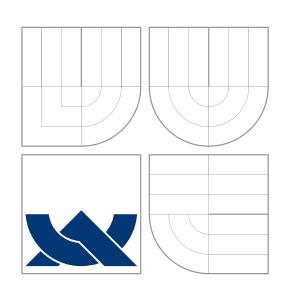
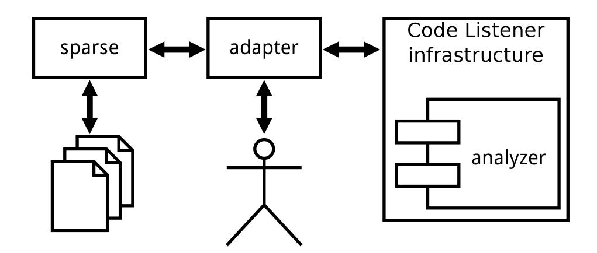
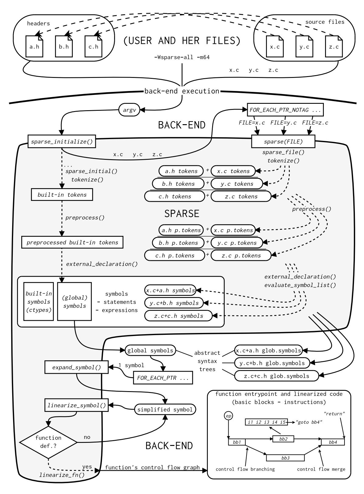
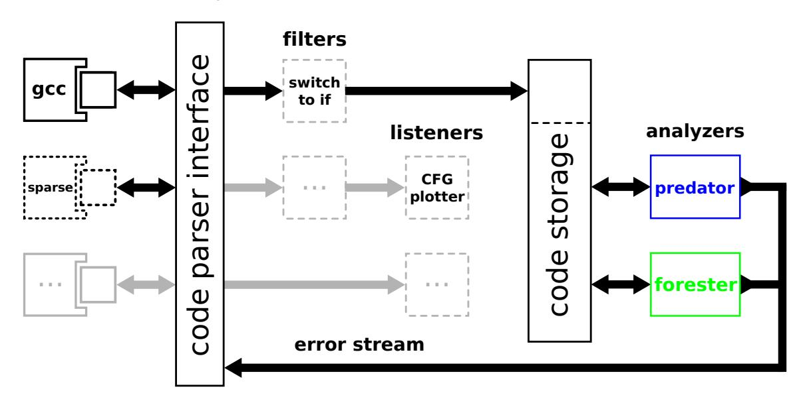
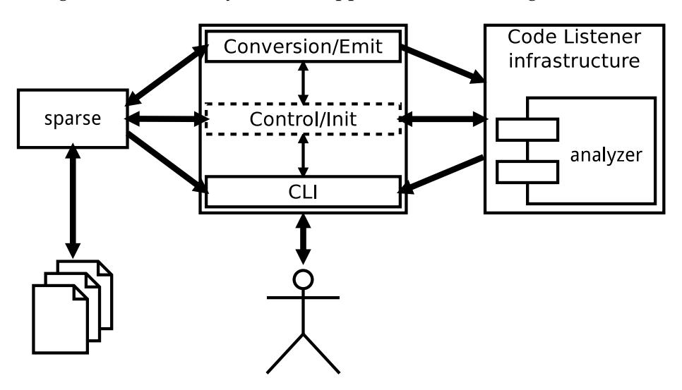

# VYSOKÉ UČENÍ TECHNICKÉ V BRNĚ

BRNO UNIVERSITY OF TECHNOLOGY

## FAKULTA INFORMAČNÍCH TECHNOLOGIÍ ÚSTAV INTELIGENTNÍCH SYSTÉMŮ

FACULTY OF INFORMATION TECHNOLOGY DEPARTMENT OF INTELLIGENT SYSTEMS

## CREATION OF SPARSE ADAPTER FOR THE CODE LISTENER INFRASTRUCTURE

DIPLOMOVÁ PRÁCE MASTER'S THESIS

AUTHOR

AUTOR PRÁCE Bc. JAN POKORNÝ

BRNO 2012



## VYSOKÉ UČENÍ TECHNICKÉ V BRNĚ

BRNO UNIVERSITY OF TECHNOLOGY


## FAKULTA INFORMAČNÍCH TECHNOLOGIÍ

FACULTY OF INFORMATION TECHNOLOGY

## VYTVOŘENÍ SPARSE ADAPTÉRU PRO INFRASTRUKTURU CODE LISTENER

CREATION OF SPARSE ADAPTER FOR THE CODE LISTENER INFRASTRUCTURE

DIPLOMOVÁ PRÁCE MASTER'S THESIS

AUTOR PRÁCE Bc. JAN POKORNÝ

AUTHOR

VEDOUCÍ PRÁCE Ing. KAMIL DUDKA

SUPERVISOR

BRNO 2012

Zadání diplomové práce/14114/2011/xpokor04

#### Vysoké učení technické v Brně - Fakulta informačních technologií

Ústav inteligentních systémů

Akademický rok 2011/2012

### Zadání diplomové práce

Řešitel: Obor: Pokorný Jan, Bc. Informační systémy

Téma:

Vytvoření Sparse adaptéru pro infrastrukturu Code Listener Creation of Sparse Adapter for the Code Listener Infrastructure

Kategorie: Formální verifikace

#### Pokyny:

- 1. Seznamte se s nástrojem Sparse pro statickou analýzu kódu v jazyce C, infrastrukturou Code Listener pro tvorbu nástrojů na statickou analýzu a nástroji Predator a Forester pro verifikaci operací s dynamickými datovými strukturami.
- 2. Prostudujte interní reprezentaci linearizovaného kódu v nástroji Sparse. Zaměřte se zejména na reprezentaci instrukcí pro práci s pamětí.
- 3. Implementujte Sparse adaptér pro infrastrukturu Code listener tak, aby bylo možné nástroje Predator a Forester používat nezávisle na zásuvných modulech překladače GCC.
- 4. Vytvořený adaptér otestujte na sadách testů dodávaných spolu s nástroji Predator a Forester.
- 5. V závěru práce srovnejte vámi vytvořený adaptér s adaptérem pro GCC a zhodnoťte přínos vámi vytvořeného adaptéru pro nástroje Predator a Forester.

#### Literatura

- Dudka, K., Peringer, P., Vojnar, T.: An Easy to Use Infrastructure for Building Static Analysis Tools, In: Proc. of EUROCAST'11, Las Palmas, Spain, 2011.
- Dudka, K., Peringer, P., Vojnar, T.: Predator: A Practical Tool for Checking Manipulation of Dynamic Data Structures Using Separation Logic, In: Proc. of CAV'1, Cliff Lodge, Snowbird, Utah, USA, 2011.
- Domovská stránka nástroje sparse: http://sparse.wiki.kernel.org/

Při obhajobě semestrální části diplomového projektu je požadováno:

Bez požadavků.

Podrobné závazné pokyny pro vypracování diplomové práce naleznete na adrese http://www.fit.vutbr.cz/info/szz/

Technická zpráva diplomové práce musí obsahovat formulaci cíle, charakteristiku současného stavu, teoretická a odborná východiska řešených problémů a specifikaci etap, které byly vyřešeny v rámci ročníkového a semestrálního projektu (30 až 40% celkového rozsahu technické zprávy).

Student odevzdá v jednom výtisku technickou zprávu a v elektronické podobě zdrojový text technické zprávy, úplnou programovou dokumentaci a zdrojové texty programů. Informace v elektronické podobě budou uloženy na standardním nepřepisovatelném paměťovém médiu (CD-R, DVD-R, apod.), které bude vloženo do písemné zprávy tak, aby nemohlo dojít k jeho ztrátě při běžné manipulaci.

Vedoucí:

Dudka Kamil, Ing., UITS FIT VUT

Datum zadání:

19. září 2011

Datum odevzdání: 23. května 2012

VYSOKÉ UČENÍ TECHNICKÉ V BRNĚ Fakulta informačních technologií

Ústav inteligentních systémů 612 <del>6</del>6 Drno, Božetěc<del>hova 2</del>

doc. Dr. Ing. Petr Hanáček vedoucí ústavu

## **Abstrakt**

Kontrola programu na výskyt chyb má nezpochybnitelný význam, obzvlášť ta založená na formálních metodách. VeriFIT na FIT VUT k tomu používá vlastní infrastrukturu *Code Listener (CL)* modulárně propojující tzv. přední stranu, typicky adaptér převádějící kód zprostředkovaný jiným způsobem (jiným tzv. parserem), a zadní stranu typicky tvořenou koncovým analyzátorem.

Cílem práce je posky[tnout to](#page-11-0) prvé jako kompaktní alternativu k existujícímu zásuvnému m[odu](#page-11-1)lu pro překladač G. Náš adaptér používá linearizovaný kód, jak jej zprostředkuje knihovna sparse pro statickou analýzu programů v C. Experimenty s jedním z hlavních analyzátorů v rámci CL, nástrojem *Predator*, a příslušnou sadou testů, dosahuje náš produkt – program *clsp* – úspěšnosti zhruba v 75% případů oproti onomu modulu pro GCC. Další zlepšení jsou před[měte](#page-11-2)m budoucího vývoje.

## **Abstract**

Program checking is indisputably important, especially if originating in formal methods. VeriFIT at FIT BUT uses custom *Code Listener (CL)* infrastructure modularly interconnecting the front-end, typically a code parser adapter, and the back-end, typically an analyser.

Our aim is to offer a former as a compact alternative to existing G compiler plug-in. This adapter uses linearized code mediated by sparse library for static analysis of programs [in C. Ac](#page-11-0)c[ording to t](#page-11-3)he experiments with one [of t](#page-11-1)he main CL analysers, *Predator* tool and its tests suite, our product – *clsp* program – is successful successful in roughly 75% of cases in comparison with the GCC plug-in. Further improvements are expe[cted.](#page-11-2)

## **Klíčová slova**

analýza programu, statická analýza, knihovna sparse, infrastruktura Code Listener, linearizovaný kód,

## **Keywords**

program analysis, static analysis, sparse library, Code Listener infrastructure, linearized code,

## **Citace**

Jan Pokorný: Creation of Sparse Adapter for the Code Listener Infrastructure, diplomová práce, Brno, FIT VUT v Brně, 2012

## **Rozšířený abstrakt**

Kontrola správnosti programů, či úžeji formální verifikace, představuje důležité odvětví informatiky pro svůj přínos na poli informatiky aplikované, kde spolehlivost či bezpečnost programů může mít zásadní roli. Jejich statická analýza, jedna z forem těchto kontrol, se obecně skládá ze tří částí: převedení zápisu programu do interní reprezentace kódu, samotná analýza nad těmito daty a zprostředkování výsledků. *VeriFIT*, Výzkumná skupina automatizované analýzy a verifikace na FIT VUT, pro oddělení jádra analýzy využívá vlastní infrastrukturu *Code Listener (CL)*. Ta modulárně propojuje svou tzv. "přední stranu" (frontend) tvořenou producentem mezikódu (typicky adaptér z jeho původní formy, ne nutně až z úrovně textového zápisu) v podobě, jak ji CL definuje, a "zadní stranu" (back-end), kterou představují jeho konzumenti, především koncové analyzátory (obecně tzv. *listenery*). Tito konzumenti se mo[hou](#page-11-1) řetězit (např. normalizace před analyzátorem), případně stát paralelně. Díky této architektuře lze zapojit libovolný zdroj produkující očekávaný mezikód, tvořený programem, který rovněž z[pros](#page-11-1)tředkuje celou analýzu uživateli, před libovolný analyzátor. Analyzovatelnou doménu stejně jako šíři analyzovaných vlastností tak lze v unifikované podobě rozšiřovat formou znovupoužitelných komponent.

V současné době je k dispozici jediný takový adaptér, realizovaný jako zásuvný modul pro překladač G a orientovaný primárně na jazyk C. Přes svou univerzalitu a snadnou integraci do stávajících SW projektů využívajících tento překladač může být provádění samotných analýz jeho prostřednictvím poněkud těžkopádné. Naším cílem je poskytnout odlehčenou alternativu ve formě adaptéru založeného na knihovně sparse, která obstará syntaktický rozkl[ad p](#page-11-2)rogramů zapsaných v C. Uživateli pak bezprostřední výstup zpřístupní ve strukturované podobě reprezentující abstraktní syntaktický strom (obecně s větvením symbol–příkaz–výraz, které z jazyka C vychází). Úroveň sémantických detailů (typová informace), či, v případě definic funkcí, úroveň zpracování až na plně lineární kód (vyjma nezbytného členění toku řízení) odrážející sémantický význam originálu, lze volitelně prohlubovat poskytnutým rozhraním. Spolu s licenčními podmínkami (Open Software License v1.1, přechodu na licenci "MIT") ji to tak činí velmi vhodnou pro náš účel.

Výsledný adaptér je realizován jako program *clsp* a představuje spolu s dalším programovým vybavením (soubory nutné pro sestavení programu vyjma explicitně zmíněných závislosti, sada automatizovaných testů a další podpůrné skripty) realizační část této práce. Dle požadavků umožňuje používat analyzátory *Predator* a *Forester* nezávisle na překladači G, přičemž však zůstává plně kompatibilní s jejich sestavením právě coby kompletních zásuvných modulů pro překladač. Hlavní výhodou je zjednodušení zacházení s těmito nástroji a současně eliminace náhodných chyb, které mohou být zaneseny odlišným způsobem sestavení. V souladu s infrastrukturou CL je program clsp uvolněn pod licencí [GPL](#page-11-2)v3 a za autoritativní se v době psaní této práce má repozitář jejího autora na adrese <https://github.com/jpokorny/thesis/tree/master/clsp>.

Textová část ve formě následujícího obsahu nejprve zasadí práci do širšího kontextu a stručně seznámí s přístupy k samočinné kontrol[e pr](#page-11-1)ogramů. Následně je prostor věnován [oběma](#page-11-4) bezprostředním styčným stranám – z větší části knihovně sparse (od obecných fak[tů po úroveň linearizovaného kódu\), dále pak infrastruktuře](https://github.com/jpokorny/thesis/tree/master/clsp) CL s přesahem ke dvěma stěžejním analyzátorům, zmíněným *Predator* a *Forester*. Ty jsou pak také využívány pro vyhodnocení použitelnosti námi implementovaného adaptéru clsp.

Jádro představuje kapitola pojednávající o procedurách převádějících reprezentaci programu, jak nám ji knihovna sparse poskytuje, na posloupnost in[stru](#page-11-1)kcí a pomocných zpráv předávaných rozhraní CL. Kromě přímočarých konverzí jsou rozebrány také složitější případy, vynucené normalizace kódu, apod. Navazující kapitola uvádí některá okrajová technická řešení a poukazuje na vybrané implementační detaily. Před závěrečným shrnutím je pozornost věnována experimentálním výsledkům a porovnání s výsledky dosahovanými využitím zásuvného modulu pro G. Z těchto experimentů vyplývá, že v případě nástroje Predator clsp obstojí zhruba u 75% případů. Paměťové a časové nároky analyzátorů s oběma adaptéry jsou srovnatelné a pokud se znatelněji rozcházely, většinou ve prospěch clsp. Pravděpodobně to je dáno optimalizacemi, které sparse implicitně provádí.

Nutno dodat, že clsp k datu [odev](#page-11-2)zdání představuje nástroj sice použitelný, nicméně má-li být aktivně používán v rámci skupiny VeriFIT, popř. mimo ni, čeká jej další vývoj, přinejmenším odchytávání chyb u okrajových případů. Ty se mohou vyskytnout poměrně snadno, jelikož zpracování kódu poměrně komplexního jazyka, jakým C je, dokáže navodit velké množství různých stavů, počítaje v to i interní závislosti zpracovávajících funkcí. S tím také souvisí fakt, že jakkoli malá změna v programech typu překladač má často nelokální dopad, kdy zaráz ovlivní velké množství cest programem. Paralelně s tím se nedá čekat, že by kterákoli z obou dotčených stran, sparse i CL, byla zakonzerovaná bez dalších změn.

## **Creation of Sparse Adapter for the Code Listener Infrastructure**

## **Prohlášení**

Prohlašuji, že jsem tuto práci vypracoval samostatně pod vedením pana Ing. Kamila Dudky. Uvedl jsem všechny zdroje, ze kterých jsem čerpal. . . . . . . . . . . . . . . . . . . . . . . . Jan Pokorný 23. května 2012

*Tato práce vznikla jako školní dílo na Vysokém učení technickém v Brně, Fakultě informačních technologií. Práce je chráněna autorským zákonem a její užití bez udělení oprávnění autorem je nezákonné, s výjimkou zákonem definovaných případů.*

<sup>©</sup> Jan Pokorný, 2012.

# **Contents**

|   | List of Figures                                                                                                                                                                                                                                                                                                                                              |  |
|---|--------------------------------------------------------------------------------------------------------------------------------------------------------------------------------------------------------------------------------------------------------------------------------------------------------------------------------------------------------------|--|
| 1 | List of Tables<br>List of Acronyms<br>Introduction<br>1.1<br>Motivation<br>                                                                                                                                                                                                                                                                                  |  |
| 2 | 1.2<br>Objective and Scope<br><br>1.3<br>Outline<br><br>Automated Approaches Towards Program Safety Checking<br>2.1<br>Program Analysis as Program Checks<br>2.2<br>Basic Classification of Program Analyses<br><br>2.3<br>Fundamentals<br><br>2.4<br>Dynamic Analysis Approach<br>2.5<br>Static Analysis Approach<br><br>2.6<br>Examples of Practical Tools |  |
| 3 | 2.7<br>Comparison of Dynamic and Static Approach<br><br>sparse: static analysis tool and library<br>Overview of sparse<br>3.1<br><br>3.2<br>Internal Reprezentation of Code Throughout the Phases<br>                                                                                                                                                        |  |
| 4 | 3.3<br>Memory Models and Intermediate Instruction Set<br>Code Listener, Predator and Forester<br>4.1<br>Code Listener Infrastructure<br><br>4.2<br>Predator Analyser<br>                                                                                                                                                                                     |  |
| 5 | 4.3<br>Forester Analyser<br><br>Adapter approaches and considerations<br>5.1<br>Types<br><br>5.2<br>Operands<br><br>5.3<br>Instructions                                                                                                                                                                                                                      |  |
| 6 | 5.4<br>Missing Information about Object Traversal<br><br>Implementation<br>6.1<br>Architecture<br>                                                                                                                                                                                                                                                           |  |

|   | 7.3<br>Outlook<br>                                                             |  |
|---|--------------------------------------------------------------------------------|--|
|   | 7.1<br>Program Checking Overview Study<br>7.2<br>Implementation of the Adapter |  |
| 7 | Conclusion                                                                     |  |
|   | 6.3<br>Debug Mode<br><br>6.4<br>Internal Testsuite                             |  |
|   |                                                                                |  |
|   |                                                                                |  |

# <span id="page-9-0"></span>**List of Figures**

| 1.1 | Conceptual schema of the adapter as mediator between sparse<br>library, Code<br>Listener infrastructure and the user   |  |
|-----|------------------------------------------------------------------------------------------------------------------------|--|
| 3.1 | Overview of sparse<br>library in the context of use; each of x.c,<br>y.c<br>and z.c<br>is<br>proceeded separately.<br> |  |
| 3.2 | Example code (listing 3.2) in a form of abstract syntax tree (AST) after parsing<br>as displayed by test-inspect.<br>  |  |
| 4.1 | Overview of Code Listener infrastructure incl. our sparse<br>adapter (adapted<br>from [101]).<br>                      |  |

# <span id="page-10-0"></span>**List of Tables**

| 2.1 | False positive and false negative errors araising from bad checker's decision                                                                                     |
|-----|-------------------------------------------------------------------------------------------------------------------------------------------------------------------|
| 2.2 | about program's safety property (adapted from [17])<br>Comparison of dynamic and static approach towards program safety checking.                                 |
|     |                                                                                                                                                                   |
| 5.1 | Mapping basic C types from sparse<br>singletons (of type struct symbol/symbol.h)<br>to respective enum<br>cl_type_e<br>(code_listener.h) and adapter-local single |
|     |                                                                                                                                                                   |

# <span id="page-11-5"></span>**List of Acronyms**

<span id="page-11-21"></span><span id="page-11-19"></span><span id="page-11-18"></span><span id="page-11-17"></span><span id="page-11-15"></span><span id="page-11-11"></span><span id="page-11-10"></span><span id="page-11-3"></span><span id="page-11-2"></span><span id="page-11-1"></span>

| 3AC          | three-address code 25                                                      |  |
|--------------|----------------------------------------------------------------------------|--|
| API          | application programming interface                                          |  |
| AST          | abstract syntax tree 15                                                    |  |
| BB           | basic block                                                                |  |
| CFG          | control flow graph8                                                        |  |
| CL           | Code Listener 1                                                            |  |
| CSE          | common subexpression elimination 20                                        |  |
| FIT BUT      | Faculty of Information Technology at Brno University of Technology1        |  |
| FOSS         | free and open-source software                                              |  |
| Gcc          | GNU Compiler Collection2                                                   |  |
| GPL<br>GPLv3 | GNU General Public License<br>GNU General Public License, version 33       |  |
| HW           | hardware                                                                   |  |
| IDE          | integrated development environment                                         |  |
| IR           | immediate representation (of computer program/its code)16                  |  |
| JIT          | just-in-time compilation 8                                                 |  |
| LHS          | left-hand side 28                                                          |  |
| OOP          | object-oriented programming programming paradigm                           |  |
| OSS          | open-source software 5                                                     |  |
| PC           | personal computer                                                          |  |
| RHS          | right-hand side 28                                                         |  |
| SSA          | static single assignment form (a form of immediate representation (IR)) 20 |  |
| SW           | software3                                                                  |  |

<span id="page-11-23"></span><span id="page-11-22"></span><span id="page-11-20"></span><span id="page-11-16"></span><span id="page-11-14"></span><span id="page-11-13"></span><span id="page-11-12"></span><span id="page-11-9"></span><span id="page-11-8"></span><span id="page-11-4"></span><span id="page-11-0"></span><sup>1</sup> <http://www.fit.vutbr.cz/>

<sup>2</sup> <http://gcc.gnu.org/>, formerly "GNU C Compiler"

<sup>3</sup> <http://www.gnu.org/licenses/gpl-3.0.html>

<span id="page-11-7"></span><span id="page-11-6"></span><sup>4</sup> <http://www.fit.vutbr.cz/research/groups/verifit/>

## <span id="page-12-0"></span>**Chapter 1**

# **Introduction**

Initially, we set up the context of the work getting down to its motivation, objectives and scope backed by a schematic overview. Then a structure of the thesis is outlined.

Our typographical conventions are simple:

- Important term, name of the technology, etc., is *emphasised* upon first use.
- Likewise upon first use, an abbreviation that may not be widely recognised is stated in full. See also List of Acronyms on p. v.

### **1.1 Motivation**

<span id="page-12-1"></span>Today, presence of computer systems is ubiq[ui](#page-11-5)tous ranging from simple things of daily use such as a coffee maker, which can be "just" out of order in the worst case, to highly critical systems. These are the ones used in automotive or airplane industry, medical equipment, or generally anywhere if lives or valuable resources are at risk in case of malfunction.

Putting hardware failures and other external disasters aside now, the only fragile part left is ultimately a computer program having the responsibility for system's behaviour. Even if this program is a music player a user is running on her PC (kind of said coffee maker equivalent), the crashes are very undesirable and should rather be prevented. But as computers are deterministic machines in principle<sup>1</sup> and the whole program life-cycle, from its normalized notation imposed by the programming language used to its final execution on the same or another machine in the form of machine language in[stru](#page-11-9)ctions (or bytecode), goes through various deterministic processes pre[se](#page-12-3)rving semantic details, we can infer the behavioural properties can be analyzed prior its run-time. This is promising as the errors to occur during a proper execution can be detected early and the possible accident prevented.

This is exactly the subject of static analysis, one of the approaches to program checking or, when done more rigorously, discipline of a formal verification<sup>2</sup> . This branch of computer science attracts many research efforts, which is for apparent reasons as suggested above. Faculty of Information Technology at Brno University of Technology (FIT BUT) also participates in this area with research conducted by Automated A[n](#page-12-4)alysis and Verification Research Group (VeriFIT). As far as static analysis is concerned, their endeavour to split the logic of analyzers from rather low-level means of gathering normalized notation of code resulted in Code Listener (CL) infrastructure. For now, we get alon[g with the](#page-11-3)

<sup>1</sup>we consider conventional [computer](#page-11-0)s only, not a technology in research

<span id="page-12-4"></span><span id="page-12-3"></span><span id="page-12-2"></span><sup>2</sup>note that there is no strict boundary and the terms are often synonymous

notion of a simple API to send or receive code, as seen from code provider and analyzer standpoints respectively.

The current state of having several analyzers but the only code provider available for use within the infrastructure leads us finally to our motivation. Implementing an alternative to the existing G co[mpil](#page-11-10)er plug-in, whereas the purposed domain of both so-called adapters are programs in C<sup>3</sup> , will amongst others:

- provi[de m](#page-11-2)ore light-weight, yet more flexible analysis workflow,
- remove the [in](#page-13-1)herent dependency of CL on G (which cannot be considered a universal part of common desktop environments, even in the FOSS world,<sup>4</sup> )
- offer the analyzers a different insight into the same original code and possibly benefit learn which sort of code is better to [proc](#page-11-1)ee[d wit](#page-11-2)h either adapter,
- as an extension of a previous, a more robust analysis solu[tion ca](#page-11-11)n be made combining both analyzers in a way in case of a failure or overly long computation with one analyzer, the run can be terminated trying the other one,
- on the side of the analyzers, help to find weaknesses in possible overly strong assumptions about what code sequences are valid, which may possibly lead to making this more restricted yet on the CL API side, and
- possibly help to adjust CL API design (or contribute on possible redesign decissions).

## **1.2 Objective and [Sco](#page-11-1)[pe](#page-11-10)**

<span id="page-13-0"></span>The aim of implementing an adapter for CL infrastructure is tight with the requirement to use library for static analysis of programs in C language called sparse. This language is also the implementation one because it fits best between the C interfaces of sparse and CL.

Thus we will first study this library, evaluating it for our purpose. As it is an open source project actively used by several o[ther](#page-11-1)s (notably a checker of the same name directly coexisting with this library) and has an responsive maintainer, we should not get into a dead end if we eventually hit any limitation in our use case. As long as our modifica[tion](#page-11-1) suggestions are not too invasive, we have a chance of having it applied, without a need to maintain a parallel version. We will especially be interested in the form of its linearized code, as this the base material we will be dealing with.

Similarly, we have to explore the other side we are interfacing with, including the two prime analyzers from the CL suite: *Predator* and *Forester*. High-level view of adapter between these two other components in the context of use is captured in fig. 1.1.

Main part of our effort will be to realize the adapter, which means to find a way how to map linearized code ca[rryi](#page-11-1)ng the semantics along from sparse library on input to its equivalent passed into CL on the output side. Surely there will be more tasks to get the final product, but this is the absolute essence. Beside straightforward instr[uctio](#page-14-1)n coversion, we will have to deal with more complicated cases such as those when non-local character of a conversion arises. This should be brought into the stage we are getting sensible results with the test suites co[ming](#page-11-1) with each of the analyzer.

<sup>3</sup>depending on CL, the G plug-in can eventually handle C++ or other G-supported languages

<span id="page-13-1"></span><sup>4</sup> other matured compilers exist, such as Clang/LLVM <http://clang.llvm.org>



Figure 1.1: Conceptual schema of the adapter as mediator between sparse library, Code Listener infrastructure and the user.

<span id="page-14-1"></span>Once this is reached, we can start evaluating our tool against the existing G plug-in. This early feedback from the tests will be valuable for further fine-tuning iterations. Then we are ready to make a final conclusion about the success of our adapter.

As with many other software (SW) projects, there are many factors that ca[nnot](#page-11-2) be foreseen. But as mentioned, we have a chance of getting required changes up to sparse project, and also main CL maintainer<sup>5</sup> expressed the possibility of reasonable modifications when unavoidable issues come up on th[is si](#page-11-12)de. Thus, the baseline is perceived with optimistism.

## **1.3 Outli[ne](#page-11-1)**

<span id="page-14-0"></span>**Chapter 2** is dedicated to briefly introduce common approaches to automated program checking together with some practical widely deployed tools, especially those following the same direction as the whole CL infrastructure, i.e., being FOSS and oriented on rather low-leve[l i](#page-15-0)mperative languages like C (which are naturally highly error-prone).

**Chapter 3** discusses sparse, particularly from a library perspective. Top-level introduction progresses down to linearized c[ode](#page-11-1) level.

**Chapter 4** briefly introduces CL infrastructure, its interface we will use and its flagship analyzer[s,](#page-25-0) Predator and Forester.

**Chapter 5** presents the approaches to our core task, that is, how we do the non-trivial conversi[on](#page-42-0) between linearize[d co](#page-11-1)de as provided by sparse into the form required by CL.

**Chapter 6** talks about the rest of notable technical solutions incorporated into our adapter and shor[tly](#page-47-0) mentions selected implementation details.

**Chapter 7** summarizes the thesis. In retrospect, we cover troublesome moments and [how](#page-11-1) we cope[d](#page-53-0) with them, states the current status and our backlog that did not fit into limited project constraints, and further suggest future development.

<sup>5</sup> supervisor of this thesis

## <span id="page-15-0"></span>**Chapter 2**

# **Automated Approaches Towards Program Safety Checking**

There's always one more bug.

(known as "Lubarsky's Law of Cybernetic Entomology")

We could have used the title "(automatic) program analysis (of computer programs)" but we are to explain why we avoided it and to further specify a narrow scope of our interest in the terms of program checking.

Next, we present a general program analysis classification, make a short stop to explain basic principles and terms, and then briefly return to particular categories of analyses. We also make an overview of common tools representing them. Finally, we attempt to find common and different attributes of these two complementary approaches.

## **2.1 Program Analysis as Program Checks**

<span id="page-15-1"></span>The most general definition of program analysis is an extraction of purpose-specific information from the software system [1]. Such analysis can be as simple as counting noncomment lines, sampling other code metrics, or proceeding the in-code comments, through run-time evaluation of a program's behaviour to a highly sophisticated proving of its properties.

As the name of the chapter sugg[es](#page-60-0)ts, we are only interested in program analyses in the sense of the latter two examples, more specifically analyses ensuring particular properties of a program regarding *bugs* (programming errors). We will only consider checks outside the scope of a common compiler/interpreter as these impose the elementary program validity<sup>1</sup> , and common assertions and other primarily manual tasks are likewise out of discussion.

For almost any reasonable programming language, there exists a variety of "bug-finding tools" provid[in](#page-15-2)g best-effort (best-guess) quantitative results rather than qualified claims about the program [3]. As we show later (2.3.1), only *sound analyses* offer such guarantees.

<span id="page-15-2"></span><sup>1</sup>which makes them another example of program analysers; this base assumption is pointedly captured in Figure 1 in the Splint manual [2]

Both techniques to check programs are especially important in the current trend of open-source software (OSS) being massively adopted by the industry [4, 5], whereas the amount of such code effectively prevents from thorough manual review. Further text concentrates on such kind of analyses and we refer to tools performing them collectively as "checkers." We take a simplest form capable of defect dection, so-calle[d "](#page-60-1)[st](#page-60-2)yle-checkers", into account, but it is [minor](#page-11-13) for us.

### <span id="page-16-2"></span>**2.2 Basic Classification of Program Analyses**

Basic categories of program analyses are following [6–8]:

<span id="page-16-0"></span>**Dynamic analysis** means the code is performed the same way as in the standard execution and usually under some kind of instrumentation; sometimes dubbed as *online analysis*.

**Static analysis** is a technique of reasoning about the [c](#page-60-3)[od](#page-60-4)e (inherently representing all possible executions), available statically all-at-once; sometimes dubbed as *offline analysis*.

**Hybrid analysis** is a synergy of the two former, used, e.g., in a way that static analysis serves to optimize run-time analysis, or empowers static analysis whenever possible switching to dynamic when necessary [9].

A secondary classification cares about the form of code being analysed [7]:

**Source analysis** operates on an original pr[og](#page-60-5)ram notation, hence it may, e.g., report very exact position of particular language construct, which is usually less precise with binaries (if available at all).

**Binary analysis** only requires the executable form, so it can be applied even on the programs with unknown/unpublished source code, but this is not the only use case.

Some other categories specific to static analyses are stated in sec. 2.5.2.

After presenting some basics, we return closer to dynamic and static analysis and then name example checkers for all three main approaches. With th[e othe](#page-19-3)r division, we state the class directly when suitable.

### **2.3 Fundamentals**

<span id="page-16-1"></span>The ultimate problem the analyses of our interest solve can be formulated as: "*Is the program P* (or its single execution in dynamic checking) *free of particular class of defects?*" This is an instance of general reasoning about program's properties as done by general analyses. In further text, we will consider "defects" in a sense of "particular class of defects."

This being stated, we determined to investigate solely a *safety* property of a program. That is to say, we want to know "bad thing" (defects) will not happen, which is weaker than *liveness* property denoting "good thing" will eventually hapen (e.g., the program always terminates) [10, 11]. Thus, instead of *total correctness* (the program terminates and the run is free of defects) we are being left with *partial correctness* which we would like the analyses to decide – something which is not always reachable (see 2.5). Liveness analysis is still rather exclusively [a su](#page-60-6)[bje](#page-60-7)ct of a research [12].

Once the analysis terminates (if at all), the answer may be Y or N accompanied with *alarm(s)* for the discovered defect (with detailed diagnostics when possible), or exceptionally U<sup>2</sup> .

These results need to be interpreted according to the level of assurance the analysis provides<sup>3</sup> . For this, some theory is explained first, and the interpretation is left for sec. 2.3.3.

#### **2.3.1 Soundness of Analysis**

Intui[ti](#page-17-0)vely, the *soundness* expresses that anything formally provable must be true [1[3\]. W](#page-18-2)e will concisely explain it in the analysis context.

Solving said decision problem can be seen as an effort to reject default expectation "*P is defect-free*," that is, to find any occurrence of a defect of particular class. For analysis to be *sound*, any real defect occurrence shall not be missed in any possible program<sup>4</sup> [and](#page-61-0) if *P* is evaluated as defect-free<sup>5</sup> , it is indeed defect-free, that is, no errors of that class will arise at run-time. This fulfills the initial notion of soundness and offers very desired guarantee in context of program checking. *Conservative* or *safe* are sometimes used as sy[no](#page-17-1)nyms to "sound" [14].

Complementary, if *co[mp](#page-17-2)lete* analysis evaluates *P* as defective, it is indeed defective. But admittedly, this is less suitable for a the program checking purpose due to possible unreported real bugs ought to be found<sup>6</sup> .

Soun[d/c](#page-61-1)omplete analyses *verifies*the absence/presence of such class of defects, in a sense of Valmari's permissive interpretation of a *verification technique* [11].

Stronger requirement – analysi[s](#page-17-3) both sound and complete – may be impossible as explained later in the context of static analysis (2.5). As per Valmari, assuredly terminating complete analysis (without U answer) conforms to a s[tric](#page-60-7)t interpretation of verification, which makes it a *verification algorithm*. As an extension, if the analysis is strictly sound, that is, not complete due to some conservative approximations [15] – it may indicate *false alarms* (safety violations) requiring manu[al i](#page-19-0)nspection, yet no real defect is missed.

Dynamic analysis is *unsound* in principle, as it cannot see all executions [16].

#### **2.3.2 False Positive and False Negative**

"Default expectation" and "false alarm" might resemble something famili[ar](#page-61-2) – statistical test theory [17].

In this view, analysis starts with *null hypothesis H*<sup>0</sup> supposing *P* is defect-free and tries to reject it. Two types of errors may occur if the decision does not match the real state. Table 2.1 depicts this. As we can see, false alarm corresponds to a *false positive (error)*. In case a real [def](#page-61-3)ect is missed, we get a *false negative (error)*. Both terms are common in this context [18].

Sound analysis only ensures no false negative may occur, but false positives are possible. [Na](#page-18-1)turally, less false positives, the more useful the results are. Analysis generating false negatives is not sound and rather a mere bug-finding technique as specified at the beginni[ng o](#page-61-4)f the chapter.

<sup>2</sup>due to, e.g., lack of resources

<sup>3</sup> and even then some discretion is needed

<sup>4</sup>we expect the program is otherwise valid, as already declared

<sup>5</sup> i.e., in a limited sense, proves it

<span id="page-17-3"></span><span id="page-17-2"></span><span id="page-17-1"></span><span id="page-17-0"></span><sup>6</sup> the most trivial complete checker is a one that marks each program as defect-free

| Decision vs. Reality | H0<br>is true | H0<br>is false |
|----------------------|---------------|----------------|

Table 2.1: False positive and false negative errors araising from bad checker's decision about program's safety property (adapted from [17]).

#### <span id="page-18-1"></span>**2.3.3 How To Interpret Result of Analysis**

Unsound analysis cannot offer any guarant[ee,](#page-61-3) result is a biased approximation. In practical use, these checkers produce good enough results and there are many success stories with bug-finding techniques (e.g., [19]).

<span id="page-18-2"></span>If the analysis is (assuredly) sound, possible outcomes are:

- no error found (Y) no such error does exist, or
- error(s) found (N) th[e re](#page-61-5)ported errors may or may not be real, manual inspection (according to reported diagnostics) o distinguish false positives is needed.

Conversely, complete analysis can conceal real defects (the outcome is false negative), but false positive will occur.

## **2.4 Dynamic Analysis Approach**

<span id="page-18-0"></span>As anticipated, this kind of program checking requires a direct execution of a program, that is, the analysis works along its run consisting of a sequence of concrete states, and yields only specific results that may not generalize. This is a case of tools like profilers, program tracers or – class of our interest – dynamic checkers.

Dynamic analysis of software originates in traditional HW approach to equipment monitoring, which "uses the insertion of '*probes*' or *instrumentation* into the device being monitored" [20]. As per cited article, first attempts of automated dynamic checking dates back to 1967. The initial motivation was to find out the tests *coverage*. To be noted that good coverage is a key concern also for dynamic program c[heck](#page-11-14)ing as representative test cases should cover reasonable amount of the behaviours. The same source discusses also a technique [of p](#page-61-6)roviding additional information about the program in a form of *annotations*, something which is an optional or required part of some analysis even nowadays<sup>7</sup> .

Nowadays, the advanced software tools for dynamic analysis often operate directly on compiled binary files, whereas a run-time of the analysed program underlays a control of the instrumentation tool. Such kind of indirection or even virtualization is as[su](#page-18-3)med to be non-intrusive towards the analysed program, and as per Nethercote [7], its semantics shall not be actively modified<sup>8</sup> . Therefore, these tools serves primarily to detect the error and provide a feedback what goes wrong rather then to actively prevent it. This way, the tool can gain almost complete insights into execution of analysed program, which are often exported into client mod[ul](#page-18-4)es performing purpose-specific analyses. [F](#page-60-8)reely available Valgrind, DynamoRIO, and Pin<sup>9</sup> are examples of such frameworks and share also other

<sup>7</sup> cf. annotations used by sparse (ch. 3)

<sup>8</sup>note a thin border between legitimate dynamic analysis tool and malware

<span id="page-18-5"></span><span id="page-18-4"></span><span id="page-18-3"></span><sup>9</sup> <http://valgrind.org/>, <http:[//](#page-18-5)www.dynamorio.org/>, <http://www.pintool.org/> respectively

common characteristics such as utilization of just-in-time compilation (JIT). Some checkers built upon them are shown later in sec. 2.6.1.

## <span id="page-19-2"></span>**2.5 Static Analysis Approach**

<span id="page-19-0"></span>The origin of general static analysis dates back to construction of first compilers. In 1959, the need for automated reasoning about the program structure was expressed<sup>10</sup> together with suggestion of its internal reprezentation for this purpose and introduction of *dominance* in control flow graph<sup>11</sup> [21]. The initial phase of the compilers, parsing the source code12, is common also to general static analyses, but they fulfill their specific purpo[se.](#page-19-4) They usually operate on the source files, but static binary analyses also exist, especially for checking if it is safe to execute g[ive](#page-19-5)n binary whatsoever [22].

Compared to dyn[am](#page-61-7)ic analyses, static ones provide a program evaluation from a [glo](#page-19-6)bal perspective, but with time–accuracy trade-off. Unfortunately, a major setback prevents static analyses from accurate summary results – any interesting question about the behaviour of a program is *undecidable*, which s[tem](#page-61-8)s from Rice's theorem [15] and was demonstrated, e.g., on an example of alias analysis<sup>13</sup> [23]. In practice, it means the checker may not terminate or produce inaccurate results.

#### **2.5.1 Sound Static Analyses**

Nevertheless, static analyses can be sound and these usually rely on these approaches [24]:

**Model checking** examines every possible state of the program to determine if the property (expressed as temporal logic formula) is satisfied, which does not scale well despite various optimization techniques.

**Theorem proving** solves the problem formalized in a suitable logic trying to prove the formula, which however requires manual assitance.

**Abstract interpretation** overapproximates the program's behavior with respect to the examined property, that is, rather than operating in concrete domain burdened by said drawback, it uses abstract domain in a way that local results, when obtained properly, apply back to the original program [25]. Its large-scale deployment is attributed to a crash of Ariane 5 rocket in 1996 due to a software defect demonstrating a need to formally verify critical SW [26].

These are complemented by other formal s[yste](#page-62-0)ms such as a separation logic , an extension of Hoare logic [27, 28].

### **2.5.2 Main Categories of Analyses**

<span id="page-19-3"></span>Before getting [to](#page-62-1) t[he](#page-62-2) main hierarchy, we state the basic levels of preciseness of internal program structure (typically in a form of control flow graph (CFG)) examination done (or required) by the analyses. This is called *analysis sensitivity* and the categories are not strictly disjoint (especially context sensitivity is directly orthogonal to the others) [15, 29–33]:

<span id="page-19-1"></span><sup>10</sup>explictly demonstrating a possibility to detect potential programming [errors](#page-11-15)

<sup>11</sup>more on them in sec. 3.2.3

<sup>12</sup>object/machine code in case of binary analysis

<span id="page-19-6"></span><span id="page-19-5"></span><span id="page-19-4"></span><sup>13</sup>see 2.5.2

**Flow sensitivity** means the analysis where a property, when examined at some specific point of a program, may depend on preceeding or following statements within intraprocedural scope. In order words, analysis is sensitive to the order of statements within the scope and the result may change when this order is permuted.

**Path sensitivity**, in the same sense as previous, is sensitive to evaluation of predicates at conditional branches, providing generally different solutions for different paths examined.

**Context sensitivity** takes into account the interprocedural dimension and hence the calling context. Different solutions are computed for different chains of callers, working with a call history to propagate information back. This information is usually obtained by a flow sensitive approach.

A brief top-level classification of general static code analyses may look like this:

**Data-flow analysis** is, in a broad term, a technique determining possible values at particular points of the program by iterative propagation of this information to the dependant locations (by means of solving *data-flow equations*) until a fixpoint is reached [33]. It is inherently flow-sensitive, though path-sensitive approaches exist [34].

- Classical analyses, such as *liveness of variables*<sup>14</sup> [29].
- *Pointer analysis* examines sets of objects a variable of pointer type [ma](#page-62-4)y point t[o a](#page-62-3)t runtime ("points-to" relationship), including special cases of *alias analysis* questioning possible equality of two pointers and *shape [an](#page-20-0)a[lys](#page-62-5)is* operating on the level of heapallocated linked data structures such as linked lists [36, 37].
- *Taint analysis*<sup>15</sup> serves to determine propagation of *tainted* data, that is, values that could get into program from possibly malicious use[rs \[](#page-62-6)[39,](#page-62-7) 40].

**Control-flow anal[ys](#page-20-1)is** keeps track of paths within the program. It is usually inherent for any other analysis and moreover, it can be used to (conservatively) approximate CFG in case of *interprocedural* (see bellow) analysis with highe[r-or](#page-63-0)[der](#page-63-1) functions [15, 41].

More **specialized analyses**, such as (control-flow accenting) class hierarchy analysis to improve performance in OOP languages [42].

### **2.5.3 Scope of Analysis and Incompleteness Concerns**

Static analyses can be cate[goriz](#page-11-16)ed also acco[rdi](#page-63-2)ng to an isolated unit of their operation [31]:

<span id="page-20-3"></span>**Local**/**regional** limits the analysis on a single/several interconnected blocks of statements. **Intraprocedural** operates on a single function (procedure).

**Interprocedural** (global) analyses a whole program with respect to the function calls. [Be](#page-62-8)comes complex<sup>16</sup> when applied to languages with constructs like function pointers [43] or higher-order functions [44], and procedure-inlining in order to yield intraprocedural analysis is not always possible [45]. This makes precise interprocedural analysis provably harder [46[\].](#page-20-2)

<sup>14</sup>a variable is live if it holds a val[ue t](#page-63-3)hat may be needed in the future [35]

<sup>15</sup>taint analysis may be dynamic as well [\[38\]](#page-63-4)

<span id="page-20-2"></span><span id="page-20-1"></span><span id="page-20-0"></span><sup>16</sup>control-flow an[alys](#page-63-5)is may be needed (see previous categorization) to approximate control flow graph [15]

Further step – static analysis reasoning about a whole program + SW environment<sup>17</sup> context – is impractical due to a need to specify this whole so-called *open system* [29]. Sound analysis has to treat any incomplete or missing information with overapproximation of possible states (e.g., by supposing arbitrary argument to function call or arbitrary [re](#page-21-1)turn value), which may be another source of false positives [14]. Genera[l tec](#page-11-12)hnique to overcome these limitations, not present in dynamic analyses, is leveraging a compositio[n o](#page-62-5)f predicates ("procedure summaries",<sup>18</sup> [45] further elaborated in a work on bi-abduction [47]).

Interprocedural analysis is desirable for in-depth checking, although, for instance, search for defect pattern can be limited by the function boun[dar](#page-61-1)ies.

### **2.6 Examples of Practic[al T](#page-63-4)ools**

<span id="page-21-0"></span>We follow the same order used for introduction of the analyses: dynamic, then static. Additionally, some examples of hybrid checker are also provided.

#### **2.6.1 Dynamic Analysis Tools**

Following overview lists some checkers together with so-called dynamic binary instrumentation frameworks behind them [48]:

**Memory error detectors** focus on problems with memory handling, particularly in regards to heap allocations.

- *Memcheck/Valgrind*, often s[een](#page-63-6) as synonymous to Valgrind, is a default and the most popular of Valgrind's tools. It can discover faulty memory accesses, using uninitialized memory, heap allocation flaws (e.g., memory leaks), and some other less general defects [49]. All at the expense of slowing program down approximately by factor of 20.
- *SGCheck/Valgrind*, an experimental stack and global array overrun detector, is a complement t[o M](#page-63-7)emcheck. Works with a heuristic that a single stack/global array accessing instruction will likely to access exclusively the same array.
- *Dr. Memory/DynamoRIO* is a tool similar to Memcheck, whereas it has been recently claimed to be as twice as fast and to produce less false positives in connection with C++ data layouts [50].

**Thread error detectors** aim at errors arising from interleaved run of an multi-threaded programs.

- *Helgrind/Valgrind* detects potential deadlocks, data races and POSIX threads API misuse.
- *DRD/Valgrind* detects data races, lock contention and POSIX threads API misuse.
- *ThreadSanitizer/Valgrind+Pin* is a data race detector outside the native Valgrind suite and was used for finding races in Chromium browser [51]. Variant for Windows is based on Pin.

<sup>17</sup>components, libraries and operating system

<span id="page-21-1"></span><sup>18</sup>may be similar to the a notion of "contracts" <http://hal.inria.fr/i[nri](#page-64-0)a-00546657>

**Attack detectors**, despite being on the border of our interest, may deserve being stated here<sup>19</sup> .

• *TaintCheck/Valgrind* is designed to performedi taint analysis at run-time [38]. It is not publicly available, however some recent alternatives exist, such as Taintgrind<sup>20</sup> .

#### **2.6.2 Examples of Static Analysis Tools**

<span id="page-22-3"></span>As concluded by [14], most of commercial static analysis checkers are not sound. [Th](#page-22-0)e exceptions are, e.g., MathWorks Polyspace [52] and Monoidics INFER [53], but as pointed out by [54], there are some controversial aspects in this area. We will limit the overview to some FOSS examples similarly as we did with dynamic ones.

A few of the fo[llo](#page-61-1)wing projects are especially important to us (mark in bold) and for the same r[easo](#page-64-3)n we include infrastructures m[aki](#page-64-1)ng easier to build such an[aly](#page-64-2)sers:

#### **Fram[ework](#page-11-11)s for static analyses** facilitate creation of new analysers.

- Many FOSS compilers (or their cores) are modular systems (*infrastructures*) allowing for custom analyses, such as *G* [55], *LLVM* [56] or *Rose* [57].
- *Frama-C* is a modular framework for C code analyses written in OCaml (and built on top of [CIL \[](#page-11-11)58] that could be stated here on its own [59]) and available with a few basic plug-ins, some of whic[h are](#page-11-2) [de](#page-64-4)signed f[or v](#page-64-5)erificati[on \(](#page-64-6)e.g., Value analysis tool uses abstract interpretation) [60].
- *Saturn* brin[gs s](#page-64-7)ome new ideas such as each function bei[ng](#page-64-8) analysed separately relying on procedure summaries (2.5.3) and the analyses being defined in a logic programming language [61]. As Fram[a-C](#page-64-9), it utilizes CIL.
- *S* is a modular framework for finding bugs in C/C++ programs on static analysis basis [62]. One of the [inter](#page-20-3)nal checkers, AutomatonChecker, allows modelling properties or pa[tte](#page-64-10)rns to be detected.
- *Code Listener* is introduced in chapter 4.

#### **Defect pattern o[rie](#page-65-0)nted checkers** is the most common category of checkers<sup>21</sup> .

- *Splint*<sup>22</sup> is a modern version of a pio[ne](#page-42-0)ering tool in this area called Lint that was focused on anomalies in C code [64]. Splint is similar in the regard but also focuses on security vulnerabilities and includes more exhaustive checks that i[n t](#page-22-1)urn requires code [an](#page-22-2)notations [2]. Internal checks can be extended with custom ones.
- *Cppcheck* targets C/C++ program[s w](#page-65-1)ith a large set of built-in rules that in many cases overlaps with Splint but also targets specific technologies (STL, Boost library) and new ones can be a[dd](#page-60-9)ed as regular expressions or C++ methods [65].
- *Compass* is a sample analyser in Rose infrastructure. Checks C/C++/Fortran code and is similar to previous two [66]. Additional checker enforcing CERT C Secure Coding rules exists [67].

<sup>19</sup>at least, in the light of a summary comparing static and dynamic approaches (2.7)

<sup>20</sup><http://www.cl.cam.ac.uk/~wmk26/ta[int](#page-65-2)grind/>

<sup>21</sup>we can refer intereste[d rea](#page-65-3)der to a detailed study [63]

<span id="page-22-2"></span><span id="page-22-1"></span><span id="page-22-0"></span><sup>22</sup>Specification Lint/Secure Programming Lint

**Checkers based on formal methods** usually produce sound results. Some others are listed as hybrid analysis examples (2.6.3).

- *B*<sup>23</sup> is an example of a model checker. It can verify temporal safety properties of C programs [68]. The simplest example is a reachability of the state/label explicitly marked in the code in whic[h BLA](#page-23-1)ST is able to produce an example of program's input to rea[ch](#page-23-2) it if any such exists [69].
- *c-semantics* is [an](#page-65-5) executable formal semantics of C capable of discovering *undefined behaviour* contained in a C program – something usually not thoroughly covered by other checkers, yet dangero[us \[](#page-65-6)70].
- *Predator* and *Forester* have dedicated space in the chapter about CL as they take part in this infrastructure (4.2 and 4.3 respectively).

**Purpose-specific checkers** are dedic[ated](#page-65-7) to particular task(s) not matching mainstream use cases.

- *cpychecker/GCC Pytho[n Plu](#page-44-0)gin* [is an](#page-45-0) example of G plug-in. It can be used to check the C source of CPython extension modules for common coding errors such as incorrect object references handling [71].
- *S*<sup>24</sup> is an example of Frama-C plug-in and [also](#page-11-2) of a taint analysis [40] (2.5.2).
- *sparse*, primarily a Linux k[ern](#page-65-8)el checker, is studied together with underlying library in t[he](#page-23-3) chapter 3.

#### **2.6.3 Examples of Hybrid Analysis Tools**

These tools usually [co](#page-25-0)me from academic spheres:

- <span id="page-23-1"></span>• *CCured* serves to infere that pointers in C programs are type-safe leaving some portion to be checked at run-time by the means of added instrumentation [72]. Was also successfully combined with BLAST [68].
- *DSD-Crasher*, tool to analyze Java programs, uses quite an unique dynamic–static–dynamic method to achieve results without false positives [73].

## **2.7 Comparison of Dynamic and Static Approach**

<span id="page-23-0"></span>The properties of the two branches of checkers are com[par](#page-65-9)ed in table 2.2. We can see, the two approaches, at least partially, overlaps at the defects they are able to find. This is what one might expect<sup>25</sup> and what promises either way for checking for particular defects.

In fact, the hybrid checking may become a univeral solution offeri[ng](#page-24-0) detailed preciseness–time trade-off tuning.

On a general [an](#page-23-4)alysis level, this tighter cooperation between the two principially different approaches is a subject of research<sup>26</sup> and furthermore utilized in the real engineering tasks [75].

<sup>23</sup>Berkeley Lazy Abstraction Software verification Tool

<sup>24</sup>Static Taint Analysis for C

<sup>25</sup>cf. introductory note about deterministic r[ela](#page-23-5)tion between program (especially its semantics) in its source form a[nd a](#page-66-0)s an executed binary (1.1)

<span id="page-23-5"></span><span id="page-23-4"></span><span id="page-23-3"></span><span id="page-23-2"></span><sup>26</sup>e.g., [9] and examples in sec. 2.6.3

| Point of view                                                             | Dynamic                                                                           | Static                            |  |  |  |  |
|---------------------------------------------------------------------------|-----------------------------------------------------------------------------------|-----------------------------------|--|--|--|--|
| Applicable at …                                                           | run-time                                                                          | compile-time                      |  |  |  |  |
| Analysed executions                                                       | single/set of test cases                                                          | "all possible" (in an ideal case) |  |  |  |  |
| Time to analyse                                                           | program run +<br>a. overhead                                                      | (0,<br>∞)<br>(generally slower)   |  |  |  |  |
|                                                                           | precise (unless sacrificed for                                                    | approximate and maybe sound       |  |  |  |  |
| Results<br>performance or other reasons)<br>(false positives/negatives or |                                                                                   |                                   |  |  |  |  |
|                                                                           | but cannot be generalized                                                         | f.p./defect absence guarantee)    |  |  |  |  |
|                                                                           | Some shared generalized classes of covered defects (safety properties they check) |                                   |  |  |  |  |
| memory                                                                    | e.g., Memcheck                                                                    | e.g., Splint (basic cases)        |  |  |  |  |

<span id="page-24-0"></span>Table 2.2: Comparison of dynamic and static approach towards program safety c[hec](#page-66-1)king.

## <span id="page-25-0"></span>**Chapter 3**

# sparse**: static analysis tool and library**

sparse is usually recognized as a Linux kernel checker, but as we show, thanks to a convenient separation of rather specific checks from general parsing library of the same name the checker utilizes (as its prime user), this library is interesting as well. With "sparse" we refer to a whole project but depending on the context, it may mean specifically the program or the library (we state it properly when it would be ambigous).

At first, we shortly look at its origin up to the current state, and then slowly progress through various phases of program's code processing from the level of tokens to linearized code.

## **3.1 Overview of** sparse

<span id="page-25-1"></span>As project's README puts it [76]:

*Sparse is a semantic parser of* [C] *source files: it's neither a compiler (although it could be used as a front-end for one) nor is it a preprocessor (although it contains as a part of it a preprocessi[ng](#page-66-2) phase).*

We could put more direct quotes from README, FAQ and perhaps Documentation/datastructures.txt files (being a part of the code repository<sup>1</sup> and the distribution packages<sup>2</sup> , further summarily "a project tree"), but we rather try to provide compacted knowledge based partly on them, but much more on our comprehension of the codebase<sup>3</sup> we got when actively working with this library. Admittedly, ther[e](#page-25-2) is not much more resources th[at](#page-25-3) would provide us with facts and support our, maybe partly imprecise, grasp of sparse. The exceptions are, apart from those explicitly mentioned, official homepage [77], a[nd](#page-25-4) pieces of information scattered in the commit logs and within the mailing list (e.g., [78]).

#### **3.1.1 Origin and License Concerns**

According to the commit log, first commit, done by its original author Linus To[rva](#page-66-3)lds, dates back to March 2003. It expresses a motivation to write a semantic parser more light-weight than G or at least to try so.

<sup>1</sup> currently, git://git.kernel.org/pub/scm/devel/sparse/sparse.git

<sup>2</sup> <http://www.kernel.org/pub/software/devel/sparse/dist/>

<span id="page-25-4"></span><span id="page-25-3"></span><span id="page-25-2"></span><sup>3</sup>w[hich i](#page-11-2)s another form of program hybrid analysis (as we were also using a debugger, cf. 2.2), but this time performed by a human

Based on email address used and further mentioned clues, we can see the origins of sparse are connected with Transmeta, a startup aimed at producing x86-compatible CPUs with outstandingly low power consumption [79]. A cited entry agree that Linus was an employee at about that time (last commit on behalf of Transmeta was in June 2003). As a result, 25 core source files carry "Copyright (C) 2003 Transmeta Corp." notice around and these copyrights effectively used to prevent from relicensing sparse from the current *Open Software License v1.1* [80], otherwise very [rar](#page-66-4)e nowadays<sup>4</sup> .

In January 2009, the acquisition of Transmeta by Novafora was finished and a few months later, Peter Anvin announced their repository was given to him and that Novafora agrees on relicensing respective copyrights under the MIT [l](#page-26-1)icense [82]. Currently, there is an ongoing effort to get [th](#page-66-5)e consent from the rest of the contributors to the project to eventually release sparse under said license [83].

Back to the origin of sparse, specifically its motivation. Probabl[y th](#page-66-6)e most authentic record that can be found today is a transcription of one of the Torvald's presentation in 2003 [84]. As he explains, Linux kernel is a challe[nge](#page-66-7) for extended static type-checking, which could provide reasonable safety without additional run-time overhead. Compared to the approach taken by *Stanford checker*, he proposes direct annotations as an added attribute to the data types, which sparse can recognize and use within the analysis. A notable example [of t](#page-66-8)hat is distinguishing pointers to user and kernel space.

Another reasons behind sparse can be deduced from FAQ file, which has a subtitle "Why sparse?" It complains that G explicitly resists to open its front-end for other uses such as the custom analysis the sparse checker performs (see also, e.g., [85]). To be noted that these restrictions have been partly relaxed only very recently and this finally allowed for a plug-in architecture [86].

In contrast with such r[estric](#page-11-2)tions of G of that time, sparse tried to be as "free" as possible, which was reflected by the mentioned non-GPL copyleft l[ice](#page-66-9)nse and by explicit separation of the parsing library suggesting to be used as an alternative to G, even in possibly "closed" proj[ects](#page-66-10).

#### **3.1.2** sparse **as Library**

We now focus on the base sparse functionality, that is, on the library used to parse C programs. It represents a generic *front-end* that can be utilized by programs finishing the code processing with a custom *back-end* (such sparse checker).

The parsing procedure was written from the ground up without a use of generators simplifying construction of compilers, such as lex and yacc<sup>5</sup> . We pay more attention to the phases of parsing in sec. 3.2, and for now, we rather look at it from a user's standpoint.

As per README, sparse understands quite a complete subset of "extended C" that is G able to parse, however it intentionally does not support so[me](#page-26-2) pre-ANSI features such as K&R syntax for function declarations<sup>6</sup> , undeclared functions or automatic integer types.

Ease of use is one of the [aim](#page-29-0) of sparse library. As README states, there is no extra configuration and no callback schema. Just a few functions to build the per-file *abstract sy[ntax](#page-11-2) tree (AST)*, that is tree representation [o](#page-26-3)f the abstract syntatic structure [87], in the memory and perhaps manipulate it further. As we can see in listing 3.1, only two calls to sparse

<span id="page-26-0"></span><sup>4</sup> e.g., it is incompatible with Debian Free Software Guidelines [81]

<sup>5</sup> in [READ](#page-11-17)ME, Torvalds explains: [the result of using them] "tends to end up just havi[ng](#page-66-11) to fight the assumptions the tools make"

<span id="page-26-3"></span><span id="page-26-2"></span><span id="page-26-1"></span><sup>6</sup> this however, seems to be partially supported (see parse.c)

API are needed to get access to all the global symbols reprezenting AST for a particular file.

```
1 # include " sparse / lib . h "
2 /* ... */
3
4 struct string_list * filelist = NULL ;
5 char * file ;
6
7 action ( sparse_initialize ( argc , argv , filelist ));
8
9 FOR_EACH_PTR_NOTAG ( filelist , file ) {
10 action ( sparse ( file ));
11 } END_FOR_EACH_PTR_NOTAG ( file );
```

Listing 3.1: Basic use of sparse library, where action is a function operating on a list of global symbols (based on [76]).

Each file is parsed at once, and upon this event, a user is given a chance to perform particular analysis. This iterative approach file-by-file is common with sparse, although some back-ends prefer to collect [kn](#page-66-2)owledge of all the files first.

We can also see that the only configuration as well as specification of files to parse is passed as a vector of arguments, which may come directly from arguments to the back-end as provided by a user. A more complete picture of using sparse library provides fig. 3.1; some already depicted aspects are described later in this chapter.

On top of the base use (cf. listing 3.1), the demonstrative use case exercises other two API calls. At first, the global symbol of interest is simplified (e.g., constant expressions evaluated) by expand\_symbol call, followed by linearize\_symbol, which generates a (nor[mal](#page-28-0)ized) *control flow graph* corresponding to the function's symbol definition. In other words, sparse library is also capable of furth[er r](#page-27-1)efinement to the level of function-local entries of *[linea](#page-11-10)rized code* as we examine in sec. 3.2.

During the parsing performed by the library, any fatal error (e.g., out of memory) means termination of the whole user program along the message printed to its standard error output (stderr). General errors in code are non-fatal, meaning that run recovers and tries to proceed the rest. For a library user, [it i](#page-29-0)s useful that each occurrence of these sets a global die\_if\_error flag, so the error state can be tracked externally. Other types of messages are a warning (questionable code found) and an information note (provides additional information to the previously emitted message). All of these are produced to stderr and follow similar conventions as used by G.

The described functionality is used primarily by sparse tool, a Linux kernel checker we introduce in sec. 3.1.3. There are, however, more projects leveraging this library. Starting within the project tree, we can [find](#page-11-2) these categories of back-ends:

**Test printers** to output program representation after particular phase of processing (e.g., lexing and p[arsing](#page-29-1)).

**Programs to summarize the program** in XML format (c2xml), as an identifiers index (socalled tags; (ctags) or as a structured list (test-dissect).

**Programs offering code insights** can plot an intraprocedural CFG (graph) or interactively inspect AST (test-inspect).

<span id="page-27-0"></span>**Programs for compilation** are either intended to transform AST into assembly language (compile) or an LLVM immediate representation (IR) (sp[arse-](#page-11-15)llvm) that can be then



<span id="page-28-0"></span>Figure 3.1: Overview of sparse library in the context of use; each of x.c, y.c and z.c is proceeded separately.

compiled in an executable. Neither is currently able to handle more complex programs. There is also an example to start with when writing actual compiler based on sparse (example.c).

Outside the project tree, there is not many publicly available back-ends.

A notable exception is Smatch, a static C code checker originally written in Perl but migrated to sparse around 2006 [88]. It is likewise commonly applied on the kernel and basically performs a data-flow analysis regarding uninitialized state of variables. The new checks can be added as C modules [89].

#### **3.1.3** sparse **as Kernel Chec[ker](#page-66-12)**

<span id="page-29-1"></span>The sparse tool was designed prim[aril](#page-66-13)y for Linux kernel, and as we explained, the whole infrastructure provided by sparse library is a kind of side-effect due to historical reasons. In fact, the library provides some extensions specific to the checker (e.g., support for context or range checking) but these extensions are not invansive towards other use cases.

As a result, the checker back-end sparse is only a tiny wrapper around the library<sup>7</sup> which only adds a few checks, such as<sup>8</sup> :

**Contexts imbalance** check determines, e.g., that "lock" has a pairing "unlock" or a function changes context as described by the annotation [91, 92].

**Dangerous casts** check prevents from [lo](#page-29-2)sing bits (incl. a sign).

**Amount of memory copied** check warns when memory-copying function (memset, memcpy and Linux-specific copy\_to\_user and copy\_fro[m\\_u](#page-66-14)[ser](#page-66-15)) tries to copy more than 100 kB.

The rest of the checks, such as preventing from specially annotated types to be casted [93] or specifically in the kernel, from pointers to different address spaces to be mixed, are implicit part of the library. But as we said, these extensions will not trigger in the common code without such annotations (or they are here on purpuse).

## **3.2 Internal Reprezentation of Code Throughout the Phases**

<span id="page-29-0"></span>In this section, we discuss the progress from a source file to the linearized code. It is partly captured in fig. 3.1 and we will refer to it. The later phases are more important to us, so we will pay more attention to them. Except for the first phase, we will demonstrate the internal reprezentation of the code on an example from listing 3.2.

#### **3.2.1 Tokeni[ze +](#page-28-0) Preprocess: Tokenstream**

The initial phase sparse performs is a lexical analysis resulti[ng i](#page-33-0)n the stream of tokens. There is a special built-in stream (e.g., where "\_\_CHECKER\_\_" symbolic macro is defined which can influence the analysed files), which is persistent. In the stated common use, a temporary token stream is built (tokenize), these tokens are the passed through the internal preprocessor (preprocess), which supports also advanced constructs like macros with variable arguments<sup>9</sup> , and ready for proper parsing. Once the token stream is parsed, it is no longer needed.

<sup>7</sup> of the same name, but it is not a name clash (sparse vs. libsparse)

<sup>8</sup>with a help of the man pa[g](#page-29-3)e [90]

<span id="page-29-3"></span><span id="page-29-2"></span><sup>9</sup> so-called variadic macros

#### **3.2.2 (Semantically) Parse: Abstract Syntax Tree Reprezentation**

<span id="page-30-5"></span>The main phase of parsing operates on the preprocessed tokens and builds AST for particular file (external\_declaration); the parser's own pass (parse.c, symbol.c, expression.c) is followed by initializer, constant expression and lazy type<sup>10</sup> evaluation (evaluate.c), and by a proper inlining of functions marked so (inline.c). Yielded AST is reprezented by a list of globals entities ("symbols" as we explain) and its progression "*s[ymbol](#page-11-17)* – *statement* – *expression*" partly copies the syntax of C.

One will not find anything on "symbol" in the C standard<sup>11</sup> [9[4\], as](#page-11-17) it is a custom abstraction for "[a]n identifier with semantic meaning" (symbol.h). This includes keywords, types, variables, functions, and labels, to name the most important ones.

A symbol is reprezented by struct symbol and its role is [dis](#page-30-0)tinguished by a type field being one of the values from enum type (symbol.h). Symbols fo[rm](#page-67-0) a hierarchy, such that a top-level symbol for a variable or a function is of SYM\_NODE kind and carries, amongst others, the identifier12; the linked "subsymbol" represents the type of that node(or possibly a function definition. This "subsymbol", however, may be composite type referencing another "subsymbol" and this may apply repeatedly until a base C type is eventually reached. For "int \*\*i", t[his](#page-30-1) chain has a form SYM\_NODE ("i") – SYM\_PTR – SYM\_PTR – SYM\_BASETYPE (&int\_ctype).

We intentionally marked the last item in that chain as a concrete reference because sparse treats base C types as *singletons*. This exploitation of (run-time) uniqueness both avoids duplication (set of C types is known in advance) and conveniently replaces peritems match test with a simple test for address equality in some cases.

As far as statements and expressions are concerned (reprezented by struct statement and struct expression from parse.h and expression.h respectively), the C standard [94] if followed more tightly. We can find, e.g., compound, expression or iteration statements. Initializers are expressions coupled with the symbols they initialize.

Example of an AST built by this pass (cf. listing 3.2) is presented in fig. 3.2. Amo[ngst](#page-67-0) others, it demonstrates the described chains of symbols starting with SYM\_NODE.

This reprezentation of program is ready-to-use and the back-ends we called "programs to summarize/offer code insights" do it. Also comp[ile](#page-33-0) back-end stops here [an](#page-34-0)d does not use further refined [line](#page-11-17)arized code.

### **3.2.3 Linearize: Control Flow Graph Reprezentation + Linearize Code**

<span id="page-30-4"></span>From now own, the user of the library can operate with a symbol/function granularity as the previous pass yielded a list of externally visible<sup>13</sup> symbols. Before linearizing definitions of functions through additional pass provided by sparse library, it is a tradition<sup>14</sup> to expand constant expressions possibly present in AST (expand.c). The linearization is usually iteratively perfomed on all the symbols from t[he](#page-30-2) list, as linearize\_symbol function (linearize.c) can filter function definitions to be linearized, leaving the other sy[mbo](#page-30-3)ls

<sup>10</sup>the type of each symbol has to be explicitly examine[d by](#page-11-17) examine\_symbol\_type function (symbol.h) to make sure the type information is complete

<sup>11</sup>at least not in the referenced draft

<sup>12</sup>as a reference to respective structure, possibly shared due to scoping

<sup>13</sup>i.e., another compilation unit can reach them (not static/local)

<span id="page-30-3"></span><span id="page-30-2"></span><span id="page-30-1"></span><span id="page-30-0"></span><sup>14</sup>based on observing the other back-ends

untouched (see also fig. 3.1). The compound statement forming a function definition is broken into a respective CFG.

Per-function CFG, representation of all paths that might be traversed during the execution, is modelled as a [dire](#page-28-0)cted graph as usual [95]. As we can in fig. 3.1, its vertices are of two types (both repre[zente](#page-11-15)d by structures in linearize.h):

**Entry point** (de[picted](#page-11-15) as *ep*) is, as the name suggests, a root of the whole CFG, where the control flow of respective function begins [\(u](#page-67-1)pon being called). [Bec](#page-28-0)ause of this, its reprezentation – struct entrypoint – constitutes a return value of linearize\_symbol, so effectively a whole CFG is being returned. That is to say, this structure contains a list of *basic blocks* forming the rest of CFG (its bbs field). Alerted reader may [see a](#page-11-15) conflict between linear list of basic blocks and non-linear CFG structure as shown in fig. 3.1. This list only forms a convenient (and practical) projection of the original graph, which is implicitly preserve[d as](#page-11-15) each basic block carries the information about the "jump" edge on its own (the figure illust[rates](#page-11-15) this as well).

**Basic block** (depicted as *bb<sup>X</sup>* and further abbreviated [BB\) i](#page-11-15)s then a real building bloc[k of](#page-28-0) CFG and sparse reprezents it as struct basic\_block. It is formed by a sequence of instructions (its insns field) with a linear control flow. Last instruction is an exception from this rule as it always does a *control transfer*. This transfer can be either simple (jump to another BB similar to goto in C, e.g., *bb*<sup>2</sup> *→ bb*4[\), br](#page-11-18)anching (e.g., *bb*<sup>1</sup> *→ {bb*2*, bb*3*}*), [or it m](#page-11-15)ay be the termination point of the function (return in C, e.g., end of *bb*4). In this view, a call of another function is not considered a control transfer as it is a separated unit of computation<sup>15</sup> that eventually returns the control back to the caller, which then continues f[rom](#page-11-18) the position the call was performed. In another words, a call may occur at arbitrary position within BB except for the last one, which is reserved for a control transfer of the men[tio](#page-31-1)ned types. Details of linearized code, especially the instruction set, are studied in 3.3.

Intuitively, the process of li[near](#page-11-18)ization is a transformation of symbols, statements and expressions spread through AST from a previous parsing into the CFG described above. In fact, sparse is similar [to c](#page-36-0)ommodity compilers in a way that it performs some optimizations as well. This includes elimination of unreachable code, CFG simplification (e.g., when depending on a constant) and data-flow analyses such as variab[le liv](#page-11-15)eness and common subexpression elimination ([CSE\)](#page-11-17) 16 .

Most of these optimizations work on intra-BB basis taking a graph *dominance* property into account. In sparse CFG, *bb<sup>A</sup>* dominates *bb<sup>B</sup>* if every [path](#page-11-15) from the entry point *ep* to *bb<sup>B</sup>* must go through *bbA*, which [is](#page-31-2) called a *dominator* of *bb<sup>B</sup>* [97].

The optimizations are p[erfor](#page-11-19)med repeate[dly](#page-11-18) until a fixpoint is reached, characteristic of data-flow analyses (2.[5.2\).](#page-11-15)

The linearization transforms the expressions (operands [of](#page-67-2) generated instructions) in a way that each intermediate result is associated with a new *register* (see further) and also local variables are rep[rezen](#page-19-3)ted by a class such registers. Hence, it effectively produces the code in static single assignment form (SSA) form, that is, a code reprezentation such that each variable is assigned exactly once [98]. This the only canonic property we can recognize

<sup>15</sup>indeed, its side-effects may influence the control flow of the caller, but not directly

<span id="page-31-2"></span><span id="page-31-1"></span><span id="page-31-0"></span><sup>16</sup>utilizing the fact the instances of identical [expres](#page-11-20)sions may be computed just once [96]

– for instance, it is not strictly a three-address code<sup>17</sup> as, e.g., switch construct is represented by instruction grouping all its cases, although it is very similar.

The introduced notion of registers is generalized by so-called *pseudos*<sup>18</sup> reprezented as struct pseudo (linearize.h) but commonly use[d a](#page-32-0)s pseudo\_t – typedef'd pointer to them (lib.h). They may stand for:

Proper **registers** (PSEUDO\_REG) are unique artificial memory storages in a[n a](#page-32-1)bstracted memory representing a space dimension of the program. Special non-artificial kind of registers are function **arguments** used within its body (PSEUDO\_ARG). Another special kind are Φ-pseudos, registers exclusively used as operands to Φ-functions as in SSA theory (OP\_PHI instruction in sparse), that is, used when several paths within CFG are merged at a particular BB where each source BB contributes with its own version of variable(s) that are virtually merged as the only instance by this destination BB19. These only originate from assignment of other pseudos by a dedicated instruction (OP\_[PHIS](#page-11-20)OURCE). When are talk[ing](#page-11-18) about "registers" [furt](#page-11-18)her in the text, we have this [class](#page-11-15) of pseudos in mind.

**Symbols** (PSEUDO\_SYM) refer directly to the externally visible variab[les](#page-11-18) or functions which have their unique predestined memory storage (possibly shared by more compilation units). Thus, these variables are the only that can be assigned repeatedly, but only by OP\_STORE instruction (an exception from said SSA form as we show in sec. 3.3.2).

**Immediate values** (PSEUDO\_VAL) represent immediate (constant) integral values as operands within instructions. Similarly, there is a special further unstructured reprezentation for void as present in C (PSEUDO\_VOID).

From a back-end's standpoint, it is important that initializers of local variables, which are represented as (named) registers rather than symbols, are directly linearized into the instruction stream within the respective BB20. This is opposed to initializers of global variables that cannot be linearized as they are not local to a set of BBs, but rather reachable globally.

The example of the linearized cod[e i](#page-11-18)[nc](#page-32-2)l. OP\_PHISOURCE and OP\_PHI instructions can be found in listing 3.3. One can note the # call instruction me[ani](#page-11-18)ng that a function was inlined at its place.

<sup>17</sup>its statements has a general form: *result* := *operand*1*operatoroperand*<sup>2</sup>

<sup>18</sup>the foundation paper calls them *pseudoassignments*

<sup>19</sup>more on how sparse models Φ-functions provides [99]

<span id="page-32-2"></span><span id="page-32-1"></span><span id="page-32-0"></span><sup>20</sup>apparently, before they are used

```
1 struct s {
2 int x ;
3 };
4
5 extern struct s s1 ;
6 struct s s1 = {
7 . x = 42 ,
8 };
9
10 static inline int neg ( int a )
11 {
12 return -a ;
13 }
```

```
14
15
16 int main ( void )
17 {
18 if ( s1 . x < 0)
19 return neg ( s1 . x );
20 else
21 return 0;
22 }
```

Listing 3.2: Example code to demonstrate internal reprezentation of code throughout the phases.

```
1 main :
2 . L0xf1 :
3 < entry - point >
4 load .32 % r1 <- 0[ s1 ]
5 setlt .32 % r2 <- % r1 , $0
6 br %r2 , . L0xf2 , . L1
7
8 . L0xf2 :
9 neg .32 % r5 <- % r1
10 # call % r5 <- neg , % r1
11 phisrc .32 % phi2 ( return ) <- % r5
12 br . L0xb1
13
14 . L1 :
15 phisrc .32 % phi3 ( return ) <- $0
16 br . L0xb1
17
18 . L0xb1 :
19 phi .32 % r7 <- % phi2 ( return ) , % phi3 ( return )
20 ret .32 % r7
```

Listing 3.3: Example code (listing 3.2) in a form of per-function CFG with SSA after (parsing +) linearization as output by test-linearize (labels simplified).

<span id="page-34-0"></span>Figure 3.2: Example code (listing 3.2) in a form of AST after parsing as displayed by testinspect.

```
1 main :
2 . L0xf1 :
3 < entry - point >
4 load .32 % r1 <- 0[ s1 ]
5 setlt .32 % r2 <- % r1 , $0
6 br %r2 , . L0xf2 , . L1
7
8 . L0xf2 :
9 neg .32 % r5 <- % r1
10 # call % r5 <- neg , % r1
11 copy .32 % r8 <- % r5
12 br . L0xb1
13
14 . L1 :
15 copy .32 % r8 <- $0
16 br . L0xb1
17
18 . L0xb1 :
19 copy .32 % r7 <- % r8
20 ret .32 % r7
```

Listing 3.4: Example code (listing 3.2) in a form of per-function CFG after (parsing + linearization +) transformation from SSA as output by test-unssa (labels simplified).

#### **3.2.4 Additional Passes**

In addition to the main passes sparse mentioned so far, sparse also contains some rather convenient ones, which all operate on per-function CFGs as yielded by linearization pass:

<span id="page-36-3"></span>**"Storage" pass** (storage.c) is helpful when one needs to determine concrete allocations (e.g., stack and architecture-specific registers) instead of the unspecified abstract memory we talked about (sec. 3.2.3). Its prime pur[pose](#page-11-15) is to ease writing real compilers based on sparse.

**UnSSA** pass offers transformation of rather compiler-oriented SSA form into its equivalent without any sign of a Φ-fu[nction](#page-30-4). To achieve this, it uses two passes and OP\_PHI instruction (performing said virtual merge of alternatives) is replaced by OP\_COPY which is feed by another OP\_COPY that was previously OP\_PHISOURCE. The register used between these [two](#page-11-20) instructions is effectively assigned multiple times (par[ticula](#page-11-20)rly because one OP\_PHI was feeded by more OP\_PHISOURCE instructions). This breaks SSA form, but on the other hand, is easier to handle at some use cases as the respective dependencies are implictly solved.

How unSSA pass works in practice is demonstrated in listing 3.4 [– it](#page-11-20) is especially apparent when compared to a previous CFG reprezentation in listing 3.3.

## **3.3 [Mem](#page-11-20)ory Models [and](#page-11-15) Intermediate Inst[r](#page-33-1)[uc](#page-35-0)tion Set**

<span id="page-36-0"></span>Now, we look at the atoms of CFG as produced by sparse – intermediate instructions. They are modelled as struct instruction (linearize.h). We will not enumerate the whole instruction set<sup>21</sup> but rather aim our interest at their classes with particular focus on memory handling ones. We wi[ll see](#page-11-15) that the intermediate instruction set indeed has very close to three-address code (3AC).

<span id="page-36-1"></span>But first, we will [int](#page-36-2)roduce memory models used by sparse. Despite the fact they may be intuitively recognized, for better comprehension of our further commentary, it is more appropriate to distinguish the two models. Also associating them with clear terms<sup>22</sup> ease further discussion. Especial[ly on](#page-11-21)e of these models is important to us, and the major place is dedicated to the associated instructions. Next, we briefly state some other categories.

### **3.3.1 Memory Models: Register Storage and Addressable Storage**

Every computational model needs some kind of *memory* to reprezent, e.g., the state, intermediate results, etc. The same holds for IR of programs, and linearized code as generated by sparse is not an exception.

<span id="page-36-4"></span>In a similar manner to how C distinguishes local and global variables, sparse distinguishes abstract memory for function-local registers (reprezented by pseudos of PSEU-DO\_REG kind) and for symbol-like varia[ble](#page-11-8)s (i.e., global-scoped, either static or external; reprezented by pseudos of PSEUDO\_SYM kind; see sec. 3.2.3).

The first memory abstraction – we will call it *register storage* – is pretty straightforward in a way how it is manipulated. An instruction producing result (e.g., a binary operation) simply uses as input operands registers allocated s[o far \(](#page-30-4)or pseudos of other kinds) and

<sup>21</sup>reader is kindly referred to the stated header file

<span id="page-36-2"></span><sup>22</sup>they are chosen intuitively as we are not aware about any prevalent term

produces a new register as the output operand. This copies the philosophy of SSA form. Also the register storage is quite transient because registers represent only a (progress of) state within the function and can only be shared by passing them into another function as arguments. If the common instructions<sup>23</sup> ever touch pseudo of PSEUDO\_SYM kind, it is always used as a reference to the underlying value (i.e., the address of respec[tive g](#page-11-20)lobal variable or possibly a function), not as the value itself.

On the contrary, the second memory [abs](#page-37-0)traction, storage of symbol-like variables, is modelled as addressable. Furthermore, it is only accessible through an address of some kind, which can be also refined using an offset displacement. This particular storage will be referred to as *addressable storage* and we will be using "symbols" as a short term for "symbollike variables" (PSEUDO\_SYM pseudos), leaving the general meaning we described earlier (or more specifically, we will consider only a subset of general symbols, cf. sec. 3.2.2). Within the run-time, addressable storage is a persistent one as it preserves the state regardless of the current control flow. Only two instructions are privileged to access it directly: OP\_LOAD for read-access and OP\_STORE for write-access. This model is further explain[ed alo](#page-30-5)ng their description (sec. 3.3.2).

#### **3.3.2 Instructions Using the Addressable Storage:** OP\_LOAD **and** OP\_STORE

<span id="page-37-1"></span>In the considere[d mo](#page-37-1)del of addressable storage, each symbol has its unique abstract address that can be further combined with a relative offset (e.g., to visit particular nested item in case of composite objects). This, e.g., means that to assign the actual symbol's value to the register, it has to be obtained from the addressable storage via the address associated with particular symbol. To be noted that if this storage is accessed through an immediate integral (in the role of a pointer), which is in accordance to what is expressible in C24, it has no connection to the contained values of symbols as these are available only by those abstract addresses associated with them.

Using symbol's value (or any nested value in case of an composite object) as an ins[tru](#page-37-2)ction operand (e.g., for binary operations) is arranged in a way that the value is loaded by the OP\_LOAD instruction to the auxiliary register, which can be subsequently used in the particular context. This is, however, not true if the instruction expects the symbol's reference (said abstact address within the storage) – no prior OP\_LOAD is needed in this case.

Similarly, values represented by symbols cannot be directly accessed for modification (e.g., cannot be direct targets for results of operations) with any instruction except for a dedicated OP\_STORE. This is the only instruction to provide write-access to the addressable storage.

We will introduce these two instructions in detail and demonstrate their principles on short examples.

#### OP\_LOAD **instruction**

This instruction serves the purpose of literally loading the value of symbol from addressable storage into register, usually (or rather always, due to optimizations sparse perform) to use this value as an operand to another instruction, which may be followed by a subsequent OP\_STORE if it is "load – modify – store" schema. As we are in a domain of SSA code, the assigned register is always a unique new one.

<sup>23</sup>there are two exceptions explained shortly

<span id="page-37-2"></span><span id="page-37-0"></span><sup>24</sup>e.g., int state = \*((void \*) 0xC0FFEE;)

This register is referenced by target field of the instruction. The other operands to the instruction are mainly a pseudo denoting the address to be accessed within the storage (src field, a source address) and offset within the addressed object (offset field). When we look at OP\_LOAD instruction as an expression of assigment, using the stated field names, we obtain:

$$r_1 := addressable\_storage[src + offset]$$
 (3.1)

where *r*<sup>1</sup> is a newly allocated register. The pseudo denoting the address to be accessed (src) can be any of three main kinds we described (sec. 3.2.3).

In case the address is expressed by a symbol, the address is directly the abstract address associated with it, and hence, if the instruction offset is zero and provided that the type of symbol's value matches the type the instruction wa[nts to](#page-30-4) access (we will explain this shortly), it yields a direct assignment as follows:

$$r_1 := addressable\_storage[\&symbol_A + 0]$$
 (3.2)

$$r_1 := symbol_A \tag{3.3}$$

To demonstate it practically, let's have a C code as in listing 3.5, followed by a respective linearization (simplified output of test-linearize).

```
1 static int i ;
2 static int
3 load_from_sym ( int arg )
4 {
5 return i ;
6 }
7
                                       8 /*
                                       9 load .32 % r1 <- 0[ i ]
                                      10 ret .32 % r1
                                      11 */
                                      Listing 3.5: Simplest exercising of OP_LOAD
                                      instruction.
```

When PSEUDO\_REG (PSEUDO\_ARG) or PSEUDO\_VAL kind of pseudo is used in place of a source address (src), the value it holds is treated as a pointer to the addressable storage, adding the offset value to it first (plain arithmetic without taking the referenced type into account).

Contrary to the example in listing 3.5, if some specific item within the addressed object – presumably of a composite type (notably a structure) – is ought to be loaded, the offset is generally non-zero. Especially zero offset can be ambiguous in case of a composite object, as it can stand either for a whole object or its initial item (or a chain of such nested ones). The exact semantic meaning can be [dedu](#page-38-0)ced from the exact type the instruction wants to find within the accessed object (type field, or perhaps also size field, which only tells the bitsize, though). For instance, we can have a look at 3.6, which demonstrates this ambiguity between the first and the second example, provided that we examine only the offset; when we have more information, such as the shown source bitsize, the object of interest can be determined).

```
1 extern struct foo
2 { int a ; int b ; } bar ;
3
4 static struct foo
5 load_from_sym_bar ( void )
6 {
                                    7 return bar ;
                                    8 }
                                    9 /*
                                    10 load .64 % r1 <- 0[ bar ]
                                    11 ret .64 % r1
                                    12 */
```

```
13
14 static int
15 load_from_sym_bar_a ( void )
16 {
17 return bar . a ;
18 }
19 /*
```

```
20 load .32 % r1 <- 0[ bar ]
21 ret .32 % r1
22 */
```

Listing 3.6: OP\_LOAD: the type information is needed to prevent ambiguity.

#### OP\_STORE **instruction**

As we said, this instruction has an exclusive access for writing into the addressable storage, which makes it the only exception to otherwise strictly adhered SSA form, and if we do not consider the addressable storage, it is still assuredly kept<sup>25</sup> .

Contrary to OP\_LOAD, it can use pseudo of arbitrary kind as both operand denoting the target address (src field of the instruction) and the value to b[e sto](#page-11-20)red (target field). To distinguish both sides of such assignment, we will use [te](#page-39-2)rms left-hand side (LHS) and right-hand side (RHS) for the target address and the value to be stored respectively. Hence we get:

<span id="page-39-0"></span>
$$addressable\_storage[LHS + offset] := RHS$$
 (3.4)

<span id="page-39-1"></span>We already mar[ked t](#page-11-23)he offset, which also has its role with OP\_STORE instructio[n \(al](#page-11-22)so its offset field) – this time to adjust the target of assignment within the addressed object (again, presumably composite).

Similarly to address operand in case of OP\_LOAD, when PSEUDO\_REG (PSEUDO\_ARG) or PSEUDO\_VAL pseudo is used as the (target) address (this time LHS), the value it holds is treated as a pointer. Likewise, this include a case of address provided as an immediate integral value.

With symbol used as LHS, it depends whether the associated object is of a composite type (or a pointer to it). When it is, the OP\_STORE instruction [may](#page-11-22) be accompanied with a non-zero offset denoting the target item and, similarly to OP\_LOAD, the exact semantic meaning of the access (through possibly chain of accessors) can be deduced from the instruction's type. Otherwi[se, it](#page-11-22) boils down to a direct assignment:

$$addressable\_storage[\&symbol_A + 0] := 42$$
 (3.5)

$$symbol_A := 42$$
 (3.6)

With RHS of the assignment, the situation is a bit easier. In this context, a symbol is<sup>26</sup> seen as the reference to associated value (its address within the addressable storage). With a pseudo of other kinds, the value it holds is used directly, which can even be a composite object (a[s with](#page-11-23) structure assignment in C).

Perhaps a better idea can be retrieved by the examples as provided in listing 3.7.

```
1 static int i ;
2 static int aux ;
3 static int * ptr = & i ;
4 static int ** ptrptr = & ptr ;
5
                                            6 static struct {
                                            7 int first ;
                                            8 int second ;
                                            9 } s ;
                                           10
```

<sup>25</sup>unless unSSA pass is performed (sec. 3.2.4)

<span id="page-39-2"></span><sup>26</sup>similarly as in case of most of non-memory related instructions

```
11 static void
12 sym_to_sym ( int ** arg )
13 {
14 ptr = & aux ;
15 }
16 /*
17 store .64 aux -> 0[ ptr ]
18 */
19
20 static void
21 arg_to_sym ( int * arg , int arg_aux )
22 {
23 i = arg_aux ;
24 }
25 /*
26 store .32 % arg2 -> 0[ i ]
27 */
28
29 static void
30 reg_to_sym ( int * arg )
31 {
32 i = aux + 1;
33 }
34 /*
35 load .32 % r3 <- 0[ aux ]
36 add .32 % r4 <- % r3 , $1
37 store .32 % r4 -> 0[ i ]
38 */
39
40 static void
41 val_to_sym ( int * arg )
42 {
43 i = 42;
44 }
45 /*
46 store .32 $42 -> 0[ i ]
47 */
48
49 static void
50 sym_to_reg ( int ** arg )
51 {
52 * ptrptr = & aux ;
53 }
54 /*
55 load .64 % r6 <- 0[ ptrptr ]
56 store .64 aux -> 0[% r6 ]
57 */
58
59 static void
60 arg_to_reg ( int * arg , int arg_aux )
61 {
62 * ptr = arg_aux ;
63 }
64 /*
65 load .64 % r8 <- 0[ ptr ]
66 store .32 % arg2 -> 0[% r8 ]
67 */
68
69 static void
                                          71 {
                                          72 * ptr = aux + 1;
                                          73 }
                                          74 /*
                                          75 load .32 % r9 <- 0[ aux ]
                                          76 add .32 % r10 <- % r9 , $1
                                          77 load .64 % r11 <- 0[ ptr ]
                                          78 store .32 % r10 -> 0[% r11 ]
                                          79 */
                                          80
                                          81 static void
                                          82 val_to_reg ( int * arg )
                                          83 {
                                          84 * ptr = 42;
                                          85 }
                                          86 /*
                                          87 load .64 % r12 <- 0[ ptr ]
                                          88 store .32 $42 -> 0[% r12 ]
                                          89 */
                                          90
                                          91 static void
                                          92 sym_to_arg ( int ** arg )
                                          93 {
                                          94 * arg = & aux ;
                                          95 }
                                          96 /*
                                          97 store .64 aux -> 0[% arg1 ]
                                          98 */
                                          99
                                          100 static void
                                          101 arg_to_arg ( int * arg , int arg_aux )
                                          102 {
                                          103 * arg = arg_aux ;
                                          104 }
                                          105 /*
                                          106 store .32 % arg2 -> 0[% arg1 ]
                                          107 */
                                          108
                                          109 static void
                                          110 reg_to_arg ( int * arg )
                                          111 {
                                          112 * arg = aux + 1;
                                          113 }
                                          114 /*
                                          115 load .32 % r17 <- 0[ aux ]
                                          116 add .32 % r18 <- % r17 , $1
                                          117 store .32 % r18 -> 0[% arg1 ]
                                          118 */
                                          119
                                          120 static void
                                          121 val_to_arg ( int * arg )
                                          122 {
                                          123 * arg = 42;
                                          124 }
                                          125 /*
                                          126 store .32 $42 -> 0[% arg1 ]
                                          127 */
                                          Listing 3.7: Exercising OP_STORE instruction.
```

reg\_to\_reg ( int \* arg )

#### **3.3.3 Other Assignment Instructions**

Beside the assignment instructions privileged to access the addressable storage, there are other instructions that facilitate assignments:

- OP\_SETVAL is used to assign an immediate value (PSEUDO\_VAL) to a register,
- OP\_COPY only makes and alias between the source and the target register and is a result of unSSA pass (see 3.2.4),
- OP\_CAST (OP\_SCAST) is an equivalent to OP\_COPY, except that it carries both source and target type information to denote the semantic of the cast ("signed cast"), and
- OP\_P[TRCAS](#page-11-20)T casts th[e inp](#page-36-3)ut operand representing a pointer, usually a symbol which in this context represents the reference to the associated value (see sec. 3.3.1) to another type, typically another pointer.

## <span id="page-42-0"></span>**Chapter 4**

# **Code Listener, Predator and Forester**

We start with introduction of *CL infrastructure* followed by the flagship analysers – *Predator* and *Forester* – which we listed as "cherkers based on formal methods" (2.6.2). As we show, they allow for automated formal verification of C programs.

### **4.1 Code Listener I[nfra](#page-11-1)structure**

<span id="page-42-1"></span>CL<sup>1</sup> is an easy to use infrastructure for building static analysis tools [100, 101]. Currently, it is a part of Predator in the terms of code repository [102] and GPLv3 license, although it can be used independently with any custom analyser.

[I](#page-42-2)t can be viewed from three perspectives. The introduction from the [most](#page-67-4) general one [is fo](#page-11-1)llowed by a view of an author of its component, fr[ont-](#page-67-5)end i[n parti](#page-11-4)[cul](#page-67-3)ar.

#### **4.1.1 Overview of Code Listener**

Code Listener infrastructure originates in an idea to simplify construction of tools for static analysis, splitting fully-fledged analyser into the main analysis unit modularly connected to the shared unit facilitating the rest. Several other similar infrastructures exist (some of the alternatives are listed in sec. 2.6.2) but none offered enough flexibility or there were other limitations (see [100]). Hence this custom infrastructure was born.

The modularity was further extended on the side of yielding a canonical *immediate representation* (IR), typically represented by a code parser, leading to "producer–consumer" model of interchangeable and re[usable](#page-22-3) components. The only common part, an active mediator between the m[odul](#page-67-3)es, became a core of the whole infrastructure. Its main role is to encapsulate the communication defined as said IR and bi-directional auxiliary messages, constituting [a c](#page-11-8)oncise API at both interfacing sides. As we show later, it in fact has more to offer to analyser's creator.

In the context of CL, the term "producer" we [orig](#page-11-8)inally used refers to *front-end*, a provider of IR. Such code is a re[sult](#page-11-10) of transformation from another form such as direct source file(s) if the whole parsing is done in-place; more frequently<sup>2</sup> , however, the sources are parsed by a helper unit (program or library) on its behalf and adapted to an expected form afterwards.

This is an exa[mple](#page-11-1) of the only code parse adapter, G compiler plug-in hooked in su[ch](#page-11-8) that it can access an internal reprezentation of [co](#page-42-3)de (GIMPLE) which is, after some

<sup>1</sup>homepage: <http://www.fit.vutbr.cz/research/groups/verifit/tools/code-listener/>

<span id="page-42-3"></span><span id="page-42-2"></span><sup>2</sup> considering the effort investment

transformations, being *emitted*, that is, in a form of API *callbacks* passed, towards CL. As mentioned in the first chapter (1.2), our task is to provide exactly such adapter, this time based on sparse library 3).

The other end we initially called "consumer", represents *back-end* within the infrastructure. It may be the end analyser, or more generally, a *listener* which, in CL terminology, means a handler of IR on its input. For instance, some native diagnostic tools are implemented as listeners<sup>3</sup>. Specialized consumers are *filters* used to transform IR and pass it to the next consumer in the chain. For example, one native CL filter decomposes switch into a series of if statements. The end analyser then solves its particular task based on IR that is made available by CL, either directly or indirectly via filter(s). CL also allows to perform more analyses at the same time.

Amongst other native listeners, there is one particularly important – code storage component. Its purpose is to build a persistent object model of IR it obtains at its input, something which is useful especially for data-flow analyses as these need to traverse a program structure repeatedly (see sec. 2.5.2). This functionality is incorporated into CL infrastructure and effectively extends the most basic API for passing IR with API to ease this static orientation within the structure of analysed program.

Schematically is this overview together with our forthcoming adapter (on the left, marked in dashed) shown in fig. 4.1.



Figure 4.1: Overview of Code Listener infrastructure incl. our sparse adapter (adapted from [101]).

#### <span id="page-43-0"></span>4.1.2 Programmer's View on Code Listener

A programmer with a desire to, e.g., add a support for a language expressible in terms of IR of CL, can do so<sup>4</sup> implementing a program to generate it either from direct source form or from another IR obtained elsewhere. Conversely, the idea of a new kind of program

<sup>&</sup>lt;sup>3</sup>e.g., an intermediate code printer

<span id="page-43-2"></span><span id="page-43-1"></span><sup>&</sup>lt;sup>4</sup>and most probably will be warmly welcome

analysis can be realized as a program operating from the level of CL IR (or CFG statically available when using code storage) up.

The adapter interacts with CL via pure C API cl/code\_listener.h in way it first "bootstraps" the whole infrastructure through a sequence of several API [ca](#page-11-1)[lls](#page-11-8). T[his inc](#page-11-15)ludes infrastructure initialization (cl\_global\_init/cl\_global\_init\_defaults) and creating the object encapsulating particular listener (cl\_code\_listener\_create). If more of them are to be used, it is convenient t[o ad](#page-11-1)dress the[m all](#page-11-10) at once when emitting. To achieve this, a special listener representing chain of others can be created (c[l\\_ch](#page-11-10)ain\_create) and readily created listener objects appended (cl\_chain\_append). Either the object of a single listener or a whole chain is subsequently the only way to communicate with CL. Such object represents a structure carrying a set of callbacks that serves this purpose.

Once the infrastructure is set up, the adapter may start emitting information corresponding to the program constructions being systematically traversed within the parser's representation of a program. This traversal may or may not reflect the ac[tua](#page-11-1)l traversal of the parser. The sequence of expected callbacks is to be found in 7.3.

The cycle is finished by a dedicated callback to confirm everything has been emitted (acknowledge), which usually triggers the analysis (so far waiting for complete reprezentation), followed by the infrastructure teardown (destroy).

One implication arises from this approach<sup>5</sup> – the adapter rep[rese](#page-72-0)nts the whole analysis externally towards its user (unless wrapped by another environment as it is in case of G plugin). This includes adjusting the details of analysis to be performed as per the user's input. Similarly, the adapter is the main medi[u](#page-44-1)m to announce the results of analysis to the user<sup>6</sup> .

From the analyser's standpoint, the base API is extended by functionality offere[d by](#page-11-2) stated code storage component as exposed via C++ header cl/storage.hh. We do not acti[ve](#page-44-2)ly use it in our project so we can only point out a simple analyser<sup>7</sup> distributed with CL, fwnull, demonstrating a use of code sto[rage](#page-11-10) API.

## **[4.2](#page-11-1) Predator Analyser**

<span id="page-44-0"></span>Predator<sup>8</sup> is a tool for checking manipulation of dynamic data structures in sequential C programs with a goal to verify real system code in a fully automated way [103–105]. It is published under GPLv3 [102] and its principal developer is Kamil Dudka.

#### **4.2.1 Overview of Predator**

Predator perfor[ms soun](#page-11-4)[d an](#page-67-5)alysis to verify memory safety in a code possibly exercising some composite data structures. Implicit checks include invalid deferences, double frees and memory leaks, and also allows for detection of memory-related defects like buffer overruns as it is designed to consider memory not just from dynamic allocation standpoint.

<sup>5</sup> as already pointed out in fig. 1.1

<sup>6</sup> if debug, warn, error, note and die hooks are defined, standard (error) output is used implicitly otherwise 7 for this reason, have omitted it when exploring practical tools (sec. 2.6), even though it was proved useful for checking real SW project

<span id="page-44-2"></span><span id="page-44-1"></span><sup>8</sup>homepage: <http://www.fi[t.vu](#page-14-1)tbr.cz/research/groups/verifit/tools/predator/>

#### **4.2.2 Analysis Performed by Predator**

The foundation of Predator is an advanced shape analysis employing separation logic with high-order inductive predicates, a technique elaborated in [37], and is influenced by SpaceInvander<sup>9</sup> . Unlike the mentioned predecessor using lists of separation logic formulae, it rather adopts a graph representation of such formulae for a description of heaps. The nodes in such *symbolic heaps* are of two kinds: *objects*, denoting allocated space, and *values* of objects. In t[h](#page-45-1)is concept, objects have values, while values (ad[dre](#page-62-7)sses) point to objects. A newly-designed algorithm operates on this reprezentation, whereas the number of symbolic heaps to be maintained is reduced in terms of detecting particular occurences of heap structures and applying join operator to merge the objects.

The analysis is performed up to interprocedural level (see 2.5.2), which includes support for indirect function calls and recursive calls of a fixed depth.

So far, Predator is able to analyse various linked list variants, even if they include nested, cyclic or possibly shared lists. Limited pointer arithmetic to navigate through list nodes is supported by Predator as well. Amongst the linked data struc[tures,](#page-19-3) Predator is especially aimed at dealing with native Linux lists, which is possible thanks to taking offsets of subobjects within encapsulating objects into account.

Support for other more complicated variants of data structures such as trees or hash tables is a subject of future development. Similarly lacking is support for non-pointer data.

#### **4.2.3 Predator in Practical Use**

<span id="page-45-4"></span>In its current form, it is tightly integrated with G compiler as a plug-in via described Code Listener infrastructure, and hence is easy to add to any project toolchain leveraging this compiler. Discovered defects are reported in a form complying with other compiler's messages, which is another step towards a smooth integration into development environment10. Importantly, errors are accompanied wit[h bac](#page-11-2)ktraces easying to find the particular reason. Predator can recover from most detected errors in an effort to provide as complete defects summary as possible.

B[es](#page-45-2)ide the implicit checks, one can also make custom checks regarding shape properties extending her code to hit error-raising location if the desired property is rendered broken<sup>11</sup> .

Despite Predator being a work in progress, its practical usability and efficiency has been recently widely recognized at the SV-COMP'1212, where it placed first and second in *HeapManipulation* and *DeviceDrivers* categories respectively [104].

## **4.3 Forester Analyser**

Forester<sup>13</sup> is a tool that is many apects similar to Predator. The same purpose is, however, achieved by a very different, novel method [106]. Currently, this prototype requires C

<span id="page-45-0"></span><sup>9</sup> <http://www.cs.ucl.ac.uk/staff/p.ohearn/Invader/Invader/Invader\_Home.html>, we can guess that "Predato[r" i](#page-45-3)s a paraphrase of "SpaceInvander"

<sup>10</sup>e.g., IDEs may semantically distinguish error–warnin[g–not](#page-68-0)e

<sup>11</sup>this universal use of analysers has already been slightly hinted in case of B (2.6.2)

<span id="page-45-1"></span><sup>12</sup>[International Competition on Software Verification \(first held right in 2012\)](http://www.cs.ucl.ac.uk/staff/p.ohearn/Invader/Invader/Invader_Home.html)

<span id="page-45-3"></span><span id="page-45-2"></span><sup>13</sup>homepage: <http://www.fit.vutbr.cz/research/groups/verifit/tools/forester/>

programs to be non-recursive and can handle only a restricted subset of program constructions. It shares the same source tree (and license) with Predator, but has its own authoritative repository [107].

#### **4.3.1 Overview of Forester**

Forester likewise [conc](#page-68-1)entrates on memory safety properties and their verification. The approach to shape analysis taken by Forester is to represent a heap as canonically decomposed parts, where the decomposition borrows from separation logic. Each of these parts can be represented by a tree automaton. As the decomposition requires ordering, its result is in fact a tuple of tree automata, called *forest automaton*. This explains the name of the tool.

Some of the repeating structures, e.g., a doubly-linked list (of an arbitratry length), are accommodated by hierarchical encoding of, e.g., a list segment, as a forest automaton of its own.

The implementation of Forester is based on non-deterministic tree automata, and shares many aspects of its usage with Predator as mentioned above (4.2.3), which is partly imposed by CL.

When compared to Predator in its current version, it adds a support for tree structures<sup>14</sup> , but on the other hand, does not provide such level of conte[xt sen](#page-45-4)sitivity<sup>15</sup> .

<sup>15</sup>e.g., a support for recursive calls

<sup>14</sup>probably thanks to a flexibility provided by automata-based approach

## <span id="page-47-0"></span>**Chapter 5**

# **Adapter approaches and considerations**

Adaptability is not imitation. It means power of resistance and assimilation.

Mahatma Gandhi

We will go through various entities that we need to convert from the linearized code as provided by sparse on the input side to the intermediate reprezentation we are passing – *emitting* – to CL.

## **5.1 Typ[es](#page-11-1)**

Types in isolation are not a major problem. Worse is to

## <span id="page-47-1"></span>**5.1.1 Base Types Mapping**

As we mentioned in sec. 3.2.2, the base types are defined as a kind of singletons. The base thing to do is to define a suitable mapping of these. We follow the same singleton approach, getting a base mapping as shown in table 5.1. This will allow us, e.g., to directly assign a particular type to an operand. One such use case is with PSEUDO\_VAL (sec. 3.2.3).

The above mapping, [howe](#page-30-5)ver, is not a solution for any other type, such as pointers (arbitrarily "deep"), arrays and various custom-defined types. From code\_listener.h perspective, it would be desirable not to crea[te e](#page-48-1)ach type (struct cl\_type) anew for each operand as we can presume that there is a limited set of types within the [prog](#page-30-4)ram that are shared by many variables. This reuse is what uid field of the CL type is for. sparse implictly reuses the types if it is a base C type as listed in table 5.1, but this unfortunately not a common case with any derived type, such as pointers.

This leads us to the idea that we can utilize a hash table, where we associate the converted CL type according to the pointer of the sparse type. This [way,](#page-11-1) whenever the type is repeated, we can use its converted form directly, otherwise [the](#page-48-1) type is converted and prepared in the hash table for possible future reuse. If the very least even if only the base C types are considered, this approach will be more performance-wise than comparing the type o[f pa](#page-11-1)rticular operand at hand comparing with each of the types listed in table 5.1.

| sparse<br>base C type       | enum cl_type_e  | adapter singletons      |  |  |  |  |  |  |
|-----------------------------|-----------------|-------------------------|--|--|--|--|--|--|
| void_ctype                  | CL_TYPE_VOID    | void_clt                |  |  |  |  |  |  |
| incomplete_ctype            |                 | incomplete_clt          |  |  |  |  |  |  |
| bad_ctype                   | CL_TYPE_UNKNOWN | bad_clt                 |  |  |  |  |  |  |
| int_ctype                   |                 | int_clt                 |  |  |  |  |  |  |
| short_ctype                 |                 | short_clt               |  |  |  |  |  |  |
| long_ctype                  |                 | long_clt                |  |  |  |  |  |  |
| llong_ctype                 | CL_TYPE_INT     | llong_clt               |  |  |  |  |  |  |
| sint_ctype                  |                 | sint_clt                |  |  |  |  |  |  |
| sshort_ctype                |                 | sshort_clt              |  |  |  |  |  |  |
| slong_ctype<br>sllong_ctype | CL_TYPE_INT     | slong_clt<br>sllong_clt |  |  |  |  |  |  |
| uint_ctype                  |                 | uint_clt                |  |  |  |  |  |  |
| ushort_ctype                |                 | ushort_clt              |  |  |  |  |  |  |
| ulong_ctype                 |                 | ulong_clt               |  |  |  |  |  |  |
| ullong_ctype                | CL_TYPE_INT     | ullong_clt              |  |  |  |  |  |  |
| char_ctype                  |                 | char_clt                |  |  |  |  |  |  |
| schar_ctype                 |                 | schar_clt               |  |  |  |  |  |  |
| uchar_ctype                 | CL_TYPE_CHAR    | uchar_clt               |  |  |  |  |  |  |
| bool_ctype                  | CL_TYPE_BOOL    | bool_clt                |  |  |  |  |  |  |
| float_ctype                 |                 | float_clt               |  |  |  |  |  |  |
| double_ctype                |                 | double_clt              |  |  |  |  |  |  |

Table 5.1: Mapping basic C types from sparse singletons (of type struct symbol/symbol.h) to respective enum cl\_type\_e (code\_listener.h) and adapter-local singletons (of type struct cl\_type/code\_listener.h).

#### <span id="page-48-1"></span>**5.1.2 "Accessible" Types**

With accessible types, we mean either composite types (structure, union, array) or pointers and functions.

For these, following fields within the top-level type, that is, a nested symbol below SYM\_NODE level (see sec. 3.2.2) are important:

- structure and union (SYM\_STRUCT, (SYM\_UNION)): symbol\_list, a list of structure fields
- array and pointer (SYM\_ARRAY, SYM\_PTR): ctype.base\_type, another nested symbol, either a "final" ty[pe or,](#page-30-5) e.g., a nested array
- function (SYM\_FN): ctype.base\_type, return type, and arguments, a list of parameters

The notion of "accessible" is used in the same meaning in sec. 5.4.1.

## **5.2 Operands**

#### **5.2.1 Operands conversion**

<span id="page-48-0"></span>As mentioned in 3.2.3, there is a few kinds of operands that needs to be converted.

PSEUDO\_VOID

This directly matches to CL operand which uses CL\_OPERAND\_VOID as its code field.

PSEUDO\_VAL

This conversion is also q[uite](#page-11-1) straightforward, as it maps to a literal – an integral constant.

PSEUDO\_SYM

Symbol is the only kind of pseudo about which we have a complete and correct type immediately available. However, it may represent a wide range of possible operands from the CL point of view – both constants and variables.

PSEUDO\_REG

Reg[iste](#page-11-1)rs are a bit tricky regarding their types as these are not immediately available as in case of symbols, so these has to be found elsewhere. The most reliable way to detect the correct type seems to be iterating through users field (list of instructions using this particular pseudo) and if the instruction is a casting one or OP\_RET, one can use the type associated with this instruction.

The other possibility is to use a type associated with "defining" instructions – as each register is created as a result of instruction, this association is recorded on the register's side, and instructions usually carries the output/resulting type.

#### **5.2.2 Global Variables Initializers**

As mentioned in sec. 3.2.3, only global variables do not have the initializers linearized (contrary to local ones). These initializers are present as initializer field in the form of an expression (see sec. 3.2.2).

One of the possibilities is to translate these expressions into respective instructions of struct cl\_initial[izer](#page-30-4) by custom routines. This might not be a best idea as we would only duplicate func[tions](#page-30-5) already present in sparse. Therefore, we try to reuse them it this option will be viable.

### **5.3 Instructions**

Conversion of instructions can be divided into two categories: those where sparse instructions map directly to CL instructions, and those that do not.

<span id="page-49-0"></span>sparse instructions that map 1:1 to CL instructions are listed in table 5.2.

There are also a few, that does not match exactly and some special treating is required. They are discussed i[n th](#page-11-1)e following sections.

#### **5.3.1** OP\_BR

This instruction can be used in two meanings, depending on whether its "condition" operand (cond field) is reprezented by PSEUDO\_VOID (sec. 3.2.3) or an actual value.

| sparse<br>enum cl_insn_e<br>instruction<br>specification for unary/binary op.            |  |
|------------------------------------------------------------------------------------------|--|
|                                                                                          |  |
|                                                                                          |  |
|                                                                                          |  |
|                                                                                          |  |
| OP_RET<br>CL_INSN_RET                                                                    |  |
| OP_ADD<br>CL_INSN_BINOP<br>CL_BINOP_PLUS                                                 |  |
| OP_SUB<br>CL_INSN_BINOP<br>CL_BINOP_MINUS                                                |  |
| OP_MULU<br>CL_INSN_BINOP<br>CL_BINOP_MULT                                                |  |
| OP_MULS<br>CL_INSN_BINOP<br>CL_BINOP_MULT                                                |  |
| OP_DIVU<br>CL_INSN_BINOP<br>CL_BINOP_TRUNC_DIV                                           |  |
| OP_DIVS<br>CL_INSN_BINOP<br>CL_BINOP_TRUNC_DIV                                           |  |
| OP_MODU<br>CL_INSN_BINOP<br>CL_BINOP_TRUNC_MOD                                           |  |
| OP_MODS<br>CL_INSN_BINOP<br>CL_BINOP_TRUNC_MOD                                           |  |
| OP_SHL<br>CL_INSN_BINOP<br>CL_BINOP_LSHIFT                                               |  |
| OP_LSR<br>CL_INSN_BINOP<br>CL_BINOP_RSHIFT<br>OP_ASR<br>CL_INSN_BINOP<br>CL_BINOP_RSHIFT |  |
| OP_AND<br>CL_INSN_BINOP<br>CL_BINOP_BIT_AND                                              |  |
| OP_OR<br>CL_INSN_BINOP<br>CL_BINOP_BIT_IOR                                               |  |
| OP_XOR<br>CL_INSN_BINOP<br>CL_BINOP_BIT_XOR                                              |  |
| OP_AND_BOOL<br>CL_INSN_BINOP<br>CL_BINOP_TRUTH_AND                                       |  |
| OP_OR_BOOL<br>CL_INSN_BINOP<br>CL_BINOP_TRUTH_OR                                         |  |
| OP_SET_EQ<br>CL_INSN_BINOP<br>CL_BINOP_EQ                                                |  |
| OP_SET_NE<br>CL_INSN_BINOP<br>CL_BINOP_NE                                                |  |
| OP_SET_LE<br>CL_INSN_BINOP<br>CL_BINOP_LE                                                |  |
| OP_SET_GE<br>CL_INSN_BINOP<br>CL_BINOP_GE                                                |  |
| OP_SET_LT<br>CL_INSN_BINOP<br>CL_BINOP_LT                                                |  |
| OP_SET_GT<br>CL_INSN_BINOP<br>CL_BINOP_GT                                                |  |
| OP_SET_B<br>CL_INSN_BINOP<br>CL_BINOP_LT                                                 |  |
| OP_SET_A<br>CL_INSN_BINOP<br>CL_BINOP_GT                                                 |  |
| OP_SET_BE<br>CL_INSN_BINOP<br>CL_BINOP_LE                                                |  |
| OP_SET_AE<br>CL_INSN_BINOP<br>CL_BINOP_GE                                                |  |
| OP_NOT<br>CL_INSN_UNOP<br>CL_UNOP_BIT_NOT                                                |  |
| OP_NEG<br>CL_INSN_UNOP<br>CL_UNOP_MINUS                                                  |  |
| OP_LOAD<br>CL_INSN_UNOP<br>CL_UNOP_ASSIGN                                                |  |
| OP_STORE<br>CL_INSN_UNOP<br>CL_UNOP_ASSIGN                                               |  |
| OP_SETVAL<br>CL_INSN_UNOP<br>CL_UNOP_ASSIGN<br>OP_CAST<br>CL_INSN_UNOP<br>CL_UNOP_ASSIGN |  |
| OP_SCAST<br>CL_INSN_UNOP<br>CL_UNOP_ASSIGN                                               |  |
| OP_FPCAST<br>CL_INSN_UNOP<br>CL_UNOP_ASSIGN                                              |  |
| OP_PTRCAST<br>CL_INSN_UNOP<br>CL_UNOP_ASSIGN                                             |  |

Table 5.2: Mapping sparse instructions to respective enum cl\_insn\_e and further to enum cl\_unop\_e/enum cl\_binop\_e (code\_listener.h) if applicable.

In the former case, it is an unconditional jump to the basic block as defined by bb\_true instruction's field. Otherwise, it is a conditional one and based on that condition, the control flow may continue with jumping to either basic block denoted by bb\_true or bb\_true. From the CL perspective, this means either emitting CL\_INSN\_JMP or CL\_INSN\_COND.

#### **5.3.2** OP\_SWITCH

CL decomposes switch statement into several callbacks: insn\_switch\_open, the actual cases (insn\_switch\_case) and finally insn\_switch\_close. Similarly to sparse, it supports also ranges as cases targets (GNU C extension).

#### **[5.3](#page-11-1).3** OP\_SEL

This is how sparse reprezents a conditional operator, which is not directly supported by CL. Solution is, however, simple – two basic block are artificially added and within each one possible value is assigned to the target operand. The control flow is split by CL\_INSN\_COND according to the tested operand and pointed to those blocks. A third added basic block [serv](#page-11-1)es as a merge of these two paths.

#### **5.3.4** OP\_CALL

Similarly to OP\_SWITCH, this is also split by CL into several callbacks: insn\_call\_open, the arguments to the call as insn\_call\_arg and finally insn\_call\_open.

## **5.4 Missing Information abou[t O](#page-11-1)bject Traversal**

<span id="page-51-0"></span>The problem we want to address with this was mentioned in sec. 3.3.2. Briefly, we are accessing some object within the addressable storage such that we only know the address of the base object, the offset at which the target subobject resides, and the target type. In case of offset = 0, this subobject may be directly a base object, otherwise is has to be some nested object we obtain with a suitable traversal, subtracting the re[mainin](#page-37-1)g offset along.

To address this, we will need a procedure to perform a type matching, and based on that, we can propose a solution.

### **5.4.1 Matching Types**

For the reasons described in 3.3.2, we will need a procedure to perform a type matching, that is, it decides whether the two types can be considered equal and thus can finish the search for a correct subitem at the given position within some accessible object present in the addressable storage (see 3.3.1).

This should work on the[se as](#page-37-1)sumptions for two types *T*1*, T*<sup>2</sup> and auxiliary functions decorating the original type with an array of it or pointer to it (PTR, ARRAY):

- *T*<sup>1</sup> *≡ T*<sup>2</sup> *→ T*<sup>1</sup> = *T*<sup>2</sup> (*≡* [is a p](#page-36-4)ointer match)
- *T*<sup>1</sup> = *T*<sup>2</sup> *→* ARRAY(*T*1) = PTR(*T*2)
- *T*<sup>1</sup> = *T*<sup>2</sup> *→* PTR(*T*1) = ARRAY(*T*2)
- *T*<sup>1</sup> *̸*= *T*<sup>2</sup> otherwise

#### **5.4.2 "Digging" the accessible object**

Now, we can present our proposed method to find a correct subitem within some accessible object in the addressable storage (see 3.3.1). We call this act as "digging the object."

The intuitive solution, utilizing the method for matching types we already described, can be as follow. The inputs are *T<sup>t</sup>* , target type, off, the offset, *Ob*, the base object, and *O<sup>w</sup>* is a working object initialized to *Ob*. TYPE is a function to return the type of its argument and ABSTYPE is a function to return [the a](#page-36-4)bstract type of its argument (pointer, structure, etc.).

- 1. if TYPE(*Ow*) = *T<sup>t</sup>* and off = 0, we (most probably) found the expected object *Ow*, otherwise
- <span id="page-52-0"></span>2. if ABSTYPE(*Ow*) = structure, access the item either matching the offset or the furthest item not exceeding the offset, yielding a new *O<sup>w</sup>* and decreasing the remaining offset respectively, and go to 1
- 3. if ABSTYPE(*Ow*) = array, access via index the item either matching the offset or the furthest item not exceeding the offset when measured from address of *Ob*, yielding a new *O<sup>w</sup>* and decreasing th[e r](#page-52-0)emaining offset respectively, and go to 1
- 4. if ABSTYPE(*Ow*) = pointer, use dereference to access the underlying object, yielding a new *Ow*, and go to 1
- 5. if this is reached, something is wrong

If the solution exists fo[r](#page-52-0) the particular instance of the problem, the method will eventually find it. However, it is not true when also unions are involved.

The issue with them is that there is no such straightforward progress towards the expected item. Therefore, the further refinement of the method is to wrap the above pseudoalgorithm with depth-first search method which, for a given union, tries systematically all the possible traversals. When it obtains "something is wrong" result, it continues with the remaining possibilities. This does not guarantee unambiguous and correct results, but it is the best we can currently achieve.

## <span id="page-53-0"></span>**Chapter 6**

# **Implementation**

The adapter is implemented as clsp program. We first look at its architecture and then on some other implementation-specific topics.

## **6.1 Architecture**

We can distinguish three base layers of the application (also see fig. 6.1):



Figure 6.1: Schema of clsp adapter and its two main layers (the middle one reprezents the initialization and finalization).

- Control/Init: this is the layer that initializes the other two, then is inactive (therefore marked dashed) and when the analysis is over, it runs some cleanup routines
- CLI: interacts with the user and handles the messages; also the interactive mode belongs to this layer
- Conversion/Emit: handles the intermediate code from sparse on its input, converts it and emits towards CL

One notable thing regarding the architecture is grouping global variables to be shared amongst the modules in a single structure as opposed to individual items. This may have a use, e.g., in unit tests, and some functions already access these globals through a dependency injection instead of accessing the structure directly.

#### **6.1.1 Build Flexibility**

One of the impotant features is a flexibility regarding how it can cooperate with CL analysers. It can be either directly linked (dynamically, but easily extendable to link statically), or the analyzers can be used directly in the form of GCC plug-ins.

This is possible thanks to imitating native G symbols the plug-ins require. The list of them can be easily extended, thanks to using a custom API wrapper imple[men](#page-11-1)ted in clsp-apis.h. This wrapper is also utilized to encapsulate both API of sparse<sup>1</sup> and of CL.

#### **6.1.2 Files**

The implementation constists of these files:

- clsp.c (+ clsp.h) is the main file containing driving the run of clsp; beside initialization incl. sparse and CL, it also hooks finalization functions it implements
- clsp-options.c (+ clsp-options.h) handles command-line options
- clsp-defaults.h is a w[ay to](#page-11-1) configure some default values
- clsp-emit.c (+ clsp-emit.h) implements the core of the conversions
- clsp-types.c (+ clsp-types.h) supports types handling
- clsp-conv.c (+ clsp-conv.h) contains auxilirary conversions and debug macros
- clsp-interact.c (+ clsp-types.h) offers the interactive mode
- clsp-colors.c (+ clsp-colors.h) provides support for coloring outputs
- clsp-out-base.c (+ clsp-out-base.h) implements base functionality of streams
- clsp-out-ext.c (+ clsp-out-ext.h) adds some additional functionality regarding streams (e.g., streams swapping, debugging macros)
- clsp-ret.c (+ clsp-ret.h) provides a way of verbose program termination
- clsp-use-cl.c (+ clsp-use-cl.h) provides some helpers for debugging CL entities
- clsp-use-sparse.c (+ clsp-use-sparse.h) provides some helpers for debugging sparse entities
- clsp-alloc.h provides some macros regarding memory allocation
- clsp-macros.h implements some useful, relatively reusable macros
- clsp-version.h carries some information regarding a version and build details

<sup>1</sup> e.g., the functions are distinguished to those producing output on stderr, stdout, and those without the output, which is further utilized for "swapping" streams to achieve desired form of an output

- clsp-apis.h is a general mean of foreign API encapsulation
- clsp-api-cl.h encapsulates API of CL
- clsp-api-sparse.h encapsulates API of [spars](#page-11-10)e
- clsp-api-gccplug.h declares [AP](#page-11-10)I [as re](#page-11-1)quired by G plug-ins from CL infrastructure
- clsp-gccplugstub.c mimics s[ymbols](#page-11-10) required by [G](#page-11-2) plug-ins from [CL](#page-11-1) infrastructure

### **6.2 Streams**

As clsp reprezents a user-visible envelope to the whole analysis, we also have to deal with the outputs – not only ours, but also of both sides we are interfacing with. It is reasonable to assume that the outputs should be separable (mainly for automated processing by other programs/scripts) and, if possible, also distinguishable to the user.

To address these requirements, we came with a concept of "streams." Basically, a stream is meant as a separation on a logical level, but can be turned into a real separation, e.g., outputting the respective messages to the different file descriptor. In addition, we also extended this concept with a simple normal color – highlight color palette customizable for each stream.

List of these streams is as follows:

- *debug*: internal debugging facility
- *sp*: sparse warnings/errors
- *cl*: CL notes/warnings/errors
- *cl-debug*: CL debug messages
- *wa[rn](#page-11-1)*: reports of unexpected internal state

To achieve [tha](#page-11-1)t, e.g., the messages emitted by sparse can be redirected to another file descriptor, we use a simple trick utilizing duplication of descriptors (dup,dup2 calls), which was tested to work even if, e.g., sparse uses glibc I/O.

## **6.3 Debug Mode**

<span id="page-55-0"></span>The program contains a simple interactive mode (-A option), which currently offers stepping with instruction granularity. It can be used together with desired level of debug messages to follow the progress through the code avoiding the confusion from a long list of messages printed all-at-once.

It currently also offers a change of the debug level directly from its internal shell.

### **6.4 Internal Testsuite**

<span id="page-56-0"></span>The program is accompanied with an internal testsuite. It is written as a comparison against referential outputs. To get rid of false positives arising from some differences across the runs due to pointers being used in the outputs<sup>2</sup> a Python script makeinv was written to make the output "invariant" to the reference file in case of particular patterns.

Currently, the testsuite only stresses instructions, but new tests may be easily added.

<sup>2</sup> sparse is a "culprit"

## <span id="page-57-0"></span>**Chapter 7**

# **Conclusion**

### **7.1 Program Checking Overview Study**

<span id="page-57-1"></span>In the first part we studied some basics of program analyses, especially its static branch. We have also tried to consisely cover automated approaches towards program safety checking and that is to say, this report of state is very incomplete. The field of program checking, verification and testing is very large at both breadth (large scale of techniques even when we limited ourselves to primarily automated approaches) and depth (summarizing details of all the techniques and their variations would hardly fit into a single book<sup>1</sup> ) with many pioneering efforts in progress as opposed to settled down state-of-art.

Also we can conclude that there seems to be no wide-enough digest summarizing this domain. The knowledge is scattered amongst many sources that are usuall[y v](#page-57-3)ery specific at their subject, but a bigger picture is hard to find. From this perspective, we can agree with [108].

## **7.2 [Im](#page-68-2)plementation of the Adapter**

#### **7.2.1 Evaluation with Predator**

<span id="page-57-2"></span>Currently, clsp is able to successfully proceed roughly 75% of the tests within the Predator testsuite.

Most common is reporting a memory leak which is not reported by G. The other common cause of a failure is an assertion error raised on either side (clsp, CL/Predator). If we compare the memory and time consumed when running either front-end, it is comparable. When this differs, slightly more successful is clsp on the testing configuration.

The Predator's testsuite also discovered a few bugs directly in spa[rse](#page-11-2).

#### **7.2.2 Evaluation with Forester**

The Forester tool was checked to principially work with clsp.

However problems of other kind were observed, preventing from objective comparison.

<span id="page-57-3"></span><sup>1</sup> the papers we refence might be issued as a single book on its own and still, it is only a fraction of relevant resources

#### **7.2.3 Conclusion**

Admittedly, our clsp adapter is not in the best condition. Partly it is caused by spending maybe too much time on things that were not directly connected with the adaption. But to be said that some internal infrastructures is good to establish in an early stage rather than later and when it is done, the program can be iteratively enhanced throughout the time.

Especially we would like to point out the flexibility clsp offers regarding its combination with CL. It can be compiled completely without it and then the needed functionality drained from the analyser compiled as a G plug-in, or it can be linked (dynamically, but with some changes, it could be statically as well).

Another thing we spent some time on was an internal debugging facility, which may be signifi[cant](#page-11-1)ly more difficult to push into the program in the later stage. If the adapter does not work properly in some case, th[e cau](#page-11-2)se should be easy to spot thanks to it – this rather a defensive approach as opposed to trying to have a perfect program without any diagnostics. To some extent, this applies also to the colors we have implanted into the program. One can find it difficult to orient herself in a large amount of printouts, to see the semantics of particular lines without "parsing" them ... a color distinguishing may ease it a lot<sup>2</sup> .

Also, many of the time was spent in the debugger with an attempt to realize, why the thing does not work as expected or how to find the requested piece of information within a ne[t](#page-58-0) of structures used by sparse, as they were not apparent from the static code. Not that sparse would be written somehow obscurely, but it is already too complex to try to realize all the contexts here and there in its code. Also its overhelmingly hard to claim something about its internals, because when one does, a counter-example is to appear soon.

During our implementation, another quite painful thing we experienced is a non-locality of the change involved in the code conversion. Something fixed, another problem arised. It is perhaps an inherent property of any program trying to be somehow similar to a compiler. Also the number of possible variations of C programs to achieve a good coverage of adapter's code is overhelming, making it very difficult to even get close to a near-perfect state.

From a more general point of view, these sufferings lead us to think that C language, despite its efficiency, is maybe too cumbersome when it comes to handling a bit more complex data structures. From this view, functional paradigm may be a better choice for such tasks as language analyses, and suddenly the projects like the mentioned Frama-C become to make even more sense.

If we return to sparse, several of our patches needed for a proper work of clsp was accepted (e.g., [109]). We also discovered a few bugs lately that seem untrivial to fix. This only demonstrates that sparse has not been much exercised by the back-ends apart from the main checker and a few others, none of which actually produces the code or performs more thorough analyses. That is to say, the bugs encountered with clsp may be on either side (and the d[ebug](#page-68-3)ging facility might be a good judge in such case).

<span id="page-58-0"></span><sup>2</sup> at least it did help the implementer together with the debugging facility to spot some problems in a significantly shorter time

## <span id="page-59-0"></span>**7.3 Outlook**

There is quite a lot of room for improvements in clsp. Especially, finishing the testsuites for Predator and Forester properly is a prime goal to achive I, the implementer, feel obligated towards developers of these. There is also a plenty of code asking for refactoring, which was planned but did not fit for time reasons. It might be also useful to extend the internal testsuite utilizing Csmith, a generator of C programs, to exercise both clsp and sparse thoroughly.

Regarding sparse, there are some bugs investigation pending. Maybe it will show up clsp requires some more modifications on the side of sparse. There was also recently a suggestion in its community to move the types of operands from instructions defining them directly to these pseudos. This looks like a good and beneficial idea, and clsp could provide a way to experiment with such changes before being even seriously considered.

# **A. Bibliography**

- [1] Takashi Ishio. "Study on Aspect Extraction and Program Analysis for Effective Software Development". PhD thesis. Osaka University, 2006. : <http://sel.ist. osaka-u.ac.jp/~lab-db/Dthesis/archive/16/16.pdf>.
- <span id="page-60-0"></span>[2] David Evans and David Larochelle. *Splint User's Manual*. June 5, 2003. : <http: //www.splint.org/manual/manual.pdf> (visited on 05/17/20[12\).](http://sel.ist.osaka-u.ac.jp/~lab-db/Dthesis/archive/16/16.pdf)
- <span id="page-60-9"></span>[3] [Zachary Anderson et al. "Beyond bug-finding: sound pro](http://sel.ist.osaka-u.ac.jp/~lab-db/Dthesis/archive/16/16.pdf)gram analysis for Linux". In: *Proceedings of the 11th USENIX workshop on Hot topics in operating systems*[. HO-](http://www.splint.org/manual/manual.pdf)[TOS'07. San Diego, CA: USENIX Associat](http://www.splint.org/manual/manual.pdf)ion, 2007, 21:1–21:6. : <http://static. usenix.org/event/hotos07/tech/full\_papers/anderson/anderson.pdf> (visited on 05/14/2012).
- [4] Mark Driver. *Open Source Predictions For 2010*. Dec. 8, 2009. : [<http://blogs.](http://static.usenix.org/event/hotos07/tech/full_papers/anderson/anderson.pdf) [gartner.com/mark\\_driver/2009/12/08/open-source-predictions-for-2](http://static.usenix.org/event/hotos07/tech/full_papers/anderson/anderson.pdf)010/> (visited on 05/15/2012).
- <span id="page-60-1"></span>[5] *Gartner Survey Reveals More than Half of Respondents Have Adopted [Open-Source Soft](http://blogs.gartner.com/mark_driver/2009/12/08/open-source-predictions-for-2010/)[ware Solutions as Part of IT Strategy](http://blogs.gartner.com/mark_driver/2009/12/08/open-source-predictions-for-2010/)*. Feb. 8, 2011. : <http://www.gartner.com/ it/page.jsp?id=1541414> (visited on 05/15/2012).
- <span id="page-60-2"></span>[6] *Program analysis (computer science) – Wikipedia, the free encyclopedia*. Mar. 17, 2011. : <http://en.wikipedia.org/w/index.php?titl[e=Program\\_analysis&oldid=](http://www.gartner.com/it/page.jsp?id=1541414) 419234316> [\(visited on 05/](http://www.gartner.com/it/page.jsp?id=1541414)12/2012).
- <span id="page-60-3"></span>[7] Nicholas Nethercote. "Dynamic Binary Analysis and Instrumentation". PhD thesis. University of Cambridge, 2004. : [<http://www.valgrind.org/docs/phd2004.](http://en.wikipedia.org/w/index.php?title=Program_analysis&oldid=419234316) [pdf>](http://en.wikipedia.org/w/index.php?title=Program_analysis&oldid=419234316).
- <span id="page-60-8"></span>[8] Derek L. Bruening. "Efficient, Transparent, and Comprehensive Runtime Code Manipulation". PhD thesis. Massachus[etts Institute of Technology, 2004. :](http://www.valgrind.org/docs/phd2004.pdf) <http: [//www](http://www.valgrind.org/docs/phd2004.pdf).burningcutlery.com/derek/phd.html>.
- <span id="page-60-4"></span>[9] Cormac Flanagan. "Hybrid type checking". In: *SIGPLAN Not.* 41.1 (Jan. 2006), pp. 245– 256. : 0362-1340. : <10.1145/1111320.1111059>. : <http://www.c[s.ucsc.](http://www.burningcutlery.com/derek/phd.html) [edu/~cormac/papers/popl06-hybrid.ps>](http://www.burningcutlery.com/derek/phd.html) (visited on 05/19/2012).
- <span id="page-60-5"></span>[10] Bowen Alpern et al. "Recognizing Safety and Liveness". In: *Distributed Computing* 2 (1986), pp. 117–126. : [<http://www.cs.cornell.e](http://dx.doi.org/10.1145/1111320.1111059)du/[fbs/publications/86-](http://www.cs.ucsc.edu/~cormac/papers/popl06-hybrid.ps) 727.ps> [\(visited on 05/16/2012\).](http://www.cs.ucsc.edu/~cormac/papers/popl06-hybrid.ps)
- <span id="page-60-7"></span><span id="page-60-6"></span>[11] Antti Valmari. "The State Explosion Problem". In: *Lectures on Petri Nets I: Basic Models, Advances in Petri Nets[, the volumes are based on the Advanced Course on Petri Nets](http://www.cs.cornell.edu/fbs/publications/86-727.ps)*. [London,](http://www.cs.cornell.edu/fbs/publications/86-727.ps) UK, UK: Springer-Verlag, 1998, pp. 429–528. : 3-540-65306-6. : <http: //www.cs.tut.fi/ohj/VARG/publications/98-4.ps> (visited on 05/16/2012).

- [12] Aziem A. Chawdhary. "Proving Termination using Abstract Interpretation". PhD thesis. Queen Mary University of London, 2010. : <http://www.chawdhary.co. uk/pubs/thesis.pdf>.
- [13] *Soundness Wikipedia, the free encyclopedia*. May 13, 2011. : <http://en.wikipedia. org/w/index.php?title=Soundness&oldid=492311887> [\(visited on 05/14/2012\).](http://www.chawdhary.co.uk/pubs/thesis.pdf)
- <span id="page-61-0"></span>[14] [Pär Emanuelsson and](http://www.chawdhary.co.uk/pubs/thesis.pdf) Ulf Nilsson. "A Comparative Study of Industrial Static Analysis Tools". In: *Electron. Notes Theor. Comput. Sci.* 217 (July 2[008\), pp. 5–21. : 1571-](http://en.wikipedia.org/w/index.php?title=Soundness&oldid=492311887) 0661. : [<10.1016/j.entcs.2008.06.039>](http://en.wikipedia.org/w/index.php?title=Soundness&oldid=492311887). : <http://www.ep.liu.se/ea/ trcis/2008/003/trcis08003.pdf> (visited on 05/15/2012).
- <span id="page-61-1"></span>[15] Michael Schwartzbach. *Lecture Notes on Static Analysis*. : <http://daimi.au.dk/ ~mis/static.html> [\(visited on 05/16/2012\).](http://dx.doi.org/10.1016/j.entcs.2008.06.039)
- [16] [Toh Ne Win and Michael Ernst. "V](http://www.ep.liu.se/ea/trcis/2008/003/trcis08003.pdf)erifying Distributed Algorithms via Dynamic Analysis and Theorem Proving". In: (2002). : <http:/[/publications.csail.](http://daimi.au.dk/~mis/static.html) [mit.edu/lcs/pubs/](http://daimi.au.dk/~mis/static.html)pdf/MIT-LCS-TR-841.pdf> (visited on 05/12/2012).
- <span id="page-61-2"></span>[17] *Type I and type II errors – Wikipedia, the free encyclopedia*. May 7, 2011. : <http : //en.wikipedia.org/w/index.php?title=Type[\\_I\\_and\\_type\\_II\\_errors&oldid=](http://publications.csail.mit.edu/lcs/pubs/pdf/MIT-LCS-TR-841.pdf) 491119939> [\(visited on 05/14/2012\).](http://publications.csail.mit.edu/lcs/pubs/pdf/MIT-LCS-TR-841.pdf)
- <span id="page-61-3"></span>[18] David Hovemeyer. "Simple and Effective Static Analysis to Find Bugs". Ph[D thesis.](http://en.wikipedia.org/w/index.php?title=Type_I_and_type_II_errors&oldid=491119939) University of Maryland, 2005. : [<http://drum.lib.umd.edu//handle/1903/](http://en.wikipedia.org/w/index.php?title=Type_I_and_type_II_errors&oldid=491119939) [2901>](http://en.wikipedia.org/w/index.php?title=Type_I_and_type_II_errors&oldid=491119939).
- <span id="page-61-4"></span>[19] *Found bugs - cppcheck*. Nov. 6, 2011. : <http://sourceforge.net/apps/mediawiki/ cppcheck/index.php?title=Found\_bugs> [\(visited on 05/16/2012\).](http://drum.lib.umd.edu//handle/1903/2901)
- <span id="page-61-5"></span>[20] [Leon G](http://drum.lib.umd.edu//handle/1903/2901). Stucki and Gary L. Foshee. "New assertion concepts for self-metric software validation". In: *SIGPLAN Not.* 10.6 (A[pr. 1975\), pp. 59–71. : 0362-1340. :](http://sourceforge.net/apps/mediawiki/cppcheck/index.php?title=Found_bugs) <10. [1145 / 390016 . 808425>](http://sourceforge.net/apps/mediawiki/cppcheck/index.php?title=Found_bugs). : <http : / / doi . acm . org / 10 . 1145 / 390016 . 808425> (visited on 05/12/2012).
- <span id="page-61-6"></span>[21] Reese T. Prosser. "Applications of Boolean matrices to the analysis of flow [dia](http://dx.doi.org/10.1145/390016.808425)[grams". In:](http://dx.doi.org/10.1145/390016.808425) *Papers presented [at the December 1-3, 1959, eastern joint IRE-AIEE-ACM](http://doi.acm.org/10.1145/390016.808425) computer conference*. IRE-AIEE-ACM '59 (Eastern). Boston, Massachusetts: ACM, 1959, pp. 133–138. : <10.1145/1460299.1460314>. : <http://doi.acm.org/10. 1145/1460299.1460314>.
- <span id="page-61-7"></span>[22] Zhichen Xu, Barton P. Miller, and Thomas Reps. "Safety checking of machine code". In: *SIGPLAN Not.* [35.5 \(May 2000\), pp. 70–82.](http://dx.doi.org/10.1145/1460299.1460314) : 0362-1340. : [<10.1145/358438.](http://doi.acm.org/10.1145/1460299.1460314) 349313>. : [<http://r](http://doi.acm.org/10.1145/1460299.1460314)esearch.cs.wisc.edu/wpis/papers/pldi00.ps> (visited on 05/15/2012).
- <span id="page-61-8"></span>[23] William Landi. "Undecidability of static analysis". In: *ACM [Lett. Program. Lang.](http://dx.doi.org/10.1145/358438.349313) [Syst.](http://dx.doi.org/10.1145/358438.349313)* 1.4 (Dec. [1992\), pp. 323–337. : 1057-4514. :](http://research.cs.wisc.edu/wpis/papers/pldi00.ps) <10.1145/161494.161501>. : <http : / / www . research . rutgers . edu / ~landi / loplas92 . ps> (visited on 05/16/2012).
- [24] Xavier Allamigeon. "Static analysis of memory manip[ulations by abstract interpre](http://dx.doi.org/10.1145/161494.161501)tatio[n". PhD thesis. Ecole Polytechnique, 2009. :](http://www.research.rutgers.edu/~landi/loplas92.ps) <http : / / www . specif . org / prix-these/2010/allamigeon-these.pdf>.

- [25] P. Cousot and R. Cousot. "Abstract interpretation: a unified lattice model for static analysis of programs by construction or approximation of fixpoints". In: *Conference Record of the Fourth Annual ACM SIGPLAN-SIGACT Symposium on Principles of Programming Languages*. Los Angeles, California: ACM Press, New York, NY, 1977, pp. 238–252. : <http://www.di.ens.fr/~cousot/COUSOTpapers/POPL77.shtml> (visited on 05/16/2012).
- <span id="page-62-0"></span>[26] Christèle Faure. *PolySpace Technologies History*. : <http : / / christele . faure . pagesperso-orange.fr/polyspace.html> [\(visited on 05/16/2012\).](http://www.di.ens.fr/~cousot/COUSOTpapers/POPL77.shtml)
- [27] John C. Reynolds. "Separation Logic: A Logic for Shared Mutable Data Structures". In: *Proceedings of the 17th Annual IEEE Symposium on [Logic in Computer Science](http://christele.faure.pagesperso-orange.fr/polyspace.html)*. LICS ['02. Washington, DC, USA: IEEE Comput](http://christele.faure.pagesperso-orange.fr/polyspace.html)er Society, 2002, pp. 55–74. : 0-7695- 1483-9. : <http://www.cs.cmu.edu/~jcr/seplogic.pdf> (visited on 05/19/2012).
- <span id="page-62-1"></span>[28] Josh Berdine et al. "Symbolic Execution with Separation Logic". In: *In APLAS*. Springer, 2005, pp. 52–68. : <http://www.eecs.qmul.ac.uk/~berdine/papers/execution. pdf> (visite[d on 05/16/2012\).](http://www.cs.cmu.edu/~jcr/seplogic.pdf)
- <span id="page-62-2"></span>[29] Flemming Nielson, Hanne Riis Nielson, and Chris Hankin. *Principles of Program Analysis*. Springer, 1[999.](http://www.eecs.qmul.ac.uk/~berdine/papers/execution.pdf)
- <span id="page-62-5"></span>[30] [Uday](http://www.eecs.qmul.ac.uk/~berdine/papers/execution.pdf) Khedker. *Interprocedural Data Flow Analysis*. CS618 Autumn 2011 course slides. : <http://www.cse.iitb.ac.in/~uday/soft-copies/ip-dfa.pdf> (visited on 05/15/2012).
- [31] Qing Yi. *Principles of Program Analysis*. CS6463 Spring 2008 course slides. : <http: / / w[ww . cs . utsa . edu / ~qingyi / cs6463 / slides / cs6463 - ch1 . pdf>](http://www.cse.iitb.ac.in/~uday/soft-copies/ip-dfa.pdf) (visited on 05/15/2012).
- <span id="page-62-8"></span>[32] Joxan Jaffar et al. *Path-Sensitive Backward Slicing*. National University of Sin[gapore,](http://www.cs.utsa.edu/~qingyi/cs6463/slides/cs6463-ch1.pdf) [The University of Melbourne, University of Sydney, 2012. :](http://www.cs.utsa.edu/~qingyi/cs6463/slides/cs6463-ch1.pdf) <http://www.comp. nus.edu.sg/~joxan/papers/slicing.pdf> (visited on 05/18/2012).
- [33] *Control flow analysis Wikipedia, the free encyclopedia*. Dec. 15, 2011. : <http://en. wikipedia.org/w/index.php?title=Control\_flow\_analysis[&oldid=466064616>](http://www.comp.nus.edu.sg/~joxan/papers/slicing.pdf) [\(visited on 05/16/2012\).](http://www.comp.nus.edu.sg/~joxan/papers/slicing.pdf)
- <span id="page-62-3"></span>[34] Rastisalv Bodík and Sadun Anik. "Path-sensitive value-flow analysis". In: *[Proceed](http://en.wikipedia.org/w/index.php?title=Control_flow_analysis&oldid=466064616)[ings of the 25th ACM SIGPLAN-SIGACT symposium on Principles of programming lan](http://en.wikipedia.org/w/index.php?title=Control_flow_analysis&oldid=466064616)guages*. POPL '98. San Diego, California, United States: ACM, 1998, pp. 237–251. : 0-89791-979-3. : <10.1145/268946.268966>. : <http://www.cs.berkeley. edu/~bodik/research/popl98.ps> (visited on 05/16/2012).
- <span id="page-62-4"></span>[35] *Live variable analysis – Wikipedia, the free encyclopedia*. May 14, 2012. : <http:// en . wikipedia . or[g / w / index . php ? title = L](http://dx.doi.org/10.1145/268946.268966)ive \_ [variable \\_ analysis & oldid =](http://www.cs.berkeley.edu/~bodik/research/popl98.ps) 492465543> [\(visited on 05/21/2012](http://www.cs.berkeley.edu/~bodik/research/popl98.ps)).
- [36] Vishwanath Raman. *Pointer Analysis A Survey*. University of California, [2004. :](http://en.wikipedia.org/w/index.php?title=Live_variable_analysis&oldid=492465543) [<http://users.soe.ucsc.edu/~vishwa/publications/Pointers.pdf>](http://en.wikipedia.org/w/index.php?title=Live_variable_analysis&oldid=492465543) (visited on [05/16/2012](http://en.wikipedia.org/w/index.php?title=Live_variable_analysis&oldid=492465543)).
- <span id="page-62-7"></span><span id="page-62-6"></span>[37] Josh Berdine et al. "Shape analysis for composite data structures". In: *Proceedings [of the 19th international conference on Computer aided verification](http://users.soe.ucsc.edu/~vishwa/publications/Pointers.pdf)*. CAV'07. Berlin, Germany: Springer-Verlag, 2007, pp. 178–192. : 978-3-540-73367-6. : <http : / / www.eecs.qmul.ac.uk/~ohearn/papers/cav07.pdf> (visited on 05/19/2012).

- [38] James Newsome. "Dynamic Taint Analysis for Automatic Detection, Analysis, and Signature Generation of Exploits on Commodity Software". In: 2005. : <http: //valgrind.org/docs/newsome2005.pdf> (visited on 05/17/2012).
- [39] Nenad Jovanovic, Christopher Kruegel, and Engin Kirda. "Pixy: A Static Analysis Tool for Detecting Web Application Vulnerabilities (Short Paper)". In: *Proce[edings of](http://valgrind.org/docs/newsome2005.pdf) [the 2006 IEEE Symposium on Security and Pri](http://valgrind.org/docs/newsome2005.pdf)vacy*. SP '06. Washington, DC, USA: IEEE Computer Society, 2006, pp. 258–263. : 0-7695-2574-1. : <10.1109/SP.2006. 29>. : <https://iseclab.org/papers/pixy.pdf> (visited on 05/17/2012).
- <span id="page-63-0"></span>[40] Dumitru Ceara. "Detecting Software Vulnerabilities. Static Taint Analysis". BSc thesis. Universitatea Politehnica Bucuresti, 2009. : <http://tan[alysis.googlecode.](http://dx.doi.org/10.1109/SP.2006.29) [com/](http://dx.doi.org/10.1109/SP.2006.29)file[s/DumitruCeara\\_BSc.pdf>](https://iseclab.org/papers/pixy.pdf).
- <span id="page-63-1"></span>[41] *Control flow analysis – Wikipedia, the free encyclopedia*. Dec. 15, 2011. : <http://en. wikipedia.org/w/index.php?title=Control\_f[low\\_analysis&oldid=466064616>](http://tanalysis.googlecode.com/files/DumitruCeara_BSc.pdf) [\(visited on 05/16/2012\).](http://tanalysis.googlecode.com/files/DumitruCeara_BSc.pdf)
- [42] Jeffrey Dean, David Grove, and Craig Chambers. "Optimization of Ob[ject-Oriented](http://en.wikipedia.org/w/index.php?title=Control_flow_analysis&oldid=466064616) [Programs Using Static Class Hierarchy Analysis". In:](http://en.wikipedia.org/w/index.php?title=Control_flow_analysis&oldid=466064616) *Proceedings of the 9th European Conference on Object-Oriented Programming*. ECOOP '95. London, UK, UK: Springer-Verlag, 1995, pp. 77–101. : 3-540-60160-0. : <http : / / www . cs . ucla . edu / ~palsberg/tba/papers/dean-grove-chambers-ecoop95.pdf> (visited on 05/16/2012).
- <span id="page-63-2"></span>[43] He Zhu and Ian Watson. "A Full Program Control Flow Representation for Real Programs". In: *IN EUROPEAN CONFERENCE ON [PARALLEL PROCESSING](http://www.cs.ucla.edu/~palsberg/tba/papers/dean-grove-chambers-ecoop95.pdf)*. 1997.
- [44] [Olin Shivers. "Control-Flow Analysis of Higher-Order Languag](http://www.cs.ucla.edu/~palsberg/tba/papers/dean-grove-chambers-ecoop95.pdf)es". PhD thesis. Carnegie Mellon University, 1991. : <http://www.ccs.neu.edu/home/shivers/papers/ diss.pdf>.
- <span id="page-63-3"></span>[45] S. Gulwani and A. Tiwari. "Computing Procedure Summaries for Interprocedural Analysis". In: *European Sy[mp. on Programming, ESOP 2007](http://www.ccs.neu.edu/home/shivers/papers/diss.pdf)*. Ed. by R. De Nicola. [Vol. 4421. L](http://www.ccs.neu.edu/home/shivers/papers/diss.pdf)NCS. 2007, pp. 253–267. : <http://www.csl.sri.com/users/tiwari/ html/esop07.html> (visited on 05/15/2012).
- <span id="page-63-4"></span>[46] Thomas Reps. *On the Sequential Nature of Interprocedural Program-Analysis Problems*. University of Wisconsin, 1995. : <ht[tp://research.cs.wisc.edu/wpis/papers/](http://www.csl.sri.com/users/tiwari/html/esop07.html) [acta96.pdf>](http://www.csl.sri.com/users/tiwari/html/esop07.html) (visited on 05/15/2012).
- <span id="page-63-5"></span>[47] Cristiano Calcagno et al. "Compositional shape analysis by means of bi-abduction". In: *SIGPLAN Not.* 44.1 (Jan. 2009[\), pp. 289–300. : 0362-1340. :](http://research.cs.wisc.edu/wpis/papers/acta96.pdf) <10 . 1145 / [1594834.148](http://research.cs.wisc.edu/wpis/papers/acta96.pdf)0917>. : <http://www.cs.ucl.ac.uk/staff/p.ohearn/papers/ popl09.pdf> (visited on 05/19/2012).
- [48] The Valgrind Developers. *Valgrind User Manual*. : <http://www.va[lgrind.org/](http://dx.doi.org/10.1145/1594834.1480917) [docs/manual/manua](http://dx.doi.org/10.1145/1594834.1480917)l.html> [\(visited on 05/13/2012\).](http://www.cs.ucl.ac.uk/staff/p.ohearn/papers/popl09.pdf)
- <span id="page-63-7"></span><span id="page-63-6"></span>[49] [Julian Seward](http://www.cs.ucl.ac.uk/staff/p.ohearn/papers/popl09.pdf) and Nicholas Nethercote. "Using Valgrind to detect undefined value errors with bit-precision". In: *Proceedings of the USE[NIX'05 Annual Technical Confer](http://www.valgrind.org/docs/manual/manual.html)ence*[. Anaheim, California, U](http://www.valgrind.org/docs/manual/manual.html)SA, 2005. : <http : / / www . valgrind . org / docs / memcheck2005.pdf> (visited on 05/13/2012).

- [50] Derek Bruening and Qin Zhao. "Practical memory checking with Dr. Memory". In: *Proceedings of the 2011 9th Annual IEEE/ACM International Symposium on Code Generation and Optimization*. CGO '11. Washington, DC, USA: IEEE Computer Society, 2011, pp. 213–223. : 978-1-61284-356-8. : <http : / / www . burningcutlery . com/derek/docs/drmem-CGO11.pdf> (visited on 05/13/2012).
- [51] Konstantin Serebryany and Timur Iskhodzhanov. "ThreadSanitizer: data race detection in practice". In: *Proceedings of the Works[hop on Binary Instrumentation and](http://www.burningcutlery.com/derek/docs/drmem-CGO11.pdf) Applications*[. WBIA '09. New York, N](http://www.burningcutlery.com/derek/docs/drmem-CGO11.pdf)ew York: ACM, 2009, pp. 62–71. : 978-1- 60558-793-6. : <10.1145/1791194.1791203>. : <http://data- race- test. googlecode.com/files/ThreadSanitizer.pdf> (visited on 05/13/2012).
- <span id="page-64-0"></span>[52] *Abstract Interpretation – Polyspace*. : <http://www.mathworks.com/discovery/ abstract-inter[pretation.html>](http://dx.doi.org/10.1145/1791194.1791203) (visited on 05/16/[2012\).](http://data-race-test.googlecode.com/files/ThreadSanitizer.pdf)
- [53] *[Frequently Asked Questions](http://data-race-test.googlecode.com/files/ThreadSanitizer.pdf)*. : <http : / / www . monoidics . com / en / resources / frequently-asked-questions.html> [\(visited on 05/16/2012\).](http://www.mathworks.com/discovery/abstract-interpretation.html)
- <span id="page-64-2"></span><span id="page-64-1"></span>[54] Pascal Cuoq. *[Static analysis tools co](http://www.mathworks.com/discovery/abstract-interpretation.html)mparisons*. : <http : / / blog . frama - c . com / index.php?post/2011/11/25/S[tatic-analysis-tools-comparisons>](http://www.monoidics.com/en/resources/frequently-asked-questions.html) (visited on [05/18/2012\).](http://www.monoidics.com/en/resources/frequently-asked-questions.html)
- <span id="page-64-3"></span>[55] *plugins - GCC Wiki*. Aug. 10, 2011. : <http : / [/ gcc . gnu . org / wiki / plugins>](http://blog.frama-c.com/index.php?post/2011/11/25/Static-analysis-tools-comparisons) [\(visited on 05/16/2012\).](http://blog.frama-c.com/index.php?post/2011/11/25/Static-analysis-tools-comparisons)
- <span id="page-64-4"></span>[56] Chris Lattner and Vikram Adve. "LLVM: A Compilation Framework for Lifelong Program Analysis & Transformation". In: *[Proceedings of the international symposium](http://gcc.gnu.org/wiki/plugins) on Code generation and optimization: feedback-directed and runtime optimization*. CGO '04. Palo Alto, California: IEEE Computer Society, 2004, pp. 75–. : 0-7695-2102-9. : <http://www.cgo.org/cgo2004/papers/06\_76\_lattner\_c.pdf> (visited on 05/16/2012).
- <span id="page-64-5"></span>[57] Dan Quinlan and Chunhua Liao. *The ROSE Source-to-Source Compiler Infrastructure*. Law[rence Livermore National Laboratory, 2011. :](http://www.cgo.org/cgo2004/papers/06_76_lattner_c.pdf) <http://cetus.ecn.purdue. edu/cetusworkshop/papers/4-1.pdf> (visited on 05/16/2012).
- <span id="page-64-6"></span>[58] Pascal Cuoq et al. "Experience report: OCaml for an industrial-strength static analysis framework". In: *SIGPLAN Not.* 44.9 (Aug. 2009)[, pp. 281–286. : 0362-1340.](http://cetus.ecn.purdue.edu/cetusworkshop/papers/4-1.pdf) : [<10.1145/1631687.1596591>](http://cetus.ecn.purdue.edu/cetusworkshop/papers/4-1.pdf). : <http://frama-c.com/u3cat/download/ CuoqICFP09.pdf> (visited on 05/16/2012).
- <span id="page-64-7"></span>[59] George C. Necula et al. "CIL: Intermediate Language and Tools for Analysis and Tra[nsformation of C Programs". In](http://dx.doi.org/10.1145/1631687.1596591): *Proc[eedings of the 11th International Conference on](http://frama-c.com/u3cat/download/CuoqICFP09.pdf) [Compiler Construct](http://frama-c.com/u3cat/download/CuoqICFP09.pdf)ion*. CC '02. London, UK, UK: Springer-Verlag, 2002, pp. 213–228. : 3-540-43369-4. : <http://citeseerx.ist.psu.edu/viewdoc/download? doi=10.1.1.119.4385&rep=rep1&type=pdf> (visited on 05/16/2012).
- <span id="page-64-8"></span>[60] *Frama-C*. : <http://frama-c.com/> (visited on 05/16/2012).
- <span id="page-64-10"></span><span id="page-64-9"></span>[61] Alex Aiken et al. "An Ov[erview of the Saturn Project". In:](http://citeseerx.ist.psu.edu/viewdoc/download?doi=10.1.1.119.4385&rep=rep1&type=pdf) *Proceedings of the 7th ACM [SIGPLAN-SIGSOFT workshop on Program ana](http://citeseerx.ist.psu.edu/viewdoc/download?doi=10.1.1.119.4385&rep=rep1&type=pdf)lysis for software tools and engineering*. PASTE '07. S[an Diego, California, USA](http://frama-c.com/): ACM, 2007, pp. 43–48. : 978-1-59593- 595-3. : <10.1145/1251535.1251543>. : <http://theory.stanford.edu/ ~hawkinsp/papers/paste2007saturn.pdf> (visited on 05/19/2012).

- [62] Jan Obdržálek, Jiří Slabý, and Marek Trtík. "STANSE: bug-finding framework for c programs". In: *Proceedings of the 7th international conference on Mathematical and Engineering Methods in Computer Science*. MEMICS'11. Lednice, Czech Republic: Springer-Verlag, 2012, pp. 167–178. : 978-3-642-25928-9. : <10 . 1007 / 978 - 3 - 642 - 25929-6\_16>. : <https://is.muni.cz/repo/956059/stanse.pdf/publication/ 956059> (visited on 05/20/2012).
- <span id="page-65-0"></span>[63] George Chatzieleftheriou and Panagiotis Katsaros. "Te[st-Driving Static Analysis](http://dx.doi.org/10.1007/978-3-642-25929-6_16) [Tools in Searc](http://dx.doi.org/10.1007/978-3-642-25929-6_16)h of C Code Vulnerabilities". In: *[Proceedings of the 2011 IEEE 35th Annu](https://is.muni.cz/repo/956059/stanse.pdf/publication/956059)[al Compu](https://is.muni.cz/repo/956059/stanse.pdf/publication/956059)ter Software and Applications Conference Workshops*. COMPSACW '11. Washington, DC, USA: IEEE Computer Society, 2011, pp. 96–103. : 978-0-7695-4459-5. : <10.1109/COMPSACW.2011.26>. : <http://mathind.csd.auth.gr/static\_ analysis\_test\_suite/> (visited on 05/17/2012).
- <span id="page-65-4"></span>[64] S. C. Johnson. "Lint, a C Program Checker". In: *COMP. SCI. TECH. REP*. 1978, pp. [78–1273.](http://dx.doi.org/10.1109/COMPSACW.2011.26)
- [65] *[SourceForge.net: cppcheck](http://mathind.csd.auth.gr/static_analysis_test_suite/)*. Apr. 15, 2011. : <http : / / sourceforge . net / apps / mediawiki/cppcheck/index.php?title=Main\_Page> (visited on 05/16/2012).
- <span id="page-65-1"></span>[66] ROSE Team. *Compass User Manual: A Tool for Source Code Checking*. : <http:// rosecompiler.org/compass.pdf> (visited on [05/16/2012\).](http://sourceforge.net/apps/mediawiki/cppcheck/index.php?title=Main_Page)
- <span id="page-65-2"></span>[67] David Svoboda. *[ROSE Checker Code - Secure Coding -](http://sourceforge.net/apps/mediawiki/cppcheck/index.php?title=Main_Page) CERT Secure Coding Standards*. Jan. 1, 2010. : <https://www.securecoding.cert.org/confluence[/display/](http://rosecompiler.org/compass.pdf) [seccode/ROSE+Checker+Code>](http://rosecompiler.org/compass.pdf) (visited on 05/16/2012).
- <span id="page-65-3"></span>[68] Dirk Beyer et al. "The software model checker Blast: Applications to software engineering". In: *Int. J. Softw. Tools Technol. Transf.* [9.5 \(Oct. 2007\), pp. 505–525. :](https://www.securecoding.cert.org/confluence/display/seccode/ROSE+Checker+Code) [1433-2779. :](https://www.securecoding.cert.org/confluence/display/seccode/ROSE+Checker+Code) <10.1007/s10009-007-0044-z>. : <http://www.sosy-lab.org/ ~dbeyer/Publications/2007- STTT.The\_Software\_Model\_Checker\_BLAST.pdf> (visited on 05/17/2012).
- <span id="page-65-5"></span>[69] *BLAST Documentation*. : [<http://www.sosy](http://dx.doi.org/10.1007/s10009-007-0044-z)- lab[.org/~dbeyer/blast\\_doc/>](http://www.sosy-lab.org/~dbeyer/Publications/2007-STTT.The_Software_Model_Checker_BLAST.pdf) [\(visited on 05/16/2012\).](http://www.sosy-lab.org/~dbeyer/Publications/2007-STTT.The_Software_Model_Checker_BLAST.pdf)
- <span id="page-65-6"></span>[70] Chucky Ellison and Grigore Roşu. "An Executable Formal Semantics of C with Applications". In: *Proceedings [of the 39th Symposium on Principles of Programming Lan](http://www.sosy-lab.org/~dbeyer/blast_doc/)guages (POPL'12)*. ACM, 2012, pp. 533–544. : <10.1145/2103656.2103719>. : <http : / / fsl . cs . uiuc . edu / pubs / ellison - rosu - 2012 - popl . pdf> (visited on 05/16/2012).
- <span id="page-65-7"></span>[71] David Malcolm. *Usage example: a static analysis t[ool for CPython extension code —](http://dx.doi.org/10.1145/2103656.2103719) gcc[python-plugin 0.9 documentation](http://fsl.cs.uiuc.edu/pubs/ellison-rosu-2012-popl.pdf)*. : <http://gcc-python-plugin.readthedocs. org/en/latest/cpychecker.html> (visited on 05/16/2012).
- <span id="page-65-8"></span>[72] George C. Necula et al. "CCured: type-safe retrofitting of legacy software". In: *ACM Trans. Program. Lang. Syst.* 27.3 (May [2005\), pp. 477–526. : 0164-0925. :](http://gcc-python-plugin.readthedocs.org/en/latest/cpychecker.html) <10. [1145 / 1065887 . 1065892>](http://gcc-python-plugin.readthedocs.org/en/latest/cpychecker.html). : <http : / / www . cs . sunysb . edu / ~rob / teaching / cse608-fa05/ccured\_popl02.pdf> (visited on 05/19/2012).
- <span id="page-65-9"></span>[73] Christoph Csallner and Yannis Smaragdakis. "DSD-Crasher: A hybrid analysi[s tool](http://dx.doi.org/10.1145/1065887.1065892) [for bug finding". In:](http://dx.doi.org/10.1145/1065887.1065892) *Proc. ACM [SIGSOFT International Symposium on Software Testing](http://www.cs.sunysb.edu/~rob/teaching/cse608-fa05/ccured_popl02.pdf) [and Analysis \(ISSTA\)](http://www.cs.sunysb.edu/~rob/teaching/cse608-fa05/ccured_popl02.pdf)*. ACM, July 2006, pp. 245–254. : <http : / / ranger . uta . edu / ~csallner / papers / csallner06dsd - crasher - abstract . html> (visited on 05/19/2012).

- [74] Thomas A. Henzinger et al. *Thread-modular Abstraction Refinement*. University of California, Microsoft Research, 2003. : <http://goto.ucsd.edu/~rjhala/papers/ thread-modular\_abstraction\_refinement.pdf> (visited on 05/18/2012).
- <span id="page-66-1"></span>[75] Byung-Gon Chun et al. "CloneCloud: elastic execution between mobile device and cloud". In: *Proceedings of the sixth confere[nce on Computer systems](http://goto.ucsd.edu/~rjhala/papers/thread-modular_abstraction_refinement.pdf)*. EuroSys '11. Salzburg, [Austria: ACM, 2011, pp. 301–314. : 978-1-4503](http://goto.ucsd.edu/~rjhala/papers/thread-modular_abstraction_refinement.pdf)-0634-8. : <10.1145/1966445. 1966473>. : <http : / / berkeley . intel - research . net / bgchun / clonecloud eurosys11.pdf> (visited on 05/16/2012).
- <span id="page-66-0"></span>[76] Linus Torvalds et al. *devel/sparse/sparse.git/blob - README*. : [<http://git.kernel](http://dx.doi.org/10.1145/1966445.1966473). [org/?p=de](http://dx.doi.org/10.1145/1966445.1966473)vel/[sparse/sparse.git;a=blob;f=README>](http://berkeley.intel-research.net/bgchun/clonecloud-eurosys11.pdf) (visited on 05/20/2012).
- [77] *[Main Page Spars](http://berkeley.intel-research.net/bgchun/clonecloud-eurosys11.pdf)e Wiki*. Oct. 19, 2009. : <https://sparse.wiki.kernel.org/ index.php/Main\_Page> (visited on 05/20/2012).
- <span id="page-66-2"></span>[78] *[A parsing and analysis library for the C language](http://git.kernel.org/?p=devel/sparse/sparse.git;a=blob;f=README)*. : <http : / / blog . gmane . org / gmane.comp.parsers.sparse> (visited on [05/20/2012\).](https://sparse.wiki.kernel.org/index.php/Main_Page)
- [79] *[Transmeta Wikipedia, th](https://sparse.wiki.kernel.org/index.php/Main_Page)e free encyclopedia*. May 15, 2012. : <http://en.wikipedia. org/w/index.php?title=Transmeta&oldid=492757254> [\(visited on 05/20/2012\).](http://blog.gmane.org/gmane.comp.parsers.sparse)
- <span id="page-66-3"></span>[80] [Linus Torvalds et al.](http://blog.gmane.org/gmane.comp.parsers.sparse) *devel/sparse/sparse.git/blob - LICENSE*. : <http://git.kernel. org/?p=devel/sparse/sparse.git;a=blob;f=LICENSE> (v[isited on 05/20/2012\).](http://en.wikipedia.org/w/index.php?title=Transmeta&oldid=492757254)
- <span id="page-66-4"></span>[81] *[The DFSG and Software Licenses](http://en.wikipedia.org/w/index.php?title=Transmeta&oldid=492757254)*. Apr. 8, 2012. : <http : / / wiki . debian . org / DFSGLicenses> (visited on 05/20/2012).
- <span id="page-66-5"></span>[82] *[Novafora relicenses Transmeta sparse copyrights under the M](http://git.kernel.org/?p=devel/sparse/sparse.git;a=blob;f=LICENSE)IT license*. : <http : / / comments.gmane.org/gmane.comp.parsers.sparse/1799> [\(visited on 05/20/2012\).](http://wiki.debian.org/DFSGLicenses)
- [83] *[relicensing Spars](http://wiki.debian.org/DFSGLicenses)e*. : <http : / / comments . gmane . org / gmane . comp . parsers . sparse/2499> (visited on 05/20/2012).
- <span id="page-66-6"></span>[84] Doc Searls. *[Linus & the Lunatics, Part I](http://comments.gmane.org/gmane.comp.parsers.sparse/1799)*. : <http : / / www . linuxjournal . com / article/7272> (visite[d on 05/20/2012\).](http://comments.gmane.org/gmane.comp.parsers.sparse/2499)
- <span id="page-66-7"></span>[85] [Richard Stallm](http://comments.gmane.org/gmane.comp.parsers.sparse/2499)an. *Re: Converting the gcc backend to a library?* Jan. 17, 2000. : <Yankhttp: //gcc.gnu.org/ml/gcc/2000-01/msg00572.html> [\(visited on 05/20/2012\).](http://www.linuxjournal.com/article/7272)
- <span id="page-66-8"></span>[86] [David Edelsohn](http://www.linuxjournal.com/article/7272). *New GCC Runtime Library Exception*. Jan. 27, 2009. : <http:// gcc.gnu.org/ml/gcc-announce/2009/msg00000.html> (visited on 05/20/[2012\).](Yank http://gcc.gnu.org/ml/gcc/2000-01/msg00572.html)
- <span id="page-66-10"></span><span id="page-66-9"></span>[87] *[Abstract syntax tree – Wikipedia, the free encyclopedia](Yank http://gcc.gnu.org/ml/gcc/2000-01/msg00572.html)*. May 1, 2012. : <http://en. wikipedia.org/w/index.php?title=Abstract\_syntax\_tree&oldid=4[90117586>](http://gcc.gnu.org/ml/gcc-announce/2009/msg00000.html) [\(visited on 05/21/2012\).](http://gcc.gnu.org/ml/gcc-announce/2009/msg00000.html)
- <span id="page-66-11"></span>[88] *Re: Moving smatch to use sparse*. : <http : / / blog . gmane . org / [gmane . comp .](http://en.wikipedia.org/w/index.php?title=Abstract_syntax_tree&oldid=490117586) [parsers.sparse/day=20061005>](http://en.wikipedia.org/w/index.php?title=Abstract_syntax_tree&oldid=490117586) (visited on 05/21/2012).
- [89] Dan Carpenter et al. *smatch.git/blob README-smatch*. : <http://repo.or.cz/ w/smatch.git/blob/HEAD:/README-smatch> [\(visited on 05/21/2012\).](http://blog.gmane.org/gmane.comp.parsers.sparse/day=20061005)
- <span id="page-66-12"></span>[90] [Josh Triplett et al.](http://blog.gmane.org/gmane.comp.parsers.sparse/day=20061005) *devel/sparse/sparse.git/blob - sparse.1*. : <http://git.kernel. org/?p=devel/sparse/sparse.git;a=blob;f=sparse.1> ([visited on 05/21/2012\).](http://repo.or.cz/w/smatch.git/blob/HEAD:/README-smatch)
- <span id="page-66-13"></span>[91] Linus Torvalds. *[Sparse "context" checking..](http://repo.or.cz/w/smatch.git/blob/HEAD:/README-smatch)* Oct. 30, 2004. : <https://lkml.org/ lkml/2004/10/30/293> (visited on 05/21/2012).
- <span id="page-66-15"></span><span id="page-66-14"></span>[92] *[\[PATCH 0/3\] improve context handling](http://git.kernel.org/?p=devel/sparse/sparse.git;a=blob;f=sparse.1)*. : <http : / / thread . gmane . org / gmane . comp.parsers.sparse/1249> (visited on 05/21/2012).

- [93] Linus Torvalds. *Re: [PATCH 00/16] mm: prepare for converting vm->vm\_flags to 64 bit*. Mar. 22, 2012. : <https : / / lkml . org / lkml / 2012 / 3 / 22 / 409> (visited on 05/21/2012).
- [94] ISO. *International Standard ISO/IEC 9899:1999: Technical Corrigendum 3. Committee Draft*. Sept. 7, 2007. : [<http : / / www . open - std . org / jtc1 / sc22 /](https://lkml.org/lkml/2012/3/22/409) wg14 / www / docs/n1256.pdf> (visited on 05/21/2012).
- <span id="page-67-0"></span>[95] *Control flow graph – Wikipedia, the free encyclopedia*. May 1, 2012. : <http://en. wikipedia.org/w/inde[x.php?title=Control\\_flow\\_graph&oldid=492353392>](http://www.open-std.org/jtc1/sc22/wg14/www/docs/n1256.pdf) [\(visited on 05/21/](http://www.open-std.org/jtc1/sc22/wg14/www/docs/n1256.pdf)2012).
- <span id="page-67-1"></span>[96] *Common subexpression elimination – Wikipedia, the free encyclopedia*. Mar[. 24, 2012. :](http://en.wikipedia.org/w/index.php?title=Control_flow_graph&oldid=492353392) [<http : / / en . wikipedia . org / w / index . php ? title = Common \\_ subexpression \\_](http://en.wikipedia.org/w/index.php?title=Control_flow_graph&oldid=492353392) elimination&oldid=483696670> (visited on 05/21/2012).
- [97] *Dominator (graph theory) Wikipedia, the free encyclopedia*. June 22, 2011. : <http: [//en.wikipedia.org/w/index.php?title=Dominator\\_\(graph\\_theory\)&oldid=](http://en.wikipedia.org/w/index.php?title=Common_subexpression_elimination&oldid=483696670) 435620107> [\(visited on 05/21/20](http://en.wikipedia.org/w/index.php?title=Common_subexpression_elimination&oldid=483696670)12).
- <span id="page-67-2"></span>[98] Ron Cytron et al. "Efficiently computing static single assignment form and t[he con](http://en.wikipedia.org/w/index.php?title=Dominator_(graph_theory)&oldid=435620107)trol dependence graph". In: *[ACM Trans. Program. Lang. Syst.](http://en.wikipedia.org/w/index.php?title=Dominator_(graph_theory)&oldid=435620107)* 13.4 (Oct. 1991), pp. 451– [490. : 01](http://en.wikipedia.org/w/index.php?title=Dominator_(graph_theory)&oldid=435620107)64-0925. : <10.1145/115372.115320>. : <http://grothoff.org/ christian/teaching/2007/3353/papers/ssa.pdf> (visited on 05/16/2012).
- [99] Martin Nagy. "Static Analysis of C Programs in Sparse and Similar Tools". BSc thesis. FIT BUT, 2009. : [<http://www.fit.vutbr.cz](http://dx.doi.org/10.1145/115372.115320)/stu[dy/DP/BP.php?id=7984&](http://grothoff.org/christian/teaching/2007/3353/papers/ssa.pdf) y=2008> [\(visited on 05/22/2012\).](http://grothoff.org/christian/teaching/2007/3353/papers/ssa.pdf)
- [100] Kamil Dudka, Petr Peringer, and Tomáš Vojnar. "An easy to use infrastructure for bui[lding stat](#page-11-3)ic analysis tools". In: *[Proceedings of the 13th international conference on](http://www.fit.vutbr.cz/study/DP/BP.php?id=7984&y=2008) [Compute](http://www.fit.vutbr.cz/study/DP/BP.php?id=7984&y=2008)r Aided Systems Theory - Volume Part I*. EUROCAST'11. Las Palmas de Gran Canaria, Spain: Springer-Verlag, 2011, pp. 527–534. : 978-3-642-27548-7. : <10. 1007 / 978 - 3 - 642 - 27549 - 4 \_ 68>. : <http : / / www . fit . vutbr . cz / ~vojnar / Publications/codelistener11.pdf>.
- <span id="page-67-3"></span>[101] Kamil Dudka, Petr Peringer, and Tomáš Vojnar. *Code Listener. An Easy to U[se In](http://dx.doi.org/10.1007/978-3-642-27549-4_68)[frastructure for Building Static Anal](http://dx.doi.org/10.1007/978-3-642-27549-4_68)ysis Tools*[. BUT FIT, VeriFIT. :](http://www.fit.vutbr.cz/~vojnar/Publications/codelistener11.pdf) <htp : / / www . [fit.vutbr.cz/research/groups/ve](http://www.fit.vutbr.cz/~vojnar/Publications/codelistener11.pdf)rifit/tools/code- listener/> (visited on 05/19/2012).
- <span id="page-67-4"></span>[102] Kamil Dudka et al. *Predator. A Separation Logic-Based GCC Plug-in for [Checking Manip](htp://www.fit.vutbr.cz/research/groups/verifit/tools/code-listener/)[ulation of Dynamic Data Structures](htp://www.fit.vutbr.cz/research/groups/verifit/tools/code-listener/)*. : <https://github.com/kdudka/predator> (visited on 05/10/2012).
- <span id="page-67-5"></span>[103] Kamil Dudka, Petr Peringer, and Tomáš Vojnar. "Predator: a practical tool for checking manipulation of dynamic data struc[tures using separation logic". In:](https://github.com/kdudka/predator) *Proceedings of the 23rd international conference on Computer aided verification*. CAV'11. Snowbird, UT: Springer-Verlag, 2011, pp. 372–378. : 978-3-642-22109-5. : <http://www. springerlink.com/content/0348r4140k031426/> (visited on 05/19/2012).

- [104] Kamil Dudka et al. "Predator: A Verification Tool for Programs with Dynamic Linked Data Structures". In: *Tools and Algorithms for the Construction and Analysis of Systems*. Ed. by Cormac Flanagan and Barbara König. Vol. 7214. Lecture Notes in Computer Science. Springer Berlin / Heidelberg, 2012, pp. 545–548. : 978-3-642-28755-8. : <http://www.fit.vutbr.cz/~vojnar/Publications/dmpv-svcomp-12.pdf> (visited on 05/19/2012).
- [105] Kamil Dudka, Petr Peringer, and Tomáš Vojnar. *Predator. A Practical Tool for Checking Man[ipulation of Dynamic Data Structures Using Separation Logic](http://www.fit.vutbr.cz/~vojnar/Publications/dmpv-svcomp-12.pdf)*. BUT FIT, VeriFIT. : <http://www.fit.vutbr.cz/research/groups/verifit/tools/predator/> (visited on 05/10/2012).
- [106] Peter Habermehl et al. "Forest automata for verification of heap manipulation". In: *Formal Methods in System Design* [\(\). 10.1007/s10703-012-0150-8, pp. 1–24. : 0925-](http://www.fit.vutbr.cz/research/groups/verifit/tools/predator/) 9856. : <http://dx.doi.org/10.1007/s10703-012-0150-8>.
- <span id="page-68-0"></span>[107] Jiří Šimáček et al. *Forester. Tool for Verification of Programs with Pointers*. : <https: //github.com/jsimacek/forester/> (visited on 05/19/2012).
- <span id="page-68-1"></span>[108] Jan Kofro[ň, Pavel Parízek, and Ondřej Šerý. "On Teaching Form](http://dx.doi.org/10.1007/s10703-012-0150-8)al Methods: Behavior Models and Code Analysis". In: *Proceedings of the 2nd International Conf[erence on](https://github.com/jsimacek/forester/) [Teaching Formal Methods](https://github.com/jsimacek/forester/)*. TFM '09. Eindhoven: Springer-Verlag, 2009, pp. 144–157. - : 978-3-642-04911-8. : <10.1007/978-3-642-04912-5\_10>. : <http://d3s. mff . cuni . cz / publications / download / KofronParizekSery \_ TeachingFM . pdf> (visited on 05/17/2012).
- <span id="page-68-3"></span><span id="page-68-2"></span>[109] *A parsing and analysis librar[y for the C language](http://dx.doi.org/10.1007/978-3-642-04912-5_10)*. : <http://permali[nk.gmane.org/](http://d3s.mff.cuni.cz/publications/download/KofronParizekSery_TeachingFM.pdf) [gmane.comp.parsers.sparse/2828>](http://d3s.mff.cuni.cz/publications/download/KofronParizekSery_TeachingFM.pdf) (visited on 05/20/2012).

# **B. List of Appendices**

| Help message of clsp                                | • | • | • | • | • | • | • | • | • | 59 |
|-----------------------------------------------------|---|---|---|---|---|---|---|---|---|----|
| Code Listener callback sequence schema in ABNF form |   |   | • |   |   |   |   |   | • | 61 |

## **Appendix 1**

# **Help message of** clsp

```
Sparse - based Code Listener frontend , version someversion
Usage : ./ clsp - run ( INT - OPTS | CL - OPTS - OR - PLUGIN | SPARSE - OPTS )* file [...]
As no Code Listener plugin was built - in ( no one to serve as a base one
at hand ) , at least one such has to be provided in the form of a shared
library containing the symbols of the interface ( plugins targeted for
GCC should be compatible ); see '-cl - plugin ' below .
This Code Listener front - end defines a few internal options ( INT - OPTS ):
 -h , -- help Prints this help text
 -- version Prints the version information
 -k , -- keep - going Defect file does not end the run , it is skipped
 -t , -- try - hard Make best effort to proceed even defective file
 -n , -- dry - run Skip the final confirmation of emitted code
 -A , -- interactive Simple interactive mode , instruction granularity
 -E , -- preprocessor Terminate showing output of sparse preprocessor
 |: file descriptors , use FD > file redirection for FD > 2 , empty /0:/ dev / null :|
 |: sparse : 'D [ FD ] ' for output to optional FD ( none = stderr ) to be deferred :|
 |: note : fatal errors are always produced on stderr :|
 --fd - debug [= FD ] Debugging ( incl . entities ) [1]
 --fd - sp [= FD ] Sparse defect reports [2]
 --fd - cl [= FD ] CL notes / warnings / errors [2]
 --fd - cl - debug [= FD ] CL debug messages [1]
 --fd - warn [= FD ] Unexpected int . state reports [1]
 |: specification of colors ( terminal only ) , empty or ' default ': no color ; :|
 |: CLR format : NORMAL - CLR [: HIGHLIGHT - CLR ] ( latter autoselected otherwise ) :|
 -- clr - debug [= CLR ] Debugging ( excl . entities ) [ green : boldgreen ]
 -- clr - sp [= CLR ] Sparse defects : debug entities [ purple : brown ]
 -- clr - cl [= CLR ] CL notes + warnings : errors [ red : boldred ]
 -- clr - cl - debug [= CLR ] CL debug messages : entities [ lightgray : blue ]
 -- clr - warn [= CLR ] Unexpected int . state reports [ darksome : darkgray ]
darksome red green brown blue purple cyan lightgray
darkgray boldred boldgreen boldbrown boldblue boldpurpleboldcyan white
black darkred darkgreen darkbrown darkblue darkpurpledarkcyan gray
 -d , -- debug [= MASK ] Internal debug ; MASK can be sum of values below :
      1 dump gathered options
      2 print messages regarding streams
      4 print diagnostics regarding plugins
      8 print current file being proceeded
     16 print current function being proceeded
     32 print event of opening new basic block
     64 print current symbol being considered
    128 print type being processed
    256 print instruction being proceeded
    512 print instruction operands details
   1024 print initializator being proceeded
   2048 print event of cache hit
   4096 print type being inserted into type DB
```

```
8192 print final allocators state
  16384 random print - outs , work in progress
  32768 allow extra , yet nondeterministic info
From the options affecting CL infrastructure ( CL - OPTS - OR - PLUGIN ) , one
particularly important is a way to load other listeners as plugins :
 -cl - plugin = FILE [: ARGS ] Path to a shared library containg symbols of
                           Code Listener ( for instance , GCC plugins can be
                           used directly ) , passing it optional ARGS ;
                           the first one is a base one and must be provided
and specifically these options are for a base ( provided ) Code Listener :
 -cl - default - output Use Code Listener ' s built - in message printers
 -cl - pprint [= FILE ] Pretty - print code along the run ( stdout by def .)
 -cl - pprint - types Add type information to pretty - printed code
 -cl - pprint - switch - to - if Unfold ' switch ' into series of 'if ' statements
 -cl - gen - cfg [= MAIN - FILE ] Generate control flow graphs ( as per MAIN - FILE )
 -cl - gen - type [= FILE ] Generate type graphs ( to FILE if specified )
 -cl - debug - location Keep printing location along the run
 -cl - debug [= LEVEL ] Debug ( according to LEVEL if specified )
Sparse options ( SPARSE - OPTS ) are generally compatible with the common
compilers ( notably GCC ) and unrecognized options are ignored anyway ;
some are highlighted below ( for the rest refer to sparse itself ):
 -v Report more defects , more likely false positives
 - m64 Suppose 64 bit architecture (32 bit by default )
 -W [ no [ -]] WARNING Request / not to report WARNING - related issues ;
                           ' sparse - all ' covers all available warnings
 - ftabstop Tab stop size to calculate column position [8]
Tip : bash completion : eval " $ (./ clsp - run -- bash )"
Return values :
      0 run was successful ( e . g . , Code Listener fed )
      1 sparse fatal error
      2 sparse detected error in the code
      3 general failure
      4 incorrect command - line
      5 memory handling failed ( probably OOM )
      6 internal type database handling failed
      7 Code Listener run has been aborted
```

## <span id="page-72-0"></span>**Appendix 2**

# **Code Listener callback sequence schema in ABNF form**

```
< analysis > ::= < termination > | < files > < termination >
< termination > ::= acknowledge destroy
< files > ::= < file > | < files > < file >
<file > ::= file_open < file - content > file_close
<file - content > ::= fnc_open <fnc > fnc_close
<fnc > ::= <fnc - args > <fnc - body > | <fnc - body >
<fnc - args > ::= fnc_arg_decl | <fnc - args > fnc_arg_decl
<fnc - body > ::= <fnc - entry > | <fnc - entry > <fnc - bbs >
<fnc - entry > ::= insn : CL_INSN_JMP
<fnc - bbs > ::= <fnc - bb > | <fnc - bbs > <fnc - bb >
<fnc - bb > ::= bb_open < term - insn > | bb_open < nonterm - insn > < term - bb >
<term - bb > ::= insn : < term - instruction > | < switch >
<term - instruction > ::= CL_INSN_JMP | CL_INSN_COND | CL_INSN_RET | CL_INSN_ABORT
< switch > ::= insn_switch_open insn_switch_close
                       | insn_switch_open < switch - case > insn_switch_close
< switch - case > ::= insn_switch_case | < switch - case > insn - switch - case
<bb - nonterm > ::= insn : < nonterm - insn > | < call >
< nonterm - insn > ::= CL_INSN_UNOP | CL_INSN_BINOP | CL_INSN_LABEL
<call > ::= insn_call_open insn_call_close
                       | insn_call_open < call - arg > insn_call_close
<call - arg > ::= insn_call_arg | < call - arg > insn_call_arg
```